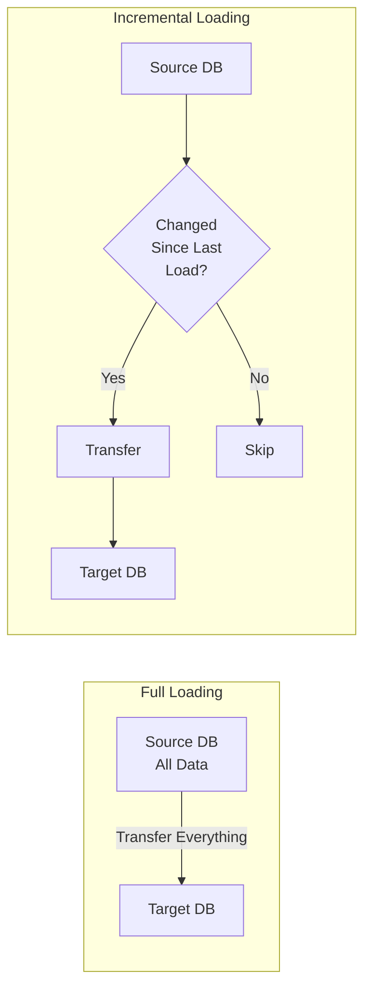

# SQL Incremental Loading

## Introduction

When migrating data between databases or loading data into a data warehouse, transferring the entire dataset every time can be resource-intensive and inefficient. **SQL Incremental Loading** solves this problem by transferring only new, updated, or modified data since the last load operation.

Think of it like backing up your photos: instead of copying all your photos every day, you only back up the new ones you've taken since yesterday. This approach significantly reduces processing time, network bandwidth usage, and system resource consumption.

## What is Incremental Loading?

Incremental loading is a data loading technique that identifies and processes only the data that has changed since the previous extraction. It requires tracking what data has already been loaded and what data is new or modified.

There are two main approaches to incremental loading:

1. **Timestamp-based**: Uses date/time fields to identify new or modified records
2. **ID-based**: Uses sequential IDs or version numbers to track changes

Let's visualize the difference between full and incremental loading:



## Key Components for Incremental Loading

To implement incremental loading, you need:

1. **Change detection mechanism**: A way to identify new or changed records
2. **Tracking metadata**: Information about when data was last extracted
3. **Merge logic**: Code to combine existing data with new data

## Timestamp-Based Incremental Loading

This approach uses a timestamp or date field to track when records were created or modified.

### Example Schema

Consider these two tables:

```sql
-- Source table (e-commerce orders)
CREATE TABLE source_orders (
    order_id INT PRIMARY KEY,
    customer_id INT,
    order_date DATETIME,
    total_amount DECIMAL(10,2),
    last_modified_date DATETIME
);

-- Target table in data warehouse
CREATE TABLE target_orders (
    order_id INT PRIMARY KEY,
    customer_id INT,
    order_date DATETIME,
    total_amount DECIMAL(10,2),
    last_modified_date DATETIME,
    loaded_date DATETIME
);
```

### Basic Timestamp-Based Extraction

Here's how to extract only new or modified records:

```sql
-- Create a variable or parameter to store the last load time
DECLARE @last_load_time DATETIME = '2023-01-15 08:30:00';

-- Extract only records modified since the last load
SELECT 
    order_id,
    customer_id,
    order_date,
    total_amount,
    last_modified_date
FROM 
    source_orders
WHERE 
    last_modified_date > @last_load_time;
```

### Example: Complete Incremental Load Process

Here's a step-by-step example of a complete incremental load process:

```sql
-- Step 1: Get the last load timestamp from a control table
DECLARE @last_load_time DATETIME;

SELECT @last_load_time = MAX(last_load_time)
FROM etl_control_table
WHERE table_name = 'orders';

-- Step 2: Extract new or changed records
SELECT 
    order_id,
    customer_id,
    order_date,
    total_amount,
    last_modified_date
INTO #temp_new_orders
FROM 
    source_orders
WHERE 
    last_modified_date > @last_load_time;

-- Step 3: Merge the new data with existing data
MERGE target_orders AS target
USING #temp_new_orders AS source
ON (target.order_id = source.order_id)
WHEN MATCHED THEN
    UPDATE SET 
        target.customer_id = source.customer_id,
        target.order_date = source.order_date,
        target.total_amount = source.total_amount,
        target.last_modified_date = source.last_modified_date,
        target.loaded_date = GETDATE()
WHEN NOT MATCHED THEN
    INSERT (order_id, customer_id, order_date, total_amount, last_modified_date, loaded_date)
    VALUES (source.order_id, source.customer_id, source.order_date, source.total_amount, source.last_modified_date, GETDATE());

-- Step 4: Update the control table with new last load time
UPDATE etl_control_table
SET last_load_time = GETDATE()
WHERE table_name = 'orders';
```

## ID-Based Incremental Loading

This approach uses sequential IDs or version numbers to track changes.

### Example Schema

```sql
-- Source table with auto-incrementing ID
CREATE TABLE source_products (
    product_id INT IDENTITY(1,1) PRIMARY KEY,
    product_name VARCHAR(100),
    price DECIMAL(10,2),
    category_id INT
);

-- Target table in data warehouse
CREATE TABLE target_products (
    product_id INT PRIMARY KEY,
    product_name VARCHAR(100),
    price DECIMAL(10,2),
    category_id INT,
    loaded_date DATETIME
);
```

### Example: ID-Based Incremental Load

```sql
-- Step 1: Get the highest ID already loaded
DECLARE @max_loaded_id INT;

SELECT @max_loaded_id = ISNULL(MAX(product_id), 0)
FROM target_products;

-- Step 2: Extract only records with higher IDs
SELECT 
    product_id,
    product_name,
    price,
    category_id
FROM 
    source_products
WHERE 
    product_id > @max_loaded_id;
```

## Handling Data Deletions

Incremental loading handles new and updated records well, but deleted records require special attention. One approach is using "soft deletes" with a status flag:

```sql
-- Source table with deletion flag
CREATE TABLE source_customers (
    customer_id INT PRIMARY KEY,
    customer_name VARCHAR(100),
    email VARCHAR(100),
    is_deleted BIT DEFAULT 0,
    last_modified_date DATETIME
);

-- Incremental load including deletions
MERGE target_customers AS target
USING (
    SELECT 
        customer_id,
        customer_name,
        email,
        is_deleted,
        last_modified_date
    FROM 
        source_customers
    WHERE 
        last_modified_date > @last_load_time
) AS source
ON (target.customer_id = source.customer_id)
WHEN MATCHED AND source.is_deleted = 1 THEN
    DELETE
WHEN MATCHED THEN
    UPDATE SET 
        target.customer_name = source.customer_name,
        target.email = source.email,
        target.last_modified_date = source.last_modified_date
WHEN NOT MATCHED AND source.is_deleted = 0 THEN
    INSERT (customer_id, customer_name, email, last_modified_date)
    VALUES (source.customer_id, source.customer_name, source.email, source.last_modified_date);
```

## Change Data Capture (CDC)

Change Data Capture is an advanced feature in some database systems (like SQL Server) that automatically tracks changes to tables, making incremental loading even easier.

```sql
-- Enable CDC on a database (SQL Server)
EXEC sys.sp_cdc_enable_db;

-- Enable CDC on a specific table
EXEC sys.sp_cdc_enable_table
    @source_schema = 'dbo',
    @source_name = 'source_orders',
    @role_name = NULL;

-- Query to get changes since last load
DECLARE @last_lsn binary(10);
SELECT @last_lsn = last_lsn FROM etl_control_table WHERE table_name = 'orders';

SELECT 
    order_id,
    customer_id,
    order_date,
    total_amount
FROM 
    cdc.dbo_source_orders_CT
WHERE 
    __$operation IN (2, 4) -- Insert or Update operations
    AND __$start_lsn > @last_lsn;
```

## Real-World Example: E-commerce Data Pipeline

Let's look at a real-world example of incrementally loading daily sales data from an e-commerce system to a data warehouse.

### Step 1: Setup Control Table

```sql
CREATE TABLE etl_control (
    table_name VARCHAR(100) PRIMARY KEY,
    last_extract_time DATETIME,
    records_processed INT,
    status VARCHAR(20)
);

INSERT INTO etl_control (table_name, last_extract_time, records_processed, status)
VALUES ('sales', '2023-01-01 00:00:00', 0, 'Ready');
```

### Step 2: Incremental Extract Procedure

```sql
CREATE PROCEDURE ExtractDailySales
AS
BEGIN
    DECLARE @last_extract DATETIME;
    DECLARE @current_time DATETIME = GETDATE();
    DECLARE @processed INT = 0;
    
    -- Get last extract time
    SELECT @last_extract = last_extract_time
    FROM etl_control
    WHERE table_name = 'sales';
    
    -- Update control table status
    UPDATE etl_control
    SET status = 'Running'
    WHERE table_name = 'sales';
    
    -- Extract new data to staging
    INSERT INTO sales_staging (
        sale_id, product_id, customer_id, 
        quantity, sale_amount, sale_date
    )
    SELECT 
        sale_id, product_id, customer_id,
        quantity, sale_amount, sale_date
    FROM 
        source_sales
    WHERE 
        sale_date > @last_extract
        AND sale_date <= @current_time;
    
    -- Get count of processed records
    SET @processed = @@ROWCOUNT;
    
    -- Update control table
    UPDATE etl_control
    SET 
        last_extract_time = @current_time,
        records_processed = @processed,
        status = 'Completed'
    WHERE table_name = 'sales';
    
    -- Return summary
    SELECT 
        @last_extract AS previous_extract,
        @current_time AS current_extract,
        @processed AS records_processed;
END;
```

### Step 3: Load and Transform Procedure

```sql
CREATE PROCEDURE LoadSalesData
AS
BEGIN
    -- Merge data from staging to target
    MERGE sales_fact AS target
    USING sales_staging AS source
    ON (target.sale_id = source.sale_id)
    WHEN MATCHED THEN
        UPDATE SET 
            target.product_id = source.product_id,
            target.customer_id = source.customer_id,
            target.quantity = source.quantity,
            target.sale_amount = source.sale_amount,
            target.sale_date = source.sale_date,
            target.last_updated = GETDATE()
    WHEN NOT MATCHED THEN
        INSERT (
            sale_id, product_id, customer_id, 
            quantity, sale_amount, sale_date, last_updated
        )
        VALUES (
            source.sale_id, source.product_id, source.customer_id,
            source.quantity, source.sale_amount, source.sale_date, GETDATE()
        );
    
    -- Clear staging table
    TRUNCATE TABLE sales_staging;
END;
```

## Best Practices for Incremental Loading

1. **Always use transaction timestamps**: Use system-generated timestamps rather than application timestamps if possible
2. **Handle data integrity**: Implement error handling and validation
3. **Use control tables**: Track metadata about load operations
4. **Implement auditing**: Log details of each incremental load
5. **Plan for recovery**: Design processes to handle failures
6. **Consider referential integrity**: Load related tables in the proper order
7. **Test edge cases**: Test what happens with schema changes, bulk updates, etc.

## Common Challenges and Solutions

| Challenge | Solution |
|-----------|----------|
| Missing timestamps | Implement a data quality process to ensure all records have valid timestamps |
| Schema changes | Use a schema comparison step before each load; handle schema evolution |
| Deleted records | Implement soft deletes or comparison-based detection |
| Initial load | Create a separate process for the initial full load |
| Transaction boundaries | Ensure changes are captured consistently across related tables |

## Summary

SQL Incremental Loading is a powerful technique that significantly improves data migration efficiency by processing only new or changed data since the last extraction. We've covered:

- The concept and benefits of incremental loading
- Timestamp-based and ID-based approaches
- Handling data deletions
- Change Data Capture
- A real-world e-commerce example
- Best practices and common challenges

By implementing incremental loading in your data pipelines, you can reduce processing time, minimize resource usage, and ensure your target systems always have up-to-date data without unnecessary overhead.

## Exercises

1. Create a simple source and target table, then write SQL to perform incremental loading based on a timestamp.
2. Modify the example code to handle deleted records.
3. Implement a recovery mechanism for when an incremental load fails halfway through.
4. Design a control table structure to track incremental loads for multiple tables.
5. Explore your database system's native CDC capabilities and write a script to use them.

## Additional Resources

- [Microsoft SQL Server CDC Documentation](https://docs.microsoft.com/en-us/sql/relational-databases/track-changes/about-change-data-capture-sql-server)
- [PostgreSQL Change Data Capture Options](https://www.postgresql.org/docs/current/logicaldecoding.html)
- [Oracle GoldenGate for CDC](https://www.oracle.com/middleware/technologies/goldengate.html)
- [Apache Nifi for ETL Workflows](https://nifi.apache.org/)
- [dbt (data build tool) for Transformations](https://www.getdbt.com/)