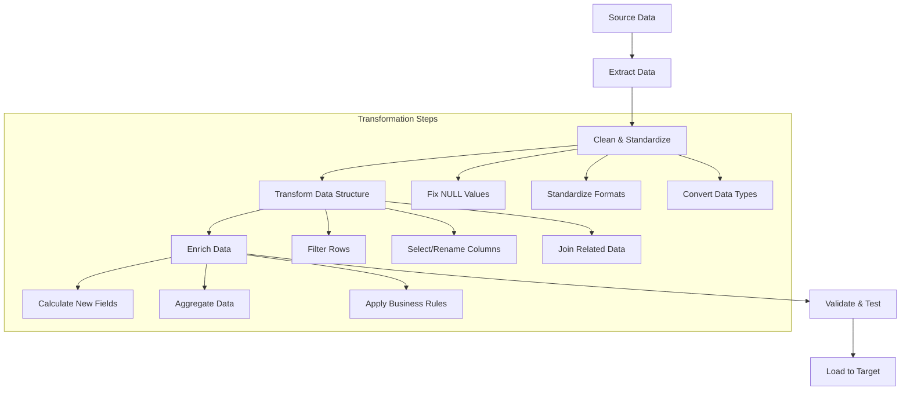

# SQL Data Transformation

## Introduction

Data transformation is a critical component of the data migration process that involves converting data from its source format to a format suitable for the target system. When working with SQL databases, transformation operations allow you to clean, restructure, enrich, and optimize your data before moving it to its destination.

In this tutorial, we'll explore the fundamentals of SQL data transformation techniques that are essential when migrating data between systems. These skills are not only valuable for migration projects but also form the foundation of data analysis and business intelligence work.

## Why Transform Data?

Before diving into the techniques, let's understand why data transformation is necessary:

1. **Data Quality**: To clean and standardize inconsistent or erroneous data
2. **Schema Changes**: To accommodate differences between source and target database structures
3. **Business Requirements**: To meet new business needs or data representations
4. **Performance**: To optimize data for better query performance
5. **Integration**: To ensure compatibility when combining data from multiple sources

## Basic SQL Transformation Techniques

### Filtering Data

One of the simplest transformations is selecting only the data you need using the `WHERE` clause.

```sql
-- Source data with all customers
SELECT * FROM customers;

-- Transformed data with only active customers
SELECT * FROM customers WHERE status = 'active';
```

**Input:**
```
customer_id | name        | email                | status
------------+-------------+----------------------+---------
1           | John Smith  | john@example.com     | active
2           | Sara Jones  | sara@example.com     | inactive
3           | Mike Davis  | mike@example.com     | active
```

**Output:**
```
customer_id | name        | email                | status
------------+-------------+----------------------+---------
1           | John Smith  | john@example.com     | active
3           | Mike Davis  | mike@example.com     | active
```

### Column Selection and Renaming

Select only needed columns and rename them to match the target schema.

```sql
-- Transform by selecting specific columns and renaming them
SELECT 
    customer_id AS id,
    name AS full_name,
    email
FROM customers
WHERE status = 'active';
```

**Output:**
```
id  | full_name   | email
----+-------------+----------------------
1   | John Smith  | john@example.com
3   | Mike Davis  | mike@example.com
```

### Data Type Conversion

Convert data types to match the target schema requirements.

```sql
-- Convert string to date
SELECT 
    order_id,
    CAST(order_date AS DATE) AS formatted_date,
    amount
FROM orders;
```

**Input:**
```
order_id | order_date         | amount
---------+--------------------+--------
101      | 2023-04-15 14:30:00| 125.99
102      | 2023-04-16 09:15:00| 89.50
```

**Output:**
```
order_id | formatted_date | amount
---------+----------------+--------
101      | 2023-04-15     | 125.99
102      | 2023-04-16     | 89.50
```

## Intermediate Transformation Techniques

### String Manipulations

Clean and standardize string data using SQL functions.

```sql
-- Standardize names (lowercase email, proper case name)
SELECT
    customer_id,
    CONCAT(
        UPPER(SUBSTRING(name, 1, 1)),
        LOWER(SUBSTRING(name, 2))
    ) AS formatted_name,
    LOWER(email) AS email_normalized
FROM customers;
```

**Input:**
```
customer_id | name        | email
------------+-------------+----------------------
1           | JOHN SMITH  | John@Example.com
2           | sara JONES  | SARA@example.COM
```

**Output:**
```
customer_id | formatted_name | email_normalized
------------+----------------+----------------------
1           | John smith     | john@example.com
2           | Sara jones     | sara@example.com
```

### Calculated Fields

Create new fields based on calculations or transformations of existing fields.

```sql
-- Calculate total price including tax
SELECT
    product_id,
    product_name,
    price,
    price * 0.08 AS tax,
    price * 1.08 AS total_price
FROM products;
```

**Input:**
```
product_id | product_name   | price
-----------+----------------+--------
1          | Laptop         | 1200.00
2          | Mouse          | 25.50
```

**Output:**
```
product_id | product_name   | price    | tax     | total_price
-----------+----------------+----------+---------+------------
1          | Laptop         | 1200.00  | 96.00   | 1296.00
2          | Mouse          | 25.50    | 2.04    | 27.54
```

### Handling NULL Values

Replace NULL values with default or calculated values.

```sql
-- Replace NULL values with defaults
SELECT
    customer_id,
    name,
    COALESCE(phone, 'Not Provided') AS phone,
    COALESCE(membership_level, 'Basic') AS membership
FROM customers;
```

**Input:**
```
customer_id | name        | phone        | membership_level
------------+-------------+--------------+----------------
1           | John Smith  | 555-123-4567 | Premium
2           | Sara Jones  | NULL         | NULL
3           | Mike Davis  | 555-987-6543 | Silver
```

**Output:**
```
customer_id | name        | phone           | membership
------------+-------------+-----------------+----------------
1           | John Smith  | 555-123-4567    | Premium
2           | Sara Jones  | Not Provided    | Basic
3           | Mike Davis  | 555-987-6543    | Silver
```

## Advanced Transformation Techniques

### Joining Tables for Enriched Data

Combine data from multiple tables to create an enriched dataset.

```sql
-- Join customer and order data
SELECT
    c.customer_id,
    c.name,
    o.order_id,
    o.order_date,
    o.amount
FROM customers c
JOIN orders o ON c.customer_id = o.customer_id
WHERE c.status = 'active';
```

**Input Tables:**

*Customers:*
```
customer_id | name        | status
------------+-------------+---------
1           | John Smith  | active
2           | Sara Jones  | inactive
```

*Orders:*
```
order_id | customer_id | order_date  | amount
---------+-------------+-------------+--------
101      | 1           | 2023-04-15  | 125.99
102      | 1           | 2023-04-20  | 89.50
103      | 2           | 2023-04-18  | 45.25
```

**Output after join and transform:**
```
customer_id | name        | order_id | order_date  | amount
------------+-------------+----------+-------------+--------
1           | John Smith  | 101      | 2023-04-15  | 125.99
1           | John Smith  | 102      | 2023-04-20  | 89.50
```

### Data Aggregation

Summarize data to create new insights or reduce data volume.

```sql
-- Aggregate orders by customer
SELECT
    customer_id,
    COUNT(*) AS total_orders,
    SUM(amount) AS total_spent,
    AVG(amount) AS average_order,
    MIN(order_date) AS first_order,
    MAX(order_date) AS most_recent_order
FROM orders
GROUP BY customer_id;
```

**Input:**
```
order_id | customer_id | order_date  | amount
---------+-------------+-------------+--------
101      | 1           | 2023-04-15  | 125.99
102      | 1           | 2023-04-20  | 89.50
103      | 2           | 2023-04-18  | 45.25
104      | 2           | 2023-04-25  | 65.75
```

**Output:**
```
customer_id | total_orders | total_spent | average_order | first_order | most_recent_order
------------+--------------+-------------+---------------+-------------+------------------
1           | 2            | 215.49      | 107.745       | 2023-04-15  | 2023-04-20
2           | 2            | 111.00      | 55.50         | 2023-04-18  | 2023-04-25
```

### Pivoting Data

Reshape data from rows to columns (or vice versa).

```sql
-- Pivot sales data from rows to columns by category
SELECT 
    product_name,
    SUM(CASE WHEN category = 'Electronics' THEN sales ELSE 0 END) AS electronics_sales,
    SUM(CASE WHEN category = 'Furniture' THEN sales ELSE 0 END) AS furniture_sales,
    SUM(CASE WHEN category = 'Clothing' THEN sales ELSE 0 END) AS clothing_sales
FROM product_sales
GROUP BY product_name;
```

**Input:**
```
product_name | category     | sales
-------------+--------------+-------
Laptop       | Electronics  | 5000
Desk         | Furniture    | 3000
Chair        | Furniture    | 2000
Phone        | Electronics  | 4000
T-shirt      | Clothing     | 1000
```

**Output after pivot:**
```
product_name | electronics_sales | furniture_sales | clothing_sales
-------------+-------------------+-----------------+----------------
Laptop       | 5000              | 0               | 0
Desk         | 0                 | 3000            | 0
Chair        | 0                 | 2000            | 0
Phone        | 4000              | 0               | 0
T-shirt      | 0                 | 0               | 1000
```

### Window Functions for Advanced Analysis

Use window functions to perform calculations across rows.

```sql
-- Add running total and row numbering
SELECT
    order_id,
    order_date,
    amount,
    SUM(amount) OVER (ORDER BY order_date) AS running_total,
    ROW_NUMBER() OVER (ORDER BY order_date) AS order_sequence
FROM orders
WHERE customer_id = 1;
```

**Input:**
```
order_id | order_date  | amount
---------+-------------+--------
101      | 2023-04-15  | 125.99
102      | 2023-04-20  | 89.50
105      | 2023-05-05  | 150.25
```

**Output:**
```
order_id | order_date  | amount  | running_total | order_sequence
---------+-------------+---------+---------------+----------------
101      | 2023-04-15  | 125.99  | 125.99        | 1
102      | 2023-04-20  | 89.50   | 215.49        | 2
105      | 2023-05-05  | 150.25  | 365.74        | 3
```

## Real-World Application: Customer Data Migration

Let's put these techniques together in a real-world scenario where we need to migrate customer data from a legacy system to a new CRM platform.

### Scenario

The legacy system has:
- Customer data spread across multiple tables
- Inconsistent formats
- Missing values
- Different column names than the target CRM

Our goal is to transform this data into a clean, consistent format for the new CRM.

### Step 1: Initial Analysis

```sql
-- Examine the source data
SELECT * FROM legacy_customers LIMIT 10;
SELECT * FROM legacy_addresses LIMIT 10;
SELECT * FROM legacy_contacts LIMIT 10;
```

### Step 2: Data Cleaning and Standardization

```sql
-- Clean and standardize customer data
SELECT
    lc.customer_id,
    TRIM(CONCAT(
        INITCAP(lc.first_name), 
        ' ', 
        INITCAP(lc.last_name)
    )) AS full_name,
    LOWER(lc.email) AS email,
    COALESCE(lc.phone, 'Unknown') AS phone,
    CASE
        WHEN lc.status = 'A' THEN 'Active'
        WHEN lc.status = 'I' THEN 'Inactive'
        ELSE 'Unknown'
    END AS status,
    COALESCE(lc.created_date, '2000-01-01') AS created_date
FROM legacy_customers lc;
```

### Step 3: Join Data from Multiple Tables

```sql
-- Join customer with address information
SELECT
    c.customer_id,
    c.full_name,
    c.email,
    c.phone,
    c.status,
    CONCAT(
        COALESCE(a.street_address, ''), ', ',
        COALESCE(a.city, ''), ', ',
        COALESCE(a.state, ''), ' ',
        COALESCE(a.zip_code, '')
    ) AS full_address,
    COALESCE(a.address_type, 'Primary') AS address_type,
    c.created_date
FROM (
    -- Nested query with the transformed customer data
    SELECT
        lc.customer_id,
        TRIM(CONCAT(
            INITCAP(lc.first_name), 
            ' ', 
            INITCAP(lc.last_name)
        )) AS full_name,
        LOWER(lc.email) AS email,
        COALESCE(lc.phone, 'Unknown') AS phone,
        CASE
            WHEN lc.status = 'A' THEN 'Active'
            WHEN lc.status = 'I' THEN 'Inactive'
            ELSE 'Unknown'
        END AS status,
        COALESCE(lc.created_date, '2000-01-01') AS created_date
    FROM legacy_customers lc
) c
LEFT JOIN legacy_addresses a ON c.customer_id = a.customer_id
WHERE a.is_primary = 1 OR a.is_primary IS NULL;
```

### Step 4: Data Aggregation for Customer Insights

```sql
-- Add purchase insights for each customer
SELECT
    c.customer_id,
    c.full_name,
    c.email,
    c.status,
    c.full_address,
    COUNT(o.order_id) AS total_orders,
    COALESCE(SUM(o.amount), 0) AS lifetime_value,
    COALESCE(MAX(o.order_date), c.created_date) AS last_activity_date
FROM customer_transformed c
LEFT JOIN legacy_orders o ON c.customer_id = o.customer_id
GROUP BY 
    c.customer_id, 
    c.full_name, 
    c.email, 
    c.status, 
    c.full_address, 
    c.created_date;
```

### Step 5: Final Transformation for Target CRM

```sql
-- Final transformation matching the target CRM schema
INSERT INTO new_crm_customers (
    customer_id,
    name,
    email,
    phone,
    address,
    status,
    total_orders,
    lifetime_value,
    created_date,
    last_activity
)
SELECT
    t.customer_id,
    t.full_name,
    t.email,
    t.phone,
    t.full_address,
    t.status,
    t.total_orders,
    t.lifetime_value,
    t.created_date,
    t.last_activity_date
FROM customer_insights t;
```

## Process Visualization

Here's a visual representation of the SQL data transformation process:



## Common Challenges and Solutions

### 1. Handling Missing or NULL Data

**Challenge**: Source data often contains NULL values or empty strings.

**Solution**: Use `COALESCE` or `CASE` statements to provide default values.

```sql
SELECT
    customer_id,
    COALESCE(email, 'no-email@example.com') AS email,
    CASE
        WHEN phone IS NULL OR TRIM(phone) = '' THEN 'Unknown'
        ELSE phone
    END AS phone
FROM customers;
```

### 2. Dealing with Inconsistent Data

**Challenge**: Data formats may be inconsistent (e.g., dates, phone numbers).

**Solution**: Use string manipulation and formatting functions.

```sql
-- Standardize phone numbers
SELECT
    customer_id,
    REGEXP_REPLACE(phone, '[^0-9]', '') AS clean_phone_number
FROM customers;
```

### 3. Performance with Large Datasets

**Challenge**: Transformations on large datasets can be slow.

**Solution**: Use temporary tables for multi-step transformations.

```sql
-- Create temporary table for intermediate results
CREATE TEMPORARY TABLE customer_clean AS
SELECT
    customer_id,
    TRIM(name) AS name,
    LOWER(email) AS email
FROM customers;

-- Use the temporary table for further transformations
SELECT 
    cc.customer_id,
    cc.name,
    cc.email,
    o.total_orders
FROM customer_clean cc
JOIN (
    SELECT 
        customer_id, 
        COUNT(*) AS total_orders 
    FROM orders 
    GROUP BY customer_id
) o ON cc.customer_id = o.customer_id;
```

## Summary

SQL data transformation is a crucial component of the data migration process that allows you to:

1. Clean and standardize data from source systems
2. Reshape data to match target system requirements
3. Combine data from multiple sources
4. Enrich data with calculated fields and business logic
5. Optimize data for performance and usability

By mastering these SQL transformation techniques, you'll be well-equipped to handle complex data migration projects and prepare data for analysis and reporting.

## Additional Resources

- Practice exercises with sample datasets on GitHub: [SQL Transformation Exercises](https://github.com/sample/sql-transformation-exercises)
- [SQL Data Cleansing Best Practices](https://example.com/sql-cleansing)
- Next tutorial: [SQL Data Loading Techniques](https://example.com/sql-loading)

## Exercises

1. **Basic Transformation**: Given a table of customer data with inconsistent case in names and emails, write a SQL query to standardize all names to title case and emails to lowercase.

2. **Joining and Filtering**: Write a query that joins a customers table with an orders table, returning only active customers who have placed at least 3 orders.

3. **Data Aggregation**: Create a monthly sales report query that shows total sales, number of orders, and average order value by month and year.

4. **Advanced Transformation**: Write a query that pivots product sales data to show quarterly sales for each product category over the past year.

5. **Complete ETL**: Design a complete SQL ETL process to migrate customer and order data from a legacy e-commerce database to a new analytics platform, including data cleaning, transformation, and aggregation steps.