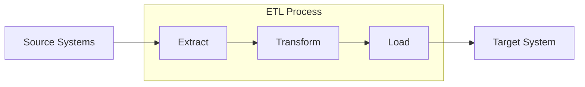

# SQL ETL Concepts

## Introduction

Extract, Transform, Load (ETL) is a fundamental process in data management that involves moving data from source systems to a target database or data warehouse. In the context of SQL, ETL serves as the backbone of data migration, business intelligence, and data integration strategies.

ETL breaks down into three distinct phases:

1. **Extract**: Retrieving data from various source systems
2. **Transform**: Converting, cleaning, and structuring the data
3. **Load**: Writing the processed data into a target system

This guide will walk you through these concepts with practical examples and SQL implementations to help you understand how ETL processes work and how you can build them effectively.

## ETL Process Overview

Before diving into specific implementations, let's understand the overall ETL workflow:



## 1. Extract: Getting Data from Source Systems

The extraction phase involves retrieving data from one or multiple source systems. These sources could be:

- Relational databases (MySQL, PostgreSQL, SQL Server)
- Flat files (CSV, Excel)
- APIs or web services
- NoSQL databases
- Legacy systems

### Basic SQL Extraction

Here's a simple extraction using SQL:

```sql
-- Extract all customer data from source database
SELECT 
    customer_id,
    first_name,
    last_name,
    email,
    phone_number,
    registration_date
FROM 
    source_db.customers
WHERE 
    registration_date > '2023-01-01';
```

### Incremental Extraction

In many cases, you'll want to extract only new or changed data since the last extraction:

```sql
-- Extract only new customer records since last extract
SELECT 
    customer_id,
    first_name,
    last_name,
    email,
    phone_number,
    registration_date
FROM 
    source_db.customers
WHERE 
    registration_date > (SELECT MAX(registration_date) FROM target_db.customers);
```

## 2. Transform: Cleaning and Reshaping Data

The transformation phase is where data is cleaned, validated, standardized, and reshaped to match the target system's requirements. Common transformations include:

- Data type conversions
- String manipulations
- Aggregations
- Joining multiple sources
- Handling missing values
- Filtering unwanted data
- Standardizing formats

### Basic SQL Transformations

```sql
-- Transform customer data
SELECT 
    customer_id,
    UPPER(first_name) AS first_name, -- Convert to uppercase
    UPPER(last_name) AS last_name,   -- Convert to uppercase
    LOWER(email) AS email,           -- Standardize emails to lowercase
    CASE
        WHEN phone_number LIKE '%-%' THEN phone_number
        WHEN LENGTH(phone_number) = 10 THEN 
            CONCAT(SUBSTRING(phone_number, 1, 3), '-', 
                   SUBSTRING(phone_number, 4, 3), '-',
                   SUBSTRING(phone_number, 7, 4))
        ELSE phone_number
    END AS formatted_phone,          -- Format phone numbers consistently
    registration_date,
    DATEDIFF(CURRENT_DATE, registration_date) AS days_since_registration
FROM 
    extracted_customer_data;
```

### Handling Missing Values

```sql
-- Handle NULL values in customer data
SELECT 
    customer_id,
    COALESCE(first_name, 'Unknown') AS first_name,
    COALESCE(last_name, 'Unknown') AS last_name,
    email,
    COALESCE(phone_number, 'No Phone') AS phone_number,
    registration_date
FROM 
    extracted_customer_data;
```

### Data Aggregation

```sql
-- Transform order data into customer spending summary
SELECT 
    c.customer_id,
    c.first_name,
    c.last_name,
    COUNT(o.order_id) AS total_orders,
    SUM(o.order_total) AS total_spent,
    AVG(o.order_total) AS average_order_value,
    MAX(o.order_date) AS latest_order_date
FROM 
    extracted_customer_data c
LEFT JOIN 
    extracted_order_data o ON c.customer_id = o.customer_id
GROUP BY 
    c.customer_id, c.first_name, c.last_name;
```

### Data Deduplication

```sql
-- Remove duplicate customer records keeping only the latest
WITH ranked_customers AS (
    SELECT 
        customer_id,
        first_name,
        last_name,
        email,
        phone_number,
        registration_date,
        ROW_NUMBER() OVER (PARTITION BY email ORDER BY registration_date DESC) AS rn
    FROM 
        extracted_customer_data
)
SELECT 
    customer_id,
    first_name,
    last_name,
    email,
    phone_number,
    registration_date
FROM 
    ranked_customers
WHERE 
    rn = 1;
```

## 3. Load: Writing Data to the Target System

The loading phase involves inserting the transformed data into the target system. This can be done in several ways:

- Full load: Replace all existing data
- Incremental load: Add only new or changed data
- Upsert: Insert new records and update existing ones

### Basic SQL Loading

```sql
-- Simple INSERT to load transformed data
INSERT INTO target_db.customers (
    customer_id,
    first_name,
    last_name,
    email,
    phone_number,
    registration_date,
    days_since_registration
)
SELECT 
    customer_id,
    first_name,
    last_name,
    email,
    formatted_phone,
    registration_date,
    days_since_registration
FROM 
    transformed_customer_data;
```

### Upsert Using MERGE/UPSERT (SQL Server/PostgreSQL)

```sql
-- SQL Server MERGE statement for upsert
MERGE INTO target_db.customers AS target
USING transformed_customer_data AS source
ON target.customer_id = source.customer_id
WHEN MATCHED THEN
    UPDATE SET
        target.first_name = source.first_name,
        target.last_name = source.last_name,
        target.email = source.email,
        target.phone_number = source.formatted_phone,
        target.registration_date = source.registration_date,
        target.last_updated = CURRENT_TIMESTAMP
WHEN NOT MATCHED THEN
    INSERT (
        customer_id,
        first_name,
        last_name,
        email,
        phone_number,
        registration_date,
        last_updated
    )
    VALUES (
        source.customer_id,
        source.first_name,
        source.last_name,
        source.email,
        source.formatted_phone,
        source.registration_date,
        CURRENT_TIMESTAMP
    );
```

### MySQL Implementation (No native MERGE)

```sql
-- MySQL upsert using INSERT ... ON DUPLICATE KEY UPDATE
INSERT INTO target_db.customers (
    customer_id,
    first_name,
    last_name,
    email,
    phone_number,
    registration_date,
    last_updated
)
SELECT 
    customer_id,
    first_name,
    last_name,
    email,
    formatted_phone,
    registration_date,
    CURRENT_TIMESTAMP
FROM 
    transformed_customer_data
ON DUPLICATE KEY UPDATE
    first_name = VALUES(first_name),
    last_name = VALUES(last_name),
    email = VALUES(email),
    phone_number = VALUES(formatted_phone),
    registration_date = VALUES(registration_date),
    last_updated = CURRENT_TIMESTAMP;
```

## Creating Complete ETL Processes

Let's look at a complete ETL example for migrating customer order data from one system to another.

### Example: Customer Order Data Migration

```sql
-- 1. Extract - Get customer and order data
CREATE TEMPORARY TABLE temp_customers AS
SELECT * FROM source_db.customers
WHERE last_updated > '2023-06-01';

CREATE TEMPORARY TABLE temp_orders AS
SELECT * FROM source_db.orders
WHERE customer_id IN (SELECT customer_id FROM temp_customers);

-- 2. Transform - Clean and enhance the data
CREATE TEMPORARY TABLE transformed_customers AS
SELECT 
    customer_id,
    TRIM(first_name) AS first_name,
    TRIM(last_name) AS last_name,
    LOWER(email) AS email,
    CASE
        WHEN country_code IS NULL THEN 'Unknown'
        ELSE UPPER(country_code)
    END AS country_code,
    created_at,
    CURRENT_TIMESTAMP AS etl_timestamp
FROM 
    temp_customers;

CREATE TEMPORARY TABLE transformed_orders AS
SELECT 
    o.order_id,
    o.customer_id,
    o.order_date,
    o.status,
    o.total_amount,
    COUNT(oi.item_id) AS item_count,
    SUM(oi.quantity) AS total_items,
    CURRENT_TIMESTAMP AS etl_timestamp
FROM 
    temp_orders o
JOIN 
    source_db.order_items oi ON o.order_id = oi.order_id
GROUP BY 
    o.order_id, o.customer_id, o.order_date, o.status, o.total_amount;

-- 3. Load - Insert into target tables
-- Load customers
INSERT INTO target_db.customers (
    customer_id, first_name, last_name, email, country_code, created_at, etl_timestamp
)
SELECT 
    customer_id, first_name, last_name, email, country_code, created_at, etl_timestamp
FROM 
    transformed_customers
ON DUPLICATE KEY UPDATE
    first_name = VALUES(first_name),
    last_name = VALUES(last_name),
    email = VALUES(email),
    country_code = VALUES(country_code),
    etl_timestamp = VALUES(etl_timestamp);

-- Load orders
INSERT INTO target_db.orders (
    order_id, customer_id, order_date, status, total_amount, 
    item_count, total_items, etl_timestamp
)
SELECT 
    order_id, customer_id, order_date, status, total_amount, 
    item_count, total_items, etl_timestamp
FROM 
    transformed_orders
ON DUPLICATE KEY UPDATE
    status = VALUES(status),
    total_amount = VALUES(total_amount),
    item_count = VALUES(item_count),
    total_items = VALUES(total_items),
    etl_timestamp = VALUES(etl_timestamp);

-- Clean up temporary tables
DROP TEMPORARY TABLE IF EXISTS temp_customers;
DROP TEMPORARY TABLE IF EXISTS temp_orders;
DROP TEMPORARY TABLE IF EXISTS transformed_customers;
DROP TEMPORARY TABLE IF EXISTS transformed_orders;
```

## ETL Best Practices

To build robust and efficient ETL processes, follow these best practices:

1. **Document your ETL workflow**: Keep detailed documentation about data sources, transformations, and loading strategies.

2. **Error handling**: Implement proper error handling and logging:
```sql
-- Example of basic error handling
BEGIN TRY
    -- ETL operations here
    COMMIT;
END TRY
BEGIN CATCH
    ROLLBACK;
    INSERT INTO etl_error_log (
        error_message, error_procedure, error_line, error_datetime
    )
    VALUES (
        ERROR_MESSAGE(), ERROR_PROCEDURE(), ERROR_LINE(), CURRENT_TIMESTAMP
    );
END CATCH;
```

3. **Incremental processing**: Prefer incremental loads over full loads when possible.

4. **Data validation**: Validate data before and after transformation:
```sql
-- Validate data after extraction
SELECT COUNT(*) AS invalid_emails
FROM extracted_customer_data
WHERE email NOT LIKE '%@%.%';
```

5. **Performance optimization**: Use indexes, partitioning, and efficient SQL:
```sql
-- Create indexes on frequently used columns in staging tables
CREATE INDEX idx_customer_id ON staging_customers(customer_id);
```

6. **Monitoring and alerts**: Set up monitoring for ETL jobs.

7. **Version control**: Maintain versioned ETL scripts.

## ETL Tools and Frameworks

While you can build ETL processes with pure SQL, several tools can enhance your capabilities:

- **SQL Server Integration Services (SSIS)**: Microsoft's ETL tool
- **Apache Airflow**: Open-source workflow management
- **Talend**: Open-source and commercial ETL solutions  
- **Informatica PowerCenter**: Enterprise ETL platform
- **Pentaho Data Integration**: Open-source ETL solution
- **AWS Glue**: Serverless ETL service
- **dbt (data build tool)**: SQL-centered transformation tool

## Summary

ETL processes are essential for data migration, integration, and warehousing projects. Using SQL for ETL provides the flexibility to extract data from various sources, transform it according to business requirements, and load it into target systems.

Key takeaways:
- Extract data efficiently, considering incremental vs. full extracts
- Transform data to ensure quality, consistency, and proper structure  
- Load data carefully, choosing the appropriate loading strategy
- Follow best practices for reliability, performance, and maintainability

With the knowledge from this guide, you should be able to design and implement basic ETL processes using SQL.

## Exercises

1. Design an ETL process to migrate customer data from a CSV file to a SQL database.
2. Create a transformation process that cleans and standardizes customer address data.
3. Implement an incremental loading strategy for a daily sales data ETL process.
4. Design an ETL workflow for consolidating data from multiple databases into a single reporting database.

## Additional Resources

- [SQL Server Integration Services Documentation](https://docs.microsoft.com/en-us/sql/integration-services/sql-server-integration-services)
- [The Data Warehouse Toolkit](https://www.kimballgroup.com/data-warehouse-business-intelligence-resources/books/data-warehouse-dw-toolkit/) by Ralph Kimball
- [PostgreSQL ETL Documentation](https://www.postgresql.org/docs/)
- [Apache Airflow Documentation](https://airflow.apache.org/docs/)
- [dbt Documentation](https://docs.getdbt.com/)