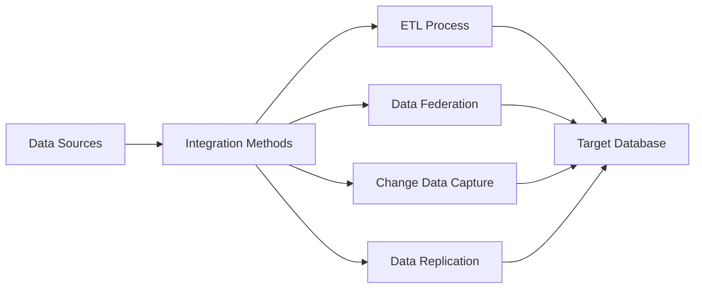
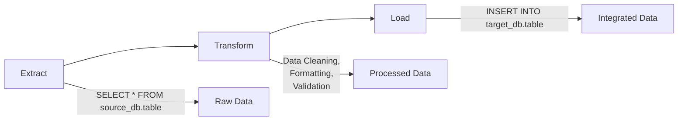

# SQL Data Integration

## Introduction

Data integration is a fundamental process in modern data management that involves combining data from different sources into a meaningful and valuable unified view. In the context of SQL databases, data integration refers to the techniques and methodologies used to collect, transform, and consolidate data from various database systems or external data sources into a target SQL database.

Whether you're building a data warehouse, migrating from one database system to another, or simply need to combine data from multiple sources for analysis, understanding SQL data integration is essential for effective data management.

## What is SQL Data Integration?

SQL Data Integration is the process of combining data residing in different SQL databases or external sources into a unified, consistent dataset that can be accessed and analyzed as a whole. This process typically involves:

1. **Extracting** data from various source systems
2. **Transforming** the data to fit the target system's structure and business rules
3. **Loading** the transformed data into the destination system

This process is commonly known as ETL (Extract, Transform, Load) and forms the backbone of data integration in SQL environments.

## Key Components of SQL Data Integration

### 1. Data Sources

Data sources can include:
- Relational databases (MySQL, PostgreSQL, SQL Server, Oracle, etc.)
- Flat files (CSV, JSON, XML)
- APIs and web services
- NoSQL databases
- Application data

### 2. Integration Methods

The primary methods for SQL data integration include:



- **ETL (Extract, Transform, Load)**: Data is extracted from source systems, transformed to meet business and technical requirements, and loaded into a target database.
- **Data Federation**: Provides a virtual integrated view of data from multiple sources without physically moving the data.
- **Change Data Capture (CDC)**: Tracks changes in source databases to efficiently update the target database.
- **Data Replication**: Creates and maintains copies of data across different database systems.

## Basic SQL Integration Techniques

### Importing Data from CSV Files

One of the simplest forms of data integration is importing data from CSV files into a SQL database.

```sql
-- Creating a table to receive the data
CREATE TABLE customers (
    customer_id INT PRIMARY KEY,
    first_name VARCHAR(50),
    last_name VARCHAR(50),
    email VARCHAR(100),
    registration_date DATE
);

-- PostgreSQL method to import CSV
COPY customers FROM '/path/to/customers.csv' DELIMITER ',' CSV HEADER;

-- MySQL method to import CSV
LOAD DATA INFILE '/path/to/customers.csv'
INTO TABLE customers
FIELDS TERMINATED BY ','
ENCLOSED BY '"'
LINES TERMINATED BY '
'
IGNORE 1 ROWS;

-- SQL Server method to import CSV
BULK INSERT customers
FROM '/path/to/customers.csv'
WITH (
    FORMAT = 'CSV',
    FIRSTROW = 2,
    FIELDTERMINATOR = ',',
    ROWTERMINATOR = '
'
);
```

The above examples show how to import a CSV file containing customer data into a SQL database using different database management systems.

### Exporting Data to CSV Files

Similarly, you can export data from SQL tables to CSV files:

```sql
-- PostgreSQL method to export to CSV
COPY customers TO '/path/to/export_customers.csv' DELIMITER ',' CSV HEADER;

-- MySQL method to export to CSV
SELECT customer_id, first_name, last_name, email, registration_date
INTO OUTFILE '/path/to/export_customers.csv'
FIELDS TERMINATED BY ','
ENCLOSED BY '"'
LINES TERMINATED BY '
'
FROM customers;

-- SQL Server method to export to CSV
SELECT customer_id, first_name, last_name, email, registration_date
FROM customers
FOR XML PATH('row'), ROOT('data'), ELEMENTS XSINIL
```

### Cross-Database Queries

Many SQL database systems allow you to query data from multiple databases:

```sql
-- SQL Server cross-database query
SELECT a.order_id, a.order_date, b.product_name
FROM OrdersDB.dbo.Orders a
JOIN ProductsDB.dbo.Products b ON a.product_id = b.product_id;

-- MySQL cross-database query
SELECT a.order_id, a.order_date, b.product_name
FROM OrdersDB.Orders a
JOIN ProductsDB.Products b ON a.product_id = b.product_id;
```

## Advanced SQL Integration Techniques

### Using SQL INSERT with SELECT

A powerful way to integrate data is by using the `INSERT ... SELECT` statement, which allows you to insert data from one table into another:

```sql
-- Create a new customer summary table
CREATE TABLE customer_summary (
    customer_id INT PRIMARY KEY,
    full_name VARCHAR(100),
    total_orders INT,
    total_spent DECIMAL(10,2)
);

-- Insert data from multiple tables into the summary table
INSERT INTO customer_summary (customer_id, full_name, total_orders, total_spent)
SELECT 
    c.customer_id,
    CONCAT(c.first_name, ' ', c.last_name) AS full_name,
    COUNT(o.order_id) AS total_orders,
    SUM(o.order_total) AS total_spent
FROM 
    customers c
LEFT JOIN 
    orders o ON c.customer_id = o.customer_id
GROUP BY 
    c.customer_id, CONCAT(c.first_name, ' ', c.last_name);
```

The output would be a new table with aggregated customer data:

| customer_id | full_name      | total_orders | total_spent |
|-------------|----------------|--------------|-------------|
| 1001        | John Smith     | 5            | 423.50      |
| 1002        | Sarah Johnson  | 3            | 198.75      |
| 1003        | Michael Brown  | 0            | 0.00        |

### Using Temporary Tables for Integration

Temporary tables can be useful for intermediate steps in data integration:

```sql
-- Create a temporary table
CREATE TEMPORARY TABLE temp_customer_orders AS
SELECT 
    c.customer_id,
    c.email,
    COUNT(o.order_id) AS order_count
FROM 
    customers c
JOIN 
    orders o ON c.customer_id = o.customer_id
WHERE 
    o.order_date >= CURRENT_DATE - INTERVAL '30 days'
GROUP BY 
    c.customer_id, c.email
HAVING 
    COUNT(o.order_id) > 3;

-- Use the temporary table for further analysis or integration
SELECT 
    t.customer_id,
    t.email,
    t.order_count,
    SUM(oi.quantity * p.price) AS recent_spending
FROM 
    temp_customer_orders t
JOIN 
    orders o ON t.customer_id = o.customer_id
JOIN 
    order_items oi ON o.order_id = oi.order_id
JOIN 
    products p ON oi.product_id = p.product_id
WHERE 
    o.order_date >= CURRENT_DATE - INTERVAL '30 days'
GROUP BY 
    t.customer_id, t.email, t.order_count
ORDER BY 
    recent_spending DESC;
```

This approach allows you to break complex integrations into manageable steps.

## ETL Process in SQL

The ETL (Extract, Transform, Load) process is central to SQL data integration. Let's explore each step with practical examples:



### 1. Extract

The extraction phase involves retrieving data from source systems. This can be done using:

```sql
-- Direct extraction using SQL
SELECT 
    customer_id,
    first_name,
    last_name,
    email,
    phone_number,
    registration_date
FROM 
    source_database.customers
WHERE 
    registration_date >= '2023-01-01';
```

### 2. Transform

The transformation phase involves cleaning, standardizing, and restructuring the data:

```sql
-- Transformation example using CTEs (Common Table Expressions)
WITH raw_customers AS (
    SELECT 
        customer_id,
        first_name,
        last_name,
        email,
        phone_number,
        registration_date
    FROM 
        source_database.customers
    WHERE 
        registration_date >= '2023-01-01'
),
formatted_customers AS (
    SELECT
        customer_id,
        INITCAP(first_name) AS first_name, -- Standardize capitalization
        INITCAP(last_name) AS last_name,
        LOWER(email) AS email, -- Standardize email format
        REGEXP_REPLACE(phone_number, '[^0-9]', '') AS phone_number, -- Clean phone format
        registration_date
    FROM 
        raw_customers
    WHERE 
        email IS NOT NULL -- Data validation
),
enriched_customers AS (
    SELECT
        c.*,
        r.region_name,
        r.country
    FROM 
        formatted_customers c
    JOIN 
        source_database.regions r ON c.region_id = r.region_id
)
SELECT * FROM enriched_customers;
```

### 3. Load

The loading phase involves inserting the transformed data into the target database:

```sql
-- Loading data into the target database
INSERT INTO target_database.customers (
    customer_id,
    first_name,
    last_name,
    email,
    phone_number,
    registration_date,
    region_name,
    country
)
SELECT
    customer_id,
    first_name,
    last_name,
    email,
    phone_number,
    registration_date,
    region_name,
    country
FROM 
    enriched_customers;
```

## Real-World Example: Building a Sales Data Mart

Let's walk through a complete example of building a simple sales data mart by integrating data from different tables:

### 1. Source Data Structure

Imagine we have the following source tables:
- `customers` - Customer information
- `products` - Product catalog
- `orders` - Order header information
- `order_items` - Order line items

### 2. Target Data Mart Structure

We want to create a sales data mart with the following table:

```sql
CREATE TABLE sales_mart (
    sale_id INT PRIMARY KEY,
    sale_date DATE,
    customer_id INT,
    customer_name VARCHAR(100),
    customer_city VARCHAR(50),
    customer_state VARCHAR(50),
    product_id INT,
    product_name VARCHAR(100),
    product_category VARCHAR(50),
    quantity INT,
    unit_price DECIMAL(10,2),
    total_amount DECIMAL(10,2),
    discount_amount DECIMAL(10,2),
    net_amount DECIMAL(10,2)
);
```

### 3. Integration Query

```sql
-- ETL process to populate the sales data mart
INSERT INTO sales_mart (
    sale_id,
    sale_date,
    customer_id,
    customer_name,
    customer_city,
    customer_state,
    product_id,
    product_name,
    product_category,
    quantity,
    unit_price,
    total_amount,
    discount_amount,
    net_amount
)
SELECT
    oi.order_item_id AS sale_id,
    o.order_date AS sale_date,
    c.customer_id,
    CONCAT(c.first_name, ' ', c.last_name) AS customer_name,
    c.city AS customer_city,
    c.state AS customer_state,
    p.product_id,
    p.product_name,
    p.category AS product_category,
    oi.quantity,
    p.price AS unit_price,
    (oi.quantity * p.price) AS total_amount,
    (oi.quantity * p.price * oi.discount_percentage / 100) AS discount_amount,
    (oi.quantity * p.price) - (oi.quantity * p.price * oi.discount_percentage / 100) AS net_amount
FROM
    orders o
JOIN 
    order_items oi ON o.order_id = oi.order_id
JOIN 
    customers c ON o.customer_id = c.customer_id
JOIN 
    products p ON oi.product_id = p.product_id
WHERE
    o.order_status = 'Completed'
    AND o.order_date BETWEEN '2023-01-01' AND '2023-12-31';
```

### 4. Sample Output

The resulting sales mart would contain integrated data like:

| sale_id | sale_date  | customer_id | customer_name  | customer_city | customer_state | product_id | product_name    | product_category | quantity | unit_price | total_amount | discount_amount | net_amount |
|---------|------------|-------------|----------------|---------------|----------------|------------|-----------------|------------------|----------|------------|--------------|-----------------|------------|
| 10001   | 2023-02-15 | 1001        | John Smith     | New York      | NY             | 5001       | Laptop Pro     | Electronics      | 1        | 1200.00    | 1200.00      | 120.00         | 1080.00    |
| 10002   | 2023-02-15 | 1001        | John Smith     | New York      | NY             | 5007       | Wireless Mouse | Electronics      | 2        | 25.00      | 50.00        | 0.00           | 50.00      |
| 10003   | 2023-03-22 | 1002        | Sarah Johnson  | Los Angeles   | CA             | 5010       | Office Chair   | Furniture        | 1        | 150.00     | 150.00       | 15.00          | 135.00     |

## Best Practices for SQL Data Integration

### 1. Plan Your Integration Strategy

Before starting any data integration project:
- Define clear objectives for the integration
- Map source and target data structures
- Establish data quality rules
- Document transformation logic

### 2. Ensure Data Quality

Data quality is crucial for successful integration:
- Validate data before and after integration
- Handle NULL values appropriately
- Implement data cleansing procedures
- Set up constraints in target tables

Example of data validation:

```sql
-- Check for data quality issues before integration
SELECT
    COUNT(*) AS total_records,
    SUM(CASE WHEN email IS NULL THEN 1 ELSE 0 END) AS null_emails,
    SUM(CASE WHEN LENGTH(phone_number) < 10 THEN 1 ELSE 0 END) AS invalid_phones,
    SUM(CASE WHEN registration_date > CURRENT_DATE THEN 1 ELSE 0 END) AS future_dates
FROM
    source_database.customers;
```

### 3. Use Transactions for Data Integrity

Wrap your integration operations in transactions to ensure data integrity:

```sql
-- Using transactions for data integration
BEGIN TRANSACTION;

-- Perform integration operations
INSERT INTO target_database.customers (...)
SELECT ... FROM source_database.customers WHERE ...;

-- Check if the integration was successful
IF @@ROWCOUNT > 0 AND @@ERROR = 0
    COMMIT TRANSACTION;
ELSE
    ROLLBACK TRANSACTION;
```

### 4. Implement Incremental Loading

For large datasets, incremental loading is more efficient than full loads:

```sql
-- Incremental loading example
INSERT INTO target_database.customers (
    customer_id,
    first_name,
    last_name,
    email,
    registration_date,
    last_updated
)
SELECT
    s.customer_id,
    s.first_name,
    s.last_name,
    s.email,
    s.registration_date,
    CURRENT_TIMESTAMP AS last_updated
FROM
    source_database.customers s
LEFT JOIN
    target_database.customers t ON s.customer_id = t.customer_id
WHERE
    t.customer_id IS NULL -- New records
    OR (
        s.last_updated > t.last_updated -- Changed records
    );
```

### 5. Document Your Integration Process

Always document your integration process, including:
- Source and target schemas
- Transformation logic
- Data mappings
- Scheduling information
- Error handling procedures

## Common Challenges and Solutions

### Handling Different Data Types

When integrating data from different sources, you might encounter incompatible data types:

```sql
-- Handling data type conversions
SELECT
    customer_id,
    -- Convert string to date with appropriate format
    CASE 
        WHEN ISDATE(date_string) = 1 THEN CAST(date_string AS DATE)
        ELSE NULL
    END AS converted_date,
    -- Convert numeric strings to numbers
    CASE 
        WHEN numeric_string LIKE '%[^0-9.]%' THEN NULL
        ELSE CAST(numeric_string AS DECIMAL(10,2))
    END AS converted_number
FROM
    source_table;
```

### Dealing with Duplicates

Identifying and handling duplicate records is essential:

```sql
-- Identifying duplicates
WITH duplicate_check AS (
    SELECT
        email,
        COUNT(*) AS count
    FROM
        customers
    GROUP BY
        email
    HAVING
        COUNT(*) > 1
)
SELECT
    c.*
FROM
    customers c
JOIN
    duplicate_check d ON c.email = d.email
ORDER BY
    c.email;

-- Removing duplicates during integration
INSERT INTO clean_customers
SELECT DISTINCT ON (email) *
FROM source_customers
ORDER BY email, last_updated DESC;
```

### Managing Schema Changes

Source systems may change their schemas over time:

```sql
-- Creating a more resilient target table
CREATE TABLE flexible_customer_data (
    customer_id INT PRIMARY KEY,
    customer_data JSONB, -- Store all attributes as JSON (PostgreSQL)
    source_system VARCHAR(50),
    integration_date TIMESTAMP DEFAULT CURRENT_TIMESTAMP
);

-- Inserting data with varying schemas
INSERT INTO flexible_customer_data (customer_id, customer_data, source_system)
SELECT
    customer_id,
    (SELECT row_to_json(s) FROM (SELECT * FROM source_customers WHERE customer_id = sc.customer_id) s),
    'system_a'
FROM
    source_customers sc;
```

## Tools and Technologies for SQL Data Integration

While SQL itself is powerful for data integration, several tools can enhance your capabilities:

1. **Database-Specific Tools**:
   - SQL Server Integration Services (SSIS)
   - Oracle Data Integrator (ODI)
   - PostgreSQL Foreign Data Wrappers

2. **Open-Source ETL Tools**:
   - Apache NiFi
   - Talend Open Studio
   - Pentaho Data Integration

3. **Cloud-Based Integration Services**:
   - AWS Glue
   - Google Cloud Dataflow
   - Azure Data Factory

## Summary

SQL data integration is a critical skill for database professionals and data engineers. In this tutorial, we've covered:

- The fundamental concepts of SQL data integration
- Basic and advanced SQL techniques for data integration
- The ETL process and its implementation in SQL
- A real-world example of building a sales data mart
- Best practices and common challenges in data integration

By mastering these concepts, you'll be well-equipped to handle data integration tasks across various SQL database systems and build robust data pipelines for your applications.

## Additional Resources and Exercises

### Resources for Further Learning

- [SQL Data Integration Documentation](https://example.com/sql-integration)
- [ETL Best Practices Guide](https://example.com/etl-best-practices)
- [Database Migration Handbook](https://example.com/migration-handbook)

### Practice Exercises

1. **Basic Integration Exercise**:
   Create a simple ETL process to import data from a CSV file into a SQL table, performing basic transformations like data type conversions and string formatting.

2. **Intermediate Integration Exercise**:
   Design a process to integrate customer and order data from two different database systems, creating a unified view of customer purchase history.

3. **Advanced Integration Exercise**:
   Build a complete data mart that integrates data from multiple source systems, including structured and semi-structured data, with proper error handling and data quality checks.

4. **Challenge Exercise**:
   Implement an incremental loading strategy that efficiently synchronizes data between source and target systems, handling updates, inserts, and deletes appropriately.