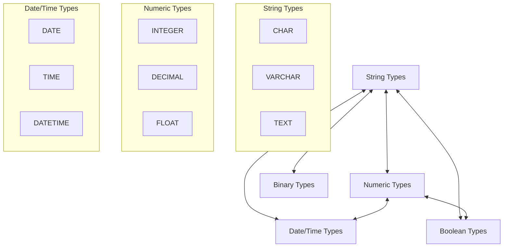

# SQL Data Conversion

## Introduction

When working with databases, you'll often encounter situations where data needs to be transformed from one type to another. SQL Data Conversion is the process of changing data from one data type to another (like converting text to numbers or dates to strings). This is a fundamental skill for data migration projects, reporting, and ensuring data consistency across systems.

In this tutorial, we'll explore how SQL handles data type conversions, when you need them, and the different methods available to convert data effectively.

## Why Data Conversion Matters

Data conversion is essential in SQL for several reasons:

- **Data Migration**: When moving data between different database systems that might handle data types differently
- **Data Integration**: When combining data from multiple sources with varying formats
- **Reporting**: When formatting output for human readability
- **Calculations**: When performing operations requiring specific data types
- **Data Validation**: When ensuring data conforms to expected formats

## SQL Data Types Overview

Before diving into conversion techniques, let's quickly review common SQL data types:

### Numeric Types
- **INTEGER**: Whole numbers without decimals
- **DECIMAL/NUMERIC**: Precise numbers with decimals
- **FLOAT/REAL**: Approximate numeric values

### String Types
- **CHAR**: Fixed-length character strings
- **VARCHAR**: Variable-length character strings
- **TEXT**: Large variable-length character strings

### Date and Time Types
- **DATE**: Calendar date (year, month, day)
- **TIME**: Time of day
- **DATETIME/TIMESTAMP**: Combined date and time

### Other Types
- **BOOLEAN**: True/false values
- **BINARY**: Binary data
- **JSON**: JSON-formatted data (in modern SQL databases)

## Implicit vs. Explicit Conversion

SQL supports two types of data conversion:

### Implicit Conversion

Implicit conversion happens automatically when SQL converts one data type to another without explicit instructions. While convenient, relying on implicit conversion can lead to unexpected results or errors.

```sql
-- Implicit conversion of string to integer
SELECT '123' + 456 AS Result;

-- Output:
-- Result
-- ------
-- 579
```

In this example, SQL automatically converts the string '123' to the number 123 before performing the addition.

### Explicit Conversion

Explicit conversion happens when you specifically instruct SQL to convert data from one type to another using conversion functions. This approach gives you more control and makes your intentions clear.

## SQL Data Conversion Functions

Different database systems provide various functions for data conversion. Let's examine the most common ones:

### CAST Function

The `CAST` function is part of the SQL standard and works across most database systems:

```sql
CAST(expression AS datatype)
```

Examples:

```sql
-- Convert string to integer
SELECT CAST('123' AS INT) AS IntValue;

-- Convert number to string
SELECT CAST(123 AS VARCHAR) AS StringValue;

-- Convert string to date
SELECT CAST('2023-10-15' AS DATE) AS DateValue;

-- Output:
-- IntValue
-- --------
-- 123

-- StringValue
-- -----------
-- 123

-- DateValue
-- ---------
-- 2023-10-15
```

### CONVERT Function (SQL Server, MySQL)

SQL Server and MySQL provide the `CONVERT` function with slightly different syntax:

SQL Server:
```sql
CONVERT(datatype, expression [, style])
```

MySQL:
```sql
CONVERT(expression, datatype)
```

SQL Server example with style parameter for date formatting:

```sql
-- Convert date to string with specific format (style 103 is dd/mm/yyyy)
SELECT CONVERT(VARCHAR, GETDATE(), 103) AS FormattedDate;

-- Output:
-- FormattedDate
-- -------------
-- 15/10/2023
```

### TO_CHAR, TO_NUMBER, TO_DATE (Oracle, PostgreSQL)

Oracle and PostgreSQL provide specialized conversion functions:

```sql
-- Convert date to formatted string
SELECT TO_CHAR(CURRENT_DATE, 'DD-MON-YYYY') AS FormattedDate;

-- Convert string to number
SELECT TO_NUMBER('1,234.56', '9,999.99') AS ConvertedNumber;

-- Convert string to date
SELECT TO_DATE('15-OCT-2023', 'DD-MON-YYYY') AS ConvertedDate;

-- Output:
-- FormattedDate
-- -------------
-- 15-OCT-2023

-- ConvertedNumber
-- ---------------
-- 1234.56

-- ConvertedDate
-- -------------
-- 2023-10-15
```

## Common Data Conversion Scenarios

Let's explore some practical examples of data conversion in real-world scenarios:

### Scenario 1: Cleaning and Standardizing Phone Numbers

When migrating customer data, you might need to standardize phone numbers stored in different formats:

```sql
-- Converting phone numbers to a standard format
SELECT 
    customer_id,
    original_phone,
    CASE 
        WHEN original_phone IS NULL THEN NULL
        ELSE CONCAT('(', SUBSTRING(REPLACE(REPLACE(REPLACE(original_phone, '(', ''), ')', ''), '-', ''), 1, 3), ') ',
            SUBSTRING(REPLACE(REPLACE(REPLACE(original_phone, '(', ''), ')', ''), '-', ''), 4, 3), '-',
            SUBSTRING(REPLACE(REPLACE(REPLACE(original_phone, '(', ''), ')', ''), '-', ''), 7, 4))
    END AS standardized_phone
FROM customers;

-- Input:
-- customer_id  | original_phone
-- -------------|--------------
-- 1            | 5551234567
-- 2            | (555)987-6543
-- 3            | 555-456-7890

-- Output:
-- customer_id | original_phone | standardized_phone
-- ------------|--------------|-----------------
-- 1           | 5551234567    | (555) 123-4567
-- 2           | (555)987-6543 | (555) 987-6543
-- 3           | 555-456-7890  | (555) 456-7890
```

### Scenario 2: Date Formatting for Report Generation

When generating reports, you might need to display dates in a more readable format:

```sql
-- SQL Server example
SELECT 
    order_id,
    order_date,
    CONVERT(VARCHAR, order_date, 107) AS formatted_date,
    total_amount
FROM orders
WHERE order_date BETWEEN '2023-01-01' AND '2023-01-31';

-- PostgreSQL example
SELECT 
    order_id,
    order_date,
    TO_CHAR(order_date, 'Month DD, YYYY') AS formatted_date,
    total_amount
FROM orders
WHERE order_date BETWEEN '2023-01-01' AND '2023-01-31';

-- Input:
-- order_id | order_date  | total_amount
-- ---------|------------|-------------
-- 1001     | 2023-01-15 | 245.67
-- 1002     | 2023-01-22 | 189.99

-- Output (SQL Server):
-- order_id | order_date  | formatted_date  | total_amount
-- ---------|------------|-----------------|-------------
-- 1001     | 2023-01-15 | Jan 15, 2023    | 245.67
-- 1002     | 2023-01-22 | Jan 22, 2023    | 189.99
```

### Scenario 3: Calculating Age from Birth Date

When migrating customer data, you might need to calculate age from birth dates:

```sql
-- SQL Server
SELECT 
    customer_id,
    birth_date,
    DATEDIFF(YEAR, birth_date, GETDATE()) - 
        CASE 
            WHEN DATEADD(YEAR, DATEDIFF(YEAR, birth_date, GETDATE()), birth_date) > GETDATE() 
            THEN 1 
            ELSE 0 
        END AS age
FROM customers;

-- MySQL
SELECT 
    customer_id,
    birth_date,
    TIMESTAMPDIFF(YEAR, birth_date, CURDATE()) AS age
FROM customers;

-- Input:
-- customer_id | birth_date
-- ------------|------------
-- 101         | 1980-05-12
-- 102         | 1995-11-28

-- Output:
-- customer_id | birth_date  | age
-- ------------|-------------|----
-- 101         | 1980-05-12  | 43
-- 102         | 1995-11-28  | 27
```

### Scenario 4: Currency Conversion and Formatting

When presenting financial data from different sources:

```sql
-- Converting numeric values to currency format
SELECT 
    product_id,
    product_name,
    price,
    CONCAT('$', FORMAT(price, 2)) AS formatted_price
FROM products;

-- Input:
-- product_id | product_name | price
-- -----------|--------------|------
-- 501        | Widget A     | 19.99
-- 502        | Widget B     | 34.5

-- Output:
-- product_id | product_name | price | formatted_price
-- -----------|--------------|-------|----------------
-- 501        | Widget A     | 19.99 | $19.99
-- 502        | Widget B     | 34.5  | $34.50
```

## Working with NULL Values During Conversion

NULL values require special attention during data conversion. Most conversion functions will return NULL if the input is NULL, but you can use COALESCE or ISNULL (in SQL Server) to provide default values:

```sql
-- Handling NULL values during conversion
SELECT 
    product_id,
    product_name,
    price,
    COALESCE(CAST(price AS VARCHAR), 'Price not available') AS price_info
FROM products;

-- Input:
-- product_id | product_name | price
-- -----------|--------------|------
-- 501        | Widget A     | 19.99
-- 502        | Widget B     | NULL

-- Output:
-- product_id | product_name | price | price_info
-- -----------|--------------|-------|------------
-- 501        | Widget A     | 19.99 | 19.99
-- 502        | Widget B     | NULL  | Price not available
```

## Data Conversion in Joins and Where Clauses

When joining tables or filtering data, data conversion is often necessary to ensure type compatibility:

```sql
-- Joining tables with different data types for ID columns
SELECT 
    c.customer_name,
    o.order_id,
    o.order_date
FROM 
    customers c
JOIN 
    orders o ON c.customer_id = CAST(o.customer_id AS VARCHAR)
WHERE 
    CAST(o.order_date AS DATE) BETWEEN '2023-01-01' AND '2023-01-31';
```

## Data Type Conversion Flow

Here's a visual guide to help understand the natural flow of data conversions:



## Best Practices for SQL Data Conversion

1. **Always Use Explicit Conversion**: Avoid relying on implicit conversion to prevent unexpected results.
2. **Handle Errors Gracefully**: Use error handling techniques (like TRY_CAST in SQL Server) to manage conversion failures.
3. **Be Cautious with Date Formats**: Different database systems interpret date formats differently. Use ISO format (YYYY-MM-DD) when possible.
4. **Understand Regional Settings**: Be aware that server regional settings can affect conversion behavior, especially for dates.
5. **Test Thoroughly**: Always test conversions with diverse sample data, including edge cases and NULL values.
6. **Document Conversion Logic**: In complex migration scenarios, document your conversion approach for future reference.
7. **Consider Performance**: Excessive type conversions can impact query performance. Design schemas to minimize necessary conversions.

## Common Errors and Troubleshooting

### Error: Arithmetic overflow error converting expression to data type int

This happens when trying to convert a value that's too large for the target data type:

```sql
-- This will cause an error
SELECT CAST('9999999999' AS INT) AS TooLargeInt;

-- Solution: Use a larger data type
SELECT CAST('9999999999' AS BIGINT) AS ConvertedValue;
```

### Error: Error converting data type varchar to datetime

This occurs when trying to convert an improperly formatted string to a date:

```sql
-- This will cause an error
SELECT CAST('31/12/2023' AS DATE) AS InvalidDateConversion;

-- Solution: Use properly formatted date string or appropriate conversion function
SELECT CAST('2023-12-31' AS DATE) AS ValidDateConversion;

-- Or in SQL Server
SELECT CONVERT(DATE, '31/12/2023', 103) AS ValidDateConversion;
```

### Error: The conversion of a varchar data type to a datetime data type resulted in an out-of-range value

This happens when the string contains a date that doesn't exist:

```sql
-- This will cause an error (there is no February 31)
SELECT CAST('2023-02-31' AS DATE) AS InvalidDate;

-- Solution: Validate date values before conversion or use TRY_CAST/TRY_CONVERT
SELECT TRY_CAST('2023-02-31' AS DATE) AS SafeConversion; -- Returns NULL
```

## Summary

SQL Data Conversion is a vital skill for data migration and management. We've covered:

- The importance of data conversion in database operations
- Different conversion functions across database systems
- Common conversion scenarios with practical examples
- Best practices for handling data conversion
- Troubleshooting common conversion errors

Mastering these techniques will help you effectively transform data between different formats, ensuring successful data migrations and accurate reporting.

## Practice Exercises

1. **Basic Conversions**: Write SQL queries to convert:
   - The number 123.45 to a string
   - The string '2023-03-15' to a date
   - The string 'true' to a boolean

2. **Phone Number Formatting**: Write a query to format phone numbers in a customer table to display as (XXX) XXX-XXXX.

3. **Date Manipulation**: Write a query to extract the day, month, and year from a date column and display them as separate columns.

4. **Currency Conversion**: Create a query that converts prices in USD to EUR based on a conversion rate of 0.92.

5. **Data Cleaning**: Write a query to clean a product code column that should contain only numeric values, replacing any non-numeric characters with an empty string.

## Additional Resources

- [SQL Server Data Type Conversion](https://docs.microsoft.com/en-us/sql/t-sql/data-types/data-type-conversion-database-engine)
- [MySQL Type Conversion Functions](https://dev.mysql.com/doc/refman/8.0/en/cast-functions.html)
- [PostgreSQL Data Type Formatting Functions](https://www.postgresql.org/docs/current/functions-formatting.html)
- [Oracle Data Type Conversion](https://docs.oracle.com/en/database/oracle/oracle-database/19/sqlrf/Data-Type-Conversion.html)