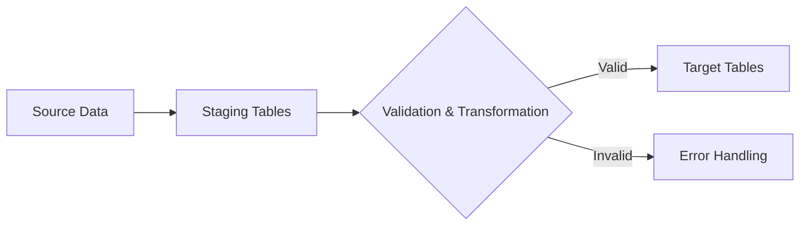

# SQL Staging Tables

## Introduction

Staging tables are temporary storage structures used during data migration and ETL (Extract, Transform, Load) processes. They serve as an intermediate area where data is temporarily held before being processed and loaded into its final destination. Think of staging tables as a "waiting room" where data sits while it's being validated, transformed, or prepared for its next destination.

In this guide, we'll explore what staging tables are, why they're crucial for successful data migrations, and how to implement them effectively in your SQL workflows.

## Why Use Staging Tables?

Before diving into how to create and use staging tables, let's understand why they're essential in data migration processes:

1. **Data Validation**: Verify data quality before loading it into production tables
2. **Performance Optimization**: Process data in batches without affecting production systems
3. **Error Handling**: Identify and fix issues before they impact production data
4. **Rollback Capability**: Easily revert changes if something goes wrong
5. **Transformation Workspace**: Apply complex transformations without risking source or target data integrity

## Basic Structure of a Staging Environment

A typical data migration process using staging tables follows this pattern:



## Creating Staging Tables

Let's look at how to create a basic staging table in SQL:

```sql
-- Example: Creating a staging table for customer data
CREATE TABLE stg_customers (
    customer_id INT,
    first_name VARCHAR(50),
    last_name VARCHAR(50),
    email VARCHAR(100),
    phone VARCHAR(20),
    address VARCHAR(255),
    city VARCHAR(50),
    state VARCHAR(2),
    zip_code VARCHAR(10),
    -- Additional metadata columns for staging
    source_system VARCHAR(50),
    load_date DATETIME DEFAULT CURRENT_TIMESTAMP,
    status VARCHAR(20) DEFAULT 'PENDING',
    error_message VARCHAR(255) NULL
);
```

Notice the additional metadata columns at the end of the table definition. These are common in staging tables to help track the data's origin, when it was loaded, and its current processing status.

## Loading Data into Staging Tables

After creating your staging tables, you'll need to load data from your source system. Here's an example:

```sql
-- Example: Loading data from source to staging
INSERT INTO stg_customers (
    customer_id, first_name, last_name, email, 
    phone, address, city, state, zip_code, source_system
)
SELECT 
    customer_id, first_name, last_name, email, 
    phone, address, city, state, zip_code, 'CRM_SYSTEM'
FROM source_database.customers
WHERE last_update > '2023-01-01';
```

## Data Validation in Staging

One of the primary benefits of staging tables is the ability to validate data before it reaches production. Here's an example of validating email addresses:

```sql
-- Example: Validating data in staging tables
UPDATE stg_customers
SET 
    status = CASE 
        WHEN email NOT LIKE '%@%.%' THEN 'ERROR'
        WHEN first_name IS NULL OR last_name IS NULL THEN 'ERROR'
        WHEN LEN(zip_code) < 5 THEN 'ERROR'
        ELSE 'VALID'
    END,
    error_message = CASE
        WHEN email NOT LIKE '%@%.%' THEN 'Invalid email format'
        WHEN first_name IS NULL OR last_name IS NULL THEN 'Missing name information'
        WHEN LEN(zip_code) < 5 THEN 'Invalid zip code'
        ELSE NULL
    END;
```

## Data Transformation

After validation, you can transform your data within the staging environment:

```sql
-- Example: Transforming data in staging tables
UPDATE stg_customers
SET 
    first_name = UPPER(first_name),
    last_name = UPPER(last_name),
    email = LOWER(email),
    phone = REPLACE(REPLACE(REPLACE(phone, '-', ''), '(', ''), ')', '')
WHERE status = 'VALID';
```

## Loading to Target Tables

Once your data is validated and transformed, you can load it into the target tables:

```sql
-- Example: Loading from staging to target
INSERT INTO production.customers (
    customer_id, first_name, last_name, email, 
    phone, address, city, state, zip_code
)
SELECT 
    customer_id, first_name, last_name, email, 
    phone, address, city, state, zip_code
FROM stg_customers
WHERE status = 'VALID';
```

## Real-World Example: Customer Data Migration

Let's walk through a complete example of using staging tables for migrating customer data from a legacy system to a new database:

### Step 1: Create the staging table

```sql
CREATE TABLE stg_customers (
    legacy_id VARCHAR(20),
    customer_name VARCHAR(100),
    contact_info VARCHAR(255),
    -- Target schema columns
    new_customer_id INT NULL,
    first_name VARCHAR(50) NULL,
    last_name VARCHAR(50) NULL,
    email VARCHAR(100) NULL,
    phone VARCHAR(20) NULL,
    -- Metadata
    source_system VARCHAR(50),
    load_date DATETIME DEFAULT CURRENT_TIMESTAMP,
    status VARCHAR(20) DEFAULT 'PENDING',
    error_message VARCHAR(255) NULL
);
```

### Step 2: Extract data from legacy system

```sql
INSERT INTO stg_customers (legacy_id, customer_name, contact_info, source_system)
SELECT 
    customer_code, 
    full_name, 
    contact_details,
    'LEGACY_CRM'
FROM legacy_database.customer_table;
```

### Step 3: Transform the data to match new schema

```sql
UPDATE stg_customers
SET 
    -- Parse customer name into first and last
    first_name = SUBSTRING(customer_name, 1, CHARINDEX(' ', customer_name + ' ') - 1),
    last_name = SUBSTRING(customer_name, CHARINDEX(' ', customer_name + ' ') + 1, LEN(customer_name)),
    
    -- Extract email and phone from contact info
    email = CASE 
        WHEN contact_info LIKE '%@%' 
        THEN SUBSTRING(contact_info, 
                      CHARINDEX('Email:', contact_info) + 6, 
                      CHARINDEX(',', contact_info + ',', CHARINDEX('Email:', contact_info)) - CHARINDEX('Email:', contact_info) - 6)
        ELSE NULL
    END,
    
    phone = CASE 
        WHEN contact_info LIKE '%Phone:%' 
        THEN SUBSTRING(contact_info, 
                      CHARINDEX('Phone:', contact_info) + 6, 
                      CHARINDEX(',', contact_info + ',', CHARINDEX('Phone:', contact_info)) - CHARINDEX('Phone:', contact_info) - 6)
        ELSE NULL
    END,
    
    -- Generate new IDs
    new_customer_id = ROW_NUMBER() OVER (ORDER BY legacy_id),
    
    -- Update status
    status = 'TRANSFORMED';
```

### Step 4: Validate the transformed data

```sql
UPDATE stg_customers
SET 
    status = CASE 
        WHEN email IS NULL AND phone IS NULL THEN 'ERROR'
        WHEN first_name IS NULL OR last_name IS NULL THEN 'ERROR'
        ELSE 'VALID'
    END,
    error_message = CASE
        WHEN email IS NULL AND phone IS NULL THEN 'Missing contact information'
        WHEN first_name IS NULL OR last_name IS NULL THEN 'Could not parse name'
        ELSE NULL
    END
WHERE status = 'TRANSFORMED';
```

### Step 5: Load to production

```sql
INSERT INTO production.customers (
    customer_id, first_name, last_name, email, phone, legacy_system_id
)
SELECT 
    new_customer_id, first_name, last_name, email, phone, legacy_id
FROM stg_customers
WHERE status = 'VALID';
```

### Step 6: Report on migration results

```sql
SELECT 
    status,
    COUNT(*) as record_count,
    ROUND(COUNT(*) * 100.0 / (SELECT COUNT(*) FROM stg_customers), 2) as percentage
FROM stg_customers
GROUP BY status;
```

Example output:

| status | record_count | percentage |
|--------|--------------|------------|
| VALID  | 9,532        | 95.32%     |
| ERROR  | 468          | 4.68%      |

## Best Practices for Staging Tables

1. **Include Metadata Columns**:
   - Add columns to track source system, load date/time, processing status
   - Include error message fields for troubleshooting

2. **Use Proper Naming Conventions**:
   - Prefix staging tables (e.g., `stg_`, `staging_`) for easy identification
   - Maintain consistent naming across your staging environment

3. **Implement Error Handling**:
   - Create error tables or use status flags to mark problematic records
   - Log detailed error messages for easier troubleshooting

4. **Manage Staging Data Lifecycle**:
   - Implement purge processes to clean up old staging data
   - Consider partitioning for large staging tables

5. **Add Indexes Strategically**:
   - Add minimal indexes to support validation and lookups
   - Don't over-index staging tables as they are temporary by nature

6. **Monitor Performance**:
   - Track load times and transformation durations
   - Optimize slow-running operations

## Common Staging Table Patterns

### Pattern 1: One-to-One Staging Tables

Create staging tables that mirror the structure of target tables, with additional metadata columns.

```sql
CREATE TABLE stg_products (
    -- Columns matching target table
    product_id INT,
    product_name VARCHAR(100),
    price DECIMAL(10,2),
    -- Metadata columns
    source_system VARCHAR(50),
    load_date DATETIME,
    status VARCHAR(20)
);
```

### Pattern 2: Consolidated Staging Tables

Create wider staging tables that consolidate data from multiple sources before splitting into normalized target tables.

```sql
CREATE TABLE stg_sales_consolidated (
    -- Order info
    order_id VARCHAR(50),
    order_date DATE,
    -- Customer info
    customer_id VARCHAR(50),
    customer_name VARCHAR(100),
    -- Product info
    product_id VARCHAR(50),
    product_name VARCHAR(100),
    quantity INT,
    price DECIMAL(10,2),
    -- Metadata
    source_system VARCHAR(50),
    load_date DATETIME,
    status VARCHAR(20)
);
```

### Pattern 3: Historical Staging Tables

Maintain historical staging data for audit and recovery purposes.

```sql
CREATE TABLE stg_customers_history (
    staging_id INT IDENTITY(1,1) PRIMARY KEY,
    customer_id INT,
    first_name VARCHAR(50),
    last_name VARCHAR(50),
    -- Other customer fields
    source_system VARCHAR(50),
    load_date DATETIME,
    process_date DATETIME,
    status VARCHAR(20)
);
```

## Summary

Staging tables are a critical component in SQL data migration processes. They provide a secure intermediary space where data can be validated, transformed, and prepared before being loaded into production systems. 

By using staging tables effectively, you can:
- Ensure data quality in your migration processes
- Create a safety buffer between source and target systems
- Implement complex transformations without risking data integrity
- Build robust error handling and reporting systems

As you develop your data migration workflows, incorporating staging tables should be a standard practice to ensure smooth, reliable, and maintainable ETL processes.

## Further Learning

### Exercises

1. Create a staging table for a product catalog migration that includes validation for required fields.
2. Design a staging environment for a multi-source data consolidation project.
3. Implement a logging system that tracks the progress of data through your staging tables.

### Additional Resources

- [Database Design Best Practices](https://example.com/database-design)
- [ETL Process Optimization](https://example.com/etl-optimization)
- [SQL Performance Tuning for Data Migration](https://example.com/sql-performance)