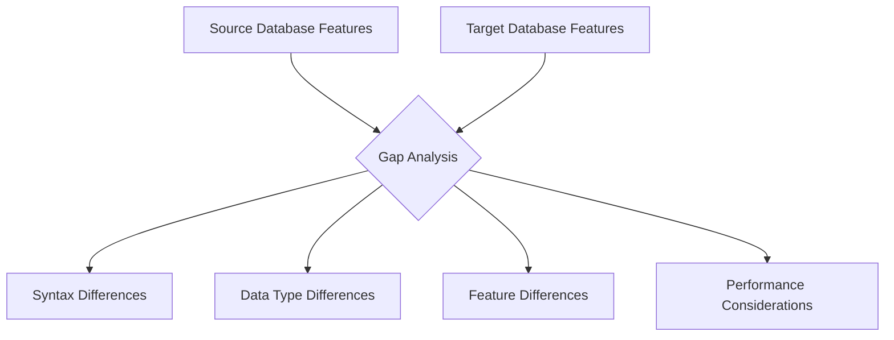
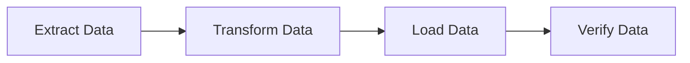

# SQL Migration Planning

## Introduction

Database migration is a critical process in software development that involves transferring data from one database system to another. SQL migration planning specifically focuses on preparing for and executing the movement of data between SQL database systems. This could involve upgrading to a newer version of the same database platform, switching to a different database vendor, or restructuring your database schema to better support evolving application needs.

Proper planning is crucial for successful migrations as it minimizes downtime, prevents data loss, and ensures application functionality remains intact. This guide will walk you through the essential steps of SQL migration planning to help you navigate this complex process with confidence.

## Why Plan Your SQL Migration?

Before diving into the planning process, let's understand why thorough migration planning is essential:

- **Minimize downtime**: A well-planned migration reduces the time your system is unavailable
- **Prevent data loss**: Careful planning ensures all data is properly transferred and validated
- **Maintain data integrity**: Proper planning preserves relationships and constraints
- **Reduce risks**: Identify and mitigate potential issues before they become problems
- **Control costs**: Avoid unexpected expenses from prolonged migrations or data recovery efforts

## The SQL Migration Planning Process

Let's break down the migration planning process into manageable steps:

### 1. Assessment and Inventory

Start by taking inventory of your current database environment:

```sql
-- Get a list of all tables in your database
SELECT table_name, table_schema 
FROM information_schema.tables
WHERE table_schema NOT IN ('pg_catalog', 'information_schema')
ORDER BY table_schema, table_name;

-- Find table sizes
SELECT 
    table_name,
    pg_size_pretty(pg_total_relation_size('"' || table_schema || '"."' || table_name || '"')) as total_size
FROM information_schema.tables
WHERE table_schema NOT IN ('pg_catalog', 'information_schema')
ORDER BY pg_total_relation_size('"' || table_schema || '"."' || table_name || '"') DESC;
```

Key assessment activities include:

- Document database size, number of tables, and record counts
- Identify complex objects (stored procedures, triggers, views, etc.)
- Map dependencies between database objects
- Catalog existing constraints, indices, and keys
- Identify custom data types or specialized SQL features

### 2. Define Migration Goals

Clearly articulate what you want to achieve with the migration:

- Are you upgrading to a newer version for better performance?
- Are you switching database vendors to reduce licensing costs?
- Are you restructuring your schema to support new application features?
- What is your target database platform and version?

Document both technical and business objectives to ensure alignment across stakeholders.

### 3. Gap Analysis

Compare your source and target database environments to identify differences that may impact migration:



Common gaps to identify include:

- SQL syntax differences between platforms
- Data type compatibility issues
- Missing features or functions in the target system
- Performance differences in query execution
- Authentication and security model changes

### 4. Create a Migration Strategy

Based on your assessment and gap analysis, define your migration approach:

- **Big Bang Migration**: Migrate all data at once during a planned outage
- **Phased Migration**: Migrate data in stages, usually by functional area
- **Parallel Operation**: Run both systems simultaneously during transition
- **Zero-Downtime Migration**: Use replication or other techniques to migrate without interruption

Example strategy document outline:

```
1. Migration Approach: Phased Migration
2. Migration Sequence:
   - Phase 1: Reference data (lookup tables)
   - Phase 2: Historical/archive data
   - Phase 3: Active transaction data
3. Timeline: 3 months total (1 month per phase)
4. Testing Approach: Dual verification of each phase
5. Rollback Plan: Revert to backup if verification fails
```

### 5. Design Schema Transformations

Document necessary schema changes between source and target:

```sql
-- Example of schema transformation script (PostgreSQL to MySQL)
-- Source (PostgreSQL):
CREATE TABLE customers (
    customer_id SERIAL PRIMARY KEY,
    name VARCHAR(100) NOT NULL,
    created_at TIMESTAMP WITH TIME ZONE DEFAULT CURRENT_TIMESTAMP
);

-- Target (MySQL):
CREATE TABLE customers (
    customer_id INT AUTO_INCREMENT PRIMARY KEY,
    name VARCHAR(100) NOT NULL,
    created_at DATETIME DEFAULT CURRENT_TIMESTAMP
);
```

Include mappings for:
- Table structures
- Data types
- Constraints and relationships
- Stored procedures and functions
- Indices and optimization structures

### 6. Create a Data Migration Plan

Detail how data will be extracted, transformed, and loaded:



This plan should include:

- Data extraction methods (SQL queries, export tools, etc.)
- Transformation rules for data conversion
- Loading procedures and optimization techniques
- Data validation and integrity checks

Example of a simple ETL script:

```sql
-- Extract data from source
SELECT customer_id, name, created_at 
FROM source_db.customers
INTO OUTFILE 'customers.csv'
FIELDS TERMINATED BY ',' 
ENCLOSED BY '"'
LINES TERMINATED BY '
';

-- Load data into target
LOAD DATA INFILE 'customers.csv'
INTO TABLE target_db.customers
FIELDS TERMINATED BY ','
ENCLOSED BY '"'
LINES TERMINATED BY '
'
(customer_id, name, created_at);
```

### 7. Develop a Testing Strategy

Create a comprehensive testing plan to ensure migration success:

- **Unit Testing**: Verify individual object transformations
- **Integration Testing**: Test relationships between migrated objects
- **Performance Testing**: Ensure the migrated system meets performance requirements
- **Application Testing**: Verify application functionality with the new database

Example test case for data validation:

```sql
-- Source database count
SELECT COUNT(*) FROM source_db.customers;
-- Expected output: 10000

-- Target database count
SELECT COUNT(*) FROM target_db.customers;
-- Expected output: 10000

-- Data integrity check
SELECT COUNT(*) 
FROM target_db.customers c
JOIN target_db.orders o ON c.customer_id = o.customer_id;
-- Compare with same query on source
```

### 8. Plan for Rollback

Always prepare for the possibility that migration may need to be reversed:

- Create full backups of source database before migration
- Document restore procedures
- Set clear criteria for rollback decisions
- Establish a rollback team and communication plan

Example rollback decision criteria:

```
Rollback will be initiated if:
1. Data validation shows >0.01% discrepancy
2. Critical application functionality fails
3. Performance degrades by >20% under test load
4. Migration exceeds the 4-hour maintenance window
```

### 9. Create a Detailed Timeline

Develop a timeline with specific tasks, dependencies, owners, and durations:

```
1. Pre-Migration (Week 1-2)
   - Create target database environment (DBA Team, 2 days)
   - Set up migration tools (DevOps, 3 days)
   - Develop transformation scripts (Development, 5 days)
   
2. Test Migration (Week 3-4)
   - Perform test migrations with sample data (All Teams, 5 days)
   - Fix issues found during testing (Development, 3 days)
   - Perform full test migration (All Teams, 2 days)
   
3. Production Migration (Week 5)
   - Announce downtime (Communications, 5 days before)
   - Backup source database (DBA Team, 2 hours)
   - Execute migration (All Teams, 4 hours)
   - Validate migration (QA Team, 2 hours)
   - Switch applications to new database (DevOps, 1 hour)
```

## Real-World Migration Example

Let's walk through a simplified example of migrating a customer order system from MySQL to PostgreSQL.

### Initial Assessment

```sql
-- MySQL: Identify tables to migrate
SHOW TABLES;
/* Output:
+----------------------+
| Tables_in_store      |
+----------------------+
| customers            |
| orders               |
| products             |
| order_items          |
+----------------------+
*/

-- Check table structure
DESCRIBE customers;
/* Output:
+-------------+--------------+------+-----+-------------------+----------------+
| Field       | Type         | Null | Key | Default           | Extra          |
+-------------+--------------+------+-----+-------------------+----------------+
| id          | int(11)      | NO   | PRI | NULL              | auto_increment |
| name        | varchar(100) | NO   |     | NULL              |                |
| email       | varchar(100) | NO   | UNI | NULL              |                |
| created_at  | timestamp    | NO   |     | CURRENT_TIMESTAMP |                |
+-------------+--------------+------+-----+-------------------+----------------+
*/
```

### Gap Analysis and Schema Transformation

```sql
-- MySQL source schema
CREATE TABLE orders (
    id INT AUTO_INCREMENT PRIMARY KEY,
    customer_id INT NOT NULL,
    order_date TIMESTAMP DEFAULT CURRENT_TIMESTAMP,
    status ENUM('pending', 'processing', 'shipped', 'delivered'),
    total DECIMAL(10,2),
    FOREIGN KEY (customer_id) REFERENCES customers(id)
);

-- PostgreSQL target schema with necessary transformations
CREATE TABLE orders (
    id SERIAL PRIMARY KEY,
    customer_id INTEGER NOT NULL,
    order_date TIMESTAMP DEFAULT CURRENT_TIMESTAMP,
    status VARCHAR(20) CHECK (status IN ('pending', 'processing', 'shipped', 'delivered')),
    total DECIMAL(10,2),
    FOREIGN KEY (customer_id) REFERENCES customers(id)
);
```

Note the transformations:
- `INT AUTO_INCREMENT` becomes `SERIAL`
- `ENUM` type becomes `VARCHAR` with a `CHECK` constraint

### Data Migration Script Example

```sql
-- Export data from MySQL
SELECT id, customer_id, order_date, status, total
FROM orders
INTO OUTFILE '/tmp/orders.csv'
FIELDS TERMINATED BY ',' 
ENCLOSED BY '"'
LINES TERMINATED BY '
';

-- Import data to PostgreSQL
COPY orders(id, customer_id, order_date, status, total)
FROM '/tmp/orders.csv'
DELIMITER ','
CSV;

-- Reset sequence to continue from the highest imported ID
SELECT setval('orders_id_seq', (SELECT MAX(id) FROM orders));
```

### Validation Query

```sql
-- Count validation
SELECT 'MySQL' as source, COUNT(*) as order_count FROM mysql_db.orders
UNION ALL
SELECT 'PostgreSQL' as source, COUNT(*) as order_count FROM postgres_db.orders;

/* Expected Output:
+------------+-------------+
| source     | order_count |
+------------+-------------+
| MySQL      | 15320       |
| PostgreSQL | 15320       |
+------------+-------------+
*/

-- Data integrity check
SELECT AVG(total) as avg_order_value FROM mysql_db.orders;
SELECT AVG(total) as avg_order_value FROM postgres_db.orders;
-- These values should match
```

## Common Migration Challenges and Solutions

### 1. Data Type Incompatibilities

**Challenge**: Source and target databases handle certain data types differently.

**Solution**: Create mapping rules for data type conversion.

```sql
-- Example: Converting MySQL TINYINT(1) to PostgreSQL BOOLEAN
-- In MySQL extraction script:
SELECT 
    id,
    CASE WHEN active = 1 THEN 'true' ELSE 'false' END as active
FROM users;

-- In PostgreSQL loading script:
CREATE TABLE users (
    id INTEGER PRIMARY KEY,
    active BOOLEAN
);
```

### 2. Character Set and Collation Issues

**Challenge**: Different character encoding between source and target.

**Solution**: Specify encoding during export and import.

```sql
-- MySQL export with UTF-8 encoding
SELECT * 
INTO OUTFILE '/tmp/data.csv'
CHARACTER SET utf8
FROM source_table;

-- PostgreSQL import with UTF-8 encoding
COPY target_table 
FROM '/tmp/data.csv' 
WITH (ENCODING 'UTF8');
```

### 3. Large Table Migration

**Challenge**: Tables too large to migrate in one operation.

**Solution**: Use chunking to migrate in batches.

```sql
-- Chunk migration example (pseudocode)
SET @chunk_size = 10000;
SET @total_records = (SELECT COUNT(*) FROM large_table);
SET @chunks = CEILING(@total_records / @chunk_size);

FOR i IN 1..@chunks DO
    -- Export chunk
    SELECT * FROM large_table 
    LIMIT @chunk_size OFFSET (i-1)*@chunk_size
    INTO OUTFILE '/tmp/chunk_${i}.csv';
    
    -- Import chunk
    COPY target_table FROM '/tmp/chunk_${i}.csv';
END FOR;
```

## Migration Checklist

Use this checklist to ensure you've covered all important aspects of migration planning:

- [ ] Complete database inventory and assessment
- [ ] Document migration goals and success criteria
- [ ] Perform gap analysis between source and target
- [ ] Select appropriate migration strategy
- [ ] Design schema transformations
- [ ] Create detailed data migration plan
- [ ] Develop comprehensive testing strategy
- [ ] Establish rollback procedures
- [ ] Create detailed timeline with responsibilities
- [ ] Prepare communication plan for stakeholders
- [ ] Schedule maintenance windows and resources
- [ ] Prepare monitoring for post-migration validation

## Summary

SQL migration planning is a critical process that requires careful consideration of multiple factors. By following a structured approach that includes thorough assessment, gap analysis, strategy development, and detailed execution planning, you can significantly reduce the risks associated with database migrations.

Remember that every migration is unique, and the planning process should be tailored to your specific environment and requirements. The investment in proper planning will pay dividends in a smoother migration with minimal disruption to your business operations.

## Additional Resources

- [Database Migration Best Practices](https://example.com/db-migration)
- [SQL Server Migration Assistant (SSMA)](https://docs.microsoft.com/en-us/sql/ssma/sql-server-migration-assistant)
- [PostgreSQL Migration Tools](https://wiki.postgresql.org/wiki/Converting_from_other_Databases_to_PostgreSQL)
- [MySQL Workbench Migration Tool](https://dev.mysql.com/doc/workbench/en/wb-migration.html)

## Exercises

1. **Assessment Exercise**: Create an inventory script that lists all tables, views, stored procedures, and triggers in your database.

2. **Gap Analysis Exercise**: Compare the data types between MySQL and PostgreSQL. Create a mapping table showing equivalent types.

3. **Planning Exercise**: Develop a migration plan for a simple blog database with users, posts, and comments tables.

4. **Validation Exercise**: Write SQL queries to validate data integrity after a migration, checking record counts, referential integrity, and data consistency.

5. **Rollback Exercise**: Create a step-by-step rollback plan that includes backup verification, application reconfiguration, and stakeholder communication.