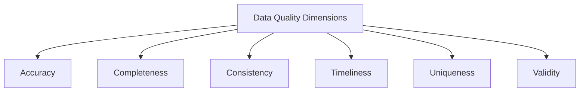

# SQL Data Quality

## Introduction

Data quality is a critical aspect of SQL data migration that often determines the success of your entire project. When moving data from one system to another, ensuring that the information remains accurate, consistent, and reliable is paramount. Poor data quality can lead to incorrect business decisions, system failures, and significant costs to remedy problems after migration.

In this guide, we'll explore the fundamentals of SQL data quality, why it matters during migrations, and how to implement practical techniques to validate and improve your data. Whether you're transferring data between databases, upgrading systems, or consolidating information, these principles will help you maintain data integrity throughout the process.

## Why Data Quality Matters in SQL Migrations

Before diving into techniques, let's understand why data quality is particularly important during migrations:

- **Business Impact**: Poor quality data can lead to incorrect analytics, flawed decisions, and financial losses
- **User Confidence**: End-users may lose trust in a new system if migrated data appears incomplete or incorrect
- **System Functionality**: Applications often fail or behave unexpectedly when data doesn't meet expected formats or business rules
- **Compliance Risks**: Regulatory requirements may demand complete and accurate data records

## Common Data Quality Dimensions

When assessing data quality, we typically examine these key dimensions:



- **Accuracy**: Data correctly represents the real-world entity or event
- **Completeness**: All required data is present
- **Consistency**: Data values don't conflict with each other
- **Timeliness**: Data is up-to-date for its intended use
- **Uniqueness**: Entities are represented without unnecessary duplication
- **Validity**: Data conforms to defined formats, rules, and constraints

## Data Profiling: The First Step

Before migration, you should profile your source data to understand its current state. SQL provides several techniques for this purpose.

### Basic Column Statistics

This query provides a quick overview of a column's statistics:

```sql
SELECT 
    COUNT(*) AS total_rows,
    COUNT(customer_email) AS non_null_emails,
    COUNT(DISTINCT customer_email) AS unique_emails,
    (COUNT(*) - COUNT(customer_email)) AS missing_emails
FROM customers;
```

Example output:

```
+------------+----------------+---------------+----------------+
| total_rows | non_null_emails | unique_emails | missing_emails |
+------------+----------------+---------------+----------------+
| 5000       | 4850           | 4820          | 150            |
+------------+----------------+---------------+----------------+
```

From this output, we can determine that:
- We have 5,000 customer records
- 150 records are missing email addresses
- There are 30 duplicate email addresses

### Identifying Pattern Issues

To find values that don't match expected patterns, you can use SQL pattern matching:

```sql
-- Find improperly formatted email addresses
SELECT customer_email
FROM customers
WHERE customer_email IS NOT NULL
AND customer_email NOT LIKE '%_@_%.__%';
```

### Finding Outliers

This query identifies potentially problematic numerical outliers:

```sql
SELECT 
    MIN(order_amount) AS min_amount,
    MAX(order_amount) AS max_amount,
    AVG(order_amount) AS avg_amount,
    PERCENTILE_CONT(0.5) WITHIN GROUP (ORDER BY order_amount) AS median_amount
FROM orders;
```

## Data Quality Validation Techniques

After profiling, implement validation checks as part of your migration process.

### 1. Constraint Validation

Ensure data conforms to business rules using constraints:

```sql
-- Check for valid product price ranges
SELECT product_id, product_name, price
FROM products
WHERE price <= 0 OR price > 10000;

-- Check for future dates in historical records
SELECT order_id, order_date
FROM orders
WHERE order_date > CURRENT_DATE;
```

### 2. Referential Integrity

Verify that relationships between tables remain intact:

```sql
-- Find orders with invalid customer references
SELECT o.order_id, o.customer_id
FROM orders o
LEFT JOIN customers c ON o.customer_id = c.customer_id
WHERE c.customer_id IS NULL;
```

### 3. Record Counts and Checksums

Confirm that all data transferred correctly:

```sql
-- Compare record counts between source and target
SELECT 
    (SELECT COUNT(*) FROM source_db.customers) AS source_count,
    (SELECT COUNT(*) FROM target_db.customers) AS target_count,
    (SELECT COUNT(*) FROM source_db.customers) - 
    (SELECT COUNT(*) FROM target_db.customers) AS difference;
```

## Data Cleansing Strategies

When issues are identified, use these strategies to clean your data before migration.

### Standardizing Values

```sql
-- Standardize phone number formats
UPDATE customers
SET phone_number = REGEXP_REPLACE(phone_number, '[^0-9]', '')
WHERE phone_number IS NOT NULL;

-- Standardize case in categorical data
UPDATE products
SET category = UPPER(TRIM(category))
WHERE category IS NOT NULL;
```

### Handling NULL Values

```sql
-- Set default values for missing quantities
UPDATE order_items
SET quantity = 1
WHERE quantity IS NULL;
```

### Removing Duplicates

```sql
-- Identify duplicate customer records
WITH DuplicateEmails AS (
    SELECT customer_email,
           ROW_NUMBER() OVER (PARTITION BY customer_email ORDER BY created_at) AS row_num
    FROM customers
    WHERE customer_email IS NOT NULL
)
SELECT c.*
FROM customers c
JOIN DuplicateEmails d ON c.customer_email = d.customer_email
WHERE d.row_num > 1;
```

## Real-World Example: Customer Data Migration

Let's walk through a complete example of migrating customer data while ensuring quality.

### Step 1: Profile the Source Data

```sql
-- Check overall data quality issues
SELECT 
    COUNT(*) AS total_customers,
    SUM(CASE WHEN email IS NULL THEN 1 ELSE 0 END) AS null_emails,
    SUM(CASE WHEN phone IS NULL THEN 1 ELSE 0 END) AS null_phones,
    SUM(CASE WHEN first_name IS NULL OR last_name IS NULL THEN 1 ELSE 0 END) AS incomplete_names,
    SUM(CASE WHEN email NOT LIKE '%_@_%.__%' AND email IS NOT NULL THEN 1 ELSE 0 END) AS invalid_emails
FROM source_customers;
```

### Step 2: Create Validation Rules

```sql
-- Create a validation table to track issues
CREATE TABLE customer_validation_results (
    customer_id INT,
    validation_date TIMESTAMP DEFAULT CURRENT_TIMESTAMP,
    issue_type VARCHAR(50),
    issue_description VARCHAR(200)
);

-- Insert validation results
INSERT INTO customer_validation_results (customer_id, issue_type, issue_description)
SELECT 
    customer_id,
    'Missing Email',
    'Customer record is missing email address'
FROM source_customers
WHERE email IS NULL;

INSERT INTO customer_validation_results (customer_id, issue_type, issue_description)
SELECT 
    customer_id,
    'Invalid Email Format',
    'Email does not match valid pattern'
FROM source_customers
WHERE email IS NOT NULL AND email NOT LIKE '%_@_%.__%';

-- Additional validations...
```

### Step 3: Clean and Transform

```sql
-- Create a staging table for transformation
CREATE TABLE staging_customers AS
SELECT
    customer_id,
    TRIM(first_name) AS first_name,
    TRIM(last_name) AS last_name,
    LOWER(TRIM(email)) AS email,
    REGEXP_REPLACE(phone, '[^0-9]', '') AS phone,
    -- Additional transformations...
FROM source_customers;

-- Apply data quality rules
UPDATE staging_customers
SET phone = NULL
WHERE LENGTH(phone) < 10;  -- Invalid phone numbers become NULL
```

### Step 4: Load and Verify

```sql
-- Insert into target system
INSERT INTO target_customers
SELECT * FROM staging_customers;

-- Verify migration success
SELECT 
    (SELECT COUNT(*) FROM source_customers) AS source_count,
    (SELECT COUNT(*) FROM target_customers) AS target_count,
    ((SELECT COUNT(*) FROM target_customers) * 100.0 / 
     NULLIF((SELECT COUNT(*) FROM source_customers), 0)) AS percentage_migrated;
```

## Implementing Ongoing Quality Checks

Data quality shouldn't end after migration. Implement these practices for ongoing quality assurance:

### 1. Data Quality Triggers

Create database triggers to enforce quality rules on new or updated data:

```sql
CREATE TRIGGER validate_new_customer
BEFORE INSERT ON customers
FOR EACH ROW
BEGIN
    IF NEW.email IS NOT NULL AND NEW.email NOT LIKE '%_@_%.__%' THEN
        SIGNAL SQLSTATE '45000' 
        SET MESSAGE_TEXT = 'Invalid email format';
    END IF;
END;
```

### 2. Scheduled Validation Jobs

Set up scheduled jobs to check data periodically:

```sql
CREATE PROCEDURE check_data_quality()
BEGIN
    -- Run various quality checks
    INSERT INTO quality_issues (issue_date, issue_type, record_count, description)
    SELECT 
        CURRENT_DATE,
        'Orphaned Orders',
        COUNT(*),
        'Orders without valid customer references'
    FROM orders o
    LEFT JOIN customers c ON o.customer_id = c.customer_id
    WHERE c.customer_id IS NULL;
    
    -- Additional checks...
END;

-- Call via scheduled job
-- EXEC check_data_quality();
```

## Best Practices for SQL Data Quality

To summarize, here are key best practices to maintain high data quality during migrations:

1. **Profile Before You Migrate**: Understand your data before attempting to move it
2. **Define Quality Rules**: Establish clear criteria for what constitutes "good" data
3. **Use Staging Areas**: Transform and clean data in staging tables before final loading
4. **Validate at Multiple Levels**: Check individual values, records, and relationships
5. **Document Everything**: Keep records of all quality issues and how they were addressed
6. **Involve Business Users**: Get feedback from those who understand the data's meaning
7. **Automate When Possible**: Create repeatable validation processes
8. **Monitor Post-Migration**: Continue checking data quality after go-live

## Summary

Ensuring data quality during SQL migrations is a multifaceted process that requires careful planning, validation, and cleansing. By following the techniques outlined in this guide, you can greatly reduce the risk of data-related issues during your migration projects.

Remember that data quality is not just a technical concern but a business necessity. The time invested in maintaining high-quality data during migration will pay dividends in system reliability, user satisfaction, and accurate business insights.

## Additional Resources

- **Books**:
  - "Data Quality: The Accuracy Dimension" by Jack E. Olson
  - "Executing Data Quality Projects" by Danette McGilvray

- **Online Resources**:
  - [Data Quality Pro](https://www.dataqualitypro.com/)
  - [DAMA International](https://dama.org/)

## Exercises

1. Write SQL queries to profile a sample customer table, identifying issues in at least three data quality dimensions.
2. Create a data validation script that checks for referential integrity between Orders and Products tables.
3. Develop a stored procedure that generates a weekly data quality report.
4. Design a set of data cleansing queries to standardize address data.
5. Create a test migration plan that includes pre-validation, transformation, and post-validation steps.