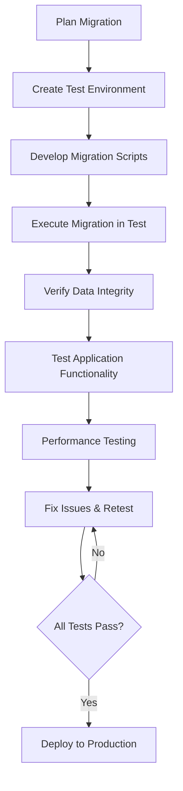

# SQL Migration Testing

## Introduction

SQL Migration Testing is a critical process in database development that ensures data is correctly transferred from one database environment to another. Whether you're upgrading your database system, changing schema structures, or moving data between platforms, migration testing helps verify that your data remains accurate, complete, and functional after the transition.

As applications evolve, databases need to adapt as well. These adaptations often require migrations—controlled changes to database schema and data. Testing these migrations is crucial to prevent data loss, corruption, or application failures that could impact your users and business.

In this guide, we'll explore the fundamentals of SQL migration testing, essential techniques, and practical examples to help you implement effective testing strategies for your database migrations.

## Why Migration Testing Matters

Database migrations can be risky. Here's why testing them is essential:

1. **Data Integrity** - Ensures no data is lost or corrupted during the migration
2. **Application Functionality** - Verifies that applications using the database continue to work correctly
3. **Performance Validation** - Confirms that the migrated database performs as expected
4. **Compliance Requirements** - Helps meet regulatory standards for data handling and protection
5. **Business Continuity** - Reduces downtime and risk during database changes

## Migration Testing Process

The SQL migration testing process typically follows these key stages:



## Types of Migration Tests

### 1. Schema Validation Tests

These tests verify that the database structure has been correctly migrated, including:
- Tables and views
- Columns and data types
- Constraints (primary keys, foreign keys, unique constraints)
- Indexes
- Stored procedures and functions

#### Example: Schema Comparison Test

```sql
-- Script to verify table structure after migration
SELECT 
    table_name, 
    column_name, 
    data_type, 
    character_maximum_length
FROM 
    information_schema.columns
WHERE 
    table_name = 'customers'
ORDER BY 
    ordinal_position;
```

**Expected Output:**
```
table_name | column_name | data_type | character_maximum_length
-----------+-------------+-----------+-------------------------
customers  | customer_id | int       | NULL
customers  | first_name  | varchar   | 50
customers  | last_name   | varchar   | 50
customers  | email       | varchar   | 100
customers  | created_at  | timestamp | NULL
```

### 2. Data Validation Tests

These tests ensure that data has been correctly migrated, with focus on:
- Row counts
- Data completeness
- Data accuracy
- Business rules validation

#### Example: Row Count Validation

```sql
-- Source database
SELECT COUNT(*) AS source_count FROM source_db.customers;

-- Target database
SELECT COUNT(*) AS target_count FROM target_db.customers;
```

**Expected Output:**
```
source_count
------------
1250

target_count
------------
1250
```

#### Example: Data Integrity Check

```sql
-- Check for data discrepancies between source and target
SELECT 
    s.customer_id,
    s.email AS source_email,
    t.email AS target_email
FROM 
    source_db.customers s
JOIN 
    target_db.customers t ON s.customer_id = t.customer_id
WHERE 
    s.email != t.email;
```

If the migration was successful, this query should return no rows.

### 3. Constraint and Relationship Tests

These tests verify that all database constraints and relationships are preserved after migration:

```sql
-- Check if all foreign keys are properly defined
SELECT 
    tc.constraint_name, 
    tc.table_name, 
    kcu.column_name, 
    ccu.table_name AS referenced_table,
    ccu.column_name AS referenced_column
FROM 
    information_schema.table_constraints tc
JOIN 
    information_schema.key_column_usage kcu ON tc.constraint_name = kcu.constraint_name
JOIN 
    information_schema.constraint_column_usage ccu ON ccu.constraint_name = tc.constraint_name
WHERE 
    tc.constraint_type = 'FOREIGN KEY';
```

### 4. Performance Tests

These tests measure the performance of the migrated database:
- Query execution time
- Transaction throughput
- Index effectiveness

#### Example: Query Performance Test

```sql
-- Test query performance before and after migration
SET @start = NOW();

SELECT 
    c.customer_id,
    c.first_name,
    c.last_name,
    COUNT(o.order_id) AS total_orders,
    SUM(o.order_total) AS total_spent
FROM 
    customers c
LEFT JOIN 
    orders o ON c.customer_id = o.customer_id
GROUP BY 
    c.customer_id, c.first_name, c.last_name
ORDER BY 
    total_spent DESC
LIMIT 100;

SELECT TIMEDIFF(NOW(), @start) AS execution_time;
```

## Practical Migration Testing Workflow

Let's walk through a practical example of testing a database migration:

### Scenario: Adding a new column to an existing table

Imagine we need to add a `phone_number` column to our `customers` table.

#### 1. Create Migration Script

```sql
-- Migration script (up.sql)
ALTER TABLE customers ADD COLUMN phone_number VARCHAR(20);

-- For existing records, set default value
UPDATE customers SET phone_number = 'Unknown';
```

#### 2. Create Rollback Script

Always prepare a rollback script in case the migration fails:

```sql
-- Rollback script (down.sql)
ALTER TABLE customers DROP COLUMN phone_number;
```

#### 3. Test the Migration in a Test Environment

```sql
-- Before migration: verify current schema
SELECT 
    column_name, 
    data_type 
FROM 
    information_schema.columns 
WHERE 
    table_name = 'customers';

-- Execute migration
SOURCE up.sql;

-- After migration: verify new schema
SELECT 
    column_name, 
    data_type 
FROM 
    information_schema.columns 
WHERE 
    table_name = 'customers';

-- Verify data in the new column
SELECT 
    customer_id, 
    first_name, 
    last_name, 
    phone_number 
FROM 
    customers 
LIMIT 10;
```

#### 4. Test Application Functionality

Verify that all application functions that interact with the `customers` table still work correctly:

```sql
-- Test query that should now include the new column
SELECT 
    customer_id, 
    CONCAT(first_name, ' ', last_name) AS customer_name,
    email,
    phone_number
FROM 
    customers
WHERE 
    customer_id = 101;
```

## Automated Testing Approaches

Manual testing is time-consuming and error-prone. Here are some approaches to automate your migration tests:

### 1. Using Testing Frameworks

Many database migration tools include built-in testing capabilities:

- **Flyway** - Test migrations can be run using the `test` command
- **Liquibase** - Offers test contexts for validating migrations
- **DBUnit** - Java framework for database unit testing
- **SQLTest** - Specialized tool for database testing

### 2. Custom Testing Scripts

You can create custom scripts to verify migrations:

```bash
#!/bin/bash
# Example bash script for testing a migration

# Run migration
mysql -u username -p database < migration.sql

# Check row counts
SOURCE_COUNT=$(mysql -u username -p source_db -e "SELECT COUNT(*) FROM customers;" -s)
TARGET_COUNT=$(mysql -u username -p target_db -e "SELECT COUNT(*) FROM customers;" -s)

if [ "$SOURCE_COUNT" == "$TARGET_COUNT" ]; then
  echo "Row count validation passed"
else
  echo "Row count validation failed"
  exit 1
fi

# Run more tests...
```

### 3. Data Comparison Tools

Several tools can help compare databases before and after migration:

- **SQL Data Compare** (Red Gate)
- **dbForge Data Compare**
- **Toad Data Compare**
- **Open source alternatives like `pgdiff` for PostgreSQL**

## Real-World Migration Testing Example

Let's look at a comprehensive real-world example involving a more complex migration.

### Scenario: Migrating from Single Table to Normalized Schema

Imagine we have a simple `orders` table that we want to normalize into `orders` and `order_items` tables.

**Original Schema:**
```sql
CREATE TABLE orders (
    order_id INT PRIMARY KEY,
    customer_id INT,
    order_date DATE,
    product_id INT,
    product_name VARCHAR(100),
    quantity INT,
    price DECIMAL(10,2),
    total DECIMAL(10,2)
);
```

**Target Schema:**
```sql
CREATE TABLE orders (
    order_id INT PRIMARY KEY,
    customer_id INT,
    order_date DATE,
    order_total DECIMAL(10,2)
);

CREATE TABLE order_items (
    item_id INT PRIMARY KEY,
    order_id INT,
    product_id INT,
    product_name VARCHAR(100),
    quantity INT,
    price DECIMAL(10,2),
    item_total DECIMAL(10,2),
    FOREIGN KEY (order_id) REFERENCES orders(order_id)
);
```

#### Migration Testing Process

1. **Pre-migration validation:**

```sql
-- Get total orders and sum of all totals
SELECT 
    COUNT(DISTINCT order_id) AS total_orders,
    SUM(total) AS grand_total
FROM 
    orders;
```

2. **Execute the migration:**

```sql
-- First, create the new tables
CREATE TABLE new_orders (
    order_id INT PRIMARY KEY,
    customer_id INT,
    order_date DATE,
    order_total DECIMAL(10,2)
);

CREATE TABLE order_items (
    item_id INT AUTO_INCREMENT PRIMARY KEY,
    order_id INT,
    product_id INT,
    product_name VARCHAR(100),
    quantity INT,
    price DECIMAL(10,2),
    item_total DECIMAL(10,2),
    FOREIGN KEY (order_id) REFERENCES new_orders(order_id)
);

-- Populate new_orders table with unique orders
INSERT INTO new_orders (order_id, customer_id, order_date, order_total)
SELECT 
    order_id, 
    customer_id, 
    order_date, 
    SUM(total) AS order_total
FROM 
    orders
GROUP BY 
    order_id, customer_id, order_date;

-- Populate order_items table
INSERT INTO order_items (order_id, product_id, product_name, quantity, price, item_total)
SELECT 
    order_id, 
    product_id, 
    product_name, 
    quantity, 
    price, 
    total
FROM 
    orders;
```

3. **Post-migration testing:**

```sql
-- Verify order counts match
SELECT COUNT(*) AS original_order_count FROM (
    SELECT DISTINCT order_id FROM orders
) AS original;

SELECT COUNT(*) AS new_order_count FROM new_orders;

-- Verify sum of totals match
SELECT SUM(total) AS original_total FROM orders;
SELECT SUM(order_total) AS new_orders_total FROM new_orders;

-- Verify all line items migrated correctly
SELECT COUNT(*) AS original_line_items FROM orders;
SELECT COUNT(*) AS new_line_items FROM order_items;

-- Verify referential integrity
SELECT 
    COUNT(*) AS orphaned_items
FROM 
    order_items oi
LEFT JOIN 
    new_orders o ON oi.order_id = o.order_id
WHERE 
    o.order_id IS NULL;
```

4. **Application functionality testing:**

```sql
-- Test a query that would have run on the old schema
SELECT 
    o.order_id, 
    o.customer_id, 
    o.order_date, 
    SUM(oi.item_total) AS order_total
FROM 
    new_orders o
JOIN 
    order_items oi ON o.order_id = oi.order_id
WHERE 
    o.customer_id = 101
GROUP BY 
    o.order_id, o.customer_id, o.order_date;
```

## Best Practices for SQL Migration Testing

1. **Always test in isolated environments** before production
2. **Create comprehensive test cases** covering all aspects of your data
3. **Automate testing wherever possible** to ensure consistency
4. **Include rollback testing** to verify you can undo migrations if needed
5. **Perform performance testing** to ensure the migration doesn't impact system speed
6. **Test with production-like data volumes** to identify scaling issues
7. **Document all test cases** for future reference
8. **Implement data validation checks** to verify data integrity
9. **Test application functionality** post-migration
10. **Include edge cases** in your test plan, such as NULL values, special characters, etc.

## Common Migration Testing Challenges

1. **Large data volumes** - Use sampling techniques or subset testing
2. **Complex dependencies** - Map all dependencies before migration
3. **Legacy systems** - Document and understand legacy schema quirks
4. **Time constraints** - Prioritize critical tests and automate where possible
5. **Production downtime** - Plan migrations during off-peak hours and optimize your process

## Tools for SQL Migration Testing

Several tools can help with SQL migration testing:

1. **Database Migration Tools**:
   - Flyway
   - Liquibase
   - Redgate SQL Compare
   - dbForge Schema Compare

2. **Testing Frameworks**:
   - DBUnit
   - SQL Test
   - tSQLt (for SQL Server)
   - pgTap (for PostgreSQL)

3. **Data Comparison Tools**:
   - Redgate Data Compare
   - ApexSQL Data Diff
   - dbForge Data Compare

## Summary

SQL Migration Testing is an essential practice for ensuring successful database migrations. By implementing a comprehensive testing strategy, you can minimize risks, prevent data loss or corruption, and ensure your applications continue to function correctly after migration.

The key points to remember:
- Always test migrations thoroughly in isolated environments
- Create test cases that cover schema, data, constraints, and performance
- Automate testing where possible to improve efficiency and consistency
- Prepare rollback scripts and test them before any production migration
- Document your migration and testing process for future reference

By following the techniques and examples in this guide, you'll be better equipped to plan and execute successful database migrations with confidence.

## Exercises

1. Create a test plan for migrating a simple customers and orders database from MySQL to PostgreSQL.
2. Write SQL scripts to validate data integrity after adding a new column to an existing table.
3. Develop a simple automated testing script that compares row counts before and after migration.
4. Design a normalized schema from a denormalized one and write migration scripts with proper testing.
5. Create a rollback plan for a complex schema change and test its effectiveness.

## Additional Resources

- [Flyway Documentation](https://flywaydb.org/documentation/)
- [Liquibase Documentation](https://docs.liquibase.com/)
- [Database Testing Fundamentals](https://www.oracle.com/database/technologies/database-testing.html)
- [SQL Server Data Migration Assistant](https://docs.microsoft.com/en-us/sql/dma/dma-overview)
- [PostgreSQL Migration Tools](https://wiki.postgresql.org/wiki/Migration_Tools)