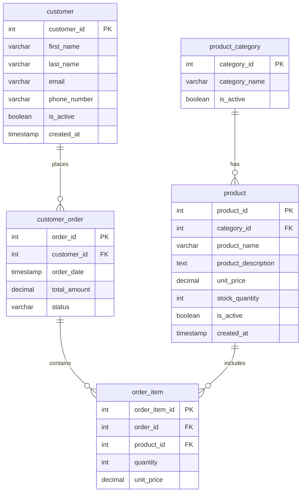

# SQL Naming Conventions

When writing SQL code, using consistent and clear naming conventions is just as important as getting your queries to work correctly. Good naming conventions make your database more understandable, your code more maintainable, and collaboration with other developers much smoother.

## Why Naming Conventions Matter

Imagine trying to navigate a city where street names change randomly or follow no logical pattern. Similarly, databases without consistent naming conventions become confusing labyrinths that slow down development and introduce errors.

Good naming conventions provide:

- **Readability**: Makes SQL code easier to understand
- **Consistency**: Reduces cognitive load when working with the database
- **Self-documentation**: Names that explain what objects are and what they do
- **Error prevention**: Avoids ambiguity that can lead to bugs
- **Maintainability**: Makes databases easier to update and expand

Let's explore the best practices for naming various database objects.

## General Naming Rules

Before diving into specific database objects, here are some universal principles:

1. **Be consistent**: Once you choose a convention, stick with it throughout your project
2. **Use descriptive names**: Names should clearly indicate the object's purpose
3. **Keep names concise**: Aim for clarity without excessive length
4. **Avoid reserved words**: Don't use SQL keywords as object names
5. **Use only standard characters**: Stick to letters, numbers, and underscores
6. **Consider case sensitivity**: Be aware that some database systems are case-sensitive

## Table Naming Conventions

Tables represent entities or concepts in your database, and their names should reflect that.

### Best Practices for Table Names

- Use **singular or plural nouns** consistently (e.g., all singular or all plural)
- Use **lowercase** letters with underscores for multi-word names (snake_case)
- Include a **prefix** for related tables

### Examples

```sql
/* Good table names */
CREATE TABLE user;
CREATE TABLE product_category;
CREATE TABLE order_item;

/* Avoid names like these */
CREATE TABLE UserData;  -- Mixed case
CREATE TABLE tbl_info;  -- Meaningless prefix
CREATE TABLE data;      -- Too vague
```

For related tables that form a module, consider using prefixes:

```sql
CREATE TABLE inventory_product;
CREATE TABLE inventory_location;
CREATE TABLE inventory_transaction;
```

## Column Naming Conventions

Columns represent attributes of the entities in your tables.

### Best Practices for Column Names

- Use **lowercase** with underscores for multi-word names
- Make names **descriptive but concise**
- Use **consistent prefixes** for columns with similar purposes
- Always name primary keys and foreign keys consistently

### Examples

```sql
CREATE TABLE customer (
    /* Good column names */
    customer_id INT PRIMARY KEY,
    first_name VARCHAR(50),
    last_name VARCHAR(50),
    date_of_birth DATE,
    is_active BOOLEAN,
    
    /* Avoid names like these */
    custID INT,        -- Inconsistent casing
    DOB DATE,          -- Unclear abbreviation
    fname VARCHAR(50)  -- Ambiguous abbreviation
);
```

### Primary and Foreign Keys

Adopt a consistent pattern for keys:

```sql
CREATE TABLE order (
    order_id INT PRIMARY KEY,  -- Primary key named after table
    customer_id INT,           -- Foreign key named after referenced table
    order_date DATE,
    FOREIGN KEY (customer_id) REFERENCES customer(customer_id)
);
```

## Index Naming Conventions

Indexes speed up queries but are often neglected in naming conventions.

### Best Practices for Index Names

- Include the table name
- Include the column(s) being indexed
- Add a prefix indicating the type of index

### Examples

```sql
/* Format: idx_[table]_[column(s)] */
CREATE INDEX idx_customer_last_name ON customer(last_name);

/* For unique indexes */
CREATE UNIQUE INDEX uidx_product_sku ON product(sku);

/* For multi-column indexes */
CREATE INDEX idx_order_customer_date ON order(customer_id, order_date);
```

## Stored Procedure and Function Naming

Procedures and functions represent actions or operations.

### Best Practices for Procedure Names

- Use a **verb_noun** format
- Add prefixes to indicate the type (sp_, fn_, etc.)
- Group related procedures with common prefixes

### Examples

```sql
/* Stored procedures - use action verbs */
CREATE PROCEDURE sp_get_customer_orders(IN cust_id INT)
BEGIN
    SELECT * FROM order WHERE customer_id = cust_id;
END;

/* Functions */
CREATE FUNCTION fn_calculate_order_total(order_id INT) 
RETURNS DECIMAL(10,2)
BEGIN
    DECLARE total DECIMAL(10,2);
    -- calculation logic here
    RETURN total;
END;
```

## Constraint Naming Conventions

Constraints ensure data integrity and should be named meaningfully.

### Best Practices for Constraint Names

- Include the constraint type as a prefix
- Include the table name
- For foreign keys, include both tables

### Examples

```sql
/* Primary key constraints */
ALTER TABLE product ADD CONSTRAINT pk_product PRIMARY KEY (product_id);

/* Foreign key constraints - include both tables */
ALTER TABLE order_item 
ADD CONSTRAINT fk_order_item_product 
FOREIGN KEY (product_id) REFERENCES product(product_id);

/* Check constraints */
ALTER TABLE product 
ADD CONSTRAINT chk_product_price 
CHECK (price > 0);

/* Unique constraints */
ALTER TABLE user 
ADD CONSTRAINT uq_user_email 
UNIQUE (email);
```

## View Naming Conventions

Views provide customized perspectives of your data.

### Best Practices for View Names

- Use the prefix "v_" or "view_"
- Make the name describe what data the view presents
- Consider including the main table name

### Examples

```sql
/* Format: v_[description] */
CREATE VIEW v_active_customers AS
SELECT * FROM customer WHERE is_active = TRUE;

/* For reporting views */
CREATE VIEW v_monthly_sales_summary AS
SELECT 
    EXTRACT(MONTH FROM order_date) AS month,
    EXTRACT(YEAR FROM order_date) AS year,
    SUM(total_amount) AS total_sales
FROM order
GROUP BY month, year;
```

## Practical Examples: Building a Sample Database

Let's apply these conventions to create a small e-commerce database:

```sql
-- Tables
CREATE TABLE product_category (
    category_id INT PRIMARY KEY,
    category_name VARCHAR(50),
    is_active BOOLEAN DEFAULT TRUE
);

CREATE TABLE product (
    product_id INT PRIMARY KEY,
    category_id INT,
    product_name VARCHAR(100),
    product_description TEXT,
    unit_price DECIMAL(10,2),
    stock_quantity INT,
    is_active BOOLEAN DEFAULT TRUE,
    created_at TIMESTAMP DEFAULT CURRENT_TIMESTAMP,
    CONSTRAINT fk_product_category FOREIGN KEY (category_id) 
        REFERENCES product_category(category_id)
);

CREATE TABLE customer (
    customer_id INT PRIMARY KEY,
    first_name VARCHAR(50),
    last_name VARCHAR(50),
    email VARCHAR(100),
    phone_number VARCHAR(20),
    is_active BOOLEAN DEFAULT TRUE,
    created_at TIMESTAMP DEFAULT CURRENT_TIMESTAMP,
    CONSTRAINT uq_customer_email UNIQUE (email)
);

CREATE TABLE customer_order (  -- Prefixed to avoid 'order' keyword
    order_id INT PRIMARY KEY,
    customer_id INT,
    order_date TIMESTAMP DEFAULT CURRENT_TIMESTAMP,
    total_amount DECIMAL(10,2),
    status VARCHAR(20),
    CONSTRAINT fk_order_customer FOREIGN KEY (customer_id) 
        REFERENCES customer(customer_id)
);

CREATE TABLE order_item (
    order_item_id INT PRIMARY KEY,
    order_id INT,
    product_id INT,
    quantity INT,
    unit_price DECIMAL(10,2),
    CONSTRAINT fk_order_item_order FOREIGN KEY (order_id) 
        REFERENCES customer_order(order_id),
    CONSTRAINT fk_order_item_product FOREIGN KEY (product_id) 
        REFERENCES product(product_id)
);
```

Notice how these naming conventions make the relationships between tables clear and help understand the purpose of each column.

## Database Schema Visualization

Here's a visualization of our schema with consistent naming conventions:



## Special Considerations for Different Database Systems

### MySQL and PostgreSQL
These systems are case-insensitive by default for object names, but using lowercase with underscores is still recommended for consistency.

### SQL Server
SQL Server is case-insensitive but preserves case. Many developers use PascalCase (e.g., `CustomerOrder`) in SQL Server environments.

### Oracle
Oracle stores object names in uppercase by default, so if you define an object with lowercase or mixed case, you'll need to quote it in queries:

```sql
CREATE TABLE "customer" (
    "customer_id" NUMBER PRIMARY KEY,
    "name" VARCHAR2(100)
);

-- Must use quotes in queries
SELECT * FROM "customer" WHERE "customer_id" = 1;
```

## Common Pitfalls to Avoid

1. **Using reserved SQL keywords as object names**
   ```sql
   -- Problematic as "order" is a SQL keyword
   CREATE TABLE order (order_id INT PRIMARY KEY);
   
   -- Better
   CREATE TABLE customer_order (order_id INT PRIMARY KEY);
   ```

2. **Inconsistent pluralization**
   ```sql
   -- Inconsistent
   CREATE TABLE products;
   CREATE TABLE customer;
   
   -- Choose one approach and stick with it
   CREATE TABLE product;
   CREATE TABLE customer;
   ```

3. **Ambiguous abbreviations**
   ```sql
   -- Unclear abbreviations
   CREATE TABLE usr;
   
   -- Column names with unclear abbreviations
   CREATE TABLE customer (
       cust_id INT,
       f_name VARCHAR(50),
       l_name VARCHAR(50)
   );
   ```

4. **Hungarian notation**
   Modern SQL practice avoids prefixing column names with data types:
   ```sql
   -- Avoid
   CREATE TABLE product (
       intProductID INT,
       strProductName VARCHAR(100),
       decPrice DECIMAL(10,2)
   );
   ```

## Summary

Consistent SQL naming conventions significantly improve database design, code readability, and maintenance. By following these best practices:

- Use **snake_case** for most database objects
- Name tables with **nouns**, either singular or plural consistently
- Make names **descriptive** and **self-documenting**
- Use **consistent prefixes** for object types (v_ for views, sp_ for stored procedures)
- Format **constraint names** to show their purpose and related tables
- Avoid SQL **reserved words** and **ambiguous abbreviations**

Remember that the best naming convention is one that your team consistently follows. Document your chosen conventions and ensure all team members understand and apply them.

## Exercises

1. Review an existing database and identify naming convention inconsistencies
2. Create a database schema for a library management system using proper naming conventions
3. Rewrite the following table creation script using better naming conventions:
   ```sql
   CREATE TABLE Customers (
       ID INT PRIMARY KEY,
       FName VARCHAR(50),
       LName VARCHAR(50),
       DOB DATE,
       active BOOLEAN
   );
   ```

## Additional Resources

- [SQL Style Guide by Simon Holywell](https://www.sqlstyle.guide/)
- [PostgreSQL Naming Conventions](https://documentation.postgresql.org/index.html)
- [MySQL Naming Best Practices](https://dev.mysql.com/doc/)
- [Microsoft's SQL Server Guidelines](https://learn.microsoft.com/en-us/sql/sql-server/)

Adopting and consistently following naming conventions might require more thought upfront, but it pays significant dividends in the long run through improved code quality, easier maintenance, and better team collaboration.