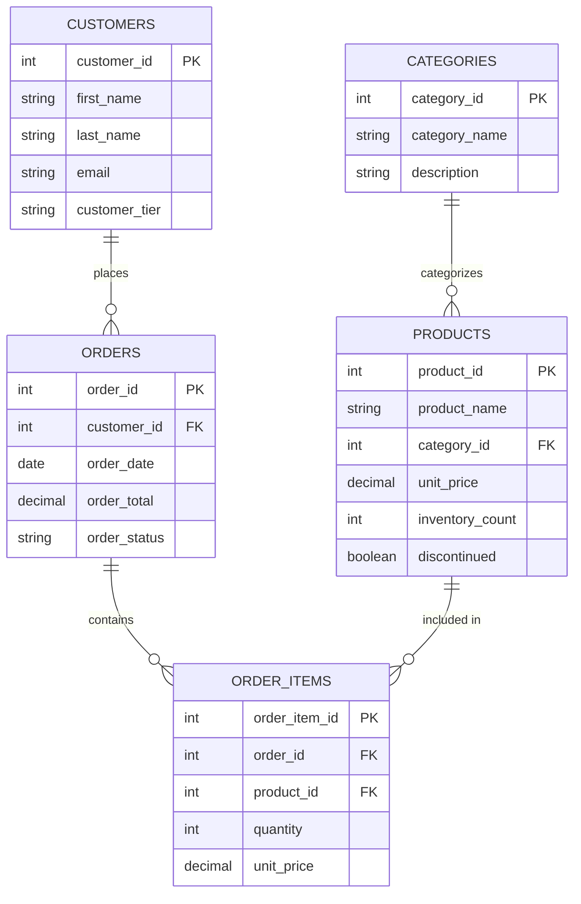

# SQL Code Organization

Good SQL code organization is like having a well-organized toolbox - it helps you find what you need quickly and makes your work more efficient. In this guide, we'll explore techniques to keep your SQL code clean, readable, and maintainable.

## Introduction

SQL (Structured Query Language) is powerful for working with databases, but without proper organization, your queries can become difficult to understand and maintain. Whether you're writing a simple SELECT statement or complex stored procedures, good organization practices will save you time and prevent errors.

This guide will teach you:
- How to format your SQL code for readability
- Effective naming conventions
- How to structure complex queries
- Best practices for commenting your code
- Organizing code with views, functions, and stored procedures

## Basic SQL Formatting

Let's start with the foundation: proper formatting.

### Consistent Indentation and Capitalization

```sql
-- Poorly formatted query
select customer_id,first_name,last_name,sum(order_total) as total_spent from customers c join orders o on c.customer_id=o.customer_id where o.order_date>'2023-01-01' group by customer_id,first_name,last_name having sum(order_total)>1000 order by total_spent desc;

-- Well-formatted query
SELECT 
    c.customer_id,
    c.first_name,
    c.last_name,
    SUM(o.order_total) AS total_spent
FROM 
    customers c
JOIN 
    orders o ON c.customer_id = o.customer_id
WHERE 
    o.order_date > '2023-01-01'
GROUP BY 
    c.customer_id, c.first_name, c.last_name
HAVING 
    SUM(o.order_total) > 1000
ORDER BY 
    total_spent DESC;
```

Notice how the well-formatted query:
- Uses consistent capitalization for SQL keywords (SELECT, FROM, WHERE)
- Places each main clause on a new line
- Indents lines to show logical structure
- Aligns related items
- Includes spaces around operators

### Line Breaks and Clause Placement

Break your query into logical sections with one major clause (SELECT, FROM, WHERE, etc.) per line. For complex queries, you might further split sections:

```sql
SELECT
    p.product_name,
    p.category,
    p.unit_price,
    SUM(od.quantity) AS units_sold,
    SUM(od.quantity * p.unit_price) AS revenue
FROM 
    products p
INNER JOIN 
    order_details od ON p.product_id = od.product_id
INNER JOIN 
    orders o ON od.order_id = o.order_id
WHERE 
    o.order_date BETWEEN '2023-01-01' AND '2023-12-31'
    AND p.category IN ('Electronics', 'Books', 'Games')
GROUP BY 
    p.product_name, p.category, p.unit_price
HAVING 
    SUM(od.quantity) > 10
ORDER BY 
    revenue DESC
LIMIT 20;
```

## Naming Conventions

Consistent naming makes your code easier to understand and maintain.

### Tables and Views

- Use plural nouns for tables (customers, orders, products)
- Prefix views with 'v_' or 'view_' (v_customer_orders)
- Use lowercase with underscores for readability (customer_order_details)

### Columns

- Use lowercase with underscores
- Be descriptive but concise (first_name instead of fname)
- Avoid reserved SQL keywords as column names
- Include units where appropriate (amount_usd, weight_kg)

### Example: Poor vs. Good Naming

```sql
-- Poor naming
SELECT c.cid, c.fn, c.ln, o.oid, o.dt, o.tot
FROM cust c
JOIN ord o ON c.cid = o.cid;

-- Good naming
SELECT 
    c.customer_id, 
    c.first_name, 
    c.last_name, 
    o.order_id, 
    o.order_date, 
    o.total_amount
FROM 
    customers c
JOIN 
    orders o ON c.customer_id = o.customer_id;
```

## Commenting Your SQL Code

Comments make your code more understandable for others and for your future self.

### Header Comments

Start complex queries or scripts with a header:

```sql
/*
 * Customer Purchase Analysis
 * 
 * Purpose: Analyze customer purchasing patterns for Q1 2023
 * Created: 2023-04-15
 * Author: Jane Smith
 * 
 * Notes: 
 * - Excludes cancelled orders
 * - Groups by customer segment
 */

SELECT
    c.customer_segment,
    COUNT(DISTINCT c.customer_id) AS customer_count,
    -- Rest of query...
```

### Inline Comments

Use inline comments to explain non-obvious logic:

```sql
SELECT
    product_id,
    product_name,
    unit_price,
    (unit_price * 0.9) AS sale_price, -- 10% discount for sale
    inventory_count,
    CASE
        WHEN inventory_count < 10 THEN 'Low' -- Critical threshold for reordering
        WHEN inventory_count < 50 THEN 'Medium'
        ELSE 'High'
    END AS stock_level
FROM
    products
WHERE
    discontinued = 0 -- Exclude discontinued products
    AND category_id IN (1, 2, 5); -- Only include specific categories
```

## Organizing Complex Queries

For complex queries, break down the logic into manageable parts.

### Common Table Expressions (CTEs)

CTEs (WITH clauses) let you define temporary result sets that make your query more readable:

```sql
-- Calculate sales metrics using CTEs
WITH monthly_sales AS (
    SELECT
        EXTRACT(YEAR FROM order_date) AS year,
        EXTRACT(MONTH FROM order_date) AS month,
        SUM(order_total) AS total_sales
    FROM
        orders
    WHERE
        order_status = 'Completed'
    GROUP BY
        EXTRACT(YEAR FROM order_date),
        EXTRACT(MONTH FROM order_date)
),
monthly_growth AS (
    SELECT
        year,
        month,
        total_sales,
        LAG(total_sales) OVER (ORDER BY year, month) AS previous_month_sales
    FROM
        monthly_sales
)
SELECT
    year,
    month,
    total_sales,
    previous_month_sales,
    CASE 
        WHEN previous_month_sales > 0 
        THEN ((total_sales - previous_month_sales) / previous_month_sales * 100)
        ELSE NULL
    END AS growth_percentage
FROM
    monthly_growth
ORDER BY
    year, month;
```

This query uses two CTEs:
1. `monthly_sales` - Calculates total sales by month
2. `monthly_growth` - Adds the previous month's sales using the window function
3. The main query then calculates the growth percentage

### Subqueries

For simpler cases, subqueries can help organize your code:

```sql
SELECT
    department_name,
    employee_count,
    avg_salary,
    RANK() OVER (ORDER BY avg_salary DESC) AS salary_rank
FROM (
    SELECT
        d.department_name,
        COUNT(e.employee_id) AS employee_count,
        AVG(e.salary) AS avg_salary
    FROM
        departments d
    JOIN
        employees e ON d.department_id = e.department_id
    GROUP BY
        d.department_name
) AS dept_summary
WHERE
    employee_count >= 5; -- Only include departments with at least 5 employees
```

## Using Views for Organization

Views allow you to encapsulate complex queries into reusable objects.

### Creating a View

```sql
CREATE VIEW v_customer_order_summary AS
SELECT
    c.customer_id,
    c.first_name,
    c.last_name,
    c.email,
    COUNT(o.order_id) AS order_count,
    SUM(o.order_total) AS total_spent,
    MAX(o.order_date) AS last_order_date
FROM
    customers c
LEFT JOIN
    orders o ON c.customer_id = o.customer_id
GROUP BY
    c.customer_id, c.first_name, c.last_name, c.email;
```

### Using the View

```sql
-- Find top customers who haven't ordered recently
SELECT
    customer_id,
    first_name,
    last_name,
    total_spent
FROM
    v_customer_order_summary
WHERE
    total_spent > 1000
    AND last_order_date < CURRENT_DATE - INTERVAL '3 months'
ORDER BY
    total_spent DESC;
```

Views provide several benefits:
- Hide complex query logic
- Enforce consistent business rules
- Simplify queries for reporting
- Improve code reusability

## Stored Procedures and Functions

For more advanced code organization, use stored procedures and functions.

### Creating a Function

```sql
CREATE OR REPLACE FUNCTION calculate_discount(
    price DECIMAL, 
    customer_tier VARCHAR
) 
RETURNS DECIMAL AS
$$
BEGIN
    RETURN CASE 
        WHEN customer_tier = 'Gold' THEN price * 0.85 -- 15% discount
        WHEN customer_tier = 'Silver' THEN price * 0.90 -- 10% discount
        WHEN customer_tier = 'Bronze' THEN price * 0.95 -- 5% discount
        ELSE price -- No discount
    END;
END;
$$ LANGUAGE plpgsql;
```

### Using the Function

```sql
SELECT
    p.product_name,
    p.unit_price AS regular_price,
    calculate_discount(p.unit_price, c.customer_tier) AS discounted_price
FROM
    products p
CROSS JOIN
    customers c
WHERE
    c.customer_id = 1001;
```

## Modularizing SQL Scripts

For larger projects, split your SQL into multiple files with a logical organization:

```
project/
├── schema/
│   ├── 01_tables.sql
│   ├── 02_constraints.sql
│   └── 03_indexes.sql
├── data/
│   ├── 01_lookup_data.sql
│   └── 02_test_data.sql
├── views/
│   ├── 01_basic_views.sql
│   └── 02_reporting_views.sql
├── functions/
│   └── calculation_functions.sql
├── procedures/
│   ├── data_import_procedures.sql
│   └── reporting_procedures.sql
└── main.sql
```

Each file should have a single responsibility, and a main file can include them all:

```sql
-- main.sql
\i schema/01_tables.sql
\i schema/02_constraints.sql
\i schema/03_indexes.sql
-- Additional includes...
```

## Database Design Visualization

Understanding your database structure is crucial for organizing your SQL code. Creating entity-relationship diagrams helps visualize the relationships between tables.



This diagram shows how customers place orders containing products, with relationships between tables clearly defined.

## Real-World Example: Customer Analysis System

Let's put everything together with a comprehensive example of well-organized SQL code for a customer analysis system.

### Step 1: Create Views for Common Data Needs

```sql
-- First, create a view for customer order summaries
CREATE VIEW v_customer_orders AS
SELECT
    c.customer_id,
    c.first_name,
    c.last_name,
    c.email,
    c.customer_since,
    c.customer_tier,
    COUNT(o.order_id) AS total_orders,
    SUM(o.order_total) AS total_spent,
    MAX(o.order_date) AS last_order_date
FROM
    customers c
LEFT JOIN
    orders o ON c.customer_id = o.customer_id
GROUP BY
    c.customer_id, c.first_name, c.last_name, c.email, c.customer_since, c.customer_tier;

-- Create a view for product performance
CREATE VIEW v_product_performance AS
SELECT
    p.product_id,
    p.product_name,
    p.category_id,
    cat.category_name,
    SUM(oi.quantity) AS units_sold,
    SUM(oi.quantity * oi.unit_price) AS revenue
FROM
    products p
JOIN
    categories cat ON p.category_id = cat.category_id
LEFT JOIN
    order_items oi ON p.product_id = oi.product_id
LEFT JOIN
    orders o ON oi.order_id = o.order_id
WHERE
    o.order_status = 'Completed'
GROUP BY
    p.product_id, p.product_name, p.category_id, cat.category_name;
```

### Step 2: Create Functions for Calculations

```sql
-- Create a function to calculate customer lifetime value
CREATE OR REPLACE FUNCTION calculate_customer_ltv(
    customer_id INT,
    years_projected INT DEFAULT 3
)
RETURNS DECIMAL AS
$$
DECLARE
    annual_value DECIMAL;
    customer_age_years DECIMAL;
    retention_rate DECIMAL DEFAULT 0.85; -- Assume 85% retention
    ltv DECIMAL;
BEGIN
    -- Calculate average annual value
    SELECT
        COALESCE(SUM(order_total), 0) / 
        GREATEST(EXTRACT(YEAR FROM AGE(CURRENT_DATE, MIN(customer_since))), 1)
    INTO
        annual_value
    FROM
        customers c
    LEFT JOIN
        orders o ON c.customer_id = o.customer_id
    WHERE
        c.customer_id = calculate_customer_ltv.customer_id;
    
    -- Calculate how long customer has been active
    SELECT
        EXTRACT(YEAR FROM AGE(CURRENT_DATE, customer_since))
    INTO
        customer_age_years
    FROM
        customers
    WHERE
        customer_id = calculate_customer_ltv.customer_id;
    
    -- Apply LTV formula: LTV = Annual Value × Projected Years × Retention Rate
    ltv := annual_value * years_projected * 
           POWER(retention_rate, LEAST(customer_age_years, 5));
    
    RETURN ROUND(ltv, 2);
END;
$$ LANGUAGE plpgsql;
```

### Step 3: Create a Stored Procedure for Reporting

```sql
CREATE OR REPLACE PROCEDURE generate_customer_segment_report(
    report_date DATE DEFAULT CURRENT_DATE
)
AS $$
BEGIN
    -- Create temporary table for the report
    DROP TABLE IF EXISTS tmp_customer_segment_report;
    
    CREATE TEMPORARY TABLE tmp_customer_segment_report AS
    WITH customer_segments AS (
        SELECT
            customer_id,
            customer_tier,
            total_spent,
            CASE
                WHEN total_orders = 0 THEN 'Inactive'
                WHEN CURRENT_DATE - last_order_date > 180 THEN 'At Risk'
                WHEN total_orders = 1 THEN 'New'
                WHEN calculate_customer_ltv(customer_id) > 1000 THEN 'High Value'
                ELSE 'Regular'
            END AS customer_segment
        FROM
            v_customer_orders
    )
    SELECT
        cs.customer_segment,
        cs.customer_tier,
        COUNT(*) AS customer_count,
        ROUND(AVG(cs.total_spent), 2) AS avg_spent,
        ROUND(SUM(cs.total_spent), 2) AS total_revenue,
        ROUND(SUM(calculate_customer_ltv(cs.customer_id)), 2) AS projected_ltv
    FROM
        customer_segments cs
    GROUP BY
        cs.customer_segment, cs.customer_tier
    ORDER BY
        cs.customer_segment, projected_ltv DESC;
    
    -- Log the report generation
    INSERT INTO report_logs (report_name, generated_date, record_count)
    SELECT 
        'Customer Segment Report', 
        report_date, 
        COUNT(*) 
    FROM 
        tmp_customer_segment_report;
        
    -- Output is available in the tmp_customer_segment_report table
END;
$$ LANGUAGE plpgsql;
```

### Step 4: Run Analysis with Organized Queries

```sql
-- Execute the report procedure
CALL generate_customer_segment_report();

-- Query the results with a well-organized SQL statement
SELECT
    customer_segment,
    customer_tier,
    customer_count,
    avg_spent,
    total_revenue,
    projected_ltv,
    ROUND(projected_ltv / total_revenue, 2) AS growth_potential
FROM
    tmp_customer_segment_report
ORDER BY
    CASE
        WHEN customer_segment = 'High Value' THEN 1
        WHEN customer_segment = 'Regular' THEN 2
        WHEN customer_segment = 'New' THEN 3
        WHEN customer_segment = 'At Risk' THEN 4
        WHEN customer_segment = 'Inactive' THEN 5
    END,
    growth_potential DESC;
```

## Summary

Good SQL code organization is essential for maintaining, troubleshooting, and collaborating on database projects. By following the practices in this guide, you'll write cleaner, more efficient SQL code:

1. **Format consistently**: Use proper indentation, capitalization, and line breaks
2. **Adopt clear naming conventions**: Choose descriptive, consistent names for tables, columns, and objects
3. **Comment thoroughly**: Add header and inline comments to explain complex logic
4. **Break down complexity**: Use CTEs and subqueries to make complex queries more readable
5. **Leverage database objects**: Organize code with views, functions, and stored procedures
6. **Modularize your scripts**: Split large projects into logically organized files
7. **Visualize your database**: Create diagrams to understand the relationships between tables

Remember that well-organized SQL code is not just about aesthetics—it leads to fewer bugs, easier maintenance, and better collaboration with your team.

## Additional Resources and Exercises

### Resources

- [SQL Style Guide by Simon Holywell](https://www.sqlstyle.guide/)
- [PostgreSQL Documentation](https://www.postgresql.org/docs/)
- [MySQL Documentation](https://dev.mysql.com/doc/)
- [SQL Server Documentation](https://docs.microsoft.com/en-us/sql/)

### Exercises

1. **Reformatting Challenge**: Take a poorly formatted query and rewrite it with proper formatting and organization.
   ```sql
   -- Reformat this query:
   select c.customer_name,sum(o.total) as total_spent,count(*) as order_count from customers c join orders o on c.id=o.customer_id where o.order_date between '2023-01-01' and '2023-12-31' group by c.customer_name having count(*)>5 order by total_spent desc limit 10;
   ```

2. **View Creation Exercise**: Create a view that shows the top 3 products by revenue for each category.

3. **CTE Practice**: Rewrite a complex nested subquery using CTEs to improve readability.

4. **Function Development**: Write a function that calculates the discount amount based on product category and customer loyalty level.

5. **Full Organization Project**: Develop a complete set of SQL objects (tables, views, functions, procedures) for a simplified e-commerce system, following the organization principles covered in this guide.