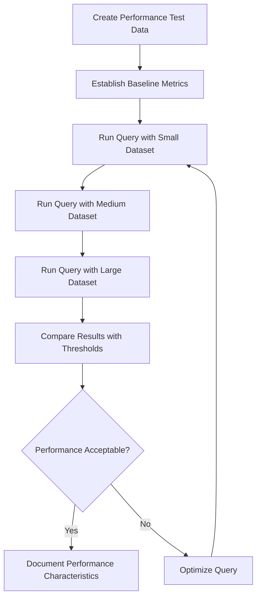
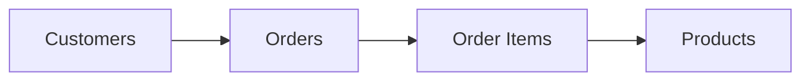

# SQL Testing Strategies

## Introduction

Testing your SQL code is just as important as testing any other part of your application. Well-tested database queries ensure data integrity, optimal performance, and reliable application behavior. This guide introduces fundamental SQL testing strategies that beginners can implement to validate their database code.

Testing SQL isn't just about checking if your query runs without errors—it's about verifying that your queries return the correct results, perform efficiently, and handle edge cases gracefully. Whether you're writing a simple SELECT statement or complex stored procedures, proper testing can save you from data corruption and performance issues in production.

## Why Test SQL Code?

Before diving into specific testing strategies, let's understand why testing SQL code is critical:

1. **Data Integrity**: Ensures your queries don't corrupt or incorrectly modify data
2. **Performance Optimization**: Identifies slow queries before they affect users
3. **Edge Case Handling**: Verifies how queries behave with unusual inputs
4. **Regression Prevention**: Confirms that changes don't break existing functionality
5. **Documentation**: Tests serve as executable documentation of expected behavior

## Basic SQL Testing Approaches

### 1. Manual Testing with Sample Data

The simplest way to test SQL is to run queries against sample data and manually verify the results.

#### Example:

Let's say we have a `users` table and want to test a query that finds all users who have logged in within the past 30 days.

```sql
-- Query to test
SELECT user_id, username, last_login 
FROM users 
WHERE last_login >= DATE_SUB(CURRENT_DATE(), INTERVAL 30 DAY);

-- Sample output:
/*
+--------+------------+---------------------+
| user_id | username   | last_login         |
+--------+------------+---------------------+
| 1      | johndoe    | 2023-08-15 10:30:00 |
| 3      | janedoe    | 2023-08-20 14:45:00 |
| 7      | bobsmith   | 2023-08-10 09:15:00 |
+--------+------------+---------------------+
*/
```

**Verification steps:**
1. Insert sample records with known last_login dates
2. Run the query
3. Manually verify that only users who logged in within the past 30 days appear in results

While manual testing works for simple cases, it becomes impractical for complex queries or large datasets.

### 2. Creating Test Databases

For more structured testing, create a dedicated test database with controlled test data.

**Steps to set up a test database:**

1. Create a separate database for testing
2. Populate it with a controlled subset of data
3. Run your queries against this database
4. Compare actual results with expected results

```sql
-- Create test database
CREATE DATABASE test_db;

-- Use the test database
USE test_db;

-- Create test table
CREATE TABLE users (
  user_id INT PRIMARY KEY,
  username VARCHAR(50),
  last_login DATETIME
);

-- Insert test data
INSERT INTO users VALUES 
  (1, 'johndoe', '2023-08-15 10:30:00'),
  (2, 'sarahm', '2023-07-10 08:15:00'),    -- Outside 30-day window
  (3, 'janedoe', '2023-08-20 14:45:00'),
  (4, 'mikebrown', '2023-06-25 11:30:00'), -- Outside 30-day window
  (5, 'lisawang', '2023-06-30 16:20:00'),  -- Outside 30-day window
  (6, 'samjones', '2023-07-28 09:00:00'),  -- Outside 30-day window (borderline)
  (7, 'bobsmith', '2023-08-10 09:15:00');
```

### 3. Automated Testing

For more reliable and repeatable testing, implement automated tests using a testing framework. While SQL doesn't have built-in testing capabilities, you can use programming languages with database connectivity to automate tests.

Here's an example using Python with pytest:

```python
import pytest
import sqlite3
from datetime import datetime, timedelta

# Setup test database
@pytest.fixture
def db_connection():
    conn = sqlite3.connect(':memory:')
    cursor = conn.cursor()
    
    # Create test table
    cursor.execute('''
        CREATE TABLE users (
            user_id INTEGER PRIMARY KEY,
            username TEXT,
            last_login TEXT
        )
    ''')
    
    # Insert test data with some users logged in within 30 days and some outside that window
    today = datetime.now()
    cursor.executemany(
        'INSERT INTO users VALUES (?, ?, ?)',
        [
            (1, 'johndoe', (today - timedelta(days=15)).isoformat()),
            (2, 'sarahm', (today - timedelta(days=45)).isoformat()),
            (3, 'janedoe', (today - timedelta(days=10)).isoformat()),
            (4, 'mikebrown', (today - timedelta(days=65)).isoformat()),
            (5, 'lisawang', (today - timedelta(days=60)).isoformat()),
            (6, 'samjones', (today - timedelta(days=32)).isoformat()),
            (7, 'bobsmith', (today - timedelta(days=20)).isoformat())
        ]
    )
    conn.commit()
    
    return conn

# Test the query for users logged in within last 30 days
def test_recent_login_query(db_connection):
    cursor = db_connection.cursor()
    
    # The query we're testing
    cursor.execute('''
        SELECT user_id, username, last_login 
        FROM users 
        WHERE date(last_login) >= date('now', '-30 days')
    ''')
    
    results = cursor.fetchall()
    
    # We expect 3 users to have logged in within the last 30 days
    assert len(results) == 3
    
    # Verify specific users are in the results
    user_ids = [row[0] for row in results]
    assert 1 in user_ids  # johndoe
    assert 3 in user_ids  # janedoe
    assert 7 in user_ids  # bobsmith
    
    # Verify users outside the window are not in results
    assert 2 not in user_ids  # sarahm
    assert 4 not in user_ids  # mikebrown
    assert 5 not in user_ids  # lisawang
    assert 6 not in user_ids  # samjones
```

## Intermediate Testing Strategies

### 1. Unit Testing Stored Procedures and Functions

Stored procedures and functions should be tested like any other code units.

```sql
-- Sample stored procedure to test
DELIMITER //
CREATE PROCEDURE calculate_total_orders(IN customer_id INT, OUT total DECIMAL(10,2))
BEGIN
    SELECT SUM(order_amount) INTO total
    FROM orders
    WHERE customer_id = customer_id;
END //
DELIMITER ;

-- Test case
DELIMITER //
CREATE PROCEDURE test_calculate_total_orders()
BEGIN
    -- Setup
    CREATE TEMPORARY TABLE IF NOT EXISTS orders (
        order_id INT PRIMARY KEY,
        customer_id INT,
        order_amount DECIMAL(10,2)
    );
    
    INSERT INTO orders VALUES
        (1, 1, 100.00),
        (2, 1, 150.00),
        (3, 2, 200.00),
        (4, 1, 50.00);
    
    -- Execute
    DECLARE result DECIMAL(10,2);
    CALL calculate_total_orders(1, result);
    
    -- Verify
    IF result = 300.00 THEN
        SELECT 'Test passed: calculate_total_orders works correctly' AS message;
    ELSE
        SELECT CONCAT('Test failed: Expected 300.00 but got ', result) AS message;
    END IF;
    
    -- Cleanup
    DROP TEMPORARY TABLE orders;
END //
DELIMITER ;

-- Run the test
CALL test_calculate_total_orders();
```

### 2. Integration Testing

Integration tests verify that your SQL queries work correctly with other parts of your application.

```python
# Example Python code for integration testing
import unittest
import psycopg2
from my_app import UserService  # Your application code

class TestUserQueries(unittest.TestCase):
    def setUp(self):
        # Connect to test database
        self.conn = psycopg2.connect(
            "dbname=test_db user=tester password=test_password"
        )
        self.cursor = self.conn.cursor()
        
        # Setup test data
        self.cursor.execute("INSERT INTO users VALUES (1, 'testuser', 'test@example.com')")
        self.conn.commit()
        
        # Initialize the service we're testing
        self.user_service = UserService(self.conn)
    
    def test_find_user_by_email(self):
        # Test the service method that uses SQL
        user = self.user_service.find_by_email('test@example.com')
        
        # Verify results
        self.assertIsNotNone(user)
        self.assertEqual(user.id, 1)
        self.assertEqual(user.username, 'testuser')
    
    def tearDown(self):
        # Clean up test data
        self.cursor.execute("DELETE FROM users WHERE id = 1")
        self.conn.commit()
        self.conn.close()
```

### 3. Performance Testing

Testing query performance helps identify slow queries before they become problems.

```sql
-- Measure query execution time
EXPLAIN ANALYZE
SELECT users.username, COUNT(orders.order_id) as order_count
FROM users 
JOIN orders ON users.user_id = orders.user_id
GROUP BY users.username
ORDER BY order_count DESC;
```

To systematically test performance:

1. Run the query with different data volumes
2. Measure execution time and resource usage
3. Establish acceptable performance thresholds
4. Test with realistic data distributions



## Advanced Testing Strategies

### 1. Test-Driven Development for SQL

Test-Driven Development (TDD) can be applied to SQL development:

1. Write a test that defines the expected behavior
2. Run the test (it should fail since the code doesn't exist yet)
3. Write the minimal SQL code to pass the test
4. Run the test again (it should pass)
5. Refactor the SQL code while keeping the test passing

### 2. Boundary Testing

Test how your queries handle edge cases:

- Empty tables
- NULL values
- Minimum/maximum values
- Special characters
- Date boundaries

```sql
-- Test query with empty result set
SELECT * FROM orders WHERE customer_id = 999;  -- Non-existent customer

-- Test with NULL values
SELECT * FROM users WHERE last_login IS NULL;

-- Test with minimum/maximum values
SELECT * FROM products WHERE price = 0;
SELECT * FROM products WHERE price = 9999.99;

-- Test with special characters
SELECT * FROM customers WHERE name LIKE '%O''Brien%';
```

### 3. Mutation Testing

Mutation testing introduces deliberate "bugs" in your queries to verify that your tests can detect them:

1. Create a working query and tests
2. Introduce a small change (mutation) in the query
3. Run the tests - they should fail if effective
4. If tests pass with the mutation, your tests may need improvement

Original query:
```sql
SELECT * FROM users WHERE active = TRUE AND last_login >= DATE_SUB(NOW(), INTERVAL 30 DAY);
```

Mutations to test:
```sql
-- Changed condition to OR
SELECT * FROM users WHERE active = TRUE OR last_login >= DATE_SUB(NOW(), INTERVAL 30 DAY);

-- Changed interval from 30 to 60 days
SELECT * FROM users WHERE active = TRUE AND last_login >= DATE_SUB(NOW(), INTERVAL 60 DAY);

-- Removed active check
SELECT * FROM users WHERE last_login >= DATE_SUB(NOW(), INTERVAL 30 DAY);
```

## Common SQL Testing Tools

Several tools can help with SQL testing:

1. **Database-specific tools**:
   - MySQL: MySQL Workbench
   - PostgreSQL: pgTAP
   - SQL Server: tSQLt

2. **Language-specific libraries**:
   - Python: pytest-postgresql, pytest-mysql
   - Java: DBUnit
   - Ruby: Database Cleaner

3. **General-purpose tools**:
   - SQL Test Builder
   - SQLite in-memory databases
   - Docker containers for isolated test environments

## Best Practices for SQL Testing

1. **Use isolated test environments**: Never test on production databases
2. **Create repeatable test cases**: Tests should be consistent across runs
3. **Test with realistic data**: Use data generators that mimic production patterns
4. **Implement data teardown**: Clean up test data after tests complete
5. **Version control your tests**: Keep tests alongside your SQL code
6. **Automate SQL testing**: Include SQL tests in your CI/CD pipeline
7. **Monitor test coverage**: Track what SQL code is being tested

## SQL Test Patterns

### The Arrange-Act-Assert Pattern

This pattern provides a clear structure for SQL tests:

1. **Arrange**: Set up the database with known test data
2. **Act**: Execute the SQL query or stored procedure
3. **Assert**: Verify the results match expectations

```sql
-- Arrange
CREATE TEMPORARY TABLE test_users (id INT, name VARCHAR(50), active BOOLEAN);
INSERT INTO test_users VALUES (1, 'Active User', TRUE), (2, 'Inactive User', FALSE);

-- Act
SELECT * FROM test_users WHERE active = TRUE;

-- Assert
-- Check that only 1 record is returned with id = 1
```

### The Before-Each/After-Each Pattern

For setting up and tearing down test data:

```sql
-- Before each test
CREATE PROCEDURE setup_test()
BEGIN
    -- Create temporary tables with test data
    CREATE TEMPORARY TABLE test_data (...);
    INSERT INTO test_data VALUES (...);
END;

-- After each test
CREATE PROCEDURE teardown_test()
BEGIN
    -- Clean up test data
    DROP TEMPORARY TABLE IF EXISTS test_data;
END;
```

## Testing SQL Transactions

Testing transactional behavior ensures your SQL correctly handles commits and rollbacks:

```sql
-- Test transaction commit
START TRANSACTION;
INSERT INTO accounts (id, balance) VALUES (1, 1000);
UPDATE accounts SET balance = balance - 100 WHERE id = 1;
COMMIT;

-- Verify balance is 900
SELECT balance FROM accounts WHERE id = 1;

-- Test transaction rollback
START TRANSACTION;
UPDATE accounts SET balance = balance - 200 WHERE id = 1;
ROLLBACK;

-- Verify balance is still 900
SELECT balance FROM accounts WHERE id = 1;
```

## Practical Example: Testing a Customer Order System

Let's put everything together with a complete example testing a customer ordering system:



```sql
-- Create test schema
CREATE TABLE customers (
    customer_id INT PRIMARY KEY,
    name VARCHAR(100),
    email VARCHAR(100),
    status VARCHAR(20)
);

CREATE TABLE products (
    product_id INT PRIMARY KEY,
    name VARCHAR(100),
    price DECIMAL(10,2),
    stock INT
);

CREATE TABLE orders (
    order_id INT PRIMARY KEY,
    customer_id INT,
    order_date DATE,
    status VARCHAR(20),
    FOREIGN KEY (customer_id) REFERENCES customers(customer_id)
);

CREATE TABLE order_items (
    order_id INT,
    product_id INT,
    quantity INT,
    price DECIMAL(10,2),
    PRIMARY KEY (order_id, product_id),
    FOREIGN KEY (order_id) REFERENCES orders(order_id),
    FOREIGN KEY (product_id) REFERENCES products(product_id)
);

-- Create a stored procedure to test
DELIMITER //
CREATE PROCEDURE create_order(
    IN p_customer_id INT,
    IN p_product_id INT,
    IN p_quantity INT,
    OUT p_order_id INT
)
BEGIN
    DECLARE product_price DECIMAL(10,2);
    DECLARE current_stock INT;
    
    -- Get product price and stock
    SELECT price, stock INTO product_price, current_stock
    FROM products WHERE product_id = p_product_id;
    
    -- Check if enough stock
    IF current_stock >= p_quantity THEN
        -- Create order
        INSERT INTO orders (customer_id, order_date, status)
        VALUES (p_customer_id, CURRENT_DATE(), 'PENDING');
        
        SET p_order_id = LAST_INSERT_ID();
        
        -- Add order item
        INSERT INTO order_items (order_id, product_id, quantity, price)
        VALUES (p_order_id, p_product_id, p_quantity, product_price);
        
        -- Update stock
        UPDATE products
        SET stock = stock - p_quantity
        WHERE product_id = p_product_id;
    ELSE
        SIGNAL SQLSTATE '45000' 
        SET MESSAGE_TEXT = 'Insufficient stock';
    END IF;
END //
DELIMITER ;
```

Now, let's write tests for this stored procedure:

```sql
-- Test case: Successful order creation
DELIMITER //
CREATE PROCEDURE test_successful_order()
BEGIN
    -- Arrange: Set up test data
    INSERT INTO customers VALUES (1, 'Test Customer', 'test@example.com', 'ACTIVE');
    INSERT INTO products VALUES (1, 'Test Product', 10.00, 100);
    
    -- Act: Create an order
    DECLARE order_id INT;
    CALL create_order(1, 1, 5, order_id);
    
    -- Assert: Verify order was created correctly
    DECLARE order_count INT;
    DECLARE order_item_count INT;
    DECLARE updated_stock INT;
    
    SELECT COUNT(*) INTO order_count FROM orders WHERE customer_id = 1;
    
    IF order_count = 1 THEN
        SELECT 'Order created successfully' AS result;
    ELSE
        SELECT 'Test failed: Order was not created' AS result;
    END IF;
    
    SELECT COUNT(*) INTO order_item_count 
    FROM order_items 
    WHERE order_id = order_id AND product_id = 1 AND quantity = 5;
    
    IF order_item_count = 1 THEN
        SELECT 'Order item created successfully' AS result;
    ELSE
        SELECT 'Test failed: Order item was not created correctly' AS result;
    END IF;
    
    SELECT stock INTO updated_stock FROM products WHERE product_id = 1;
    
    IF updated_stock = 95 THEN
        SELECT 'Stock updated correctly' AS result;
    ELSE
        SELECT CONCAT('Test failed: Expected stock 95, got ', updated_stock) AS result;
    END IF;
    
    -- Clean up
    DELETE FROM order_items WHERE order_id = order_id;
    DELETE FROM orders WHERE order_id = order_id;
    DELETE FROM products WHERE product_id = 1;
    DELETE FROM customers WHERE customer_id = 1;
END //
DELIMITER ;

-- Test case: Insufficient stock
DELIMITER //
CREATE PROCEDURE test_insufficient_stock()
BEGIN
    -- Arrange: Set up test data
    INSERT INTO customers VALUES (2, 'Test Customer 2', 'test2@example.com', 'ACTIVE');
    INSERT INTO products VALUES (2, 'Test Product 2', 20.00, 3);
    
    -- Act & Assert: Try to create an order with more quantity than available
    DECLARE exit_handler_called BOOLEAN DEFAULT FALSE;
    DECLARE order_id INT;
    
    -- Declare handler for the expected error
    DECLARE CONTINUE HANDLER FOR SQLSTATE '45000' 
    BEGIN
        SET exit_handler_called = TRUE;
    END;
    
    -- Try to create an order that should fail
    CALL create_order(2, 2, 5, order_id);
    
    IF exit_handler_called = TRUE THEN
        SELECT 'Test passed: Error was triggered for insufficient stock' AS result;
    ELSE
        SELECT 'Test failed: No error triggered for insufficient stock' AS result;
    END IF;
    
    -- Verify no order was created
    DECLARE order_count INT;
    SELECT COUNT(*) INTO order_count FROM orders WHERE customer_id = 2;
    
    IF order_count = 0 THEN
        SELECT 'No order was created, as expected' AS result;
    ELSE
        SELECT 'Test failed: Order was created despite insufficient stock' AS result;
    END IF;
    
    -- Verify stock was not changed
    DECLARE current_stock INT;
    SELECT stock INTO current_stock FROM products WHERE product_id = 2;
    
    IF current_stock = 3 THEN
        SELECT 'Stock remained unchanged, as expected' AS result;
    ELSE
        SELECT CONCAT('Test failed: Stock was changed to ', current_stock, ' when it should be 3') AS result;
    END IF;
    
    -- Clean up
    DELETE FROM products WHERE product_id = 2;
    DELETE FROM customers WHERE customer_id = 2;
END //
DELIMITER ;

-- Run the tests
CALL test_successful_order();
CALL test_insufficient_stock();
```

## Summary

Testing SQL code is essential for ensuring your database operations are correct, efficient, and reliable. In this guide, we've covered a range of testing strategies from basic manual testing to advanced techniques like mutation testing.

Remember these key points:

1. Always test SQL in an isolated environment, never on production data
2. Use a test database with controlled test data
3. Test for correctness, performance, and edge cases
4. Automate tests where possible
5. Apply test-driven development principles to SQL
6. Test transactional behavior explicitly
7. Use appropriate testing tools for your database platform

By implementing a robust SQL testing strategy, you'll catch issues early, improve code quality, and build a more reliable application.

## Additional Resources

### Books
- "SQL Unit Testing" by Michael Coles
- "Testing SQL Server Applications" by Louis Davidson

### Online Resources
- [pgTAP Documentation](https://pgtap.org/) for PostgreSQL testing
- [tSQLt Framework](https://tsqlt.org/) for SQL Server
- [MySQL Workbench Manual: Database Testing](https://dev.mysql.com/doc/workbench/en/)

### Practice Exercises

1. **Basic**: Create a test for a query that calculates the average order value per customer
2. **Intermediate**: Write test cases for a stored procedure that transfers money between accounts
3. **Advanced**: Implement a full test suite for a database schema with at least three related tables

Remember, consistent testing leads to more reliable database code and fewer production issues. Make testing a regular part of your SQL development process.