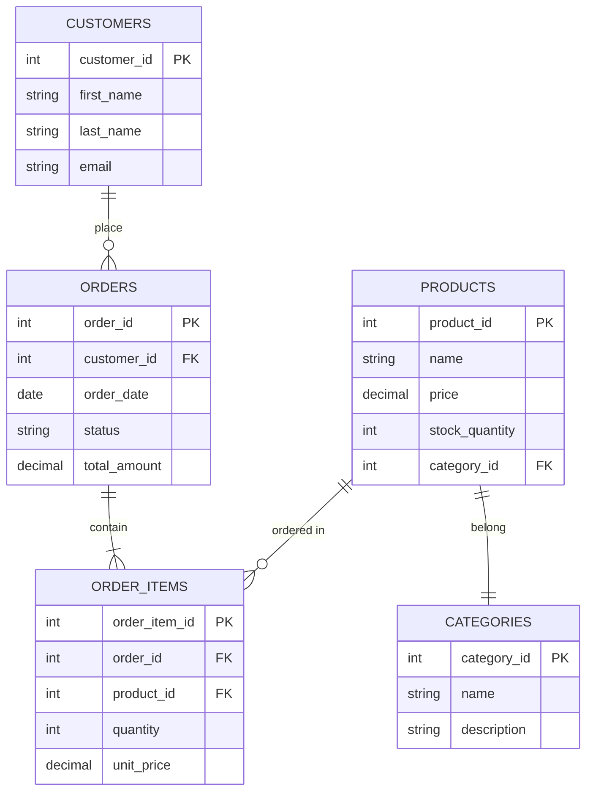

# SQL Documentation

## Introduction

Proper documentation is often overlooked in SQL development, yet it's one of the most valuable practices for maintaining and understanding databases. SQL documentation involves adding meaningful explanations and context to your database objects and queries. 

This guide explores why documentation matters in SQL, what elements should be documented, and how to implement documentation practices that will make your database work more accessible and maintainable.

## Why Document Your SQL Code?

Documentation serves several important purposes:

- **Knowledge Transfer**: Helps new team members understand database structures
- **Future Reference**: Provides context when revisiting code months or years later
- **Troubleshooting**: Makes debugging easier when issues arise
- **Maintenance**: Simplifies updates and changes to the database
- **Collaboration**: Enables multiple developers to work effectively together

## Essential SQL Documentation Elements

### 1. Database Schema Documentation

Your database schema is the foundation of your data structure. Document the following:

```sql
-- Database: InventorySystem
-- Purpose: Tracks product inventory, orders, and customer information
-- Created: 2023-05-15
-- Author: Jane Smith
-- Version: 1.2
```

### 2. Table Documentation

Each table should have clear documentation that explains its purpose and structure:

```sql
-- Table: products
-- Description: Stores all product information including SKU, name, price, and stock levels
-- Primary Key: product_id
-- Relations:
--   - Referenced by order_items.product_id (Foreign Key)
--   - References categories.category_id (Foreign Key)

CREATE TABLE products (
    product_id INT PRIMARY KEY,
    sku VARCHAR(50) UNIQUE NOT NULL,
    name VARCHAR(100) NOT NULL,
    description TEXT,
    price DECIMAL(10, 2) NOT NULL,
    stock_quantity INT NOT NULL DEFAULT 0,
    category_id INT REFERENCES categories(category_id),
    created_at TIMESTAMP DEFAULT CURRENT_TIMESTAMP,
    updated_at TIMESTAMP DEFAULT CURRENT_TIMESTAMP
);
```

### 3. Column Documentation

For complex tables, document individual columns:

```sql
-- Column: products.price
-- Description: The current retail price of the product in USD
-- Data Type: DECIMAL(10, 2) - Up to 10 digits with 2 decimal places
-- Constraints: NOT NULL - Every product must have a price
-- Business Rules: Must be greater than 0
```

### 4. Query Documentation

When writing complex queries, include explanations:

```sql
-- Query Name: MonthlyProductSales
-- Purpose: Calculate total sales for each product in a given month
-- Parameters:
--   - month_start: TIMESTAMP - First day of the month to analyze
--   - month_end: TIMESTAMP - Last day of the month to analyze
-- Output: Product name, total quantity sold, total revenue

SELECT 
    p.name AS product_name,
    SUM(oi.quantity) AS total_quantity_sold,
    SUM(oi.quantity * oi.unit_price) AS total_revenue
FROM 
    products p
JOIN 
    order_items oi ON p.product_id = oi.product_id
JOIN 
    orders o ON oi.order_id = o.order_id
WHERE 
    o.order_date BETWEEN :month_start AND :month_end
    AND o.status = 'completed'
GROUP BY 
    p.product_id, p.name
ORDER BY 
    total_revenue DESC;
```

### 5. Stored Procedure and Function Documentation

Document the purpose, parameters, and return values:

```sql
-- Procedure: update_product_inventory
-- Description: Updates product inventory levels after a purchase or return
-- Parameters:
--   - p_product_id: INT - The ID of the product to update
--   - p_quantity: INT - The quantity change (negative for sales, positive for returns)
-- Returns: BOOLEAN - TRUE if update successful, FALSE otherwise
-- Side Effects: Updates products.stock_quantity and logs the change in inventory_log table

CREATE OR REPLACE FUNCTION update_product_inventory(
    p_product_id INT,
    p_quantity INT
) RETURNS BOOLEAN AS $$
BEGIN
    -- Update the product quantity
    UPDATE products
    SET stock_quantity = stock_quantity + p_quantity,
        updated_at = CURRENT_TIMESTAMP
    WHERE product_id = p_product_id;
    
    -- Log the inventory change
    INSERT INTO inventory_log (
        product_id,
        quantity_change,
        change_reason,
        changed_at
    ) VALUES (
        p_product_id,
        p_quantity,
        CASE 
            WHEN p_quantity > 0 THEN 'restock'
            ELSE 'sale'
        END,
        CURRENT_TIMESTAMP
    );
    
    RETURN FOUND;
EXCEPTION
    WHEN OTHERS THEN
        -- Log the error and return false
        INSERT INTO error_log (error_message, procedure_name)
        VALUES (SQLERRM, 'update_product_inventory');
        RETURN FALSE;
END;
$$ LANGUAGE plpgsql;
```

## Documentation Methods in SQL

### Inline Comments

Use double dashes (`--`) for single line comments:

```sql
SELECT 
    customer_id,
    COUNT(*) AS order_count
FROM 
    orders
WHERE 
    order_date >= CURRENT_DATE - INTERVAL '1 year'  -- Only consider orders from the last year
GROUP BY 
    customer_id
HAVING 
    COUNT(*) > 10  -- Find customers with more than 10 orders
```

### Block Comments

For multi-line documentation, use `/* ... */`:

```sql
/*
This query identifies our VIP customers based on:
1. Total spending over $1000 in the last year
2. At least 5 orders placed
3. No returned orders

Results are used for the quarterly loyalty program.
*/
SELECT 
    c.customer_id,
    c.first_name,
    c.last_name,
    SUM(o.total_amount) AS total_spent
FROM 
    customers c
JOIN 
    orders o ON c.customer_id = o.customer_id
WHERE 
    o.order_date >= CURRENT_DATE - INTERVAL '1 year'
    AND o.status = 'completed'
GROUP BY 
    c.customer_id, c.first_name, c.last_name
HAVING 
    COUNT(o.order_id) >= 5
    AND SUM(o.total_amount) > 1000
    AND NOT EXISTS (
        SELECT 1 
        FROM orders 
        WHERE customer_id = c.customer_id 
        AND status = 'returned'
    );
```

## Using Database-Specific Documentation Features

Many database systems provide built-in documentation features:

### PostgreSQL Comments

PostgreSQL allows you to add comments directly to database objects:

```sql
-- Add comment to a table
COMMENT ON TABLE products IS 'Contains all product information including inventory levels';

-- Add comment to a column
COMMENT ON COLUMN products.stock_quantity IS 'Current available inventory';

-- View comments
SELECT 
    description 
FROM 
    pg_description 
WHERE 
    objoid = 'products'::regclass;
```

### MySQL Comments

MySQL offers similar functionality:

```sql
-- Add comment when creating a table
CREATE TABLE customers (
    customer_id INT PRIMARY KEY,
    first_name VARCHAR(50),
    last_name VARCHAR(50),
    email VARCHAR(100)
) COMMENT = 'Stores customer contact information and account details';

-- Add column comment
ALTER TABLE customers
MODIFY COLUMN email VARCHAR(100) COMMENT 'Primary contact email, must be unique';
```

## Creating Documentation Files

Beyond inline documentation, create dedicated documentation files:

### README.md for Database Projects

```markdown
# Inventory Management System

## Database Overview
This database supports the company's inventory management application. It tracks products, suppliers, orders, and customers.

## Key Tables
- products: Core product information
- inventory: Current stock levels
- orders: Customer purchase information
- customers: Customer details

## Common Queries
See the `/queries` directory for documented examples of common operations.

## Maintenance
- Daily backup at 2:00 AM
- Weekly integrity check on Sundays

## Contact
For questions about this database, contact the Database Team.
```

### Entity-Relationship Diagrams

Visual documentation helps understand database relationships:



## Data Dictionary Example

Create a data dictionary to document all database elements:

| Table Name | Column Name | Data Type | Description | Constraints | Example Value |
|------------|-------------|-----------|-------------|-------------|---------------|
| products | product_id | INT | Unique identifier | PRIMARY KEY | 1245 |
| products | name | VARCHAR(100) | Product display name | NOT NULL | "Wireless Mouse" |
| products | price | DECIMAL(10,2) | Current retail price in USD | NOT NULL, > 0 | 29.99 |
| products | category_id | INT | Reference to category | FOREIGN KEY | 5 |

## Documentation Best Practices

1. **Be Consistent**: Use the same format for similar objects
2. **Keep It Updated**: Update documentation when the database changes
3. **Be Concise**: Provide enough detail without being verbose
4. **Use Examples**: Include example values or queries where helpful
5. **Document Assumptions**: Note any business rules or assumptions
6. **Include Context**: Explain why certain decisions were made
7. **Document Relationships**: Clearly explain how tables relate to each other
8. **Avoid Redundancy**: Don't repeat information unnecessarily

## Real-World Example: E-commerce Database

Let's see a practical example of well-documented SQL for an e-commerce database:

```sql
-- Database: EcommerceDB
-- Purpose: Supporting backend for the MyShop online store
-- Version: 2.1
-- Last Updated: 2023-08-15
-- Author: Database Team

-- Table: customers
-- Stores registered customer information
CREATE TABLE customers (
    customer_id SERIAL PRIMARY KEY,
    email VARCHAR(100) UNIQUE NOT NULL COMMENT 'Primary customer identifier for logins',
    first_name VARCHAR(50) NOT NULL,
    last_name VARCHAR(50) NOT NULL,
    password_hash VARCHAR(255) NOT NULL COMMENT 'Bcrypt hashed password',
    created_at TIMESTAMP DEFAULT CURRENT_TIMESTAMP,
    last_login TIMESTAMP COMMENT 'Used for security monitoring',
    marketing_opt_in BOOLEAN DEFAULT FALSE COMMENT 'Whether customer consents to marketing emails'
);

-- Customer address information stored separately for flexibility
-- A customer can have multiple addresses (shipping, billing, etc.)
CREATE TABLE customer_addresses (
    address_id SERIAL PRIMARY KEY,
    customer_id INT NOT NULL REFERENCES customers(customer_id) ON DELETE CASCADE,
    address_type VARCHAR(20) NOT NULL COMMENT 'Values: shipping, billing, both',
    address_line1 VARCHAR(100) NOT NULL,
    address_line2 VARCHAR(100),
    city VARCHAR(50) NOT NULL,
    state VARCHAR(50),
    postal_code VARCHAR(20) NOT NULL,
    country VARCHAR(50) NOT NULL,
    is_default BOOLEAN DEFAULT FALSE COMMENT 'Is this the default address for the type',
    
    -- Enforce that a customer can have only one default address per type
    CONSTRAINT unique_default_address UNIQUE (customer_id, address_type, is_default),
    
    -- Add check constraint for valid address types
    CONSTRAINT valid_address_type CHECK (address_type IN ('shipping', 'billing', 'both'))
);

-- View: customer_order_summary
-- Purpose: Frequently used report showing customer purchase history
-- Usage: Marketing team uses for loyalty program analysis
CREATE VIEW customer_order_summary AS
SELECT
    c.customer_id,
    c.email,
    c.first_name,
    c.last_name,
    COUNT(o.order_id) AS total_orders,
    SUM(o.order_total) AS lifetime_value,
    MIN(o.order_date) AS first_order_date,
    MAX(o.order_date) AS most_recent_order,
    EXTRACT(DAY FROM (NOW() - MAX(o.order_date))) AS days_since_last_order
FROM
    customers c
LEFT JOIN
    orders o ON c.customer_id = o.customer_id
GROUP BY
    c.customer_id, c.email, c.first_name, c.last_name;

-- Function: calculate_shipping_cost
-- Purpose: Centralized shipping calculation used by the shopping cart and order processing
-- Parameters:
--   - p_weight: Total weight of items in kilograms
--   - p_distance: Shipping distance in kilometers
--   - p_expedited: Whether expedited shipping is requested
-- Returns: Calculated shipping cost in USD
CREATE FUNCTION calculate_shipping_cost(
    p_weight DECIMAL,
    p_distance DECIMAL,
    p_expedited BOOLEAN
) RETURNS DECIMAL AS $$
DECLARE
    base_rate DECIMAL := 5.00;  -- Base shipping rate
    weight_factor DECIMAL := 0.5;  -- Cost per kg
    distance_factor DECIMAL := 0.1;  -- Cost per 100km
    expedited_multiplier DECIMAL := 1.5;  -- Expedited shipping costs 50% more
    final_cost DECIMAL;
BEGIN
    -- Calculate base shipping cost
    final_cost := base_rate + (p_weight * weight_factor) + (p_distance / 100 * distance_factor);
    
    -- Apply expedited multiplier if requested
    IF p_expedited THEN
        final_cost := final_cost * expedited_multiplier;
    END IF;
    
    -- Round to 2 decimal places
    RETURN ROUND(final_cost, 2);
END;
$$ LANGUAGE plpgsql;
```

## Summary

Proper SQL documentation is an investment that pays dividends throughout the lifecycle of a database project. Good documentation:

- Makes databases more accessible to new team members
- Reduces troubleshooting time
- Improves code quality
- Provides historical context for database decisions
- Helps prevent errors during modifications

By following the practices outlined in this guide, you'll create database systems that are easier to maintain, understand, and extend.

## Additional Resources

- [PostgreSQL Documentation on Comments](https://www.postgresql.org/docs/current/sql-comment.html)
- [MySQL Documentation Features](https://dev.mysql.com/doc/refman/8.0/en/comments.html)
- [SQL Style Guide by Simon Holywell](https://www.sqlstyle.guide/)
- [Database Design and Documentation Tools](https://dbdiagram.io/)

## Exercises

1. Create documentation for a simple three-table database (e.g., students, courses, enrollments).
2. Add proper inline documentation to an existing SQL query.
3. Generate an entity-relationship diagram for a database system you're familiar with.
4. Create a data dictionary for a small database project.
5. Set up a documentation README file for a database project you're working on.