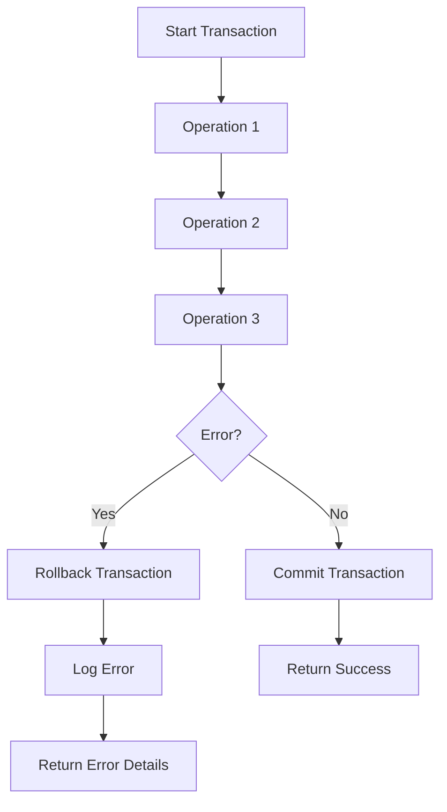

# SQL Error Handling

## Introduction

When working with databases, things don't always go as planned. A query might fail due to invalid data, connection issues, or constraint violations. Without proper error handling, these failures can crash your application or lead to data inconsistencies. This is where SQL error handling comes in.

Error handling in SQL allows you to:
- Identify and respond to problems gracefully
- Prevent application crashes
- Maintain data integrity
- Provide meaningful feedback to users
- Create more robust and reliable applications

In this guide, we'll explore SQL error handling techniques across different database systems, with a focus on practical examples that you can apply to your own projects.

## Basic Error Handling Concepts

Before diving into specific implementations, let's understand some core concepts:

### Types of SQL Errors

SQL errors generally fall into these categories:

1. **Syntax errors**: Incorrect SQL statement structure
2. **Semantic errors**: SQL is syntactically correct but invalid (e.g., referencing a non-existent table)
3. **Constraint violations**: Operations that violate database rules (e.g., unique constraints)
4. **Connection errors**: Problems with the database connection
5. **Timeout errors**: Operations taking too long to complete

### Error Handling Approaches

Different database systems offer various mechanisms for handling errors:

- **TRY...CATCH blocks** (SQL Server)
- **Exception handling** (PL/SQL in Oracle, PL/pgSQL in PostgreSQL)
- **HANDLER declarations** (MySQL)
- **WHENEVER statements** (Standard SQL)

Let's explore these approaches with practical examples.

## SQL Server Error Handling (T-SQL)

SQL Server uses a TRY...CATCH construct similar to many programming languages.

### Basic TRY...CATCH Structure

```sql
BEGIN TRY
    -- SQL statements that might cause an error
    INSERT INTO Customers (CustomerID, Name)
    VALUES (1, 'John Doe');
END TRY
BEGIN CATCH
    -- Error handling code
    PRINT 'An error occurred: ' + ERROR_MESSAGE();
END CATCH
```

### Comprehensive Error Handling Example

Here's a more complete example that captures detailed error information:

```sql
BEGIN TRY
    -- Attempt to insert a duplicate key
    INSERT INTO Products (ProductID, ProductName, Price)
    VALUES (101, 'New Product', 29.99);
END TRY
BEGIN CATCH
    SELECT
        ERROR_NUMBER() AS ErrorNumber,
        ERROR_SEVERITY() AS ErrorSeverity,
        ERROR_STATE() AS ErrorState,
        ERROR_PROCEDURE() AS ErrorProcedure,
        ERROR_LINE() AS ErrorLine,
        ERROR_MESSAGE() AS ErrorMessage;
    
    -- Optionally log the error
    INSERT INTO ErrorLog (
        ErrorNumber, ErrorSeverity, ErrorState,
        ErrorProcedure, ErrorLine, ErrorMessage, ErrorDate
    )
    VALUES (
        ERROR_NUMBER(), ERROR_SEVERITY(), ERROR_STATE(),
        ERROR_PROCEDURE(), ERROR_LINE(), ERROR_MESSAGE(), GETDATE()
    );
END CATCH
```

#### Output (if error occurs):
```
ErrorNumber  ErrorSeverity  ErrorState  ErrorProcedure  ErrorLine  ErrorMessage
-----------  -------------  ----------  --------------  ---------  --------------------------------------------------
2627         14             1           NULL            3          Violation of PRIMARY KEY constraint 'PK_Products'.
                                                                   Cannot insert duplicate key in object 'dbo.Products'.
```

### Transaction Management with Error Handling

Error handling is particularly important when working with transactions:

```sql
BEGIN TRANSACTION;

BEGIN TRY
    -- Multiple operations that should succeed or fail together
    UPDATE Inventory SET Quantity = Quantity - 10 WHERE ProductID = 101;
    INSERT INTO OrderItems (OrderID, ProductID, Quantity) VALUES (1001, 101, 10);
    
    -- If we get here, commit the transaction
    COMMIT TRANSACTION;
    PRINT 'Transaction completed successfully.';
END TRY
BEGIN CATCH
    -- An error occurred, roll back the transaction
    ROLLBACK TRANSACTION;
    
    PRINT 'Transaction failed: ' + ERROR_MESSAGE();
    
    -- Optionally re-throw the error
    ;THROW
END CATCH
```

## Oracle PL/SQL Exception Handling

Oracle's PL/SQL uses an exception handling model with EXCEPTION blocks.

### Basic Exception Handling

```sql
BEGIN
    -- SQL statements that might raise an exception
    INSERT INTO employees (employee_id, first_name, last_name)
    VALUES (999, 'Jane', 'Smith');
    
EXCEPTION
    WHEN DUP_VAL_ON_INDEX THEN
        DBMS_OUTPUT.PUT_LINE('Error: Employee ID already exists.');
    WHEN OTHERS THEN
        DBMS_OUTPUT.PUT_LINE('An unexpected error occurred: ' || SQLERRM);
END;
/
```

### Custom Exceptions

You can define and raise custom exceptions:

```sql
DECLARE
    -- Declare a custom exception
    insufficient_funds EXCEPTION;
    v_balance NUMBER := 500;
    v_withdrawal NUMBER := 1000;
BEGIN
    -- Check if withdrawal is possible
    IF v_withdrawal > v_balance THEN
        RAISE insufficient_funds;
    END IF;
    
    -- Process withdrawal
    v_balance := v_balance - v_withdrawal;
    DBMS_OUTPUT.PUT_LINE('New balance: ' || v_balance);
    
EXCEPTION
    WHEN insufficient_funds THEN
        DBMS_OUTPUT.PUT_LINE('Error: Insufficient funds for withdrawal.');
    WHEN OTHERS THEN
        DBMS_OUTPUT.PUT_LINE('Unexpected error: ' || SQLERRM);
END;
/
```

#### Output:
```
Error: Insufficient funds for withdrawal.
```

## PostgreSQL Error Handling

PostgreSQL uses a structure similar to Oracle's PL/pgSQL.

### Basic Exception Handling

```sql
DO $$
BEGIN
    -- Attempt operation that might fail
    INSERT INTO users (username, email) 
    VALUES ('john_doe', 'john@example.com');
    
EXCEPTION
    WHEN unique_violation THEN
        RAISE NOTICE 'Username or email already exists.';
    WHEN others THEN
        RAISE NOTICE 'Unexpected error: %', SQLERRM;
END;
$$;
```

### Getting Error Details

```sql
DO $$
DECLARE
    v_state TEXT;
    v_msg TEXT;
    v_detail TEXT;
    v_hint TEXT;
    v_context TEXT;
BEGIN
    -- Invalid operation
    UPDATE products SET price = price * 1.1 WHERE category = 'Unknown';
    
    -- This will only execute if no error occurred
    RAISE NOTICE 'Update completed successfully.';
    
EXCEPTION
    WHEN OTHERS THEN
        GET STACKED DIAGNOSTICS
            v_state = RETURNED_SQLSTATE,
            v_msg = MESSAGE_TEXT,
            v_detail = PG_EXCEPTION_DETAIL,
            v_hint = PG_EXCEPTION_HINT,
            v_context = PG_EXCEPTION_CONTEXT;
            
        RAISE NOTICE 'Error details:'
            'State: %, Message: %, Detail: %, Hint: %, Context: %',
            v_state, v_msg, v_detail, v_hint, v_context;
END;
$$;
```

## MySQL Error Handling

MySQL uses a HANDLER mechanism for catching and handling errors.

### Declaring Handlers

```sql
DELIMITER //

CREATE PROCEDURE transfer_funds(
    IN from_account INT,
    IN to_account INT, 
    IN amount DECIMAL(10,2)
)
BEGIN
    -- Declare variables for error handling
    DECLARE exit_handler BOOLEAN DEFAULT FALSE;
    DECLARE CONTINUE HANDLER FOR SQLEXCEPTION
    BEGIN
        SET exit_handler = TRUE;
        SELECT 'An error occurred during the transaction' AS Message;
        ROLLBACK;
    END;
    
    -- Start transaction
    START TRANSACTION;
    
    -- Subtract from source account
    UPDATE accounts SET balance = balance - amount 
    WHERE account_id = from_account AND balance >= amount;
    
    -- Check if the update affected any rows
    IF ROW_COUNT() = 0 THEN
        SELECT 'Insufficient funds or invalid source account' AS Message;
        SET exit_handler = TRUE;
        ROLLBACK;
    ELSE
        -- Add to destination account
        UPDATE accounts SET balance = balance + amount 
        WHERE account_id = to_account;
        
        -- Check if the destination update worked
        IF ROW_COUNT() = 0 THEN
            SELECT 'Invalid destination account' AS Message;
            SET exit_handler = TRUE;
            ROLLBACK;
        END IF;
    END IF;
    
    -- If no errors, commit the transaction
    IF NOT exit_handler THEN
        COMMIT;
        SELECT 'Funds transferred successfully' AS Message;
    END IF;
END //

DELIMITER ;
```

### Using Multiple Handlers

```sql
DELIMITER //

CREATE PROCEDURE insert_new_product(
    IN p_name VARCHAR(100),
    IN p_price DECIMAL(10,2),
    IN p_category_id INT
)
BEGIN
    -- Declare specific handlers
    DECLARE CONTINUE HANDLER FOR 1062 
        SELECT 'Error: Product name already exists' AS Message;
        
    DECLARE CONTINUE HANDLER FOR 1452
        SELECT 'Error: Category does not exist' AS Message;
        
    DECLARE EXIT HANDLER FOR SQLEXCEPTION
        SELECT 'An unexpected error occurred' AS Message;
    
    -- Attempt to insert the new product
    INSERT INTO products (name, price, category_id)
    VALUES (p_name, p_price, p_category_id);
    
    -- If we get here, success
    SELECT 'Product added successfully' AS Message;
END //

DELIMITER ;
```

## Error Handling Best Practices

To make your SQL error handling more effective:

### 1. Be Specific with Error Catching

Catch specific errors instead of using generic handlers when possible:

```sql
-- SQL Server example
BEGIN TRY
    INSERT INTO Orders (OrderID, CustomerID, OrderDate)
    VALUES (12345, 101, GETDATE());
END TRY
BEGIN CATCH
    -- Check for specific error conditions
    IF ERROR_NUMBER() = 2627 -- Primary key violation
        PRINT 'Order ID already exists.';
    ELSE IF ERROR_NUMBER() = 547 -- Foreign key violation
        PRINT 'Customer ID does not exist.';
    ELSE
        PRINT 'An unexpected error occurred: ' + ERROR_MESSAGE();
END CATCH
```

### 2. Log Errors Appropriately

Create an error logging system:

```sql
-- Create an error log table
CREATE TABLE ErrorLog (
    ErrorLogID INT IDENTITY(1,1) PRIMARY KEY,
    ErrorTime DATETIME DEFAULT GETDATE(),
    UserName NVARCHAR(100) DEFAULT SUSER_SNAME(),
    ErrorNumber INT,
    ErrorSeverity INT,
    ErrorState INT,
    ErrorProcedure NVARCHAR(200),
    ErrorLine INT,
    ErrorMessage NVARCHAR(4000)
);

-- Error logging procedure
CREATE PROCEDURE LogError
AS
BEGIN
    INSERT INTO ErrorLog (
        ErrorNumber, ErrorSeverity, ErrorState,
        ErrorProcedure, ErrorLine, ErrorMessage
    )
    SELECT
        ERROR_NUMBER(), ERROR_SEVERITY(), ERROR_STATE(),
        ERROR_PROCEDURE(), ERROR_LINE(), ERROR_MESSAGE();
END;
```

### 3. Use Transactions for Data Integrity

Always wrap related operations in transactions:



### 4. Provide Meaningful Error Messages

Make error messages helpful for users and developers:

```sql
-- Instead of:
RAISE ERROR('Insert failed.');

-- Use:
RAISE ERROR('Cannot add product ID %d: Price must be greater than zero.', @ProductID);
```

### 5. Implement Retry Logic for Transient Errors

Some errors (like deadlocks or connection issues) are temporary:

```sql
DECLARE @RetryCount INT = 0;
DECLARE @MaxRetries INT = 3;
DECLARE @Success BIT = 0;

WHILE @RetryCount < @MaxRetries AND @Success = 0
BEGIN
    BEGIN TRY
        BEGIN TRANSACTION;
        
        -- Operation that might cause a deadlock
        UPDATE InventoryTable SET Quantity = Quantity - 1 
        WHERE ProductID = 101;
        
        COMMIT TRANSACTION;
        SET @Success = 1;
    END TRY
    BEGIN CATCH
        IF ERROR_NUMBER() = 1205 -- Deadlock victim error
        BEGIN
            ROLLBACK TRANSACTION;
            SET @RetryCount = @RetryCount + 1;
            -- Wait before retrying (exponential backoff)
            WAITFOR DELAY '00:00:0' + CAST(@RetryCount AS VARCHAR(1));
        END
        ELSE
        BEGIN
            -- Non-deadlock error, don't retry
            ROLLBACK TRANSACTION;
            -- Log and re-throw
            EXEC LogError;
            ;THROW;
        END
    END CATCH
END

IF @Success = 0
    PRINT 'Operation failed after ' + CAST(@MaxRetries AS VARCHAR(10)) + ' retry attempts.';
ELSE
    PRINT 'Operation completed successfully after ' + CAST(@RetryCount AS VARCHAR(10)) + ' retries.';
```

## Practical Real-World Example: Order Processing System

Let's implement error handling in a practical scenario - an order processing system:

```sql
CREATE PROCEDURE PlaceOrder
    @CustomerID INT,
    @ProductID INT,
    @Quantity INT
AS
BEGIN
    -- Declare variables
    DECLARE @AvailableStock INT;
    DECLARE @OrderID INT;
    DECLARE @ErrorMsg NVARCHAR(4000);
    
    -- Start transaction
    BEGIN TRY
        BEGIN TRANSACTION;
        
        -- Check if product exists and has enough stock
        SELECT @AvailableStock = StockQuantity 
        FROM Products 
        WHERE ProductID = @ProductID;
        
        IF @AvailableStock IS NULL
            THROW 50001, 'Product does not exist.', 1;
            
        IF @AvailableStock < @Quantity
            THROW 50002, 'Not enough stock available.', 1;
            
        -- Check if customer exists
        IF NOT EXISTS (SELECT 1 FROM Customers WHERE CustomerID = @CustomerID)
            THROW 50003, 'Customer does not exist.', 1;
            
        -- Create order header
        INSERT INTO Orders (CustomerID, OrderDate, Status)
        VALUES (@CustomerID, GETDATE(), 'Pending');
        
        -- Get the new order ID
        SET @OrderID = SCOPE_IDENTITY();
        
        -- Create order detail
        INSERT INTO OrderDetails (OrderID, ProductID, Quantity, UnitPrice)
        SELECT @OrderID, @ProductID, @Quantity, Price
        FROM Products
        WHERE ProductID = @ProductID;
        
        -- Update inventory
        UPDATE Products
        SET StockQuantity = StockQuantity - @Quantity
        WHERE ProductID = @ProductID;
        
        -- If everything succeeded, commit the transaction
        COMMIT TRANSACTION;
        
        -- Return the order details
        SELECT 
            o.OrderID,
            o.OrderDate,
            c.CustomerName,
            p.ProductName,
            od.Quantity,
            od.UnitPrice,
            (od.Quantity * od.UnitPrice) AS TotalAmount
        FROM Orders o
        JOIN Customers c ON o.CustomerID = c.CustomerID
        JOIN OrderDetails od ON o.OrderID = od.OrderID
        JOIN Products p ON od.ProductID = p.ProductID
        WHERE o.OrderID = @OrderID;
    END TRY
    BEGIN CATCH
        -- If an error occurred, roll back the transaction
        IF @@TRANCOUNT > 0
            ROLLBACK TRANSACTION;
            
        -- Get error information
        SET @ErrorMsg = ERROR_MESSAGE();
        
        -- Check for specific errors
        IF ERROR_NUMBER() IN (50001, 50002, 50003) -- Our custom errors
            SELECT 'Order Failed: ' + @ErrorMsg AS Status;
        ELSE
            BEGIN
                -- Log unexpected errors
                INSERT INTO ErrorLog (
                    ErrorNumber, ErrorSeverity, ErrorState,
                    ErrorProcedure, ErrorLine, ErrorMessage
                )
                VALUES (
                    ERROR_NUMBER(), ERROR_SEVERITY(), ERROR_STATE(),
                    ERROR_PROCEDURE(), ERROR_LINE(), ERROR_MESSAGE()
                );
                
                SELECT 'Order Failed: An unexpected error occurred. Error ID: ' + 
                       CAST(SCOPE_IDENTITY() AS VARCHAR(10)) AS Status;
            END
    END CATCH
END
```

## Summary

Proper error handling is essential for creating robust SQL applications. In this guide, we've covered:

- Basic error handling concepts across different database systems
- Implementation of TRY...CATCH, EXCEPTION blocks, and HANDLERs
- Best practices for effective error management
- Real-world example of implementing error handling in an order processing system

By implementing these techniques, you'll be able to:
- Create more reliable applications
- Maintain data integrity
- Provide better user experiences
- Save time debugging issues
- Build more professional database solutions

## Additional Resources

To deepen your knowledge of SQL error handling:

- **Books**:
  - "SQL Server Error Handling & Stored Procedures" by Abhishek Goel
  - "Pro T-SQL Programmer's Guide" by Miguel Cebollero

- **Online Documentation**:
  - [SQL Server Error Handling](https://docs.microsoft.com/en-us/sql/t-sql/language-elements/try-catch-transact-sql)
  - [Oracle Database Error Handling](https://docs.oracle.com/en/database/oracle/oracle-database/19/lnpls/plsql-error-handling.html)
  - [PostgreSQL Error Handling](https://www.postgresql.org/docs/current/plpgsql-control-structures.html#PLPGSQL-ERROR-TRAPPING)
  - [MySQL Error Handling](https://dev.mysql.com/doc/refman/8.0/en/error-handling.html)

## Exercises

To practice your SQL error handling skills:

1. **Basic Exercise**: Modify the SQL Server example to handle specific error codes (e.g., foreign key violations, check constraint violations).

2. **Intermediate Exercise**: Create a stored procedure that transfers money between two bank accounts, with proper error handling and transaction management.

3. **Advanced Exercise**: Implement a retry mechanism for deadlock situations in a high-concurrency scenario, using exponential backoff.

4. **Challenge**: Design an error logging and notification system that logs errors to a table and sends email alerts for critical errors.