# SQL Security Practices

## Introduction

Security is a critical aspect of database management that often gets overlooked, especially by beginners. As you build applications that interact with databases, implementing robust security practices is just as important as writing efficient queries. This guide will walk you through essential SQL security practices that will help protect your data from unauthorized access, modification, or deletion.

SQL security breaches can lead to devastating consequences, including data theft, corruption, or complete system compromise. Understanding and implementing proper security measures from the beginning will save you from potential security disasters later.

## Why SQL Security Matters

Before diving into specific practices, let's understand why SQL security is crucial:

1. **Data Protection**: Your database likely contains sensitive information like user credentials, personal details, or business data.
2. **Compliance Requirements**: Many industries have regulations requiring proper data protection (GDPR, HIPAA, etc.).
3. **Business Continuity**: Security breaches can disrupt operations and damage your reputation.
4. **Financial Impact**: Data breaches are expensive, involving recovery costs, potential legal penalties, and lost business.

## Common SQL Security Vulnerabilities

Let's explore the most common SQL security vulnerabilities and how to address them:

### 1. SQL Injection

SQL injection is one of the most prevalent and dangerous vulnerabilities. It occurs when untrusted user input is directly incorporated into SQL queries.

#### Vulnerable Example:

```sql
-- User input: admin' OR '1'='1
$username = $_POST['username'];
$query = "SELECT * FROM users WHERE username = '$username'";
```

In this vulnerable code, if a malicious user inputs `admin' OR '1'='1`, the resulting query becomes:

```sql
SELECT * FROM users WHERE username = 'admin' OR '1'='1'
```

This would return all records from the users table since `'1'='1'` is always true.

#### Secure Approach: Parameterized Queries

Parameterized queries (prepared statements) separate SQL code from data, preventing injection:

```sql
-- PHP PDO example
$stmt = $pdo->prepare("SELECT * FROM users WHERE username = ?");
$stmt->execute([$username]);
$user = $stmt->fetch();

-- Node.js with mysql package
connection.query(
  'SELECT * FROM users WHERE username = ?',
  [username],
  function(error, results, fields) {
    // Process results
  }
);
```

### 2. Excessive Privileges

Giving database users more permissions than they need increases risk if credentials are compromised.

#### Vulnerable Approach:

```sql
-- Giving all privileges to an application user
GRANT ALL PRIVILEGES ON database_name.* TO 'app_user'@'localhost';
```

#### Secure Approach: Principle of Least Privilege

```sql
-- Grant only needed permissions
GRANT SELECT, INSERT ON database_name.customers TO 'app_user'@'localhost';
GRANT SELECT ON database_name.products TO 'app_user'@'localhost';
```

### 3. Plain Text Password Storage

Storing passwords as plain text is extremely risky if your database is compromised.

#### Vulnerable Approach:

```sql
INSERT INTO users (username, password) VALUES ('john_doe', 'password123');
```

#### Secure Approach: Password Hashing

```sql
-- Using bcrypt (in application code before SQL query)
$hashedPassword = password_hash('password123', PASSWORD_BCRYPT);

-- Then store the hash
INSERT INTO users (username, password) VALUES ('john_doe', '$2y$10$GK1HHAm3hASl8KRGVf2be.iFTJeG0wKjq/YwuCYJ1fGKWTk7Rr2dW');
```

## Database Security Configuration

Beyond coding practices, proper database configuration is essential:

### 1. Network Security

Limit database access to specific networks or IP addresses:

```sql
-- MySQL/MariaDB: Bind to localhost only
-- In my.cnf:
bind-address = 127.0.0.1

-- PostgreSQL: Configure in pg_hba.conf
host    all             all             127.0.0.1/32            md5
```

### 2. Authentication and Access Control

Use strong authentication mechanisms:

```sql
-- Create user with strong password
CREATE USER 'app_user'@'localhost' IDENTIFIED BY 'strong-random-password-here';

-- PostgreSQL role with password expiry
CREATE ROLE app_user WITH LOGIN PASSWORD 'strong-password' VALID UNTIL '2024-12-31';
```

### 3. Encryption

Implement encryption for sensitive data:

```sql
-- MySQL/MariaDB: Enable TLS/SSL
-- In my.cnf:
ssl-ca=/path/to/ca.pem
ssl-cert=/path/to/server-cert.pem
ssl-key=/path/to/server-key.pem

-- PostgreSQL: Enable SSL
-- In postgresql.conf:
ssl = on
ssl_cert_file = 'server.crt'
ssl_key_file = 'server.key'
```

## Real-World Example: Building a Secure User Authentication System

Let's walk through creating a secure user registration and login system:

### 1. User Registration

```javascript
// Node.js example with Express and MySQL

const express = require('express');
const mysql = require('mysql2/promise');
const bcrypt = require('bcrypt');
const app = express();

app.use(express.json());

// Database connection
const pool = mysql.createPool({
  host: 'localhost',
  user: 'app_user',
  password: 'secure_password',
  database: 'user_system'
});

app.post('/register', async (req, res) => {
  try {
    const { username, email, password } = req.body;
    
    // Input validation
    if (!username || !email || !password) {
      return res.status(400).json({ error: 'All fields are required' });
    }
    
    // Password strength check
    if (password.length < 8) {
      return res.status(400).json({ error: 'Password must be at least 8 characters' });
    }
    
    // Hash password
    const saltRounds = 10;
    const hashedPassword = await bcrypt.hash(password, saltRounds);
    
    // Store user with parameterized query
    const conn = await pool.getConnection();
    await conn.execute(
      'INSERT INTO users (username, email, password) VALUES (?, ?, ?)',
      [username, email, hashedPassword]
    );
    conn.release();
    
    res.status(201).json({ message: 'User registered successfully' });
  } catch (error) {
    console.error('Registration error:', error);
    res.status(500).json({ error: 'Registration failed' });
  }
});
```

### 2. User Login

```javascript
app.post('/login', async (req, res) => {
  try {
    const { username, password } = req.body;
    
    // Input validation
    if (!username || !password) {
      return res.status(400).json({ error: 'Username and password required' });
    }
    
    // Get user with parameterized query
    const conn = await pool.getConnection();
    const [rows] = await conn.execute(
      'SELECT id, username, password FROM users WHERE username = ?',
      [username]
    );
    conn.release();
    
    if (rows.length === 0) {
      // Use timing-safe comparison to prevent timing attacks
      await bcrypt.compare(password, '$2b$10$invalidhashforcomparison');
      return res.status(401).json({ error: 'Invalid credentials' });
    }
    
    // Verify password
    const user = rows[0];
    const passwordMatch = await bcrypt.compare(password, user.password);
    
    if (!passwordMatch) {
      return res.status(401).json({ error: 'Invalid credentials' });
    }
    
    // Generate session or JWT token here
    
    res.json({ message: 'Login successful', userId: user.id });
  } catch (error) {
    console.error('Login error:', error);
    res.status(500).json({ error: 'Login failed' });
  }
});
```

## Data Access Patterns

For secure data access, implement these patterns:

### 1. Use Database Views for Restricted Access

```sql
-- Create a view that limits access to non-sensitive data
CREATE VIEW public_user_data AS
SELECT id, username, display_name, join_date
FROM users;

-- Grant access to the view instead of the table
GRANT SELECT ON public_user_data TO 'app_read_user'@'localhost';
```

### 2. Implement Row-Level Security (PostgreSQL)

```sql
-- Create policy to restrict users to their own data
CREATE POLICY user_isolation ON user_data
    USING (user_id = current_user_id());
    
-- Enable row level security
ALTER TABLE user_data ENABLE ROW LEVEL SECURITY;
```

## SQL Security Best Practices Checklist

Here's a comprehensive checklist to ensure you've covered the major security bases:

```mermaid
flowchart TD
    A[SQL Security Practices] --> B[Input Validation]
    A --> C[Access Control]
    A --> D[Data Protection]
    A --> E[Monitoring & Auditing]
    
    B --> B1[Use Parameterized Queries]
    B --> B2[Sanitize Inputs]
    B --> B3[Validate Data Types]
    B --> B4[Limit Input Length]
    
    C --> C1[Principle of Least Privilege]
    C --> C2[Use Strong Authentication]
    C --> C3[Implement Role-Based Access]
    C --> C4[Regular Permission Audits]
    
    D --> D1[Encrypt Sensitive Data]
    D --> D2[Secure Backups]
    D --> D3[Hash Passwords]
    D --> D4[Use TLS/SSL]
    
    E --> E1[Log All Access]
    E --> E2[Monitor for Suspicious Activity]
    E --> E3[Regular Security Scans]
    E --> E4[Incident Response Plan]
```



## Additional Security Measures

1. **Regular Updates**: Keep your database software updated with security patches.
2. **Secure Database Configuration**: Disable unnecessary features and services.
3. **Firewall Protection**: Implement network-level protection for your database servers.
4. **Automatic Timeout**: Set sessions to expire after periods of inactivity.
5. **Prepared Statement Caching**: Improve performance while maintaining security.

## Summary

SQL security is a multi-layered approach that requires attention at every level of your application and database design. The key practices to remember are:

1. Always use parameterized queries to prevent SQL injection
2. Implement the principle of least privilege for database access
3. Never store passwords or sensitive data in plain text
4. Enable encryption for data in transit and at rest
5. Regularly audit your security practices and keep systems updated

By implementing these practices from the beginning of your projects, you'll build a solid security foundation that protects your data and your users.

## Additional Resources

- [OWASP SQL Injection Prevention Cheat Sheet](https://cheatsheetseries.owasp.org/cheatsheets/SQL_Injection_Prevention_Cheat_Sheet.html)
- [MySQL Security Best Practices](https://dev.mysql.com/doc/refman/8.0/en/security.html)
- [PostgreSQL Security Documentation](https://www.postgresql.org/docs/current/security.html)

## Exercises

1. Take an existing SQL query in your application and convert it to use parameterized statements.
2. Audit the database user permissions in one of your projects and apply the principle of least privilege.
3. Create a security checklist specific to your application's database needs.
4. Practice identifying SQL injection vulnerabilities in sample code.
5. Implement a password reset function using secure hashing and time-limited tokens.