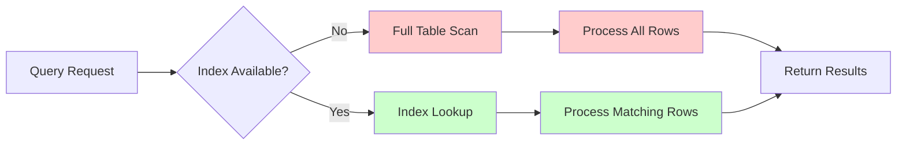

# SQL Performance Tips

## Introduction

When working with databases, the performance of your SQL queries can significantly impact your application's efficiency. Slow queries can lead to poor user experience, increased server load, and even system crashes under heavy traffic. This guide will introduce you to essential SQL performance tips that can help you write more efficient queries and optimize your database operations.

Whether you're building a small personal project or a large-scale application, these techniques will help you establish good habits early in your SQL journey. Let's dive into the world of SQL optimization!

## Why SQL Performance Matters

Before we jump into specific techniques, let's understand why SQL performance is crucial:

1. **User Experience**: Faster queries = faster application response times
2. **Resource Efficiency**: Optimized queries consume less CPU, memory, and I/O
3. **Scalability**: Well-optimized databases can handle more users and data
4. **Cost Savings**: Efficient queries can reduce infrastructure costs

The performance difference between an optimized and unoptimized query can be dramatic - sometimes turning minutes-long operations into seconds or milliseconds.

## Essential SQL Performance Tips

### 1. Use Indexes Wisely

Indexes are one of the most powerful tools for improving SQL performance. They work like a book's index, helping the database quickly locate data without scanning every row.

#### Creating an Index

```sql
-- Basic index on a single column
CREATE INDEX idx_lastname ON customers(last_name);

-- Composite index on multiple columns
CREATE INDEX idx_lastname_firstname ON customers(last_name, first_name);
```

#### When to Use Indexes

- Columns frequently used in WHERE clauses
- Columns used in JOIN conditions
- Columns used in ORDER BY or GROUP BY

#### Example: Query Performance With and Without an Index

Without an index:

```sql
-- This query might perform a full table scan (slow)
SELECT * FROM customers 
WHERE last_name = 'Smith';
```

With an index:

```sql
-- After creating the index: CREATE INDEX idx_lastname ON customers(last_name);
-- Same query now uses the index (much faster)
SELECT * FROM customers 
WHERE last_name = 'Smith';
```

#### Index Considerations

- **Don't over-index**: Each index takes storage space and slows down INSERT/UPDATE operations
- **Monitor usage**: Remove unused indexes
- **Consider column order** in composite indexes based on query patterns

### 2. Select Only What You Need

Retrieving unnecessary columns wastes resources and slows down your queries.

#### Bad Practice

```sql
-- Selecting all columns when you only need a few
SELECT * FROM products WHERE category = 'Electronics';
```

#### Good Practice

```sql
-- Selecting only the specific columns you need
SELECT product_id, product_name, price 
FROM products 
WHERE category = 'Electronics';
```

This approach reduces:
- Data transfer between database and application
- Memory usage
- Processing time

### 3. Limit the Result Set Size

When dealing with large tables, limiting your result set can dramatically improve performance.

```sql
-- Return only the first 100 results
SELECT product_name, price 
FROM products 
ORDER BY price DESC 
LIMIT 100;
```

For pagination:

```sql
-- Get results 101-200
SELECT product_name, price 
FROM products 
ORDER BY price DESC 
LIMIT 100 OFFSET 100;
```

### 4. Optimize JOINs

JOINs are often performance bottlenecks. Here are some tips for optimizing them:

- Join on indexed columns
- Minimize the number of joins when possible
- Use the appropriate join type (INNER, LEFT, etc.)

#### Example: Optimizing a JOIN Query

```sql
-- Less efficient (joining large tables first)
SELECT c.customer_name, o.order_date, p.product_name
FROM orders o
JOIN customers c ON o.customer_id = c.customer_id
JOIN order_items oi ON o.order_id = oi.order_id
JOIN products p ON oi.product_id = p.product_id
WHERE o.order_date > '2023-01-01';

-- More efficient (filtering first, then joining)
SELECT c.customer_name, o.order_date, p.product_name
FROM orders o
JOIN order_items oi ON o.order_id = oi.order_id
JOIN products p ON oi.product_id = p.product_id
JOIN customers c ON o.customer_id = c.customer_id
WHERE o.order_date > '2023-01-01';
```

### 5. Use WHERE Before GROUP BY and HAVING

Filter data as early as possible in the query execution:

```sql
-- Less efficient
SELECT customer_id, COUNT(*) as order_count
FROM orders
GROUP BY customer_id
HAVING order_date > '2023-01-01';

-- More efficient
SELECT customer_id, COUNT(*) as order_count
FROM orders
WHERE order_date > '2023-01-01'
GROUP BY customer_id;
```

### 6. Avoid Functions in WHERE Clauses

Using functions on columns in WHERE clauses prevents indexes from being used.

#### Bad Practice

```sql
-- Index on last_name won't be used
SELECT * FROM employees 
WHERE UPPER(last_name) = 'SMITH';
```

#### Good Practice

```sql
-- Index on last_name can be used
SELECT * FROM employees 
WHERE last_name = 'Smith';

-- Or if case-insensitivity is needed
SELECT * FROM employees 
WHERE last_name ILIKE 'smith';
```

### 7. Use Prepared Statements

Prepared statements improve performance by:
- Allowing the database to reuse execution plans
- Reducing parsing overhead
- Protecting against SQL injection

```sql
-- Example in pseudo-code with parameters
PREPARE get_customer AS
SELECT * FROM customers WHERE customer_id = $1;

-- Execute with different values
EXECUTE get_customer(1001);
EXECUTE get_customer(1002);
```

### 8. Denormalize When Appropriate

While normalization reduces redundancy, sometimes strategic denormalization can improve read performance.

Consider maintaining summary tables or calculated fields for frequently accessed statistics:

```sql
-- Creating a summary table
CREATE TABLE order_summaries (
    customer_id INT,
    total_orders INT,
    total_value DECIMAL(10,2),
    last_order_date DATE,
    PRIMARY KEY (customer_id)
);

-- Update on new orders (simplified example)
INSERT INTO order_summaries (customer_id, total_orders, total_value, last_order_date)
VALUES (1001, 1, 150.00, '2023-05-15')
ON DUPLICATE KEY UPDATE
    total_orders = total_orders + 1,
    total_value = total_value + 150.00,
    last_order_date = '2023-05-15';
```

### 9. Use EXPLAIN to Analyze Query Performance

The EXPLAIN command shows how the database plans to execute your query, helping you identify potential issues.

```sql
EXPLAIN SELECT c.customer_name, COUNT(o.order_id) as order_count
FROM customers c
JOIN orders o ON c.customer_id = o.customer_id
WHERE c.region = 'West'
GROUP BY c.customer_name;
```

Look for:
- Full table scans
- Missing indexes
- Inefficient join methods
- High execution costs

Different database systems have variations of EXPLAIN, so check your database documentation for specifics.

### 10. Database-Specific Optimization Techniques

Different database systems have unique optimization features:

**MySQL/MariaDB:**
```sql
-- Forcing index usage
SELECT * FROM products USE INDEX (idx_category) 
WHERE category = 'Electronics';
```

**PostgreSQL:**
```sql
-- Statistics on table
ANALYZE products;

-- Parallel query processing
SET max_parallel_workers_per_gather = 4;
```

**SQL Server:**
```sql
-- Query hints
SELECT * FROM products WITH (INDEX(idx_category))
WHERE category = 'Electronics';
```

## Visualizing Query Optimization

Here's a simple visualization of how proper indexing can improve query performance:



## Common Performance Issues and Solutions

| Issue | Symptom | Solution |
|-------|---------|----------|
| Missing indexes | Slow queries with conditions on unindexed columns | Add appropriate indexes |
| Over-indexing | Slow write operations | Remove unused indexes |
| Retrieving too much data | Network bottlenecks, high memory usage | Select only needed columns |
| Inefficient JOINs | Queries with multiple joins running slowly | Optimize join order, add indexes |
| Using functions in WHERE | Index not being used | Restructure query to avoid functions on indexed columns |
| N+1 query problem | Many similar queries in loops | Use JOIN or IN instead of separate queries |

## Practical Example: Optimizing an E-commerce Query

Let's walk through optimizing a real-world e-commerce query step by step.

### Initial Query (Unoptimized)

```sql
-- Find all customers who purchased a specific product
SELECT *
FROM customers c, orders o, order_items oi, products p
WHERE c.customer_id = o.customer_id
AND o.order_id = oi.order_id
AND oi.product_id = p.product_id
AND p.product_name LIKE '%Smartphone%'
ORDER BY o.order_date;
```

### Issues with this query:
1. Selects all columns (`*`)
2. Uses old-style comma joins
3. Has a wildcard at the beginning of LIKE
4. May lack proper indexes

### Optimized Query

```sql
-- First, add appropriate indexes
CREATE INDEX idx_orders_customer ON orders(customer_id);
CREATE INDEX idx_order_items_order ON order_items(order_id);
CREATE INDEX idx_order_items_product ON order_items(product_id);
CREATE INDEX idx_products_name ON products(product_name);

-- Optimized query
SELECT c.customer_id, c.first_name, c.last_name, c.email,
       o.order_id, o.order_date
FROM customers c
JOIN orders o ON c.customer_id = o.customer_id
JOIN order_items oi ON o.order_id = oi.order_id
JOIN products p ON oi.product_id = p.product_id
WHERE p.product_name LIKE 'Smartphone%'  -- Removed leading wildcard
ORDER BY o.order_date
LIMIT 100;  -- Assuming we don't need all results at once
```

Improvements:
1. Selected only necessary columns
2. Used modern JOIN syntax
3. Removed leading wildcard in LIKE condition
4. Added proper indexes
5. Added LIMIT clause

## Summary

Optimizing SQL performance is a balance between following best practices and understanding your specific application needs. Here's a quick recap of the key points:

1. **Use indexes strategically** on columns used in WHERE, JOIN, and ORDER BY
2. **Select only the columns you need** rather than using `SELECT *`
3. **Limit result sets** when handling large data sets
4. **Optimize JOINs** by using indexes and filtering early
5. **Use WHERE before GROUP BY** to filter data early
6. **Avoid functions on indexed columns** in WHERE clauses
7. **Use prepared statements** for repeated queries
8. **Consider denormalization** for read-heavy workloads
9. **Use EXPLAIN** to analyze and improve query performance
10. **Learn database-specific optimizations** for your platform

Remember that optimization is an ongoing process. As your data grows and usage patterns change, you may need to revisit your optimization strategies.

## Additional Resources

- [MySQL Performance Optimization Documentation](https://dev.mysql.com/doc/refman/8.0/en/optimization.html)
- [PostgreSQL Query Performance Tuning](https://www.postgresql.org/docs/current/performance-tips.html)
- [SQL Server Query Tuning Fundamentals](https://learn.microsoft.com/en-us/sql/relational-databases/performance/monitoring-performance-by-using-the-query-store)
- Book: "SQL Performance Explained" by Markus Winand

## Exercises

1. Take a slow query from your project and apply the optimization techniques from this guide.
2. Use EXPLAIN to analyze the execution plan before and after your optimizations.
3. Create an appropriate index strategy for a table with frequent reads but infrequent writes.
4. Optimize a query that uses multiple JOINs and GROUP BY clauses.
5. Compare the performance of a query with and without appropriate indexes using actual timing.