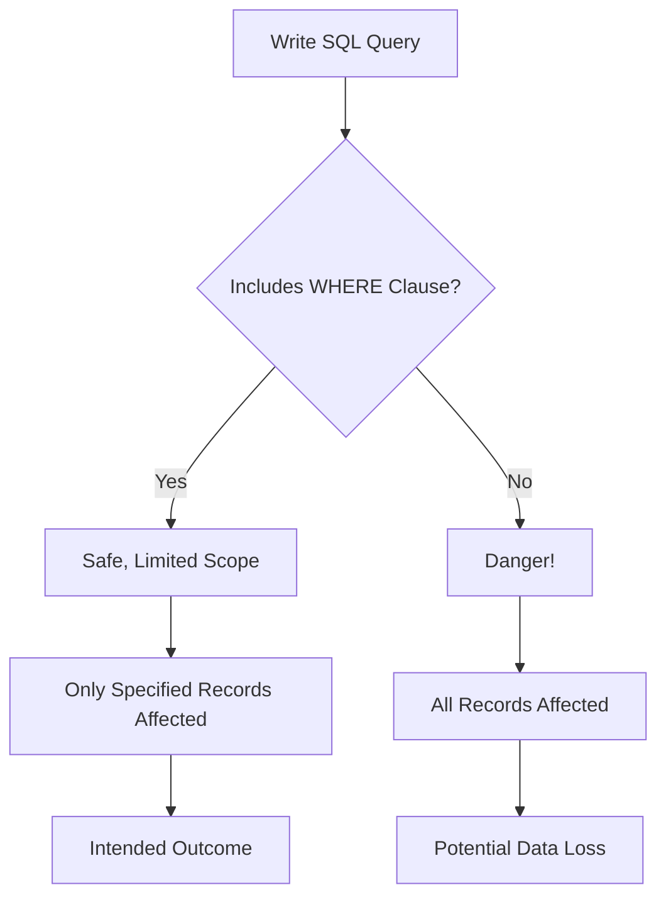

# SQL Common Mistakes

## Introduction

When learning SQL, it's easy to fall into certain pitfalls that can lead to incorrect results, poor performance, or security vulnerabilities. This guide covers the most common mistakes that SQL beginners make and provides practical solutions to avoid them. Understanding these mistakes early in your SQL journey will help you develop good habits and write more reliable, efficient, and secure database queries.

## Mistake 1: Improper Use of NULL Values

NULL in SQL represents an unknown or missing value, not zero or an empty string. Many beginners misunderstand how NULL values work in comparisons and functions.

### Common Error

```sql
-- Attempting to find records where name is NULL
SELECT * FROM customers WHERE name = NULL;
```

This query will not return any results, even if NULL values exist in the name column.

### Correct Approach

```sql
-- Proper way to check for NULL values
SELECT * FROM customers WHERE name IS NULL;

-- Proper way to check for non-NULL values
SELECT * FROM customers WHERE name IS NOT NULL;
```

### Why This Matters

NULL doesn't equal anything, not even another NULL. This special value requires special operators (`IS NULL` and `IS NOT NULL`). Understanding this behavior is crucial for writing accurate queries.

## Mistake 2: Missing WHERE Clause

One of the most dangerous mistakes is forgetting the WHERE clause in UPDATE or DELETE statements.

### Common Error

```sql
-- Intended to update only one record, but affects all records!
UPDATE customers SET status = 'active';

-- Intended to delete specific records, but deletes all records!
DELETE FROM orders;
```

### Correct Approach

```sql
-- Properly scoped update
UPDATE customers SET status = 'active' WHERE customer_id = 1234;

-- Properly scoped delete
DELETE FROM orders WHERE order_date < '2020-01-01';
```

### Why This Matters

Without a WHERE clause, UPDATE affects all rows in the table, and DELETE removes all records. Always double-check your UPDATE and DELETE statements before executing them. Consider using transactions (BEGIN/COMMIT/ROLLBACK) for additional safety.

## Mistake 3: SQL Injection Vulnerabilities

SQL injection happens when user input is directly concatenated into SQL queries, allowing malicious users to manipulate your database.

### Common Error

```javascript
// JavaScript code building an SQL query (DANGEROUS!)
const username = userInput;
const query = `SELECT * FROM users WHERE username = '${username}'`;
```

If a user enters `' OR '1'='1`, the resulting query becomes:

```sql
SELECT * FROM users WHERE username = '' OR '1'='1';
```

This would return all users, bypassing authentication.

### Correct Approach

Always use parameterized queries or prepared statements:

```javascript
// Using parameterized query in Node.js with mysql package
connection.query(
  'SELECT * FROM users WHERE username = ?',
  [username],
  function (error, results) {
    // Handle results
  }
);
```

### Why This Matters

SQL injection can lead to unauthorized data access, data loss, or even complete system compromise. Never trust user input and always use parameterized queries to separate SQL code from data.

## Mistake 4: Inefficient JOINs

Poor JOIN practices can lead to slow queries or incorrect results.

### Common Error

```sql
-- Cartesian product (cross join) - usually a mistake
SELECT * FROM orders, customers;

-- Missing JOIN condition
SELECT * FROM orders JOIN customers;
```

### Correct Approach

```sql
-- Explicit JOIN with proper condition
SELECT * FROM orders 
JOIN customers ON orders.customer_id = customers.id;

-- Alternative syntax with explicit JOIN type
SELECT * FROM orders 
INNER JOIN customers ON orders.customer_id = customers.id;
```

### Why This Matters

Improper JOINs can result in cartesian products, exponentially increasing the result set size and slowing down your query. Always specify the JOIN type and condition.

## Mistake 5: SELECT * in Production Code

Using `SELECT *` retrieves all columns from a table, which can be inefficient and cause problems when table structures change.

### Common Error

```sql
-- Getting more data than needed
SELECT * FROM customers WHERE country = 'USA';
```

### Correct Approach

```sql
-- Only retrieve needed columns
SELECT customer_id, first_name, last_name, email 
FROM customers 
WHERE country = 'USA';
```

### Why This Matters

Selecting only the columns you need:
1. Reduces network traffic and memory usage
2. Improves query performance
3. Makes your code less susceptible to schema changes
4. Clarifies your code's intent

## Mistake 6: Ignoring Indexes for Large Tables

Queries on large tables without proper indexes can be extremely slow.

### Common Error

```sql
-- Filtering on an unindexed column in a large table
SELECT * FROM transactions WHERE transaction_date > '2023-01-01';
```

### Correct Approach

```sql
-- Create an index first
CREATE INDEX idx_transaction_date ON transactions(transaction_date);

-- Then run your query
SELECT * FROM transactions WHERE transaction_date > '2023-01-01';
```

### Example: Analyzing Query Performance

Let's compare a query before and after adding an index:

```sql
-- Before index (might take seconds or minutes on large tables)
EXPLAIN SELECT * FROM orders WHERE order_date BETWEEN '2023-01-01' AND '2023-01-31';

-- After adding an index
CREATE INDEX idx_order_date ON orders(order_date);

-- Now much faster!
EXPLAIN SELECT * FROM orders WHERE order_date BETWEEN '2023-01-01' AND '2023-01-31';
```

### Why This Matters

Indexes are like the table of contents in a book. Without them, the database has to scan every row to find what you're looking for. On large tables, this can mean the difference between milliseconds and minutes.

## Mistake 7: Overlooking LIMIT in Large Result Sets

Retrieving too many rows at once can overwhelm application memory and slow down processing.

### Common Error

```sql
-- Potentially returning millions of rows
SELECT * FROM log_entries WHERE level = 'error';
```

### Correct Approach

```sql
-- Limiting results to a manageable batch
SELECT * FROM log_entries WHERE level = 'error' LIMIT 1000;

-- For pagination
SELECT * FROM log_entries WHERE level = 'error' LIMIT 1000 OFFSET 2000;
```

### Why This Matters

Retrieving large result sets can:
1. Exhaust database connection resources
2. Consume excessive network bandwidth
3. Overload application memory
4. Create a poor user experience

Always use LIMIT when retrieving data that could potentially return many rows.

## Mistake 8: Improper Use of GROUP BY

The GROUP BY clause has specific rules that often confuse beginners.

### Common Error

```sql
-- Selecting columns not in GROUP BY (will error in most SQL databases)
SELECT customer_id, product_name, COUNT(*) as count
FROM orders
GROUP BY customer_id;
```

### Correct Approach

```sql
-- Include all non-aggregated columns in GROUP BY
SELECT customer_id, product_name, COUNT(*) as count
FROM orders
GROUP BY customer_id, product_name;

-- Or use only aggregated columns and GROUP BY columns
SELECT customer_id, COUNT(*) as order_count, SUM(amount) as total_spent
FROM orders
GROUP BY customer_id;
```

### Why This Matters

When you use GROUP BY, each selected column must either:
1. Be included in the GROUP BY clause, or
2. Be used with an aggregate function (COUNT, SUM, AVG, etc.)

Violating this rule leads to indeterminate results or errors, depending on your database system.

## Mistake 9: Not Using Transactions for Multi-step Operations

Performing multiple related database changes without transactions can lead to data inconsistency.

### Common Error

```sql
-- Without transaction - if the second statement fails, data becomes inconsistent
UPDATE accounts SET balance = balance - 100 WHERE account_id = 123;
UPDATE accounts SET balance = balance + 100 WHERE account_id = 456;
```

### Correct Approach

```sql
-- Using a transaction
BEGIN;
UPDATE accounts SET balance = balance - 100 WHERE account_id = 123;
UPDATE accounts SET balance = balance + 100 WHERE account_id = 456;
COMMIT;

-- With error handling
BEGIN;
UPDATE accounts SET balance = balance - 100 WHERE account_id = 123;
-- If any issues occur:
-- ROLLBACK;
-- Otherwise:
COMMIT;
```

### Why This Matters

Transactions ensure that a series of operations either all succeed or all fail, maintaining data integrity. They're essential for operations like transfers, where partial completion would be worse than complete failure.

## Mistake 10: Case Sensitivity Confusion

SQL's case sensitivity rules can vary between database systems, leading to confusion.

### Common Error

```sql
-- Works in case-insensitive databases, fails in case-sensitive ones
SELECT * FROM Customers WHERE Name = 'john';
```

### Correct Approach

```sql
-- Case-insensitive comparison (works across databases)
SELECT * FROM Customers WHERE LOWER(Name) = 'john';

-- Or match the exact case
SELECT * FROM Customers WHERE Name = 'John';
```

### Why This Matters

Different database systems handle case sensitivity differently:
- MySQL (with default settings): Table names are case-sensitive on Unix but case-insensitive on Windows. String comparisons are case-insensitive.
- PostgreSQL: Table and column names are case-insensitive unless quoted. String comparisons are case-sensitive.
- SQL Server: Table and column names are case-insensitive. String comparisons depend on the collation setting.

Understanding your database's case sensitivity rules prevents subtle bugs.

## Using Visualization to Understand SQL Mistakes

Let's visualize one of the most common SQL mistake patterns - the missing WHERE clause:



## Summary

Avoiding these common SQL mistakes will help you write more reliable, efficient, and secure database queries:

1. Use `IS NULL` and `IS NOT NULL` to check for NULL values
2. Always include a WHERE clause in UPDATE and DELETE statements
3. Prevent SQL injection by using parameterized queries
4. Write explicit JOIN conditions
5. Specify only the columns you need instead of using `SELECT *`
6. Create appropriate indexes for large tables
7. Use LIMIT to restrict large result sets
8. Follow GROUP BY rules correctly
9. Use transactions for multi-step operations
10. Be aware of case sensitivity differences between database systems

By being mindful of these common pitfalls, you'll develop good habits that will serve you well as you advance in your SQL journey.

## Additional Resources

- [SQL Style Guide](https://www.sqlstyle.guide/) - Comprehensive guidelines for writing readable, maintainable SQL
- [Use the Index, Luke](https://use-the-index-luke.com/) - A guide to database performance for developers
- [OWASP SQL Injection Prevention Cheat Sheet](https://cheatsheetseries.owasp.org/cheatsheets/SQL_Injection_Prevention_Cheat_Sheet.html) - Detailed guide on preventing SQL injection vulnerabilities

## Exercises

1. **Fix the NULL Comparison**:  
   Convert this incorrect query to the correct form:
   ```sql
   SELECT * FROM products WHERE price = NULL;
   ```

2. **Prevent Full Table Update**:  
   Fix this query to only update products from a specific category:
   ```sql
   UPDATE products SET discount = 0.15;
   ```

3. **Optimize a SELECT Statement**:  
   Rewrite this query to only retrieve necessary columns:
   ```sql
   SELECT * FROM customers WHERE signup_date > '2023-01-01';
   ```

4. **Secure Against SQL Injection**:  
   Convert this vulnerable code to use parameterized queries:
   ```javascript
   const query = `SELECT * FROM users WHERE username = '${username}' AND password = '${password}'`;
   ```

5. **Fix a GROUP BY Issue**:  
   Correct this query that incorrectly uses GROUP BY:
   ```sql
   SELECT product_id, customer_name, COUNT(*) as purchase_count
   FROM orders
   GROUP BY product_id;
   ```