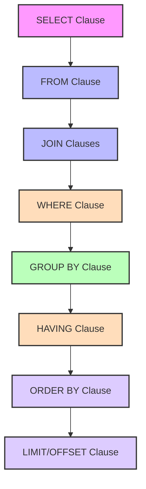

# SQL Style Guide

## Introduction

A SQL style guide is a set of conventions and rules for writing SQL code that is clean, consistent, and maintainable. Just like with any programming language, following a consistent style in SQL makes your code easier to read, troubleshoot, and collaborate on with others. This guide will walk you through essential SQL formatting practices that will help you write professional-quality SQL from the beginning of your programming journey.

## Why SQL Style Matters

Consider these two queries that do the exact same thing:

```sql
SELECT id,first_name,last_name,email,created_at FROM users WHERE status='active' AND created_at>='2023-01-01';
```

```sql
SELECT
    id,
    first_name,
    last_name,
    email,
    created_at
FROM 
    users
WHERE 
    status = 'active'
    AND created_at >= '2023-01-01';
```

The second query is significantly easier to read and understand. Good SQL style isn't just about aesthetics—it directly impacts code quality and team productivity.

## Core SQL Style Principles

### 1. Consistent Capitalization

SQL has keywords (like `SELECT`, `FROM`, `WHERE`) and identifiers (table names, column names). Choose a capitalization style and stick with it:

| Style                                      | Example                        |
|--------------------------------------------|--------------------------------|
| Keywords uppercase, identifiers lowercase  | `SELECT first_name FROM users` |
| Everything lowercase                       | `select first_name from users` |
| Keywords lowercase, identifiers PascalCase | `select FirstName from Users`  |

#### Recommended Approach:
- **Keywords in UPPERCASE** (SELECT, FROM, WHERE)
- **Table and column names in snake_case** (user_accounts, first_name)

This provides clear visual distinction between SQL syntax and your database objects.

### 2. Indentation and Line Breaks

Break long queries into multiple lines with consistent indentation:

```sql
SELECT
    u.user_id,
    u.username,
    o.order_id,
    o.order_date
FROM 
    users u
JOIN 
    orders o ON u.user_id = o.user_id
WHERE
    o.order_date >= '2023-01-01'
    AND o.status = 'completed'
ORDER BY
    o.order_date DESC;
```

#### Guidelines:
- Start major clauses (SELECT, FROM, WHERE, etc.) on new lines
- Indent subqueries and conditions
- Align related items
- Use 2 or 4 spaces for indentation (not tabs)

### 3. Table and Column Aliases

Use meaningful aliases that make your code clearer:

```sql
-- Avoid this:
SELECT
    a,
    b,
    c
FROM 
    really_long_table_name x
JOIN 
    another_very_long_table_name y ON x.id = y.foreign_id;

-- Do this instead:
SELECT
    users.first_name,
    users.last_name,
    orders.total
FROM 
    users
JOIN 
    orders ON users.id = orders.user_id;

-- Or with short, meaningful aliases:
SELECT
    u.first_name,
    u.last_name,
    o.total
FROM 
    users u
JOIN 
    orders o ON u.id = o.user_id;
```

#### Guidelines:
- Use aliases that suggest the table's content (users → u, orders → o)
- Prefer full table names for simple queries
- For complex queries with multiple joins, use short but meaningful aliases

### 4. White Space and Operators

Use spaces around operators for readability:

```sql
-- Hard to read
SELECT product_id,product_name,price*1.1 AS increased_price
FROM products
WHERE category_id=3 AND (price<100 OR featured=true);

-- Much better
SELECT 
    product_id,
    product_name,
    price * 1.1 AS increased_price
FROM 
    products
WHERE 
    category_id = 3 
    AND (price < 100 OR featured = true);
```

#### Guidelines:
- Add spaces around operators `(=, <, >, +, etc.)`
- Add spaces after commas
- Avoid extra spaces inside parentheses

### 5. Comments

Use comments to explain complex logic:

```sql
-- Get active premium users who haven't logged in during the last 30 days
SELECT 
    user_id,
    email,
    last_login_date
FROM 
    users
WHERE 
    subscription_type = 'premium'
    AND status = 'active'
    AND last_login_date < DATEADD(day, -30, GETDATE());
```

#### Guidelines:
- Add comments for complex queries explaining the purpose
- For large scripts, add section headers with comment blocks
- Keep comments up-to-date when you modify code

## Real-World Example: Building a Sales Report

Let's apply these style principles to create a real-world sales report:

```sql
/*
 * Monthly Sales Report
 * Shows product performance aggregated by month
 * Includes comparison to previous month
 */
SELECT
    EXTRACT(YEAR FROM order_date) AS year,
    EXTRACT(MONTH FROM order_date) AS month,
    p.category,
    p.product_name,
    SUM(oi.quantity) AS units_sold,
    SUM(oi.quantity * oi.unit_price) AS total_revenue,
    ROUND(
        SUM(oi.quantity * oi.unit_price) / SUM(oi.quantity),
        2
    ) AS average_unit_price
FROM
    order_items oi
JOIN
    products p ON oi.product_id = p.product_id
JOIN
    orders o ON oi.order_id = o.order_id
WHERE
    o.status = 'completed'
    AND o.order_date BETWEEN '2023-01-01' AND '2023-12-31'
GROUP BY
    EXTRACT(YEAR FROM order_date),
    EXTRACT(MONTH FROM order_date),
    p.category,
    p.product_name
ORDER BY
    year,
    month,
    total_revenue DESC;
```

Notice how the consistent formatting makes this complex query much easier to follow.

## SQL Style for Different Database Systems

Different database systems may have slightly different conventions:

### MySQL/MariaDB Style

```sql
SELECT 
    id,
    first_name,
    last_name
FROM 
    customers
WHERE 
    created_at >= '2023-01-01'
LIMIT 10;
```

### PostgreSQL Style

```sql
SELECT 
    id,
    first_name,
    last_name
FROM 
    customers
WHERE 
    created_at >= '2023-01-01'
LIMIT 10;
```

### SQL Server (T-SQL) Style

```sql
SELECT TOP 10
    id,
    first_name,
    last_name
FROM 
    customers
WHERE 
    created_at >= '2023-01-01';
```

While the basic principles remain the same, be aware of syntax differences and conventions specific to your database platform.

## Visualizing SQL Query Structure

The structure of a well-formatted SQL query can be visualized as follows:



This diagram illustrates the logical flow of SQL query processing and can help you remember the correct order of clauses when writing your queries.

## SQL Formatting Tools

You don't have to format your SQL manually. Many tools can help:

- **SQL Formatter extensions** for VS Code, Sublime Text, etc.
- **Online formatters** like [SQLFormat.org](https://sqlformat.org/)
- **Database IDE tools** like DataGrip, DBeaver, etc. with built-in formatting
- **Command-line tools** like `sqlparse` for Python

These tools can automatically apply consistent formatting to your SQL code.

## Summary

A consistent SQL style guide helps you write clean, maintainable queries that are easier to understand and troubleshoot. Key principles include:

- Consistent capitalization (UPPERCASE for keywords)
- Clear indentation and line breaks
- Meaningful table and column aliases
- Proper spacing around operators
- Helpful comments for complex logic

By following these guidelines from the beginning of your SQL journey, you'll develop good habits that will serve you well as your database skills grow.

## Practice Exercises

1. **Style Correction**:
   Take this poorly formatted query and rewrite it with proper style:
   ```sql
   select u.userid,u.name,u.email,o.orderid,o.total,o.orderdate from users u join orders o on u.userid=o.userid where o.status='complete' and o.orderdate>='2023-01-01' order by o.orderdate desc;
   ```

2. **Real-World Application**:
   Write a well-styled query that finds the top 5 customers by total purchase amount, including their name, email, and total spending.

## Additional Resources

- [SQL Style Guide by Simon Holywell](https://www.sqlstyle.guide/)
- [PostgreSQL Documentation - SQL Syntax](https://www.postgresql.org/docs/current/sql-syntax.html)
- [MySQL Documentation - SQL Statement Syntax](https://dev.mysql.com/doc/refman/8.0/en/sql-statements.html)
- [SQL Server Documentation - Transact-SQL Syntax](https://docs.microsoft.com/en-us/sql/t-sql/language-reference)

Follow these guidelines to write SQL that you and your team will appreciate for years to come!