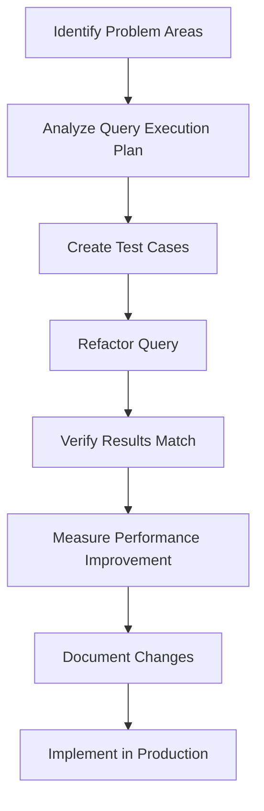

# SQL Refactoring

## Introduction

SQL refactoring is the process of restructuring existing SQL code to improve its internal structure without changing its external behavior. Just like refactoring in other programming languages, SQL refactoring aims to enhance code quality, performance, and maintainability while preserving functionality.

As databases grow and applications evolve, SQL queries that once performed adequately may become bottlenecks. Refactoring helps address these issues proactively, ensuring your database interactions remain efficient and your code remains clear and maintainable.

## Why Refactor SQL?

Refactoring SQL provides several important benefits:

- **Improved performance**: Optimized queries execute faster and consume fewer resources
- **Enhanced readability**: Well-structured SQL is easier to understand and maintain
- **Reduced technical debt**: Regular refactoring prevents accumulation of problematic code
- **Better scalability**: Efficient queries handle growing data volumes more effectively
- **Easier maintenance**: Clean SQL is simpler to debug and modify

## Common SQL Refactoring Techniques

### 1. Simplifying Complex Queries

Complex queries with multiple nested subqueries can be difficult to understand and optimize. Breaking them down into simpler components often improves both readability and performance.

**Before Refactoring:**

```sql
SELECT customer_name, 
       (SELECT SUM(order_total) 
        FROM orders 
        WHERE orders.customer_id = customers.customer_id 
        AND order_date BETWEEN '2023-01-01' AND '2023-12-31') as yearly_total
FROM customers
WHERE customer_id IN 
      (SELECT customer_id 
       FROM orders 
       GROUP BY customer_id 
       HAVING COUNT(*) > 5);
```

**After Refactoring:**

```sql
WITH active_customers AS (
    SELECT customer_id
    FROM orders
    GROUP BY customer_id
    HAVING COUNT(*) > 5
),
yearly_totals AS (
    SELECT customer_id, SUM(order_total) as yearly_total
    FROM orders
    WHERE order_date BETWEEN '2023-01-01' AND '2023-12-31'
    GROUP BY customer_id
)
SELECT c.customer_name, COALESCE(yt.yearly_total, 0) as yearly_total
FROM customers c
JOIN active_customers ac ON c.customer_id = ac.customer_id
LEFT JOIN yearly_totals yt ON c.customer_id = yt.customer_id;
```

The refactored version uses Common Table Expressions (CTEs) to break the logic into distinct, understandable steps, making the query more maintainable and often more efficient.

### 2. Replacing Subqueries with JOINs

In many cases, subqueries can be replaced with JOINs, which typically perform better, especially with larger datasets.

**Before Refactoring:**

```sql
SELECT product_name, product_price
FROM products
WHERE category_id = (
    SELECT category_id 
    FROM categories 
    WHERE category_name = 'Electronics'
);
```

**After Refactoring:**

```sql
SELECT p.product_name, p.product_price
FROM products p
JOIN categories c ON p.category_id = c.category_id
WHERE c.category_name = 'Electronics';
```

The JOIN version is often more efficient because the database can optimize the execution plan better than with subqueries.

### 3. Eliminating Redundant Conditions

Redundant or overlapping WHERE conditions can complicate queries without adding value.

**Before Refactoring:**

```sql
SELECT * FROM employees
WHERE (hire_date >= '2020-01-01' AND hire_date <= '2023-12-31')
AND (department_id = 5 OR department_id = 6)
AND (hire_date >= '2019-06-01')
AND (salary > 50000);
```

**After Refactoring:**

```sql
SELECT * FROM employees
WHERE hire_date BETWEEN '2020-01-01' AND '2023-12-31'
AND department_id IN (5, 6)
AND salary > 50000;
```

The refactored query is cleaner and eliminates the redundant date condition.

### 4. Using Proper Indexing

While not strictly a code refactoring technique, ensuring proper indexes exist to support your queries is essential for performance.

**Example Index Creation:**

```sql
-- Before refactoring: frequent query without proper index
SELECT * FROM orders
WHERE customer_id = 123 AND order_date > '2023-01-01';

-- Add a composite index to support this query pattern
CREATE INDEX idx_orders_customer_date 
ON orders(customer_id, order_date);
```

### 5. Replacing UNION with UNION ALL When Appropriate

When you don't need to eliminate duplicates, using UNION ALL instead of UNION can significantly improve performance.

**Before Refactoring:**

```sql
SELECT product_id, product_name FROM featured_products
UNION
SELECT product_id, product_name FROM new_arrivals;
```

**After Refactoring (when duplicates are acceptable):**

```sql
SELECT product_id, product_name FROM featured_products
UNION ALL
SELECT product_id, product_name FROM new_arrivals;
```

UNION ALL skips the resource-intensive process of checking for and removing duplicates.

## SQL Refactoring Process

Follow these steps for effective SQL refactoring:



### Step 1: Identify Problem Areas

Look for SQL queries that are:
- Running slowly
- Hard to understand
- Frequently modified
- Causing application bottlenecks

### Step 2: Analyze Query Execution Plan

Use database tools to examine how your query is currently executing:

```sql
-- In MySQL/MariaDB
EXPLAIN SELECT * FROM orders WHERE customer_id = 123;

-- In PostgreSQL
EXPLAIN ANALYZE SELECT * FROM orders WHERE customer_id = 123;

-- In SQL Server
SET STATISTICS IO, TIME ON;
GO
SELECT * FROM orders WHERE customer_id = 123;
GO
```

### Step 3: Create Test Cases

Before refactoring, create test cases that verify the current behavior:

```sql
-- Create a temporary table with the original query results
CREATE TEMPORARY TABLE original_results AS
SELECT customer_id, COUNT(*) as order_count
FROM orders
GROUP BY customer_id
HAVING COUNT(*) > 10;
```

### Step 4: Refactor the Query

Apply appropriate refactoring techniques while keeping the intended functionality intact.

### Step 5: Verify Results Match

Compare the results of the original and refactored queries:

```sql
-- Compare refactored results with original
WITH refactored_results AS (
    SELECT c.customer_id, COUNT(o.order_id) as order_count
    FROM customers c
    JOIN orders o ON c.customer_id = o.customer_id
    GROUP BY c.customer_id
    HAVING COUNT(o.order_id) > 10
)
SELECT * FROM original_results
EXCEPT
SELECT * FROM refactored_results;

-- If this returns no rows, the results match
```

### Step 6: Measure Performance Improvement

Compare the execution time and resource usage of the original and refactored queries.

### Step 7: Document Changes

Document what was changed and why, including performance metrics.

## Advanced SQL Refactoring Techniques

### 1. Denormalizing for Read-Heavy Operations

In some cases, controlled denormalization can improve read performance:

**Before:**

```sql
SELECT o.order_id, c.customer_name, p.product_name, oi.quantity
FROM orders o
JOIN customers c ON o.customer_id = c.customer_id
JOIN order_items oi ON o.order_id = oi.order_id
JOIN products p ON oi.product_id = p.product_id
WHERE o.order_date > '2023-01-01';
```

**After (with denormalized order_summary table):**

```sql
-- Create a denormalized view or materialized view
CREATE VIEW order_summary AS
SELECT o.order_id, o.order_date, 
       c.customer_id, c.customer_name,
       p.product_id, p.product_name, 
       oi.quantity
FROM orders o
JOIN customers c ON o.customer_id = c.customer_id
JOIN order_items oi ON o.order_id = oi.order_id
JOIN products p ON oi.product_id = p.product_id;

-- Then query becomes simpler
SELECT order_id, customer_name, product_name, quantity
FROM order_summary
WHERE order_date > '2023-01-01';
```

### 2. Refactoring String Operations

String operations in SQL are often expensive. When possible, refactor them to use more efficient approaches:

**Before:**

```sql
SELECT * FROM customers
WHERE UPPER(first_name) = 'JOHN';
```

**After:**

```sql
-- Create a computed column or use a case-insensitive collation
SELECT * FROM customers
WHERE first_name = 'John'
   OR first_name = 'JOHN'
   OR first_name = 'john';
```

Better yet, in many databases you can use:

```sql
SELECT * FROM customers
WHERE first_name ILIKE 'john';  -- PostgreSQL
-- or
WHERE first_name COLLATE SQL_Latin1_General_CP1_CI_AS = 'john';  -- SQL Server
```

### 3. Using Window Functions

Window functions can replace complex self-joins and subqueries:

**Before:**

```sql
SELECT e.employee_id, e.employee_name, e.salary,
       (SELECT AVG(salary) FROM employees 
        WHERE department_id = e.department_id) as dept_avg_salary
FROM employees e;
```

**After:**

```sql
SELECT employee_id, employee_name, salary,
       AVG(salary) OVER (PARTITION BY department_id) as dept_avg_salary
FROM employees;
```

Window functions perform calculations across a set of rows related to the current row, often resulting in cleaner, more efficient code.

## Real-World SQL Refactoring Example

Let's walk through a complete refactoring example for a complex reporting query:

**Original Query:**

```sql
SELECT 
    p.product_name,
    (SELECT category_name FROM categories WHERE category_id = p.category_id) as category,
    p.unit_price,
    (SELECT SUM(quantity) FROM order_items WHERE product_id = p.product_id) as total_quantity,
    (SELECT COUNT(DISTINCT o.customer_id) 
     FROM orders o 
     JOIN order_items oi ON o.order_id = oi.order_id 
     WHERE oi.product_id = p.product_id) as unique_customers,
    CASE 
        WHEN (SELECT SUM(quantity) FROM order_items WHERE product_id = p.product_id) > 100 THEN 'High'
        WHEN (SELECT SUM(quantity) FROM order_items WHERE product_id = p.product_id) > 50 THEN 'Medium'
        ELSE 'Low'
    END as demand_level
FROM products p
WHERE p.discontinued = 0
AND p.unit_price > 20
ORDER BY (SELECT SUM(quantity) FROM order_items WHERE product_id = p.product_id) DESC;
```

**Refactored Query:**

```sql
WITH product_sales AS (
    SELECT 
        oi.product_id,
        SUM(oi.quantity) as total_quantity,
        COUNT(DISTINCT o.customer_id) as unique_customers
    FROM order_items oi
    JOIN orders o ON oi.order_id = o.order_id
    GROUP BY oi.product_id
)
SELECT 
    p.product_name,
    c.category_name as category,
    p.unit_price,
    COALESCE(ps.total_quantity, 0) as total_quantity,
    COALESCE(ps.unique_customers, 0) as unique_customers,
    CASE 
        WHEN COALESCE(ps.total_quantity, 0) > 100 THEN 'High'
        WHEN COALESCE(ps.total_quantity, 0) > 50 THEN 'Medium'
        ELSE 'Low'
    END as demand_level
FROM products p
LEFT JOIN categories c ON p.category_id = c.category_id
LEFT JOIN product_sales ps ON p.product_id = ps.product_id
WHERE p.discontinued = 0
AND p.unit_price > 20
ORDER BY COALESCE(ps.total_quantity, 0) DESC;
```

This refactoring:
1. Eliminates redundant subqueries that calculated the same values multiple times
2. Uses CTEs to organize the logic clearly
3. Replaces correlated subqueries with JOINs
4. Handles NULL cases with COALESCE
5. Maintains the exact same results as the original query

## Best Practices for SQL Refactoring

1. **Start with a backup**: Always have a backup of your database and original queries before beginning.

2. **Test thoroughly**: Verify the refactored query returns identical results to the original.

3. **Refactor incrementally**: Make small, targeted changes rather than rewriting entire queries at once.

4. **Use database-specific features wisely**: Leverage your database's unique features, but be careful about portability.

5. **Consider query plans**: Check execution plans before and after refactoring to confirm performance improvements.

6. **Document changes**: Keep records of what was changed and why, especially performance metrics.

7. **Standardize SQL formatting**: Adopt consistent formatting practices for better readability:

```sql
-- Consistent formatting example
SELECT 
    customer_id,
    first_name,
    last_name,
    COUNT(order_id) AS order_count
FROM 
    customers
LEFT JOIN 
    orders ON customers.customer_id = orders.customer_id
WHERE 
    customer_status = 'Active'
    AND registration_date >= '2022-01-01'
GROUP BY 
    customer_id,
    first_name,
    last_name
HAVING 
    COUNT(order_id) > 0
ORDER BY 
    order_count DESC;
```

## Common SQL Refactoring Pitfalls

1. **Premature optimization**: Don't refactor what isn't broken or what isn't a performance bottleneck.

2. **Over-complication**: Sometimes a simple query with a good index outperforms a complex "optimized" query.

3. **Ignoring database differences**: What works well in PostgreSQL might not work the same in MySQL or SQL Server.

4. **Forgetting about transactions**: Refactored code must maintain the same transaction boundaries and isolation levels.

5. **Neglecting edge cases**: Test with boundary conditions and special cases, not just typical data.

## Tools for SQL Refactoring

Several tools can assist in the SQL refactoring process:

- **Database-specific execution plan analyzers**:
  - MySQL: EXPLAIN and EXPLAIN ANALYZE
  - PostgreSQL: EXPLAIN (ANALYZE, BUFFERS)
  - SQL Server: Query Execution Plans and Statistics

- **SQL formatting tools**:
  - SQL Formatter online tools
  - IDE plugins (DataGrip, VS Code SQL extensions)

- **SQL quality checkers**:
  - SonarQube with SQL plugins
  - SQLFluff

## Summary

SQL refactoring is a valuable practice that helps maintain database performance and code quality as your application grows. By applying structured techniques like simplifying complex queries, replacing subqueries with JOINs, and using CTEs, you can transform difficult-to-maintain SQL into cleaner, more efficient code.

Remember that good SQL refactoring preserves existing functionality while enhancing performance, readability, and maintainability. Always verify results match, test thoroughly, and document your changes.

## Exercises

1. Refactor this query to use CTEs instead of nested subqueries:
   ```sql
   SELECT product_name, 
          (SELECT AVG(unit_price) FROM products) as avg_price,
          unit_price - (SELECT AVG(unit_price) FROM products) as price_difference
   FROM products
   WHERE unit_price > (SELECT AVG(unit_price) FROM products);
   ```

2. Refactor this query to eliminate the self-join by using window functions:
   ```sql
   SELECT e1.employee_name, e1.department, e1.salary,
          e2.average_salary,
          e1.salary - e2.average_salary as difference
   FROM employees e1
   JOIN (
       SELECT department, AVG(salary) as average_salary
       FROM employees
       GROUP BY department
   ) e2 ON e1.department = e2.department;
   ```

3. Identify and fix performance issues in this query:
   ```sql
   SELECT 
       o.order_date, 
       c.customer_name,
       SUM(oi.quantity * p.unit_price) as order_total
   FROM orders o
   JOIN customers c ON UPPER(o.customer_id) = UPPER(c.customer_id)
   JOIN order_items oi ON o.order_id = oi.order_id
   JOIN products p ON oi.product_id = p.product_id
   WHERE YEAR(o.order_date) = 2023
   GROUP BY o.order_date, c.customer_name;
   ```

## Additional Resources

- [SQL Performance Explained](https://use-the-index-luke.com/) - An excellent book on SQL optimization
- [Database Refactoring Patterns](https://databaserefactoring.com/) - Catalog of refactoring techniques
- [SQL Style Guide](https://www.sqlstyle.guide/) - Guidelines for SQL formatting and conventions
- [SQL Server Query Tuning](https://docs.microsoft.com/en-us/sql/relational-databases/performance/query-processing-architecture-guide) - Microsoft's official guide
- [PostgreSQL Performance Optimization](https://www.postgresql.org/docs/current/performance-tips.html) - From the PostgreSQL documentation