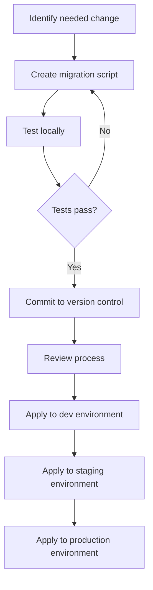

# SQL Version Control

## Introduction

Have you ever made a change to your database schema, only to realize it broke something else? Or worked on a database with multiple team members, unsure who made what changes and when? SQL version control solves these problems by providing a systematic approach to tracking and managing changes to your database structures and code.

In this guide, we'll explore how to implement version control for your SQL databases. You'll learn why it's essential, how it works, and practical approaches to integrate it into your workflow. Whether you're working alone or as part of a team, these practices will help you maintain a more stable, reliable database environment.

## Why Version Control for SQL?

Traditional software development has long embraced version control systems like Git for tracking code changes. However, databases often remain outside this workflow, leading to several problems:

- **Untracked changes**: Without version control, it's difficult to know who changed what and when
- **Deployment challenges**: Moving database changes between environments becomes error-prone
- **Collaboration difficulties**: Multiple developers can inadvertently overwrite each other's changes
- **Recovery problems**: Restoring to a previous state becomes nearly impossible

By implementing SQL version control, you can:

1. Track all changes to your database schema and stored procedures
2. Roll back to previous versions when needed
3. Collaborate effectively with other developers
4. Deploy changes consistently across different environments
5. Maintain a comprehensive history of your database evolution

## Getting Started with SQL Version Control

### Approach 1: Migration Scripts

The most common approach to SQL version control is using **migration scripts** (also called change scripts). These are SQL files that represent incremental changes to your database.

#### How It Works

1. Each change to the database is written as a SQL script
2. Scripts are numbered sequentially and stored in your version control system
3. A separate table in your database tracks which scripts have been applied
4. When deploying, only the new scripts are executed

Let's see a simple example:

```sql
-- 001_create_users_table.sql
CREATE TABLE users (
    id INT PRIMARY KEY AUTO_INCREMENT,
    username VARCHAR(50) NOT NULL UNIQUE,
    email VARCHAR(100) NOT NULL UNIQUE,
    created_at TIMESTAMP DEFAULT CURRENT_TIMESTAMP
);

-- Add a comment for documentation
COMMENT ON TABLE users IS 'Stores user account information';
```

```sql
-- 002_add_user_status.sql
ALTER TABLE users 
ADD COLUMN status VARCHAR(20) DEFAULT 'active' NOT NULL;

-- Add an index for faster lookups by status
CREATE INDEX idx_user_status ON users(status);
```

To track which migrations have been applied, you'll need a version table:

```sql
-- 000_create_version_table.sql
CREATE TABLE schema_versions (
    version_number INT PRIMARY KEY,
    script_name VARCHAR(100) NOT NULL,
    applied_at TIMESTAMP DEFAULT CURRENT_TIMESTAMP,
    applied_by VARCHAR(50) NOT NULL
);
```

When you apply a migration, you also record it:

```sql
-- After applying migration 001
INSERT INTO schema_versions (version_number, script_name, applied_by) 
VALUES (1, '001_create_users_table.sql', 'developer1');
```

### Approach 2: State-Based Version Control

Another approach is **state-based** version control, where you describe the desired final state of your database rather than the steps to get there.

#### How It Works

1. You maintain SQL files that describe how your database should look
2. A tool compares your description with the actual database
3. The tool generates the necessary changes to align the database with your description

Here's an example of a state description:

```sql
-- users_table.sql (current state description)
CREATE TABLE users (
    id INT PRIMARY KEY AUTO_INCREMENT,
    username VARCHAR(50) NOT NULL UNIQUE,
    email VARCHAR(100) NOT NULL UNIQUE,
    status VARCHAR(20) DEFAULT 'active' NOT NULL,
    created_at TIMESTAMP DEFAULT CURRENT_TIMESTAMP
);

CREATE INDEX idx_user_status ON users(status);
COMMENT ON TABLE users IS 'Stores user account information';
```

## Tools for SQL Version Control

Several tools can help you implement version control for SQL:

### 1. Flyway

Flyway is a popular migration-based database version control tool that works with most major databases.

**Example usage:**

First, create a migration script:

```sql
-- V1__Create_users_table.sql
CREATE TABLE users (
    id INT PRIMARY KEY AUTO_INCREMENT,
    username VARCHAR(50) NOT NULL UNIQUE,
    email VARCHAR(100) NOT NULL UNIQUE,
    created_at TIMESTAMP DEFAULT CURRENT_TIMESTAMP
);
```

Then run Flyway to apply it:

```bash
# Command line execution
flyway -url=jdbc:mysql://localhost:3306/mydb -user=root migrate
```

Flyway automatically creates a table called `flyway_schema_history` to track applied migrations.

**Output:**
```
Flyway Community Edition 8.5.13 by Redgate
Database: jdbc:mysql://localhost:3306/mydb (MySQL 8.0)
Successfully validated 1 migration
Creating Schema History table `mydb`.`flyway_schema_history` ...
Current version of schema `mydb`: << Empty Schema >>
Migrating schema `mydb` to version 1 - Create users table
Successfully applied 1 migration to schema `mydb` (execution time 00:00.124s)
```

### 2. Liquibase

Liquibase is another popular tool that supports both migration-based and state-based approaches.

**Example usage:**

Create a changelog file:

```xml
<!-- changelog.xml -->
<databaseChangeLog
    xmlns="http://www.liquibase.org/xml/ns/dbchangelog"
    xmlns:xsi="http://www.w3.org/2001/XMLSchema-instance"
    xsi:schemaLocation="http://www.liquibase.org/xml/ns/dbchangelog
                        http://www.liquibase.org/xml/ns/dbchangelog/dbchangelog-4.9.xsd">

    <changeSet id="1" author="developer1">
        <createTable tableName="users">
            <column name="id" type="int" autoIncrement="true">
                <constraints primaryKey="true" nullable="false"/>
            </column>
            <column name="username" type="varchar(50)">
                <constraints nullable="false" unique="true"/>
            </column>
            <column name="email" type="varchar(100)">
                <constraints nullable="false" unique="true"/>
            </column>
            <column name="created_at" type="timestamp" defaultValueComputed="CURRENT_TIMESTAMP"/>
        </createTable>
    </changeSet>
</databaseChangeLog>
```

Run Liquibase to apply the changes:

```bash
# Command line execution
liquibase --changeLogFile=changelog.xml update
```

### 3. SQL Source Control

For those using SQL Server Management Studio, SQL Source Control integrates directly with your IDE.

### 4. Sqitch

Sqitch is a database-agnostic version control system that doesn't require a schema table.

## Integrating with Git

To fully leverage version control, you should store your SQL scripts or state descriptions in a Git repository. Here's a typical workflow:

1. Create a dedicated directory for database changes in your repository
2. Follow a consistent naming convention for your migration scripts
3. Never modify a script that has been committed and potentially applied
4. Use branches for experimental database changes

Here's an example project structure:

```
my-project/
├── src/
│   └── ...
├── db/
│   ├── migrations/
│   │   ├── 001_create_users_table.sql
│   │   ├── 002_add_user_status.sql
│   │   └── 003_create_posts_table.sql
│   └── scripts/
│       ├── apply_migrations.sh
│       └── rollback_last_migration.sh
└── README.md
```

## Database Change Management Workflow

Let's look at a typical workflow for managing database changes:



### Best Practices

1. **Always script changes**: Never make direct changes to the database schema
2. **One change per script**: Keep migrations focused on a single logical change
3. **Make migrations reversible**: Include both "up" and "down" scripts
4. **Test before committing**: Verify your migrations work as expected
5. **Use meaningful names**: Name your scripts according to their purpose
6. **Include documentation**: Comment your scripts to explain the why, not just the how

### Example of a Reversible Migration

```sql
-- 004_add_last_login_column.sql

-- Up migration
ALTER TABLE users
ADD COLUMN last_login TIMESTAMP NULL;

-- Down migration (commented for safety, to be used with rollback tools)
/*
ALTER TABLE users
DROP COLUMN last_login;
*/
```

## Real-World Example: Building a Blog Platform

Let's walk through a complete example of using migration scripts to develop a simple blog platform database:

### Step 1: Initial User Table

```sql
-- 001_create_users_table.sql
CREATE TABLE users (
    id INT PRIMARY KEY AUTO_INCREMENT,
    username VARCHAR(50) NOT NULL UNIQUE,
    email VARCHAR(100) NOT NULL UNIQUE,
    password_hash VARCHAR(255) NOT NULL,
    created_at TIMESTAMP DEFAULT CURRENT_TIMESTAMP
);
```

### Step 2: Add Posts Table

```sql
-- 002_create_posts_table.sql
CREATE TABLE posts (
    id INT PRIMARY KEY AUTO_INCREMENT,
    user_id INT NOT NULL,
    title VARCHAR(200) NOT NULL,
    content TEXT NOT NULL,
    created_at TIMESTAMP DEFAULT CURRENT_TIMESTAMP,
    FOREIGN KEY (user_id) REFERENCES users(id)
);
```

### Step 3: Add Comments Feature

```sql
-- 003_create_comments_table.sql
CREATE TABLE comments (
    id INT PRIMARY KEY AUTO_INCREMENT,
    post_id INT NOT NULL,
    user_id INT NOT NULL,
    content TEXT NOT NULL,
    created_at TIMESTAMP DEFAULT CURRENT_TIMESTAMP,
    FOREIGN KEY (post_id) REFERENCES posts(id),
    FOREIGN KEY (user_id) REFERENCES users(id)
);
```

### Step 4: Add User Profile Information

```sql
-- 004_add_user_profile_columns.sql
ALTER TABLE users
ADD COLUMN full_name VARCHAR(100) NULL,
ADD COLUMN bio TEXT NULL,
ADD COLUMN profile_image_url VARCHAR(255) NULL;
```

### Step 5: Applying the Changes

To apply these changes, you might use a tool like Flyway:

```bash
# Apply all migrations
flyway -url=jdbc:mysql://localhost:3306/blog_db -user=dev migrate
```

Or a custom script:

```python
# apply_migrations.py
import mysql.connector
import os
import re

def get_applied_versions(cursor):
    cursor.execute("CREATE TABLE IF NOT EXISTS schema_versions (version INT PRIMARY KEY, script_name VARCHAR(100), applied_at TIMESTAMP DEFAULT CURRENT_TIMESTAMP)")
    cursor.execute("SELECT version FROM schema_versions ORDER BY version")
    return [row[0] for row in cursor.fetchall()]

def apply_migrations(conn, cursor, migrations_folder):
    applied = get_applied_versions(cursor)
    
    # Get all migration files
    migration_files = [f for f in os.listdir(migrations_folder) if f.endswith('.sql')]
    
    for file in sorted(migration_files):
        # Extract version from filename (e.g., 001_create_users_table.sql → 1)
        match = re.match(r'(\d+)_.*\.sql', file)
        if not match:
            continue
            
        version = int(match.group(1))
        
        # Skip already applied migrations
        if version in applied:
            print(f"Skipping migration {file} (already applied)")
            continue
            
        print(f"Applying migration {file}...")
        
        # Read and execute the migration
        with open(os.path.join(migrations_folder, file), 'r') as f:
            sql = f.read()
            cursor.execute(sql)
            
        # Record the migration
        cursor.execute("INSERT INTO schema_versions (version, script_name) VALUES (%s, %s)", (version, file))
        conn.commit()
        
        print(f"Successfully applied migration {file}")

# Connect and apply migrations
conn = mysql.connector.connect(host='localhost', database='blog_db', user='dev', password='password')
cursor = conn.cursor()
apply_migrations(conn, cursor, './migrations')
cursor.close()
conn.close()
```

## Common Challenges and Solutions

### Challenge 1: Handling Data Migrations

Schema changes are relatively straightforward, but moving or transforming existing data requires special care.

**Solution**: Create separate migration scripts specifically for data:

```sql
-- 005_migrate_user_names_to_profile.sql

-- First, ensure the required columns exist
ALTER TABLE users
ADD COLUMN IF NOT EXISTS full_name VARCHAR(100) NULL;

-- Then migrate the data
UPDATE users
SET full_name = username
WHERE full_name IS NULL;
```

### Challenge 2: Managing Dependencies Between Migrations

Sometimes, migrations depend on each other in complex ways.

**Solution**: Use a version control tool that supports dependencies, or carefully document prerequisites in your migration scripts:

```sql
-- 006_create_user_roles.sql
-- Depends on: 001_create_users_table.sql

CREATE TABLE user_roles (
    user_id INT NOT NULL,
    role VARCHAR(20) NOT NULL,
    PRIMARY KEY (user_id, role),
    FOREIGN KEY (user_id) REFERENCES users(id)
);
```

### Challenge 3: Production Deployments

Deploying changes to production brings additional challenges around downtime and risk.

**Solution**: Follow these practices for production deployments:

1. Always back up the database before applying migrations
2. Test migrations thoroughly in staging environments
3. Schedule migrations during low-traffic periods
4. Use transactions when possible to allow rollbacks
5. Consider using tools that support zero-downtime migrations

## Summary

SQL version control is an essential practice for modern database development. By implementing a structured approach to tracking and managing database changes, you can:

- Maintain a complete history of database schema evolution
- Collaborate effectively within development teams
- Safely deploy changes across multiple environments
- Recover from problematic changes when necessary

Whether you choose a migration-based approach with tools like Flyway and Liquibase, or a state-based approach with schema comparison tools, the most important step is to establish a consistent process that works for your team and project.

Remember these key principles:
1. Never make direct changes to production databases
2. Always script and version all database changes
3. Test thoroughly before deploying
4. Keep migrations small and focused
5. Document your schema changes

## Additional Resources

### Tools
- [Flyway Documentation](https://flywaydb.org/documentation)
- [Liquibase Documentation](https://docs.liquibase.com/home.html)
- [Sqitch](https://sqitch.org/)
- [SQL Source Control](https://www.red-gate.com/products/sql-development/sql-source-control/)

### Learning Resources
- "Database Refactoring" by Scott Ambler and Pramod Sadalage
- "Refactoring Databases: Evolutionary Database Design" by Scott Ambler
- "Continuous Delivery" by Jez Humble and David Farley (Chapter on Database Migration)

## Practice Exercises

1. **Basic Migration Practice**:
   Create a series of migration scripts for a simple e-commerce database with customers, products, and orders tables.

2. **Tool Exploration**:
   Compare Flyway and Liquibase by implementing the same database changes with both tools.

3. **Team Workflow Challenge**:
   Set up a Git repository with database migrations and create a workflow document for your team to follow when making database changes.

4. **Advanced Scenario**:
   Create a migration that splits a full_address column into separate street, city, state, and zip_code columns, while preserving the existing data.

5. **State-Based Practice**:
   Create a state-based schema representation using your tool of choice, and practice generating differential scripts against various database states.