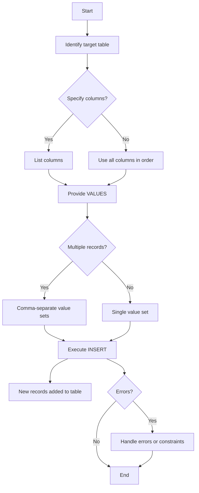

# SQL Insert Into

## Introduction

The `INSERT INTO` statement is one of the fundamental SQL commands used to add new records to a database table. Whether you're creating a user profile, adding a product to your inventory, or logging an event, the `INSERT INTO` statement is your go-to command for adding data to your tables.

In this tutorial, we'll explore the syntax and usage of the `INSERT INTO` statement, providing clear examples and practical applications to help you master this essential SQL operation.

## Basic Syntax

The `INSERT INTO` statement has two primary forms:

### 1. Specifying Both Columns and Values

```sql
INSERT INTO table_name (column1, column2, column3, ...)
VALUES (value1, value2, value3, ...);
```

### 2. Providing Values for All Columns

If you're inserting values for all columns in the table, you can omit the column names:

```sql
INSERT INTO table_name
VALUES (value1, value2, value3, ...);
```

## Basic Examples

Let's look at some examples to understand how `INSERT INTO` works in practice.

Imagine we have a `students` table with the following structure:

```sql
CREATE TABLE students (
    student_id INT PRIMARY KEY,
    first_name VARCHAR(50),
    last_name VARCHAR(50),
    email VARCHAR(100),
    enrollment_date DATE
);
```

### Example 1: Inserting a Single Record (Specifying Columns)

```sql
INSERT INTO students (student_id, first_name, last_name, email, enrollment_date)
VALUES (1, 'John', 'Doe', 'john.doe@example.com', '2023-09-01');
```

**Result:**

| student_id | first_name | last_name | email | enrollment_date |
|------------|------------|-----------|-------|-----------------|
| 1 | John | Doe | john.doe@example.com | 2023-09-01 |

### Example 2: Inserting a Single Record (Without Specifying Columns)

```sql
INSERT INTO students
VALUES (2, 'Jane', 'Smith', 'jane.smith@example.com', '2023-09-02');
```

**Result:**

| student_id | first_name | last_name | email | enrollment_date |
|------------|------------|-----------|-------|-----------------|
| 1 | John | Doe | john.doe@example.com | 2023-09-01 |
| 2 | Jane | Smith | jane.smith@example.com | 2023-09-02 |

### Example 3: Inserting Only Specific Columns

When you don't need to insert values for all columns (assuming the missing columns allow NULL or have default values):

```sql
INSERT INTO students (student_id, first_name, last_name)
VALUES (3, 'Mike', 'Johnson');
```

**Result:**

| student_id | first_name | last_name | email | enrollment_date |
|------------|------------|-----------|-------|-----------------|
| 1 | John | Doe | john.doe@example.com | 2023-09-01 |
| 2 | Jane | Smith | jane.smith@example.com | 2023-09-02 |
| 3 | Mike | Johnson | NULL | NULL |

## Inserting Multiple Records

SQL allows you to insert multiple records in a single statement, which is more efficient than executing multiple individual INSERT statements.

### Syntax for Multiple Insertions

```sql
INSERT INTO table_name (column1, column2, ...)
VALUES 
    (value1_1, value1_2, ...),
    (value2_1, value2_2, ...),
    (value3_1, value3_2, ...);
```

### Example 4: Inserting Multiple Records

```sql
INSERT INTO students (student_id, first_name, last_name, email, enrollment_date)
VALUES 
    (4, 'Sarah', 'Williams', 'sarah.w@example.com', '2023-09-03'),
    (5, 'David', 'Brown', 'david.b@example.com', '2023-09-03'),
    (6, 'Emily', 'Davis', 'emily.d@example.com', '2023-09-04');
```

**Result:**

| student_id | first_name | last_name | email | enrollment_date |
|------------|------------|-----------|-------|-----------------|
| 1 | John | Doe | john.doe@example.com | 2023-09-01 |
| 2 | Jane | Smith | jane.smith@example.com | 2023-09-02 |
| 3 | Mike | Johnson | NULL | NULL |
| 4 | Sarah | Williams | sarah.w@example.com | 2023-09-03 |
| 5 | David | Brown | david.b@example.com | 2023-09-03 |
| 6 | Emily | Davis | emily.d@example.com | 2023-09-04 |

## INSERT INTO with SELECT Statement

You can also use the `INSERT INTO` statement to copy data from one table to another using a SELECT statement.

### Syntax

```sql
INSERT INTO target_table (column1, column2, ...)
SELECT column1, column2, ...
FROM source_table
WHERE condition;
```

### Example 5: Copying Data Between Tables

Imagine we have a `new_students` table with the same structure as our `students` table:

```sql
CREATE TABLE new_students (
    student_id INT PRIMARY KEY,
    first_name VARCHAR(50),
    last_name VARCHAR(50),
    email VARCHAR(100),
    enrollment_date DATE
);
```

We can copy all students who enrolled on a specific date:

```sql
INSERT INTO new_students (student_id, first_name, last_name, email, enrollment_date)
SELECT student_id, first_name, last_name, email, enrollment_date
FROM students
WHERE enrollment_date = '2023-09-03';
```

**Result in new_students table:**

| student_id | first_name | last_name | email | enrollment_date |
|------------|------------|-----------|-------|-----------------|
| 4 | Sarah | Williams | sarah.w@example.com | 2023-09-03 |
| 5 | David | Brown | david.b@example.com | 2023-09-03 |

## Handling Duplicates

When inserting data into a table with a primary key or unique constraint, you might encounter duplicate key errors. Different database systems offer solutions for this situation.

### MySQL: INSERT IGNORE

In MySQL, you can use `INSERT IGNORE` to skip records that would cause duplicate key errors:

```sql
INSERT IGNORE INTO students (student_id, first_name, last_name)
VALUES (1, 'John', 'Updated'); -- This will be ignored since student_id 1 already exists
```

### MySQL and PostgreSQL: ON DUPLICATE KEY UPDATE / ON CONFLICT

To update existing records when a duplicate key is found:

**MySQL:**
```sql
INSERT INTO students (student_id, first_name, last_name)
VALUES (1, 'John', 'Updated')
ON DUPLICATE KEY UPDATE first_name = 'John', last_name = 'Updated';
```

**PostgreSQL:**
```sql
INSERT INTO students (student_id, first_name, last_name)
VALUES (1, 'John', 'Updated')
ON CONFLICT (student_id) 
DO UPDATE SET first_name = 'John', last_name = 'Updated';
```

## Visual Flow of INSERT INTO Statement



## Real-World Application Examples

### Example 6: E-commerce Product Insertion

In an e-commerce application, you might need to insert a new product into the inventory:

```sql
-- Create products table
CREATE TABLE products (
    product_id INT PRIMARY KEY,
    product_name VARCHAR(100),
    category VARCHAR(50),
    price DECIMAL(10, 2),
    stock_quantity INT,
    added_date TIMESTAMP DEFAULT CURRENT_TIMESTAMP
);

-- Insert a new product
INSERT INTO products (product_id, product_name, category, price, stock_quantity)
VALUES (1001, 'Wireless Headphones', 'Electronics', 79.99, 45);
```

### Example 7: User Registration System

When a user signs up for your application, you would insert their information into a users table:

```sql
-- Create users table
CREATE TABLE users (
    user_id INT AUTO_INCREMENT PRIMARY KEY,
    username VARCHAR(50) UNIQUE,
    email VARCHAR(100) UNIQUE,
    password_hash VARCHAR(128),
    registration_date TIMESTAMP DEFAULT CURRENT_TIMESTAMP,
    last_login TIMESTAMP NULL
);

-- Insert a new user
INSERT INTO users (username, email, password_hash)
VALUES ('johndoe', 'john.doe@example.com', 'hashed_password_here');
```

### Example 8: Event Logging System

In an application that tracks events or activity:

```sql
-- Create logs table
CREATE TABLE activity_logs (
    log_id INT AUTO_INCREMENT PRIMARY KEY,
    user_id INT,
    action_type VARCHAR(50),
    action_description TEXT,
    ip_address VARCHAR(45),
    timestamp TIMESTAMP DEFAULT CURRENT_TIMESTAMP
);

-- Log a user action
INSERT INTO activity_logs (user_id, action_type, action_description, ip_address)
VALUES (42, 'LOGIN', 'User logged in successfully', '192.168.1.1');
```

## Best Practices

1. **Always specify columns**: Even if you're inserting values for all columns, explicitly listing the column names makes your code more maintainable and less prone to errors when table structure changes.

2. **Use parameterized queries**: When integrating SQL with programming languages, use parameterized queries or prepared statements to prevent SQL injection:

   ```javascript
   // Example in Node.js with MySQL
   const sql = "INSERT INTO users (username, email) VALUES (?, ?)";
   connection.query(sql, ['johndoe', 'john@example.com'], function (err, result) {
       if (err) throw err;
       console.log("1 record inserted");
   });
   ```

3. **Validate data before insertion**: Ensure that the data you're inserting meets your application's requirements before attempting to insert it into the database.

4. **Use transactions for multiple related inserts**: When inserting related data across multiple tables, use transactions to ensure data consistency.

5. **Handle constraints properly**: Be prepared to handle constraint violations (unique, foreign key, check constraints) in your application code.

## Common Errors and Solutions

1. **Duplicate key error**: Occurs when trying to insert a record with a primary key or unique value that already exists.
   - Solution: Use `INSERT IGNORE` or `ON DUPLICATE KEY UPDATE` (MySQL) / `ON CONFLICT` (PostgreSQL)

2. **Column count doesn't match value count**: Occurs when the number of columns and values don't match.
   - Solution: Ensure you have the same number of values as columns in your INSERT statement.

3. **Data type mismatch**: Occurs when trying to insert a value of the wrong data type.
   - Solution: Ensure your values match the expected data types for each column.

4. **NOT NULL constraint violation**: Occurs when not providing a value for a column that doesn't accept NULL values.
   - Solution: Either provide values for all required columns or define default values in your table schema.

## Summary

The `INSERT INTO` statement is a fundamental SQL command for adding new data to database tables. In this tutorial, we've covered:

- Basic syntax for inserting single and multiple records
- Different ways to specify columns and values
- Copying data between tables using INSERT INTO with SELECT
- Handling duplicate key errors
- Real-world application examples
- Best practices and common errors

Understanding how to correctly use the `INSERT INTO` statement is essential for any developer working with databases. With the knowledge gained from this tutorial, you should be well-equipped to add data to your database tables efficiently and effectively.

## Exercises

1. Create a `courses` table with columns for `course_id`, `course_name`, `department`, `credits`, and `instructor`. Insert at least 5 courses into this table.

2. Create a `enrollments` table that links students to courses, with columns for `enrollment_id`, `student_id`, `course_id`, and `enrollment_date`. Insert records showing several students enrolled in different courses.

3. Write a query that inserts into a `department_stats` table the count of students enrolled in each department's courses.

4. Practice handling duplicate keys by writing an INSERT statement that either ignores duplicates or updates existing records.

5. Create a backup copy of the `students` table by creating a new table and using INSERT INTO with SELECT to copy the data.

## Additional Resources

- [W3Schools SQL INSERT INTO Tutorial](https://www.w3schools.com/sql/sql_insert.asp)
- [MySQL Documentation on INSERT Statement](https://dev.mysql.com/doc/refman/8.0/en/insert.html)
- [PostgreSQL Documentation on INSERT](https://www.postgresql.org/docs/current/sql-insert.html)
- [SQL Constraints](https://www.w3schools.com/sql/sql_constraints.asp) - to understand how constraints affect INSERT operations