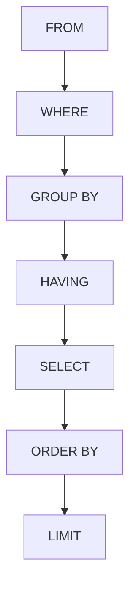

# SQL SELECT Query

The SELECT statement is one of the most frequently used commands in SQL (Structured Query Language). It allows you to retrieve data from one or more tables in a database, making it the foundation of data retrieval operations.

## Introduction to SELECT

At its core, the SELECT statement allows you to:
- Fetch specific columns or all columns from a table
- Filter data based on conditions
- Sort the results in a specific order
- Group and aggregate data
- Join multiple tables together

Whether you need to find a single record or analyze millions of rows, the SELECT query is your starting point for working with stored data.

## Basic Syntax

The most basic form of a SELECT query is:

```sql
SELECT column1, column2, ...
FROM table_name;
```

Let's break down the components:
- `SELECT`: The keyword that begins the query
- `column1, column2, ...`: The names of the columns you want to retrieve
- `FROM`: Keyword that specifies which table to query
- `table_name`: The name of the table containing your data

## Retrieving All Columns

To retrieve all columns from a table, you can use the asterisk (*) wildcard:

```sql
SELECT *
FROM employees;
```

**Example Input:** Table `employees` contains:

| employee_id | first_name | last_name | hire_date  | salary |
|-------------|------------|-----------|------------|--------|
| 101         | John       | Smith     | 2020-05-15 | 55000  |
| 102         | Maria      | Garcia    | 2019-11-20 | 62000  |
| 103         | Ahmed      | Hassan    | 2021-02-10 | 51000  |

**Example Output:** The query returns all rows and columns:

| employee_id | first_name | last_name | hire_date  | salary |
|-------------|------------|-----------|------------|--------|
| 101         | John       | Smith     | 2020-05-15 | 55000  |
| 102         | Maria      | Garcia    | 2019-11-20 | 62000  |
| 103         | Ahmed      | Hassan    | 2021-02-10 | 51000  |

> **Note:** While using `SELECT *` is convenient for exploration, it's generally better practice to explicitly list the columns you need in production code. This improves readability and performance.

## Selecting Specific Columns

To retrieve only certain columns, list them after the SELECT keyword:

```sql
SELECT first_name, last_name, salary
FROM employees;
```

**Example Output:**

| first_name | last_name | salary |
|------------|-----------|--------|
| John       | Smith     | 55000  |
| Maria      | Garcia    | 62000  |
| Ahmed      | Hassan    | 51000  |

## Filtering Data with WHERE

The WHERE clause allows you to filter results based on specific conditions:

```sql
SELECT first_name, last_name, salary
FROM employees
WHERE salary > 55000;
```

**Example Output:**

| first_name | last_name | salary |
|------------|-----------|--------|
| Maria      | Garcia    | 62000  |

The WHERE clause supports various comparison operators:
- `=` (equal to)
- `>` (greater than)
- `<` (less than)
- `>=` (greater than or equal to)
- `<=` (less than or equal to)
- `<>` or `!=` (not equal to)

## Using Logical Operators

Combine multiple conditions using logical operators:

### AND Operator
Returns rows that satisfy all conditions:

```sql
SELECT first_name, last_name, hire_date
FROM employees
WHERE salary > 50000 AND hire_date < '2021-01-01';
```

**Example Output:**

| first_name | last_name | hire_date  |
|------------|-----------|------------|
| John       | Smith     | 2020-05-15 |
| Maria      | Garcia    | 2019-11-20 |

### OR Operator
Returns rows that satisfy at least one condition:

```sql
SELECT first_name, last_name, salary
FROM employees
WHERE last_name = 'Smith' OR salary > 60000;
```

**Example Output:**

| first_name | last_name | salary |
|------------|-----------|--------|
| John       | Smith     | 55000  |
| Maria      | Garcia    | 62000  |

### NOT Operator
Negates a condition:

```sql
SELECT first_name, last_name
FROM employees
WHERE NOT last_name = 'Smith';
```

**Example Output:**

| first_name | last_name |
|------------|-----------|
| Maria      | Garcia    |
| Ahmed      | Hassan    |

## Sorting Results with ORDER BY

The ORDER BY clause sorts your results in ascending (ASC) or descending (DESC) order:

```sql
SELECT first_name, last_name, salary
FROM employees
ORDER BY salary DESC;
```

**Example Output:**

| first_name | last_name | salary |
|------------|-----------|--------|
| Maria      | Garcia    | 62000  |
| John       | Smith     | 55000  |
| Ahmed      | Hassan    | 51000  |

You can sort by multiple columns:

```sql
SELECT first_name, last_name, salary
FROM employees
ORDER BY salary DESC, last_name ASC;
```

## DISTINCT Keyword

To eliminate duplicate values, use the DISTINCT keyword:

```sql
SELECT DISTINCT department_id
FROM employees;
```

If the employees table had:

| employee_id | first_name | last_name | department_id |
|-------------|------------|-----------|---------------|
| 101         | John       | Smith     | 1             |
| 102         | Maria      | Garcia    | 2             |
| 103         | Ahmed      | Hassan    | 1             |

The query would return:

| department_id |
|---------------|
| 1             |
| 2             |

## Limiting Results

Different database systems offer ways to limit the number of rows returned:

### MySQL/PostgreSQL:
```sql
SELECT first_name, last_name
FROM employees
LIMIT 2;
```

### SQL Server:
```sql
SELECT TOP 2 first_name, last_name
FROM employees;
```

### Oracle:
```sql
SELECT first_name, last_name
FROM employees
WHERE ROWNUM <= 2;
```

**Example Output** (for any of the above):

| first_name | last_name |
|------------|-----------|
| John       | Smith     |
| Maria      | Garcia    |

## Using Wildcards with LIKE

The LIKE operator allows pattern matching searches:

```sql
SELECT first_name, last_name
FROM employees
WHERE last_name LIKE 'S%';
```

This finds last names that start with 'S'.

**Example Output:**

| first_name | last_name |
|------------|-----------|
| John       | Smith     |

Common wildcards:
- `%` - Represents zero, one, or multiple characters
- `_` - Represents a single character

Examples:
- `'S%'` - Starts with 'S'
- `'%son'` - Ends with 'son'
- `'%ith%'` - Contains 'ith'
- `'_mith'` - Any 5-letter name ending with 'mith'

## Working with NULL Values

NULL represents missing or unknown data. To check for NULL values:

```sql
SELECT first_name, last_name
FROM employees
WHERE manager_id IS NULL;
```

To find non-NULL values:

```sql
SELECT first_name, last_name
FROM employees
WHERE manager_id IS NOT NULL;
```

## Aggregate Functions

SQL provides functions to perform calculations on data:

```sql
SELECT 
    COUNT(*) AS total_employees,
    AVG(salary) AS average_salary,
    MAX(salary) AS highest_salary,
    MIN(salary) AS lowest_salary,
    SUM(salary) AS salary_total
FROM employees;
```

**Example Output:**

| total_employees | average_salary | highest_salary | lowest_salary | salary_total |
|-----------------|----------------|----------------|---------------|--------------|
| 3               | 56000          | 62000          | 51000         | 168000       |

Common aggregate functions:
- `COUNT()` - Counts rows
- `AVG()` - Calculates average
- `SUM()` - Calculates sum
- `MIN()` - Finds minimum value
- `MAX()` - Finds maximum value

## Grouping Data with GROUP BY

Group rows that have the same values:

```sql
SELECT department_id, COUNT(*) AS employee_count
FROM employees
GROUP BY department_id;
```

If the data looked like:

| employee_id | first_name | department_id |
|-------------|------------|---------------|
| 101         | John       | 1             |
| 102         | Maria      | 2             |
| 103         | Ahmed      | 1             |
| 104         | Sara       | 3             |
| 105         | James      | 2             |

The output would be:

| department_id | employee_count |
|---------------|----------------|
| 1             | 2              |
| 2             | 2              |
| 3             | 1              |

## Filtering Groups with HAVING

The HAVING clause filters groups, similar to how WHERE filters rows:

```sql
SELECT department_id, COUNT(*) AS employee_count
FROM employees
GROUP BY department_id
HAVING COUNT(*) > 1;
```

**Example Output:**

| department_id | employee_count |
|---------------|----------------|
| 1             | 2              |
| 2             | 2              |

## Real-World Applications

### Scenario 1: Customer Analysis
Finding customers who have made purchases above a certain amount:

```sql
SELECT 
    c.customer_id,
    c.first_name,
    c.last_name,
    SUM(o.total_amount) AS total_spent
FROM 
    customers c
JOIN 
    orders o ON c.customer_id = o.customer_id
WHERE 
    o.order_date >= '2023-01-01'
GROUP BY 
    c.customer_id, c.first_name, c.last_name
HAVING 
    SUM(o.total_amount) > 1000
ORDER BY 
    total_spent DESC;
```

### Scenario 2: Inventory Management
Identifying products that are low in stock:

```sql
SELECT 
    product_name,
    category,
    quantity_in_stock,
    reorder_level
FROM 
    products
WHERE 
    quantity_in_stock <= reorder_level
ORDER BY 
    quantity_in_stock ASC;
```

### Scenario 3: Sales Performance
Analyzing monthly sales by region:

```sql
SELECT 
    r.region_name,
    EXTRACT(MONTH FROM o.order_date) AS month,
    EXTRACT(YEAR FROM o.order_date) AS year,
    SUM(o.total_amount) AS monthly_sales
FROM 
    orders o
JOIN 
    customers c ON o.customer_id = c.customer_id
JOIN 
    regions r ON c.region_id = r.region_id
WHERE 
    o.order_date BETWEEN '2023-01-01' AND '2023-12-31'
GROUP BY 
    r.region_name, 
    EXTRACT(MONTH FROM o.order_date),
    EXTRACT(YEAR FROM o.order_date)
ORDER BY 
    r.region_name, year, month;
```

## Query Execution Flow

Understanding the logical order of SQL query execution helps in writing and troubleshooting queries:



Remember that SQL executes in a different order than it's written:
1. FROM clause determines which table to query
2. WHERE filters rows before any grouping
3. GROUP BY creates groups
4. HAVING filters groups
5. SELECT determines which columns to include
6. ORDER BY sorts the results
7. LIMIT restricts the number of rows returned

## Summary

The SQL SELECT query is the foundation of data retrieval in databases. We've covered:

- Basic syntax for retrieving data
- Filtering with WHERE clauses
- Sorting with ORDER BY
- Eliminating duplicates with DISTINCT
- Using pattern matching with LIKE
- Working with NULL values
- Calculating aggregates with functions like COUNT, SUM, AVG
- Grouping data with GROUP BY
- Filtering groups with HAVING
- Real-world applications and logical query execution

By mastering SELECT queries, you gain the ability to extract precisely the information you need from databases, which is an essential skill for any developer or data analyst.

## Exercises

1. Write a SELECT query to retrieve the first name, last name, and email of all customers.
2. Create a query that finds all products with a price between $10 and $20.
3. Write a query to find the top 5 most expensive products.
4. Create a query that counts how many employees work in each department.
5. Write a query to find all customers who have not placed an order in the last 3 months.

## Additional Resources

- [SQL SELECT Documentation by W3Schools](https://www.w3schools.com/sql/sql_select.asp)
- [PostgreSQL SELECT Documentation](https://www.postgresql.org/docs/current/sql-select.html)
- [MySQL SELECT Statement Reference](https://dev.mysql.com/doc/refman/8.0/en/select.html)
- [SQL Fiddle](http://sqlfiddle.com/) - Practice writing and testing SQL queries online
- [SQLZOO](https://sqlzoo.net/) - Interactive SQL tutorials and exercises