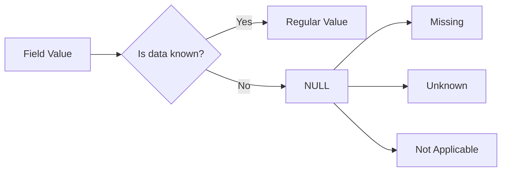

# SQL NULL Values

## Introduction

In SQL databases, a `NULL` value represents missing or unknown data. Unlike other values, `NULL` is not zero, an empty string, or a space - it's the absence of any value. Understanding how to work with `NULL` values is crucial for effective database management and query writing.

Think of `NULL` as a placeholder that says, "This information is not available." For example, if a customer hasn't provided their phone number, that field would contain a `NULL` value rather than being empty or containing a default value.

## Understanding NULL Values

### What NULL Represents

- `NULL` indicates **missing**, **unknown**, or **inapplicable** data
- `NULL` is **not** equivalent to zero or an empty string
- `NULL` is **not** equal to another `NULL` (two unknowns aren't necessarily the same)



### How NULL Behaves

The most important thing to understand about `NULL` values is that they behave differently in comparisons:

- `NULL` is not equal to anything, including another `NULL`
- `NULL` is not greater than or less than any value
- Any arithmetic operation involving `NULL` results in `NULL`
- Any comparison with `NULL` using standard operators (`=`, `<`, `>`) yields `UNKNOWN` (not `TRUE` or `FALSE`)

## Testing for NULL Values

Since `NULL` cannot be compared using the equality operator (`=`), SQL provides special operators to test for `NULL` values.

### Using IS NULL and IS NOT NULL

To check if a column contains a `NULL` value:

```sql
SELECT column_name, another_column
FROM table_name
WHERE column_name IS NULL;
```

To find rows where a column is not `NULL`:

```sql
SELECT column_name, another_column
FROM table_name
WHERE column_name IS NOT NULL;
```

### Example: Finding Missing Contact Information

Let's say we have a `customers` table with contact information:

```sql
-- Creating a sample customers table
CREATE TABLE customers (
    customer_id INT PRIMARY KEY,
    first_name VARCHAR(50),
    last_name VARCHAR(50),
    email VARCHAR(100),
    phone VARCHAR(20)
);

-- Inserting sample data
INSERT INTO customers VALUES
(1, 'John', 'Smith', 'john@example.com', '555-1234'),
(2, 'Sarah', 'Johnson', 'sarah@example.com', NULL),
(3, 'Michael', 'Brown', NULL, '555-5678'),
(4, 'Emily', 'Davis', 'emily@example.com', '555-9012'),
(5, 'David', 'Wilson', NULL, NULL);
```

Now, to find customers with missing phone numbers:

```sql
SELECT customer_id, first_name, last_name
FROM customers
WHERE phone IS NULL;
```

**Output:**
```
customer_id | first_name | last_name
------------|------------|----------
2           | Sarah      | Johnson
5           | David      | Wilson
```

To find customers with both email and phone information:

```sql
SELECT customer_id, first_name, last_name
FROM customers
WHERE email IS NOT NULL AND phone IS NOT NULL;
```

**Output:**
```
customer_id | first_name | last_name
------------|------------|----------
1           | John       | Smith
4           | Emily      | Davis
```

## NULL Values in Calculations

### NULL in Arithmetic Operations

When a `NULL` value is used in calculations, the result is typically `NULL`:

```sql
-- Creating a sample orders table
CREATE TABLE orders (
    order_id INT PRIMARY KEY,
    product_name VARCHAR(100),
    quantity INT,
    unit_price DECIMAL(10,2),
    discount DECIMAL(10,2)
);

-- Inserting sample data
INSERT INTO orders VALUES
(101, 'Laptop', 1, 999.99, 100.00),
(102, 'Mouse', 2, 24.99, NULL),
(103, 'Keyboard', 1, 49.99, 5.00),
(104, 'Monitor', NULL, 299.99, 30.00);
```

If we try to calculate the total price with discount:

```sql
SELECT 
    order_id, 
    product_name,
    quantity,
    unit_price,
    discount,
    (quantity * unit_price) - discount AS total_price
FROM orders;
```

**Output:**
```
order_id | product_name | quantity | unit_price | discount | total_price
---------|--------------|----------|------------|----------|------------
101      | Laptop       | 1        | 999.99     | 100.00   | 899.99
102      | Mouse        | 2        | 24.99      | NULL     | NULL
103      | Keyboard     | 1        | 49.99      | 5.00     | 44.99
104      | Monitor      | NULL     | 299.99     | 30.00    | NULL
```

Notice that when either `quantity` is `NULL` or `discount` is `NULL`, the calculated `total_price` is also `NULL`.

### Using COALESCE to Handle NULL in Calculations

The `COALESCE` function returns the first non-NULL value in a list, making it perfect for providing default values:

```sql
SELECT 
    order_id, 
    product_name,
    COALESCE(quantity, 0) AS actual_quantity,
    unit_price,
    COALESCE(discount, 0) AS actual_discount,
    (COALESCE(quantity, 0) * unit_price) - COALESCE(discount, 0) AS total_price
FROM orders;
```

**Output:**
```
order_id | product_name | actual_quantity | unit_price | actual_discount | total_price
---------|--------------|-----------------|------------|-----------------|------------
101      | Laptop       | 1               | 999.99     | 100.00          | 899.99
102      | Mouse        | 2               | 24.99      | 0.00            | 49.98
103      | Keyboard     | 1               | 49.99      | 5.00            | 44.99
104      | Monitor      | 0               | 299.99     | 30.00           | -30.00
```

## NULL in Aggregate Functions

Most aggregate functions in SQL ignore `NULL` values, which is important to understand when analyzing data.

### Example: Average Calculation

Let's calculate the average discount:

```sql
-- Without handling NULL values
SELECT AVG(discount) AS average_discount
FROM orders;
```

**Output:**
```
average_discount
-----------------
45.00
```

This average only includes the non-NULL discount values (100.00, 5.00, and 30.00).

### COUNT Behavior with NULL

The `COUNT(*)` function counts all rows, while `COUNT(column_name)` counts only non-NULL values in that column:

```sql
-- Count all rows
SELECT COUNT(*) AS total_orders FROM orders;

-- Count orders with a known quantity
SELECT COUNT(quantity) AS orders_with_quantity FROM orders;
```

**Output:**
```
total_orders
------------
4

orders_with_quantity
--------------------
3
```

## Functions for Handling NULL Values

SQL provides several functions to handle `NULL` values in your queries:

### COALESCE Function

Returns the first non-NULL value in a list:

```sql
SELECT 
    product_name,
    COALESCE(discount, 0) AS discount_to_apply
FROM orders;
```

**Output:**
```
product_name | discount_to_apply
-------------|------------------
Laptop       | 100.00
Mouse        | 0.00
Keyboard     | 5.00
Monitor      | 30.00
```

### NULLIF Function

Returns `NULL` if two expressions are equal, otherwise returns the first expression:

```sql
-- Creating a sample division example
CREATE TABLE math_operations (
    value1 INT,
    value2 INT
);

INSERT INTO math_operations VALUES
(10, 2),
(15, 3),
(8, 0),  -- Division by zero problem
(20, 5);

-- Safe division using NULLIF to avoid division by zero
SELECT 
    value1, 
    value2, 
    value1 / NULLIF(value2, 0) AS safe_division
FROM math_operations;
```

**Output:**
```
value1 | value2 | safe_division
-------|--------|---------------
10     | 2      | 5
15     | 3      | 5
8      | 0      | NULL
20     | 5      | 4
```

### IFNULL/NVL Function

Some database systems provide `IFNULL` (MySQL) or `NVL` (Oracle) functions that work like `COALESCE` but with only two parameters:

```sql
-- MySQL syntax
SELECT 
    product_name,
    IFNULL(discount, 0) AS discount_to_apply
FROM orders;

-- Oracle syntax would be:
-- SELECT product_name, NVL(discount, 0) AS discount_to_apply FROM orders;
```

## NULL in WHERE Clauses and Joins

### Impact on Filtering Data

Remember that `NULL` values require special treatment in `WHERE` clauses:

```sql
-- This will NOT find rows where discount is NULL
SELECT * FROM orders WHERE discount = NULL;  -- Incorrect approach

-- This is the correct way to find NULL values
SELECT * FROM orders WHERE discount IS NULL;
```

### NULL Values in Joins

`NULL` values can complicate joins between tables. For example, if you join tables on columns that contain `NULL` values, those rows might not appear in the result set with an inner join:

```sql
-- Creating a related products table
CREATE TABLE product_details (
    product_name VARCHAR(100) PRIMARY KEY,
    category VARCHAR(50),
    in_stock BOOLEAN
);

INSERT INTO product_details VALUES
('Laptop', 'Electronics', TRUE),
('Keyboard', 'Accessories', TRUE),
('Headphones', 'Audio', FALSE);
-- Note: Mouse and Monitor are missing

-- Joining with the orders table
SELECT 
    o.order_id,
    o.product_name,
    p.category
FROM orders o
INNER JOIN product_details p ON o.product_name = p.product_name;
```

**Output:**
```
order_id | product_name | category
---------|--------------|----------
101      | Laptop       | Electronics
103      | Keyboard     | Accessories
```

Notice that Mouse and Monitor orders don't appear in the results because they don't have matching entries in the `product_details` table.

To include all orders, you would use a `LEFT JOIN`:

```sql
SELECT 
    o.order_id,
    o.product_name,
    p.category
FROM orders o
LEFT JOIN product_details p ON o.product_name = p.product_name;
```

**Output:**
```
order_id | product_name | category
---------|--------------|----------
101      | Laptop       | Electronics
102      | Mouse        | NULL
103      | Keyboard     | Accessories
104      | Monitor      | NULL
```

## Best Practices for Handling NULL Values

1. **Decide when to allow NULLs**: Consider which columns truly need to allow `NULL` values. For columns where data should always be present, use constraints like `NOT NULL`.

2. **Use DEFAULT values when appropriate**: Instead of `NULL`, sometimes a default value makes more sense:
   ```sql
   CREATE TABLE products (
       product_id INT PRIMARY KEY,
       product_name VARCHAR(100) NOT NULL,
       description VARCHAR(500) DEFAULT 'No description available',
       in_stock BOOLEAN DEFAULT TRUE,
       discount DECIMAL(10,2) DEFAULT 0.00
   );
   ```

3. **Be consistent in your approach**: Either use `NULL` to represent missing data or use specific default values, but try to be consistent across your database design.

4. **Always use IS NULL/IS NOT NULL**: Never use `= NULL` or `!= NULL` for comparisons.

5. **Handle NULLs in calculations**: Use `COALESCE` or similar functions to provide default values in calculations.

6. **Consider the impact of NULLs on indexes**: Indexing columns with many `NULL` values may impact performance.

## Real-World Application: Customer Analysis

Let's wrap up with a practical example of analyzing customer demographics where some data might be missing:

```sql
-- Creating a customers demographics table
CREATE TABLE customer_demographics (
    customer_id INT PRIMARY KEY,
    age INT,
    income DECIMAL(10,2),
    education_level VARCHAR(50),
    region VARCHAR(50)
);

INSERT INTO customer_demographics VALUES
(1, 35, 75000.00, 'Bachelor', 'North'),
(2, NULL, 82000.00, 'Master', 'South'),
(3, 42, NULL, 'PhD', 'West'),
(4, 29, 62000.00, NULL, 'East'),
(5, 51, 95000.00, 'Bachelor', NULL);

-- Analyzing average income by education level, handling NULL values
SELECT 
    COALESCE(education_level, 'Unknown') AS education,
    COUNT(*) AS customer_count,
    AVG(income) AS average_income,
    MIN(age) AS youngest,
    MAX(age) AS oldest
FROM customer_demographics
GROUP BY education_level
ORDER BY average_income DESC NULLS LAST;
```

**Output:**
```
education | customer_count | average_income | youngest | oldest
----------|----------------|----------------|----------|--------
PhD       | 1              | NULL           | 42       | 42
Master    | 1              | 82000.00       | NULL     | NULL
Bachelor  | 2              | 85000.00       | 35       | 51
Unknown   | 1              | 62000.00       | 29       | 29
```

## Summary

`NULL` values in SQL represent missing or unknown data and have special behavior that distinguishes them from regular values. Key points to remember:

- `NULL` is not equal to anything, including another `NULL`
- Use `IS NULL` and `IS NOT NULL` to test for `NULL` values
- Arithmetic operations with `NULL` result in `NULL`
- Use functions like `COALESCE` to handle `NULL` values in calculations
- Most aggregate functions ignore `NULL` values
- `NULL` values can affect joins and filtering in unexpected ways
- Be thoughtful about when to allow `NULL` values in your database design

## Exercises

1. Write a query to find all products in the `orders` table where either quantity or discount is unknown.

2. Modify the calculation for `total_price` to apply a 10% additional discount when the regular discount is `NULL`.

3. Write a query that counts how many customers have missing information in each column of the `customer_demographics` table.

4. Create a report showing the percentage of complete vs. incomplete data for each column in the `customer_demographics` table.

## Additional Resources

- [SQL NULL Functions](https://www.w3schools.com/sql/sql_isnull.asp) - W3Schools
- [SQL COALESCE Function](https://www.postgresql.org/docs/current/functions-conditional.html#FUNCTIONS-COALESCE-NVL-IFNULL) - PostgreSQL Documentation
- [SQL Null Values](https://dev.mysql.com/doc/refman/8.0/en/working-with-null.html) - MySQL Documentation