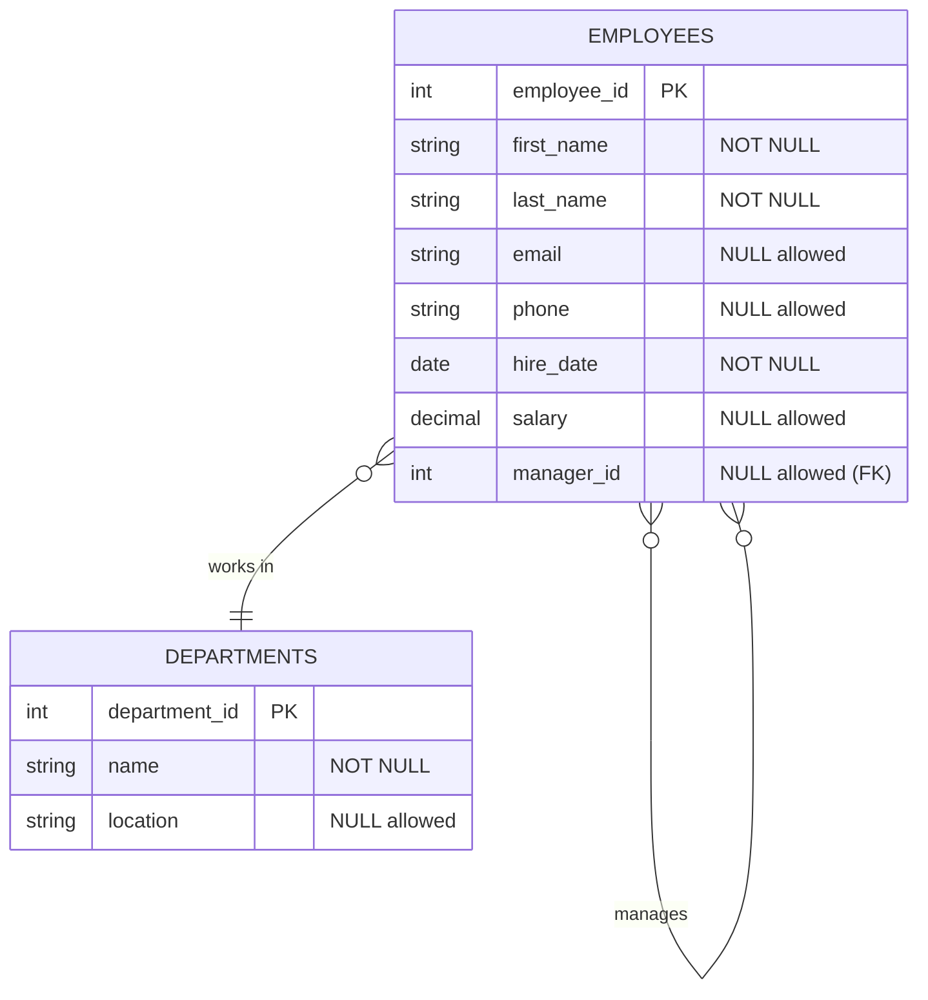

# SQL IS NULL

## Introduction

When working with databases, you'll frequently encounter situations where data is missing or undefined. In SQL, these missing values are represented by a special marker called `NULL`. Understanding how to work with `NULL` values is crucial for effective database management and query writing.

Unlike other values (such as empty strings, zero, or false), `NULL` represents the absence of any value. It's a special marker that indicates that data is missing, unknown, or not applicable. This unique characteristic of `NULL` requires special operators and considerations when writing SQL queries.

In this tutorial, we'll explore:
- What `NULL` values are
- How to check for `NULL` values
- How to filter data based on `NULL` and non-`NULL` values
- Common functions for handling `NULL` values
- Best practices when working with `NULL` in real-world applications

## Understanding NULL Values

### What is NULL?

`NULL` is not a value in the traditional sense—it's a marker that represents the absence of a value. This is an important distinction because:

- `NULL` is not equal to zero
- `NULL` is not equal to an empty string (`''`)
- `NULL` is not equal to false
- `NULL` is not even equal to another `NULL`

In SQL, `NULL` represents an unknown or missing value, which means it doesn't follow the normal rules of comparison that other values do.

### NULL in Database Tables

Let's look at an example to understand how `NULL` values appear in a database:

```sql
CREATE TABLE employees (
    employee_id INT PRIMARY KEY,
    first_name VARCHAR(50) NOT NULL,
    last_name VARCHAR(50) NOT NULL,
    email VARCHAR(100),
    phone VARCHAR(20),
    hire_date DATE NOT NULL,
    salary DECIMAL(10, 2),
    manager_id INT
);

INSERT INTO employees VALUES
(1, 'John', 'Smith', 'john.smith@example.com', '555-1234', '2022-01-15', 60000, NULL),
(2, 'Sarah', 'Johnson', 'sarah.j@example.com', NULL, '2022-03-10', 65000, 1),
(3, 'Michael', 'Williams', NULL, '555-9876', '2022-02-20', NULL, 1);
```

In this example:
- John doesn't have a manager (manager_id is `NULL`)
- Sarah doesn't have a phone number (phone is `NULL`)
- Michael doesn't have an email address (email is `NULL`) or a defined salary (salary is `NULL`)

## Checking for NULL Values

### The IS NULL Operator

To check if a value is `NULL`, you cannot use the equals operator (`=`). This is because `NULL` represents an unknown value, and comparing anything with an unknown value results in an unknown result.

Instead, SQL provides the `IS NULL` operator specifically for this purpose:

```sql
SELECT employee_id, first_name, last_name
FROM employees
WHERE email IS NULL;
```

**Output:**
```
employee_id | first_name | last_name
------------|------------|-----------
3           | Michael    | Williams
```

### The IS NOT NULL Operator

Similarly, to find records where a column has a value (is not `NULL`), use the `IS NOT NULL` operator:

```sql
SELECT employee_id, first_name, last_name
FROM employees
WHERE phone IS NOT NULL;
```

**Output:**
```
employee_id | first_name | last_name
------------|------------|-----------
1           | John       | Smith
3           | Michael    | Williams
```

### Common Mistake: Using = NULL

A common mistake is trying to use the equals operator with `NULL`:

```sql
-- INCORRECT way to check for NULL values
SELECT employee_id, first_name, last_name
FROM employees
WHERE email = NULL;
```

This query will not return any results, even if there are records with `NULL` email values. In SQL, comparing anything to `NULL` using `=` results in an unknown result, not true or false.

## Working with NULL in Conditions

### NULL and Boolean Logic

When `NULL` values are involved in boolean expressions, they follow a three-valued logic: True, False, and Unknown. Any comparison with `NULL` results in an unknown value, which is treated as false in WHERE clauses.

This behavior affects how conditions with `NULL` values are evaluated:

```sql
-- Find employees with missing phone OR missing email
SELECT employee_id, first_name, last_name
FROM employees
WHERE phone IS NULL OR email IS NULL;
```

**Output:**
```
employee_id | first_name | last_name
------------|------------|-----------
2           | Sarah      | Johnson
3           | Michael    | Williams
```

### NULL in AND/OR Conditions

Using `NULL` with AND/OR requires careful consideration:

```sql
-- Find employees who have a defined salary above 60000
SELECT employee_id, first_name, last_name, salary
FROM employees
WHERE salary > 60000;
```

**Output:**
```
employee_id | first_name | last_name | salary
------------|------------|-----------|-------
2           | Sarah      | Johnson   | 65000
```

Note that Michael (who has a `NULL` salary) is not included, even though we don't know if his salary is above 60000 or not. This is because the comparison results in an unknown value, which is treated as false in the WHERE clause.

## Functions for Handling NULL Values

### COALESCE Function

The `COALESCE` function returns the first non-NULL value from a list of expressions. It's useful for providing default values when data is missing:

```sql
SELECT 
    employee_id,
    first_name,
    last_name,
    COALESCE(email, 'No email provided') AS email,
    COALESCE(phone, 'No phone provided') AS phone,
    COALESCE(salary, 0) AS salary
FROM employees;
```

**Output:**
```
employee_id | first_name | last_name | email                  | phone        | salary
------------|------------|-----------|------------------------|--------------|-------
1           | John       | Smith     | john.smith@example.com | 555-1234     | 60000
2           | Sarah      | Johnson   | sarah.j@example.com    | No phone...  | 65000
3           | Michael    | Williams  | No email provided      | 555-9876     | 0
```

### IFNULL/NULLIF Functions (Database Dependent)

Many SQL implementations provide additional functions for working with `NULL` values:

**IFNULL** (MySQL, SQLite):

```sql
-- MySQL syntax
SELECT 
    employee_id,
    first_name,
    IFNULL(salary, 0) AS adjusted_salary
FROM employees;
```

**NVL** (Oracle):

```sql
-- Oracle syntax
SELECT 
    employee_id,
    first_name,
    NVL(salary, 0) AS adjusted_salary
FROM employees;
```

**NULLIF** (reverses the process - returns NULL if two expressions are equal):

```sql
SELECT employee_id, NULLIF(manager_id, employee_id) AS different_manager
FROM employees;
```

This would return `NULL` if an employee is their own manager (manager_id = employee_id).

## Counting and Grouping with NULL Values

### COUNT and NULL

The `COUNT(*)` function counts all rows, regardless of `NULL` values, while `COUNT(column)` counts only non-`NULL` values in that column:

```sql
-- Count all employees
SELECT COUNT(*) AS total_employees FROM employees;

-- Count employees with a phone number
SELECT COUNT(phone) AS employees_with_phone FROM employees;
```

**Output:**
```
total_employees
---------------
3

employees_with_phone
--------------------
2
```

### GROUP BY and NULL

When grouping data, `NULL` values are treated as a single group:

```sql
-- Group employees by manager_id
SELECT 
    manager_id, 
    COUNT(*) AS employee_count
FROM employees
GROUP BY manager_id;
```

**Output:**
```
manager_id | employee_count
-----------|---------------
NULL       | 1
1          | 2
```

## Practical Examples

### Example 1: Finding Incomplete Records

Identifying records with missing values is important for data quality assessment:

```sql
-- Find employees with any missing contact information
SELECT 
    employee_id,
    first_name,
    last_name
FROM employees
WHERE email IS NULL OR phone IS NULL;
```

**Output:**
```
employee_id | first_name | last_name
------------|------------|-----------
2           | Sarah      | Johnson
3           | Michael    | Williams
```

### Example 2: Reporting with Default Values

When creating reports, you often want to replace `NULL` values with meaningful defaults:

```sql
SELECT 
    first_name,
    last_name,
    COALESCE(salary, 'Not disclosed') AS salary_info,
    CASE
        WHEN manager_id IS NULL THEN 'Department Head'
        ELSE CONCAT('Reports to ID: ', manager_id)
    END AS reporting_structure
FROM employees;
```

### Example 3: Filtering Out Complete vs. Incomplete Records

```sql
-- Find employees with complete records
SELECT 
    employee_id,
    first_name,
    last_name
FROM employees
WHERE email IS NOT NULL 
  AND phone IS NOT NULL 
  AND salary IS NOT NULL;

-- Find employees with incomplete records
SELECT 
    employee_id,
    first_name,
    last_name
FROM employees
WHERE email IS NULL 
   OR phone IS NULL 
   OR salary IS NULL;
```

## NULL in Database Design

Understanding `NULL` values is also important for database design:



When designing tables, you need to decide which columns can accept `NULL` values and which should be required (`NOT NULL`). This decision depends on:

1. Whether a value is mandatory for the data to make sense
2. Whether a default value could be used instead of `NULL`
3. How the application will handle missing values

## Best Practices for Working with NULL

1. **Be explicit about NULL handling**: Always use `IS NULL` and `IS NOT NULL` for checking null values, never `= NULL` or `!= NULL`.

2. **Choose consciously between NULL and default values**: Decide whether a column should allow `NULL` values or if default values make more sense.

3. **Use COALESCE for display purposes**: When presenting data to users, use `COALESCE` to provide meaningful default values.

4. **Be careful with JOINs**: `NULL` values in join columns can cause records to be excluded from joins.

5. **Know how your specific database handles NULL**: Different database systems might have slightly different `NULL` handling behaviors and functions.

## Common NULL-Related Issues

### NULLs in Unique Constraints

In most SQL databases, unique constraints and indexes allow multiple `NULL` values (because `NULL != NULL`). If you need to enforce uniqueness for both normal values and `NULL` values, you may need additional application logic.

### NULLs in FOREIGN KEY Constraints

A foreign key can be `NULL` (unless defined as `NOT NULL`), indicating that there is no relationship. This is common in optional relationships between tables.

### NULLs in Calculations

Any arithmetic operation involving `NULL` results in `NULL`:

```sql
SELECT employee_id, salary, salary * 1.1 AS potential_new_salary
FROM employees;
```

For employee 3 (Michael), the potential_new_salary will be `NULL` because his current salary is `NULL`.

## Summary

Working with `NULL` values in SQL requires:

1. **Understanding what NULL represents**: The absence of a value, not zero or an empty string.

2. **Using the correct operators**: `IS NULL` and `IS NOT NULL` instead of `= NULL` or `!= NULL`.

3. **Managing NULLs in calculations and conditions**: Using functions like `COALESCE` to provide default values.

4. **Awareness of how NULL affects queries**: Especially in WHERE clauses, JOINs, and aggregate functions.

By mastering these concepts, you'll be well-equipped to handle missing or unknown data in your database applications.

## Exercises

1. Create a query that lists all employees and categorizes them as "Has Manager" or "No Manager" based on their manager_id.

2. Write a query to find the average salary of all employees, treating NULL salaries as zero.

3. Create a report showing the count of employees with complete contact information (both email and phone) versus those with incomplete information.

4. Write a query that returns "No Data Available" for all NULL values across all columns in the employees table.

## Additional Resources

- [SQL NULL Values (W3Schools)](https://www.w3schools.com/sql/sql_null_values.asp)
- [NULL Functions in SQL (SQLite Documentation)](https://www.sqlite.org/lang_corefunc.html)
- [Handling Missing Data in SQL (Mode Analytics Blog)](https://mode.com/sql-tutorial/sql-null-values/)
- [SQL Null Functions (Oracle Documentation)](https://docs.oracle.com/en/database/oracle/oracle-database/19/sqlrf/NULL-Related-Functions.html)