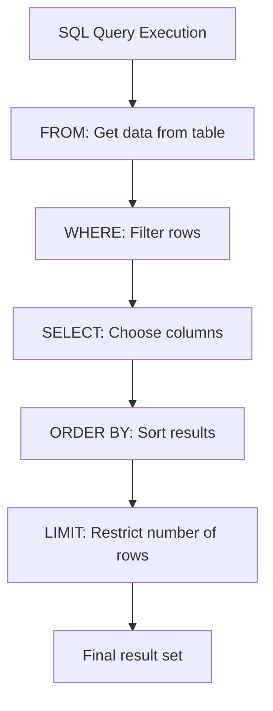

# SQL ORDER BY: Sorting Query Results

## Introduction

When querying a database, retrieving data in a specific order is often as important as the data itself. Imagine trying to find a contact in an unsorted list of thousands of names or analyzing sales figures without being able to see them from highest to lowest. This is where SQL's `ORDER BY` clause comes in.

The `ORDER BY` clause allows you to sort the results of your SQL queries based on one or more columns, making your data more organized and easier to understand. It's one of the fundamental tools in SQL data manipulation that helps transform raw data into meaningful information.

## Basic Syntax

The basic syntax of the `ORDER BY` clause is:

```sql
SELECT column1, column2, ...
FROM table_name
ORDER BY column1 [ASC|DESC], column2 [ASC|DESC], ...;
```

Where:
- `column1, column2, ...` are the columns you want to sort by
- `ASC` sorts in ascending order (default if not specified)
- `DESC` sorts in descending order

## Simple Sorting Examples

Let's start with some basic examples using a sample `employees` table:

| employee_id | first_name | last_name | hire_date  | salary  |
|-------------|------------|-----------|------------|---------|
| 1           | John       | Smith     | 2018-01-15 | 55000   |
| 2           | Jane       | Doe       | 2019-03-20 | 62000   |
| 3           | Michael    | Johnson   | 2017-11-05 | 59000   |
| 4           | Sarah      | Williams  | 2020-06-10 | 58000   |
| 5           | Robert     | Brown     | 2018-09-22 | 61000   |

### Sorting by a Single Column (Ascending)

```sql
SELECT employee_id, first_name, last_name, hire_date, salary
FROM employees
ORDER BY last_name;
```

**Result:**
```
| employee_id | first_name | last_name | hire_date  | salary  |
|-------------|------------|-----------|------------|---------|
| 5           | Robert     | Brown     | 2018-09-22 | 61000   |
| 2           | Jane       | Doe       | 2019-03-20 | 62000   |
| 3           | Michael    | Johnson   | 2017-11-05 | 59000   |
| 1           | John       | Smith     | 2018-01-15 | 55000   |
| 4           | Sarah      | Williams  | 2020-06-10 | 58000   |
```

In this example, the results are sorted alphabetically by the `last_name` column.

### Sorting by a Single Column (Descending)

```sql
SELECT employee_id, first_name, last_name, hire_date, salary
FROM employees
ORDER BY salary DESC;
```

**Result:**
```
| employee_id | first_name | last_name | hire_date  | salary  |
|-------------|------------|-----------|------------|---------|
| 2           | Jane       | Doe       | 2019-03-20 | 62000   |
| 5           | Robert     | Brown     | 2018-09-22 | 61000   |
| 3           | Michael    | Johnson   | 2017-11-05 | 59000   |
| 4           | Sarah      | Williams  | 2020-06-10 | 58000   |
| 1           | John       | Smith     | 2018-01-15 | 55000   |
```

Here, we've sorted the employees by their salary in descending order (highest to lowest).

## Sorting by Multiple Columns

You can sort by multiple columns, creating a hierarchy of sorting criteria:

```sql
SELECT employee_id, first_name, last_name, hire_date, salary
FROM employees
ORDER BY hire_date ASC, salary DESC;
```

**Result:**
```
| employee_id | first_name | last_name | hire_date  | salary  |
|-------------|------------|-----------|------------|---------|
| 3           | Michael    | Johnson   | 2017-11-05 | 59000   |
| 1           | John       | Smith     | 2018-01-15 | 55000   |
| 5           | Robert     | Brown     | 2018-09-22 | 61000   |
| 2           | Jane       | Doe       | 2019-03-20 | 62000   |
| 4           | Sarah      | Williams  | 2020-06-10 | 58000   |
```

In this example:
1. Records are first sorted by `hire_date` in ascending order (oldest to newest)
2. If multiple employees have the same hire date, they're then sorted by `salary` in descending order

## Advanced ORDER BY Techniques

### Sorting by Column Position

Instead of column names, you can sort by the position of columns in your SELECT statement:

```sql
SELECT employee_id, first_name, last_name, hire_date, salary
FROM employees
ORDER BY 3; -- Sorts by the 3rd column (last_name)
```

This query produces the same result as sorting by `last_name` ASC. While this can save typing, using column names is generally more readable and maintainable.

### Sorting by Expressions

You can sort by expressions or functions:

```sql
SELECT employee_id, first_name, last_name, hire_date, salary
FROM employees
ORDER BY LENGTH(last_name);
```

**Result:**
```
| employee_id | first_name | last_name | hire_date  | salary  |
|-------------|------------|-----------|------------|---------|
| 2           | Jane       | Doe       | 2019-03-20 | 62000   |
| 1           | John       | Smith     | 2018-01-15 | 55000   |
| 5           | Robert     | Brown     | 2018-09-22 | 61000   |
| 3           | Michael    | Johnson   | 2017-11-05 | 59000   |
| 4           | Sarah      | Williams  | 2020-06-10 | 58000   |
```

This sorts employees by the length of their last name, from shortest to longest.

### Using CASE Expressions in ORDER BY

You can implement custom sorting logic using CASE expressions:

```sql
SELECT employee_id, first_name, last_name, hire_date, salary
FROM employees
ORDER BY 
    CASE 
        WHEN salary > 60000 THEN 1
        WHEN hire_date < '2018-01-01' THEN 2
        ELSE 3
    END;
```

This sorts employees into three groups:
1. High earners (salary > 60000)
2. Long-term employees with moderate salaries
3. Everyone else

## Real-World Applications

### Application 1: Generating Reports

When creating business reports, sorting is essential for readability and analysis:

```sql
-- Monthly sales report sorted by revenue
SELECT 
    product_name,
    category,
    units_sold,
    price_per_unit,
    (units_sold * price_per_unit) AS revenue
FROM 
    sales
WHERE 
    sale_date BETWEEN '2023-01-01' AND '2023-01-31'
ORDER BY 
    revenue DESC;
```

This query helps identify the best-performing products for the month.

### Application 2: Pagination

When building web applications that display large datasets, pagination is typically implemented with `ORDER BY` combined with `LIMIT`:

```sql
-- Display page 2 of a product catalog (10 items per page)
SELECT 
    product_id, 
    product_name, 
    price
FROM 
    products
ORDER BY 
    product_name
LIMIT 10 OFFSET 10;
```

### Application 3: Finding Extremes

`ORDER BY` with `LIMIT` can quickly identify minimum or maximum values:

```sql
-- Find the 5 most recent customers
SELECT 
    customer_id, 
    customer_name, 
    registration_date
FROM 
    customers
ORDER BY 
    registration_date DESC
LIMIT 5;
```

## Visualization: How ORDER BY Works



## Performance Considerations

While `ORDER BY` is powerful, it can impact query performance, especially on large datasets:

1. **Indexing**: Adding indexes on columns frequently used in ORDER BY clauses can significantly improve performance.
2. **Sorting Costs**: Sorting large result sets requires additional memory and processing time.
3. **Avoid Unnecessary Sorting**: Only use ORDER BY when the sort order is important for your application.

For example, creating an index on the `last_name` column:

```sql
CREATE INDEX idx_employees_lastname ON employees(last_name);
```

## Summary

The SQL `ORDER BY` clause is a fundamental tool for organizing query results in a meaningful way. Key points to remember:

- Use `ASC` for ascending order (default) and `DESC` for descending order
- Sort by multiple columns to create hierarchical sorting
- Leverage expressions and CASE statements for complex sorting logic
- Consider performance implications, especially for large datasets

By mastering `ORDER BY`, you gain the ability to present data in exactly the format you need, making your database queries more powerful and your applications more user-friendly.

## Exercises

1. Write a query to list employees sorted by their hire date (newest first) and then by their last name (alphabetically).
2. Create a query that sorts products by category in ascending order and then by price in descending order within each category.
3. Write a query to rank students by their average score, placing NULL values last.
4. Modify this query to sort customers by their total lifetime purchases:
   ```sql
   SELECT customer_id, customer_name, total_purchases
   FROM customers;
   ```

## Additional Resources

- [SQL ORDER BY with NULLS FIRST/LAST](https://www.postgresql.org/docs/current/queries-order.html)
- [Database indexing strategies for sorting](https://use-the-index-luke.com/)
- [SQL Performance Tuning for Sorted Queries](https://www.sqlshack.com/query-optimization-techniques-in-sql-server-the-basics/)