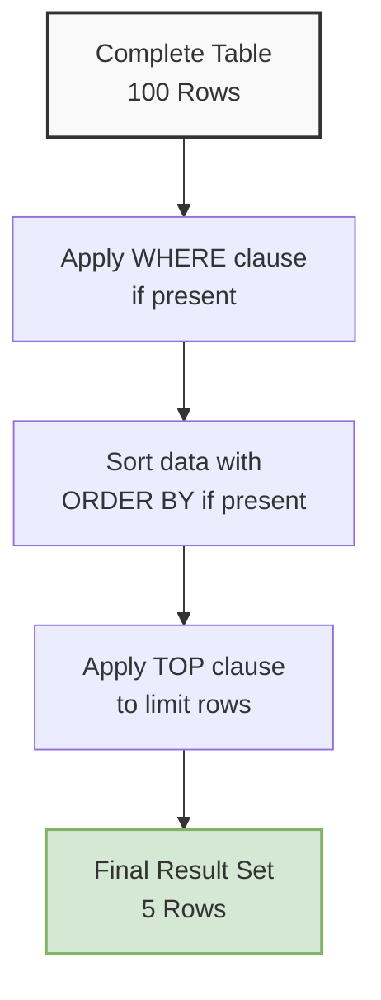

# SQL TOP Clause

## Introduction

When working with databases that contain thousands or millions of records, you often don't need to retrieve all the data at once. The SQL TOP clause is a powerful tool that allows you to limit the number of rows returned in a query result set. This is especially useful when you're working with large tables and only need to see a sample of the data, or when you want to retrieve the highest or lowest values based on a specific column.

The TOP clause is primarily used in Microsoft SQL Server, but similar functionality exists in other database management systems:
- MySQL and PostgreSQL use the `LIMIT` clause
- Oracle uses `ROWNUM` or `FETCH FIRST` (in Oracle 12c and later)

In this tutorial, we'll focus on the SQL Server implementation of TOP, but we'll also briefly cover the equivalent syntax in other popular database systems.

## Basic Syntax

The basic syntax for the TOP clause in SQL Server is:

```sql
SELECT TOP (number_of_rows) column_name(s)
FROM table_name
[WHERE condition]
[ORDER BY column_name];
```

Let's break down the components:
- `TOP (number_of_rows)`: Specifies how many rows to return
- `column_name(s)`: The columns you want to include in the result set
- `table_name`: The table from which to retrieve data
- `[WHERE condition]`: Optional filter to apply to the data
- `[ORDER BY column_name]`: Optional sorting to determine which "top" rows to return

## Simple Examples

### Example 1: Retrieving a Fixed Number of Rows

Let's say we have a table named `Products` with information about items in an online store:

```sql
-- Return the top 5 products
SELECT TOP (5) ProductName, Price
FROM Products;
```

**Output:**
```
ProductName         Price
----------------    ------
Laptop              899.99
Smartphone          499.99
Wireless Headphones 129.99
Tablet              349.99
Smart Watch         199.99
```

This query returns the first 5 rows from the Products table. However, without an `ORDER BY` clause, the database simply returns the first 5 records it encounters, which may not be meaningful.

### Example 2: Combining TOP with ORDER BY

The TOP clause becomes much more useful when combined with ORDER BY:

```sql
-- Return the 3 most expensive products
SELECT TOP (3) ProductName, Price
FROM Products
ORDER BY Price DESC;
```

**Output:**
```
ProductName    Price
------------   ------
Laptop         899.99
Smartphone     499.99
Tablet         349.99
```

Now we're getting the 3 products with the highest prices by using `ORDER BY Price DESC`.

## Advanced Usage

### Using TOP with PERCENT

You can use the PERCENT keyword to return a percentage of rows instead of a fixed number:

```sql
-- Return the top 10% of products by price
SELECT TOP (10) PERCENT ProductName, Price
FROM Products
ORDER BY Price DESC;
```

If our Products table has 50 items, this query would return the 5 most expensive products (10% of 50).

### Using TOP with TIES

The WITH TIES option allows you to include rows that have the same values in the ORDER BY field as the last row in the result set:

```sql
-- Return the top 3 products by price, including any products that tie with the 3rd most expensive
SELECT TOP (3) WITH TIES ProductName, Price
FROM Products
ORDER BY Price DESC;
```

**Output (if two products have the same price):**
```
ProductName    Price
------------   ------
Laptop         899.99
Smartphone     499.99
Tablet         349.99
Camera         349.99
```

In this example, both the Tablet and Camera have the same price, so both are included in the results even though we specified TOP (3).

## Real-World Applications

### Example 1: Sales Dashboard

Imagine you're building a sales dashboard for a retail store. You want to display the top 5 bestselling products:

```sql
SELECT TOP (5) p.ProductName, SUM(od.Quantity) AS TotalSold
FROM Products p
JOIN OrderDetails od ON p.ProductID = od.ProductID
GROUP BY p.ProductName
ORDER BY TotalSold DESC;
```

**Output:**
```
ProductName         TotalSold
----------------    ---------
Smartphone          1245
Wireless Headphones 987
Laptop              845
Smart Watch         756
Tablet              612
```

This query joins the Products table with the OrderDetails table to calculate the total quantity sold for each product, then returns only the top 5.

### Example 2: Performance Analysis

A database administrator might want to identify the slowest-performing queries:

```sql
SELECT TOP (10) query_text, execution_count, total_elapsed_time / execution_count AS avg_elapsed_time
FROM sys.dm_exec_query_stats
CROSS APPLY sys.dm_exec_sql_text(sql_handle)
ORDER BY avg_elapsed_time DESC;
```

This query uses system views to find the 10 queries with the highest average execution time.

### Example 3: Data Sampling

When exploring a new dataset, you might want to examine a small sample:

```sql
SELECT TOP (100) *
FROM Customer_Transactions
ORDER BY NEWID();
```

The `NEWID()` function generates a random UUID, so this query returns a random sample of 100 rows from the table.

## Equivalent Syntax in Other Database Systems

### MySQL and PostgreSQL

In MySQL and PostgreSQL, the equivalent of TOP is LIMIT:

```sql
-- MySQL/PostgreSQL equivalent of TOP 5
SELECT ProductName, Price
FROM Products
ORDER BY Price DESC
LIMIT 5;
```

### Oracle

In Oracle 12c and later:

```sql
-- Oracle equivalent of TOP 5
SELECT ProductName, Price
FROM Products
ORDER BY Price DESC
FETCH FIRST 5 ROWS ONLY;
```

In earlier Oracle versions:

```sql
-- Oracle older version equivalent
SELECT ProductName, Price
FROM Products
WHERE ROWNUM <= 5
ORDER BY Price DESC;
```

## Visualization of TOP Clause

Here's a diagram showing how the TOP clause filters rows from a table:



## Common Pitfalls and Best Practices

### 1. TOP without ORDER BY
Without an ORDER BY clause, the rows returned by TOP are unpredictable. Always use ORDER BY with TOP when you want specific rows.

### 2. Performance Considerations
Be aware that using TOP with ORDER BY requires the database to sort the entire result set before returning the top N rows. For large tables, this can be resource-intensive.

### 3. Paging vs. TOP
While TOP is useful for retrieving a small number of rows, it's not ideal for implementing pagination. For pagination, consider using the OFFSET-FETCH feature available in SQL Server 2012 and later:

```sql
-- Get page 3 (rows 21-30) assuming 10 rows per page
SELECT ProductName, Price
FROM Products
ORDER BY ProductName
OFFSET 20 ROWS
FETCH NEXT 10 ROWS;
```

## Summary

The SQL TOP clause is a versatile feature that allows you to limit the number of rows returned by a query. When combined with ORDER BY, it becomes a powerful tool for retrieving only the most relevant data from your tables.

Key points to remember:
- TOP is specific to SQL Server; other databases use similar but different syntax
- Always use ORDER BY with TOP to get meaningful results
- Consider using PERCENT for dynamic row count based on table size
- Use WITH TIES when you want to include rows with values equal to the last row
- Be mindful of performance implications when using TOP with large tables

## Practice Exercises

1. Create a table named `Employees` with columns for EmployeeID, Name, Department, and Salary. Insert at least 10 records with varying salary values.

2. Write a query to find the 3 highest-paid employees.

3. Write a query to find the top 20% of employees by salary.

4. Write a query to find the 5 most recently hired employees.

5. Modify your queries to use the equivalent syntax for MySQL or PostgreSQL.

## Additional Resources

- [Microsoft SQL Server Documentation on TOP](https://docs.microsoft.com/en-us/sql/t-sql/queries/top-transact-sql)
- [MySQL LIMIT Documentation](https://dev.mysql.com/doc/refman/8.0/en/limit-optimization.html)
- [PostgreSQL LIMIT Documentation](https://www.postgresql.org/docs/current/queries-limit.html)
- [Oracle FETCH FIRST Documentation](https://docs.oracle.com/database/121/SQLRF/statements_10002.htm#SQLRF55631)