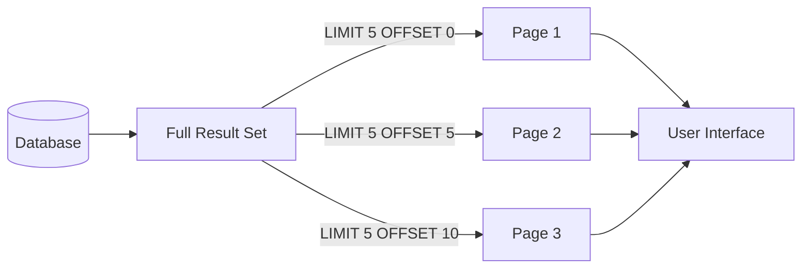

# SQL LIMIT Clause

## Introduction

When working with databases that contain thousands or millions of records, retrieving all rows with a query can be inefficient and overwhelming. The SQL `LIMIT` clause solves this problem by allowing you to restrict the number of records returned by a query. This feature is particularly useful for implementing pagination in web applications, viewing sample data, or improving query performance.

In this tutorial, you'll learn:
- The basic syntax of the LIMIT clause
- How to use LIMIT with OFFSET for pagination
- Database-specific variations
- Real-world applications and best practices

## Basic Syntax

The `LIMIT` clause is added at the end of a SQL query to restrict the number of rows returned:

```sql
SELECT column1, column2, ...
FROM table_name
LIMIT number_of_rows;
```

### Example 1: Retrieving a Fixed Number of Rows

Imagine we have a `products` table with numerous items. To view just the first 5 products:

```sql
SELECT product_id, product_name, price
FROM products
LIMIT 5;
```

**Output:**
```
| product_id | product_name      | price  |
|------------|-------------------|--------|
| 1          | Laptop            | 999.99 |
| 2          | Smartphone        | 699.99 |
| 3          | Headphones        | 149.99 |
| 4          | Tablet            | 349.99 |
| 5          | Wireless Mouse    | 29.99  |
```

## Using LIMIT with OFFSET

The `OFFSET` keyword is used alongside `LIMIT` to skip a specified number of rows before starting to return records. This combination is perfect for implementing pagination.

### Syntax:

```sql
SELECT column1, column2, ...
FROM table_name
LIMIT number_of_rows OFFSET row_offset;
```

### Example 2: Implementing Pagination

Let's say we want to display products in pages of 5 items each:

**Page 1:**
```sql
SELECT product_id, product_name, price
FROM products
LIMIT 5 OFFSET 0;  -- Same as LIMIT 5
```

**Page 2:**
```sql
SELECT product_id, product_name, price
FROM products
LIMIT 5 OFFSET 5;  -- Skip first 5 rows, get next 5
```

**Output for Page 2:**
```
| product_id | product_name      | price  |
|------------|-------------------|--------|
| 6          | External SSD      | 89.99  |
| 7          | Monitor           | 249.99 |
| 8          | Keyboard          | 59.99  |
| 9          | Webcam            | 49.99  |
| 10         | Speakers          | 79.99  |
```

## Alternative Syntax and Database Variations

The `LIMIT` clause syntax can vary between different database management systems:

### MySQL and PostgreSQL
Both use the standard syntax shown above:

```sql
SELECT * FROM table_name LIMIT 10 OFFSET 20;
```

PostgreSQL also supports an alternative syntax:

```sql
SELECT * FROM table_name LIMIT 10 OFFSET 20;
-- Is the same as:
SELECT * FROM table_name LIMIT 20, 10;
```

### Microsoft SQL Server
SQL Server uses `TOP` instead of `LIMIT`:

```sql
-- SQL Server syntax
SELECT TOP 10 * FROM table_name;
```

For pagination in SQL Server (2012 and newer), use `OFFSET-FETCH`:

```sql
SELECT * FROM table_name
ORDER BY column_name
OFFSET 20 ROWS
FETCH NEXT 10 ROWS ONLY;
```

### Oracle (Before 12c)
Oracle traditionally used `ROWNUM`:

```sql
-- Oracle syntax (before 12c)
SELECT * FROM (
    SELECT * FROM table_name
    WHERE ROWNUM <= 30
) WHERE ROWNUM > 20;
```

### Oracle (12c and later)
Oracle 12c introduced support for the ANSI SQL standard:

```sql
-- Oracle 12c and later
SELECT * FROM table_name
OFFSET 20 ROWS FETCH NEXT 10 ROWS ONLY;
```

## Important Considerations

### 1. ORDER BY is Essential

When using `LIMIT`, always include an `ORDER BY` clause unless you specifically don't care about the order of results. Without ordering, the database will return rows in an unpredictable order, which can lead to:
- Duplicate records across pages
- Missing records
- Inconsistent results

### Example 3: LIMIT with ORDER BY

```sql
SELECT product_id, product_name, price
FROM products
ORDER BY price DESC  -- Get most expensive products first
LIMIT 3;
```

**Output:**
```
| product_id | product_name      | price   |
|------------|-------------------|---------|
| 1          | Laptop            | 999.99  |
| 2          | Smartphone        | 699.99  |
| 7          | Monitor           | 249.99  |
```

### 2. Performance Considerations

The `LIMIT` clause can improve performance by reducing the amount of data that needs to be transferred to the client. However, the database still performs the full query before applying the limit. For large tables, use additional conditions to narrow down results before applying `LIMIT`.

## Real-World Applications

### Pagination in Web Applications

One of the most common uses of the `LIMIT` clause is implementing pagination in web applications. Here's a practical example:

```sql
-- Page formula: LIMIT page_size OFFSET (page_number - 1) * page_size

-- For page 1 with 10 items per page
SELECT * FROM products ORDER BY product_name LIMIT 10 OFFSET 0;

-- For page 3 with 10 items per page
SELECT * FROM products ORDER BY product_name LIMIT 10 OFFSET 20;
```

This technique is used to display data in manageable chunks across multiple pages.

### Data Sampling

The `LIMIT` clause can be used for quick data sampling:

```sql
-- Get a random sample of 100 customers
SELECT * FROM customers
ORDER BY RAND()  -- MySQL syntax
LIMIT 100;
```

### Top N Analysis

Analysts often use `LIMIT` for "Top N" analysis:

```sql
-- Find the top 5 highest-value orders
SELECT order_id, customer_id, total_amount
FROM orders
ORDER BY total_amount DESC
LIMIT 5;
```

## Practical Example: Building a Product Catalog

Let's build a complete product catalog page with pagination:

```sql
-- Total number of products (for calculating total pages)
SELECT COUNT(*) AS total_products FROM products;

-- Products for the current page (page 2, 10 items per page)
SELECT 
    product_id,
    product_name,
    category,
    price,
    CONCAT(SUBSTRING(description, 1, 100), '...') AS short_description
FROM 
    products
WHERE 
    in_stock = 1
ORDER BY 
    product_name
LIMIT 10 OFFSET 10;
```

This query would be used in a web application where:
1. The first query determines how many pagination links to display
2. The second query fetches only the products for the current page
3. We're showing abbreviated descriptions to save space

## Visualizing Pagination

Here's a diagram showing how pagination works:



## Common Mistakes and Troubleshooting

### Mistake 1: Missing ORDER BY

Without an `ORDER BY` clause, results with `LIMIT` may be inconsistent:

```sql
-- Problematic query - results may change each time
SELECT * FROM products LIMIT 10;

-- Better query - consistent ordering
SELECT * FROM products ORDER BY product_id LIMIT 10;
```

### Mistake 2: Incorrect Pagination Calculations

When calculating the OFFSET for pagination, a common mistake is:

```sql
-- Incorrect (if page starts at 1)
OFFSET page_number * items_per_page

-- Correct
OFFSET (page_number - 1) * items_per_page
```

### Mistake 3: Not Handling Empty Pages

If a user requests a page beyond available data, no results will be returned. Your application should handle this case gracefully.

## Summary

The SQL `LIMIT` clause is a powerful tool for controlling the number of records returned by a query. Key takeaways include:

- Use `LIMIT` to restrict the number of rows returned
- Combine with `OFFSET` for pagination
- Always include an `ORDER BY` clause for consistent results
- Different database systems may use different syntax
- `LIMIT` is essential for building user-friendly interfaces to large datasets

By mastering the `LIMIT` clause, you can build more efficient queries and improve the user experience of your applications.

## Exercises

1. Write a query to fetch the 10 most recent orders from an `orders` table.
2. Create a query to implement pagination for a blog with 5 posts per page, showing the third page.
3. Write queries to show the top 3 and bottom 3 products by price.
4. Create a query that randomly selects 5 customers from a `customers` table.
5. Write a query to find the 5 most popular product categories based on the number of sales.

## Additional Resources

- [MySQL LIMIT Documentation](https://dev.mysql.com/doc/refman/8.0/en/limit-optimization.html)
- [PostgreSQL LIMIT Documentation](https://www.postgresql.org/docs/current/queries-limit.html)
- [SQL Server OFFSET-FETCH Documentation](https://docs.microsoft.com/en-us/sql/t-sql/queries/select-order-by-clause-transact-sql)
- [W3Schools SQL LIMIT Tutorial](https://www.w3schools.com/sql/sql_top.asp)