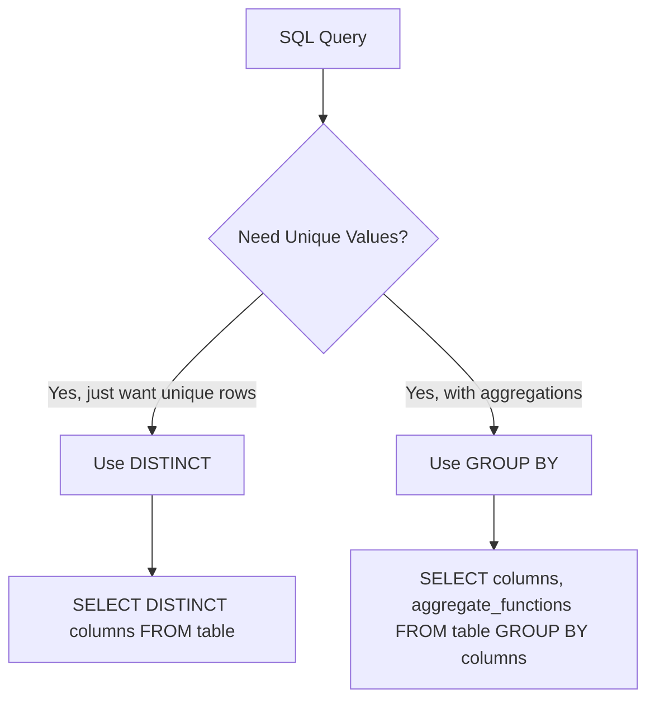

# SQL DISTINCT Values

## Introduction

When working with databases, you'll often encounter situations where you need to retrieve unique values from your data. SQL provides a powerful keyword called `DISTINCT` that helps eliminate duplicate values from your query results.

Think of it like this: if you have a classroom attendance sheet with multiple entries of the same student on different days, using `DISTINCT` would give you just a list of unique student names, with each name appearing only once.

In this tutorial, we'll explore how to use the `DISTINCT` keyword to retrieve unique values from your database tables, examine practical examples, and learn about important considerations when working with this feature.

## Basic Syntax

The basic syntax for using the `DISTINCT` keyword is:

```sql
SELECT DISTINCT column_name(s)
FROM table_name
WHERE condition;
```

The `DISTINCT` keyword is placed right after the `SELECT` statement and before the column names you wish to query.

## Retrieving Single Column Distinct Values

Let's start with a simple example. Imagine we have a `customers` table that stores information about our customers, including the countries they reside in.

Here's a sample of our data:

| customer_id | first_name | last_name | country    |
|-------------|------------|-----------|------------|
| 1           | John       | Smith     | USA        |
| 2           | Emma       | Johnson   | Canada     |
| 3           | Michael    | Williams  | USA        |
| 4           | Sophia     | Brown     | UK         |
| 5           | James      | Jones     | Canada     |
| 6           | Olivia     | Garcia    | USA        |

If we want to know all the unique countries our customers are from, we can use:

```sql
SELECT DISTINCT country
FROM customers;
```

**Output:**
```
country
-------
USA
Canada
UK
```

Instead of returning all 6 rows with redundant country values, the `DISTINCT` keyword gives us only the 3 unique countries.

## Using DISTINCT with Multiple Columns

The `DISTINCT` keyword can also work with multiple columns. In this case, it will return rows where the combination of those columns is unique.

For example, if we have an `orders` table:

| order_id | product_id | customer_id | quantity | status     |
|----------|------------|-------------|----------|------------|
| 1        | 101        | 3           | 2        | Shipped    |
| 2        | 102        | 1           | 1        | Pending    |
| 3        | 101        | 2           | 3        | Delivered  |
| 4        | 103        | 1           | 1        | Shipped    |
| 5        | 102        | 3           | 2        | Pending    |
| 6        | 101        | 1           | 1        | Pending    |

If we want to know all unique combinations of customer_id and status:

```sql
SELECT DISTINCT customer_id, status
FROM orders;
```

**Output:**
```
customer_id | status
------------|-----------
3           | Shipped
1           | Pending
2           | Delivered
1           | Shipped
3           | Pending
```

Note that the row for customer_id 1 with status 'Pending' appears only once in our result, even though it appears twice in our original table (order_id 2 and 6).

## Using DISTINCT with COUNT

A common use case is to count the number of distinct values in a column. This is achieved by combining `DISTINCT` with the `COUNT` function:

```sql
SELECT COUNT(DISTINCT country)
FROM customers;
```

**Output:**
```
count
-----
3
```

This tells us there are 3 unique countries in our `customers` table.

## Using DISTINCT with WHERE Clause

You can combine `DISTINCT` with other SQL clauses like `WHERE` to filter your results:

```sql
SELECT DISTINCT product_id
FROM orders
WHERE status = 'Pending';
```

**Output:**
```
product_id
----------
102
101
```

This query returns all unique product IDs that have pending orders.

## DISTINCT vs. GROUP BY

The `DISTINCT` keyword and `GROUP BY` clause can sometimes achieve similar results, but they serve different purposes:



- Use `DISTINCT` when you simply want to eliminate duplicate rows.
- Use `GROUP BY` when you want to perform aggregate operations (like SUM, AVG, COUNT) on groups of data.

For example, if we want to count the number of orders for each country:

```sql
SELECT country, COUNT(order_id) as order_count
FROM customers
JOIN orders ON customers.customer_id = orders.customer_id
GROUP BY country;
```

**Output:**
```
country | order_count
--------|------------
USA     | 3
Canada  | 2
UK      | 1
```

## Real-World Applications

### Application 1: Data Cleaning

When exploring a new dataset, `DISTINCT` helps you understand the distribution of values:

```sql
-- Find all unique job titles in an employees table
SELECT DISTINCT job_title
FROM employees
ORDER BY job_title;
```

This quickly shows all job titles without repetition, helping identify inconsistencies or misspellings.

### Application 2: Dropdown Menus in Web Applications

When building a web application with filtering options:

```sql
-- Get all unique categories for a product filter
SELECT DISTINCT category
FROM products
WHERE in_stock = true
ORDER BY category;
```

This query could populate a dropdown menu showing only relevant categories of in-stock products.

### Application 3: Business Analytics

For business analysis and reporting:

```sql
-- Find which regions have sales of specific products
SELECT DISTINCT r.region_name
FROM regions r
JOIN stores s ON r.region_id = s.region_id
JOIN sales sl ON s.store_id = sl.store_id
WHERE sl.product_id = 101;
```

This returns all unique regions where product 101 has been sold.

## Performance Considerations

While `DISTINCT` is useful, it does come with performance implications:

1. **Sorting Operation**: `DISTINCT` typically requires a sorting operation to identify unique values, which can be resource-intensive for large datasets.

2. **Index Usage**: Performance can be improved if the columns used with `DISTINCT` are indexed.

3. **Alternative Approaches**: For very large tables, consider whether a `GROUP BY` with proper indexing might be more efficient.

## Common Mistakes and How to Avoid Them

### Mistake 1: Applying DISTINCT Unnecessarily

Using `DISTINCT` when not needed adds processing overhead:

```sql
-- Inefficient if customer_id is a primary key and guaranteed to be unique
SELECT DISTINCT customer_id, first_name, last_name
FROM customers;
```

Since customer_id is unique, `DISTINCT` is redundant here and simply wastes resources.

### Mistake 2: Using DISTINCT with Large Result Sets

Applying `DISTINCT` to queries returning many rows can lead to performance issues. Consider limiting your data first:

```sql
-- Better approach to a potentially large result set
SELECT DISTINCT product_category
FROM products
WHERE created_date > '2023-01-01';
```

### Mistake 3: Misunderstanding Multiple Column Behavior

Remember that `DISTINCT` considers the combination of all columns:

```sql
-- This returns unique combinations of first_name and country
SELECT DISTINCT first_name, country
FROM customers;
```

This might return multiple rows with the same first_name if they're from different countries.

## Summary

The SQL `DISTINCT` keyword is a powerful tool for retrieving unique values from database tables. It can be used with single or multiple columns and combined with other SQL clauses for more complex filtering.

Key takeaways:
- Use `DISTINCT` to eliminate duplicates from your query results
- When applied to multiple columns, `DISTINCT` considers the unique combination of all columns
- `DISTINCT` can be combined with aggregate functions like `COUNT`
- Consider performance implications when using `DISTINCT` on large datasets

## Practice Exercises

1. Create a table called `employees` with columns for employee_id, department, position, and salary. Insert several rows including some with duplicate department values.

2. Write a query to find all unique departments.

3. Write a query to find all unique combinations of department and position.

4. Count how many different departments exist.

5. Challenge: Create a query that shows each department and the count of unique positions within that department.

## Additional Resources

- [SQL DISTINCT in the SQL Standard](https://www.w3schools.com/sql/sql_distinct.asp)
- [PostgreSQL DISTINCT Documentation](https://www.postgresql.org/docs/current/sql-select.html#SQL-DISTINCT)
- [MySQL DISTINCT Keyword](https://dev.mysql.com/doc/refman/8.0/en/distinct-optimization.html)