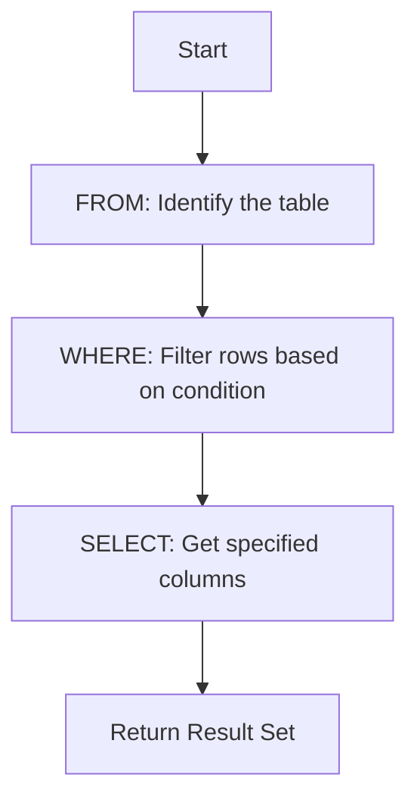

# SQL WHERE Clause

## Introduction

When working with databases, you often need to retrieve specific data rather than entire tables. The SQL `WHERE` clause is a powerful tool that allows you to filter data based on specified conditions. Think of it as asking your database a question: "Show me only the data that meets these criteria."

The `WHERE` clause works with `SELECT`, `UPDATE`, and `DELETE` statements to narrow down which rows should be affected by your query. It's one of the most important concepts in SQL data manipulation.

## Basic Syntax

The basic syntax of the `WHERE` clause is:

```sql
SELECT column1, column2, ...
FROM table_name
WHERE condition;
```

The condition is an expression that evaluates to either true or false for each row in the table. Only rows that satisfy the condition (where the condition evaluates to true) will be included in the result set.

## Comparison Operators

The `WHERE` clause uses comparison operators to create conditions. Here are the most common operators:

| Operator | Description                | Example                    |
|----------|----------------------------|----------------------------|
| `=`        | Equal to                   | `WHERE age = 25`           |
| `>`        | Greater than               | `WHERE salary > 50000`     |
| `<`        | Less than                  | `WHERE price < 100`        |
| `>=`       | Greater than or equal to   | `WHERE quantity >= 10`     |
| `<=`       | Less than or equal to      | `WHERE discount <= 15`     |
| `<>`       | Not equal to               | `WHERE status <> 'Closed'` |
| `!=`       | Not equal to (alternative) | `WHERE status != 'Closed'` |

## Example 1: Basic Filtering

Let's say we have a `customers` table with the following data:

```
+----+----------+-------+------+-------------+
| id | name     | age   | city | email       |
+----+----------+-------+------+-------------+
| 1  | John     | 25    | NYC  | j@mail.com  |
| 2  | Sarah    | 32    | LA   | s@mail.com  |
| 3  | Mike     | 28    | Miami| m@mail.com  |
| 4  | Emma     | 25    | NYC  | e@mail.com  |
| 5  | David    | 35    | SF   | d@mail.com  |
+----+----------+-------+------+-------------+
```

To find all customers who are 25 years old:

```sql
SELECT * 
FROM customers 
WHERE age = 25;
```

Result:
```
+----+--------+------+------+-------------+
| id | name   | age  | city | email       |
+----+--------+------+------+-------------+
| 1  | John   | 25   | NYC  | j@mail.com  |
| 4  | Emma   | 25   | NYC  | e@mail.com  |
+----+--------+------+------+-------------+
```

To find all customers from NYC:

```sql
SELECT name, age, email 
FROM customers 
WHERE city = 'NYC';
```

Result:
```
+--------+------+-------------+
| name   | age  | email       |
+--------+------+-------------+
| John   | 25   | j@mail.com  |
| Emma   | 25   | e@mail.com  |
+--------+------+-------------+
```

## Logical Operators

You can combine multiple conditions using logical operators:

- `AND`: Both conditions must be true
- `OR`: At least one condition must be true
- `NOT`: Negates a condition

### Example 2: Using AND

Find customers who are 25 years old AND live in NYC:

```sql
SELECT * 
FROM customers 
WHERE age = 25 AND city = 'NYC';
```

Result:
```
+----+--------+------+------+-------------+
| id | name   | age  | city | email       |
+----+--------+------+------+-------------+
| 1  | John   | 25   | NYC  | j@mail.com  |
| 4  | Emma   | 25   | NYC  | e@mail.com  |
+----+--------+------+------+-------------+
```

### Example 3: Using OR

Find customers who are either 25 years old OR live in LA:

```sql
SELECT * 
FROM customers 
WHERE age = 25 OR city = 'LA';
```

Result:
```
+----+--------+------+------+-------------+
| id | name   | age  | city | email       |
+----+--------+------+------+-------------+
| 1  | John   | 25   | NYC  | j@mail.com  |
| 2  | Sarah  | 32   | LA   | s@mail.com  |
| 4  | Emma   | 25   | NYC  | e@mail.com  |
+----+--------+------+------+-------------+
```

### Example 4: Using NOT

Find customers who do NOT live in NYC:

```sql
SELECT * 
FROM customers 
WHERE NOT city = 'NYC';
```

Or alternatively:

```sql
SELECT * 
FROM customers 
WHERE city <> 'NYC';
```

Result:
```
+----+--------+------+-------+-------------+
| id | name   | age  | city  | email       |
+----+--------+------+-------+-------------+
| 2  | Sarah  | 32   | LA    | s@mail.com  |
| 3  | Mike   | 28   | Miami | m@mail.com  |
| 5  | David  | 35   | SF    | d@mail.com  |
+----+--------+------+-------+-------------+
```

## Special Operators

SQL provides additional operators for more complex filtering:

### BETWEEN Operator

The `BETWEEN` operator selects values within a range:

```sql
SELECT * 
FROM customers 
WHERE age BETWEEN 25 AND 30;
```

Result:
```
+----+--------+------+-------+-------------+
| id | name   | age  | city  | email       |
+----+--------+------+-------+-------------+
| 1  | John   | 25   | NYC   | j@mail.com  |
| 3  | Mike   | 28   | Miami | m@mail.com  |
| 4  | Emma   | 25   | NYC   | e@mail.com  |
+----+--------+------+-------+-------------+
```

### IN Operator

The `IN` operator allows you to specify multiple values in a WHERE clause:

```sql
SELECT * 
FROM customers 
WHERE city IN ('NYC', 'LA');
```

Result:
```
+----+--------+------+------+-------------+
| id | name   | age  | city | email       |
+----+--------+------+------+-------------+
| 1  | John   | 25   | NYC  | j@mail.com  |
| 2  | Sarah  | 32   | LA   | s@mail.com  |
| 4  | Emma   | 25   | NYC  | e@mail.com  |
+----+--------+------+------+-------------+
```

### LIKE Operator

The `LIKE` operator is used for pattern matching with wildcards:
- `%` represents zero, one, or multiple characters
- `_` represents a single character

```sql
SELECT * 
FROM customers 
WHERE email LIKE '%mail.com';
```

This query finds all customers whose email addresses end with "mail.com".

Result:
```
+----+----------+-------+-------+-------------+
| id | name     | age   | city  | email       |
+----+----------+-------+-------+-------------+
| 1  | John     | 25    | NYC   | j@mail.com  |
| 2  | Sarah    | 32    | LA    | s@mail.com  |
| 3  | Mike     | 28    | Miami | m@mail.com  |
| 4  | Emma     | 25    | NYC   | e@mail.com  |
| 5  | David    | 35    | SF    | d@mail.com  |
+----+----------+-------+-------+-------------+
```

To find names starting with 'J':

```sql
SELECT * 
FROM customers 
WHERE name LIKE 'J%';
```

Result:
```
+----+--------+------+------+-------------+
| id | name   | age  | city | email       |
+----+--------+------+------+-------------+
| 1  | John   | 25   | NYC  | j@mail.com  |
+----+--------+------+------+-------------+
```

### IS NULL / IS NOT NULL

These operators check if a value is NULL (missing) or not:

```sql
SELECT * 
FROM customers 
WHERE phone IS NULL;
```

This would find all customers who don't have a phone number recorded.

## Real-World Applications

### Example: E-commerce Filtering

Imagine you're building an e-commerce website with a `products` table:

```
+----+----------------+-------------+--------+----------+
| id | name           | category    | price  | in_stock |
+----+----------------+-------------+--------+----------+
| 1  | Laptop         | Electronics | 999.99 | true     |
| 2  | Headphones     | Electronics | 149.99 | true     |
| 3  | Coffee Maker   | Appliances  | 79.99  | false    |
| 4  | Desk Chair     | Furniture   | 199.99 | true     |
| 5  | Smartphone     | Electronics | 699.99 | true     |
| 6  | Blender        | Appliances  | 49.99  | true     |
+----+----------------+-------------+--------+----------+
```

1. Find all available electronics under $500:

```sql
SELECT * 
FROM products 
WHERE category = 'Electronics' 
AND price < 500 
AND in_stock = true;
```

Result:
```
+----+----------------+-------------+--------+----------+
| id | name           | category    | price  | in_stock |
+----+----------------+-------------+--------+----------+
| 2  | Headphones     | Electronics | 149.99 | true     |
+----+----------------+-------------+--------+----------+
```

2. Find all products that are either appliances or cost less than $100:

```sql
SELECT * 
FROM products 
WHERE category = 'Appliances' 
OR price < 100;
```

Result:
```
+----+----------------+-------------+--------+----------+
| id | name           | category    | price  | in_stock |
+----+----------------+-------------+--------+----------+
| 3  | Coffee Maker   | Appliances  | 79.99  | false    |
| 6  | Blender        | Appliances  | 49.99  | true     |
+----+----------------+-------------+--------+----------+
```

### Example: User Authentication

In a user authentication system, you might use the WHERE clause to verify login credentials:

```sql
SELECT * 
FROM users 
WHERE username = 'user_input' 
AND password_hash = 'hashed_password_input';
```

> ⚠️ **Note:** In a real application, never store plain text passwords. Always use secure password hashing and additional security measures.

## Flow of Execution

When SQL processes a query with a WHERE clause, it follows these steps:



The database engine first identifies the table, then applies the WHERE filter to determine which rows to include, and finally selects the requested columns from those filtered rows.

## Common Mistakes and Best Practices

### Mistakes to Avoid:

1. **Case sensitivity issues**: In some databases, string comparisons are case-sensitive.
   ```sql
   -- This might not find "NYC" if the database is case-sensitive
   SELECT * FROM customers WHERE city = 'nyc';
   ```

2. **Forgetting to handle NULL values**: Regular comparisons with NULL don't work as expected.
   ```sql
   -- This doesn't work to find NULL values
   SELECT * FROM customers WHERE phone = NULL;
   
   -- Use this instead
   SELECT * FROM customers WHERE phone IS NULL;
   ```

3. **Using single quotes for column names**: Use backticks or double quotes (depending on your database system) for column names, not single quotes.
   ```sql
   -- Incorrect
   SELECT * FROM products WHERE 'price' < 100;
   
   -- Correct
   SELECT * FROM products WHERE price < 100;
   ```

### Best Practices:

1. **Use parentheses for complex conditions** to ensure they're evaluated in the intended order:
   ```sql
   SELECT * 
   FROM products 
   WHERE (category = 'Electronics' AND price < 500) OR (category = 'Appliances' AND price < 100);
   ```

2. **Optimize your WHERE clauses**: Place the most selective conditions first when using AND operators.

3. **Use appropriate indexes** on columns frequently used in WHERE clauses to improve query performance.

## Summary

The SQL WHERE clause is essential for filtering data in your queries. With it, you can:

- Filter rows based on specific conditions
- Use comparison operators `(=, <, >, etc.)` to create those conditions
- Combine multiple conditions using logical operators (AND, OR, NOT)
- Use special operators like BETWEEN, IN, LIKE, and IS NULL for more complex filtering
- Apply these filtering techniques to real-world scenarios

By mastering the WHERE clause, you'll be able to retrieve precisely the data you need from your databases, making your applications more efficient and your code more effective.

## Exercises

Test your understanding with these exercises:

1. Write a query to find all products with prices between $100 and $500.
2. Write a query to find all customers who live in either NYC or LA and are older than 30.
3. Find all products that are in the 'Electronics' category and are either in stock or cost more than $500.
4. Find all customers whose email addresses contain the letter 'a' but don't end with 'gmail.com'.

## Additional Resources

- [SQL WHERE Clause Documentation](https://www.w3schools.com/sql/sql_where.asp)
- [SQL Practice Exercises](https://www.sqlzoo.net/)
- [Database Index Optimization](https://use-the-index-luke.com/)

Keep practicing your SQL queries to become more proficient. Remember that the WHERE clause is just one part of SQL's powerful data manipulation capabilities!