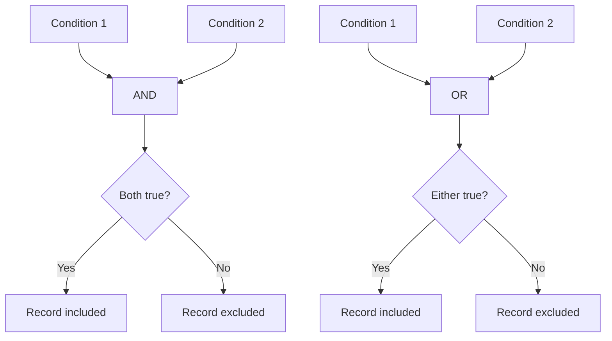

# SQL AND OR Operators

## Introduction

When querying databases, you often need to filter data based on multiple conditions. SQL provides two powerful logical operators—`AND` and `OR`—that let you combine conditions in your `WHERE` clause to create more complex and precise filters.

- The `AND` operator returns records when **all** conditions are true
- The `OR` operator returns records when **any** of the conditions is true

Understanding these operators is essential for writing effective SQL queries that retrieve exactly the data you need. In this tutorial, you'll learn how to use these operators with practical examples.

## The AND Operator

### Basic Syntax

The `AND` operator connects two or more conditions. All conditions must be true for a row to be included in the results.

```sql
SELECT column1, column2, ...
FROM table_name
WHERE condition1 AND condition2 AND condition3 ...;
```

### Examples

Let's say we have a table of `students` with the following data:

| student_id | name     | age | grade | major      |
|------------|----------|-----|-------|------------|
| 1          | John     | 20  | 85    | Computer Science |
| 2          | Sarah    | 19  | 92    | Mathematics |
| 3          | Michael  | 22  | 78    | Physics    |
| 4          | Emma     | 20  | 95    | Computer Science |
| 5          | David    | 21  | 88    | Biology    |
| 6          | Lisa     | 19  | 72    | Mathematics |

#### Example 1: Find all Computer Science students with grades above 90

```sql
SELECT name, grade, major
FROM students
WHERE major = 'Computer Science' AND grade > 90;
```

**Result:**

| name | grade | major           |
|------|-------|-----------------|
| Emma | 95    | Computer Science |

In this example, only Emma meets both conditions: being a Computer Science major AND having a grade higher than 90.

#### Example 2: Find students aged 20 with grades above 80

```sql
SELECT name, age, grade
FROM students
WHERE age = 20 AND grade > 80;
```

**Result:**

| name | age | grade |
|------|-----|-------|
| John | 20  | 85    |
| Emma | 20  | 95    |

Both John and Emma meet both conditions: being 20 years old AND having grades above 80.

## The OR Operator

### Basic Syntax

The `OR` operator also connects multiple conditions, but only one condition needs to be true for a row to be included in the results.

```sql
SELECT column1, column2, ...
FROM table_name
WHERE condition1 OR condition2 OR condition3 ...;
```

### Examples

Using the same `students` table:

#### Example 1: Find all Mathematics or Physics majors

```sql
SELECT name, major
FROM students
WHERE major = 'Mathematics' OR major = 'Physics';
```

**Result:**

| name    | major      |
|---------|------------|
| Sarah   | Mathematics |
| Michael | Physics    |
| Lisa    | Mathematics |

This query returns all students who are either Mathematics or Physics majors.

#### Example 2: Find students with high grades or who are older

```sql
SELECT name, age, grade
FROM students
WHERE grade > 90 OR age > 21;
```

**Result:**

| name    | age | grade |
|---------|-----|-------|
| Sarah   | 19  | 92    |
| Michael | 22  | 78    |
| Emma    | 20  | 95    |

This returns students who either have a grade above 90 OR are older than 21.

## Combining AND and OR Operators

You can combine `AND` and `OR` in a single query to create more complex conditions. When doing so, it's important to use parentheses to ensure the conditions are evaluated in the order you intend.

### Order of Evaluation

Without parentheses, SQL evaluates `AND` operators before `OR` operators. This is similar to how multiplication takes precedence over addition in mathematics.

### Examples

#### Example 1: Find Computer Science students with high grades or any Biology students

```sql
SELECT name, grade, major
FROM students
WHERE (major = 'Computer Science' AND grade > 90) OR major = 'Biology';
```

**Result:**

| name  | grade | major           |
|-------|-------|-----------------|
| Emma  | 95    | Computer Science |
| David | 88    | Biology         |

This returns Emma (who meets both conditions before the OR) and David (who is a Biology major).

#### Example 2: What happens with incorrect parentheses placement

Consider this query:

```sql
SELECT name, grade, major
FROM students
WHERE major = 'Computer Science' AND (grade > 90 OR major = 'Biology');
```

**Result:**

| name | grade | major           |
|------|-------|-----------------|
| Emma | 95    | Computer Science |

This only returns Emma because the query now finds Computer Science majors who either have grades above 90 OR are Biology majors. Since a student can't be both a Computer Science and Biology major at the same time, the second part of the OR condition becomes irrelevant.

## NOT Operator with AND/OR

You can also use the `NOT` operator in combination with `AND` and `OR` to negate conditions.

```sql
SELECT name, grade, major
FROM students
WHERE major = 'Computer Science' AND NOT grade < 85;
```

**Result:**

| name | grade | major           |
|------|-------|-----------------|
| John | 85    | Computer Science |
| Emma | 95    | Computer Science |

This returns Computer Science students with grades that are not less than 85 (equivalent to ≥ 85).

## Visualizing AND/OR Logic

The following diagram shows how AND and OR operators work:



## Real-World Applications

### E-commerce Website: Product Filtering

Imagine an online store with a `products` table:

```sql
-- Find affordable electronics or any premium product
SELECT product_name, category, price, quality
FROM products
WHERE (category = 'Electronics' AND price < 500) 
   OR quality = 'Premium';
```

This query helps customers find budget-friendly electronics or any premium products.

### HR System: Employee Queries

In a company database:

```sql
-- Find employees in the IT department who are either senior level or earn high salaries
SELECT employee_name, department, position, salary
FROM employees
WHERE department = 'IT' 
  AND (position = 'Senior' OR salary > 80000);
```

This helps HR identify experienced or well-compensated IT staff.

### Data Analysis: Customer Segmentation

For a marketing campaign:

```sql
-- Find potential high-value customers
SELECT customer_id, purchase_total, visit_frequency
FROM customers
WHERE purchase_total > 1000 
   OR (visit_frequency > 10 AND purchase_total > 500);
```

This identifies both big spenders and regular customers with moderate spending.

## Common Mistakes and Best Practices

### Mistake 1: Missing Parentheses

```sql
-- Ambiguous query
SELECT * FROM students 
WHERE major = 'Computer Science' OR major = 'Mathematics' AND grade > 90;
```

Since AND has higher precedence, this finds all Computer Science majors plus Mathematics majors with grades above 90, which might not be what you intended.

### Mistake 2: Over-complicating Conditions

```sql
-- Overly complex
SELECT * FROM students 
WHERE (grade >= 90 AND grade <= 100) OR (major = 'Computer Science' AND grade >= 90 AND grade <= 100);
```

This could be simplified to:

```sql
-- Simplified
SELECT * FROM students 
WHERE grade >= 90 AND (grade <= 100 AND (major = 'Computer Science' OR major != 'Computer Science'));
```

Which simplifies further to:

```sql
-- Most simplified
SELECT * FROM students 
WHERE grade >= 90;
```

### Best Practices

1. **Use parentheses liberally** to make your intention clear
2. **Test complex conditions** with simple datasets
3. **Break down complex queries** into smaller, manageable parts
4. **Consider readability** for others who might maintain your code

## Summary

The SQL `AND` and `OR` operators are essential tools for filtering data based on multiple conditions:

- `AND` requires all conditions to be true
- `OR` requires at least one condition to be true
- You can combine them using parentheses to create complex filters
- Remember that AND has higher precedence than OR
- Using these operators effectively allows you to precisely target the exact data you need

By mastering these operators, you'll be able to write more efficient and precise SQL queries for your applications.

## Practice Exercises

1. Write a query to find students who are either Computer Science majors with grades above 80 or Mathematics majors with grades above 90.

2. Find all students who are not Computer Science majors but have grades above 90.

3. Find students who are either 19 years old with any grade or any age with grades above 90.

## Additional Resources

- [SQL Tutorial: WHERE Clause](https://www.w3schools.com/sql/sql_where.asp)
- [SQL Boolean Operators](https://www.tutorialspoint.com/sql/sql-boolean-operators.htm)
- [MySQL Documentation: Operator Precedence](https://dev.mysql.com/doc/refman/8.0/en/operator-precedence.html)