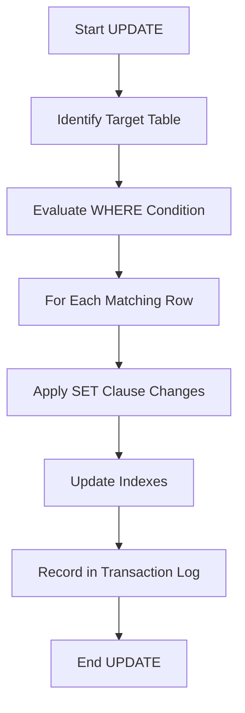

# SQL UPDATE Statement

## Introduction

The SQL UPDATE statement is a powerful data manipulation command that allows you to modify existing records in a database table. Whether you need to correct errors, refresh information, or implement changes to your data, the UPDATE statement is your go-to tool for making these modifications.

In this guide, we'll explore how the UPDATE statement works, its syntax, and how to use it safely and effectively. By the end, you'll be confidently updating your database records like a pro!

## Basic Syntax

The basic syntax of the SQL UPDATE statement is:

```sql
UPDATE table_name
SET column1 = value1, column2 = value2, ...
WHERE condition;
```

Let's break down this syntax:

- `UPDATE table_name`: Specifies the table containing the data you want to modify
- `SET column1 = value1, column2 = value2, ...`: Defines which columns to update and their new values
- `WHERE condition`: Determines which rows to update (this is optional but highly recommended)

:::caution
If you omit the WHERE clause, the UPDATE statement will modify **all rows** in the table! Always double-check your WHERE condition before executing an UPDATE statement.
:::

## Simple Example

Let's look at a basic example using a `customers` table:

```sql
-- Before UPDATE
SELECT * FROM customers WHERE customer_id = 1001;
```

**Output:**
```
customer_id | first_name | last_name | email              | city
-----------+------------+-----------+--------------------+---------
1001       | John       | Smith     | john.s@example.com | New York
```

Now, let's update John's email address:

```sql
-- Performing the UPDATE
UPDATE customers
SET email = 'john.smith@example.com'
WHERE customer_id = 1001;
```

**Output:**
```
Query OK, 1 row affected (0.01 sec)
```

After the UPDATE:

```sql
-- After UPDATE
SELECT * FROM customers WHERE customer_id = 1001;
```

**Output:**
```
customer_id | first_name | last_name | email                   | city
-----------+------------+-----------+-------------------------+---------
1001       | John       | Smith     | john.smith@example.com  | New York
```

As you can see, John's email address has been successfully updated!

## Updating Multiple Columns

You can update multiple columns in a single UPDATE statement by separating them with commas in the SET clause:

```sql
UPDATE customers
SET email = 'john.smith@example.com',
    city = 'Boston'
WHERE customer_id = 1001;
```

**Output:**
```
Query OK, 1 row affected (0.01 sec)
```

This changes both John's email and city in one operation.

## Update with Expressions

The UPDATE statement can use expressions and functions to calculate new values:

```sql
-- Adding a 10% discount to all products in a specific category
UPDATE products
SET price = price * 0.9
WHERE category = 'Electronics';
```

This reduces the price of all electronics products by 10%.

## Updating with Data from Other Tables

You can update a table based on values from another table using a subquery or JOIN:

### Using Subquery

```sql
UPDATE employees
SET salary = salary * 1.1
WHERE department_id IN (SELECT department_id FROM departments WHERE location = 'New York');
```

This gives a 10% raise to all employees in New York departments.

### Using JOIN (MySQL/MariaDB syntax)

```sql
UPDATE employees e
JOIN departments d ON e.department_id = d.department_id
SET e.salary = e.salary * 1.1
WHERE d.location = 'New York';
```

## Conditional Updates with CASE

The CASE expression lets you apply conditional logic in your updates:

```sql
UPDATE products
SET status = CASE
    WHEN stock_quantity = 0 THEN 'Out of Stock'
    WHEN stock_quantity < 10 THEN 'Low Stock'
    ELSE 'In Stock'
END;
```

This updates the status of products based on their stock quantity.

## UPDATE with Limit (MySQL specific)

In MySQL, you can limit the number of rows affected by an UPDATE:

```sql
UPDATE customers
SET membership_status = 'Gold'
WHERE spending_points > 1000
ORDER BY spending_points DESC
LIMIT 100;
```

This upgrades only the top 100 customers with the highest spending points to Gold status.

## Real-World Applications

Let's explore some practical applications of the UPDATE statement:

### 1. Customer Data Management

```sql
-- Update customer contact information
UPDATE customers
SET phone = '555-123-4567',
    address = '123 Main St',
    last_updated = CURRENT_TIMESTAMP
WHERE customer_id = 2001;
```

### 2. Inventory Management

```sql
-- Update stock quantities after a sale
UPDATE inventory
SET quantity = quantity - 5,
    last_sold_date = CURRENT_DATE
WHERE product_id = 'P1001';
```

### 3. Data Cleanup

```sql
-- Standardize email formats
UPDATE users
SET email = LOWER(email)
WHERE email LIKE '%[A-Z]%';

-- Fix formatting issues in phone numbers
UPDATE customers
SET phone = CONCAT('(', SUBSTRING(phone, 1, 3), ') ', SUBSTRING(phone, 4, 3), '-', SUBSTRING(phone, 7))
WHERE phone LIKE '___________';
```

### 4. Batch Processing

```sql
-- Deactivate accounts that haven't been accessed in over a year
UPDATE user_accounts
SET status = 'Inactive',
    deactivation_date = CURRENT_DATE
WHERE last_login_date < DATE_SUB(CURRENT_DATE, INTERVAL 1 YEAR)
AND status = 'Active';
```

## Best Practices

To use UPDATE statements effectively and safely:

1. **Always use the WHERE clause** unless you truly want to update all rows
2. **Test with SELECT first** - construct your WHERE clause in a SELECT statement to verify which rows will be affected
3. **Use transactions** for important updates:
   ```sql
   BEGIN TRANSACTION;
   UPDATE important_table SET critical_value = 'new_value' WHERE id = 123;
   -- Check results if possible
   COMMIT; -- or ROLLBACK if something went wrong
   ```
4. **Limit the scope** of your updates to minimize impact
5. **Consider using table aliases** for clarity in complex updates
6. **Back up your data** before major update operations

## How UPDATE Works

Behind the scenes, when you execute an UPDATE statement, the database engine:

1. Identifies the target table
2. Evaluates the WHERE condition to determine which rows to modify
3. For each matching row, applies the SET clause changes
4. Updates indexes as needed
5. Records the changes in the transaction log

This process can be visualized as:



## Common Errors and How to Avoid Them

1. **Updating too many rows**
   - Solution: Always double-check your WHERE clause and test with SELECT first

2. **Syntax errors in column names or values**
   - Solution: Verify column names exist and use appropriate quoting for string values

3. **Constraint violations**
   - Solution: Ensure your updates comply with table constraints like unique indexes

4. **Locking issues in high-concurrency environments**
   - Solution: Keep updates small and fast, and handle deadlocks appropriately

## Summary

The SQL UPDATE statement is an essential tool for maintaining and modifying data in your database. In this guide, we've covered:

- Basic syntax and usage of the UPDATE statement
- How to update multiple columns at once
- Using expressions and functions in updates
- Updating with data from other tables
- Conditional updates with CASE
- Real-world applications and best practices

Remember that while the UPDATE statement is powerful, it should be used with care. Always double-check your WHERE conditions, test with SELECT statements first, and consider using transactions for important updates.

With these skills and precautions in mind, you're now ready to confidently modify your database data using the SQL UPDATE statement!

## Exercises

Try these exercises to practice your UPDATE skills:

1. Create a table called `practice_customers` with columns for `id`, `name`, `email`, and `status`. Insert a few sample rows.

2. Write an UPDATE statement to change the status of all customers to 'Active'.

3. Write an UPDATE statement to change only the email address of the customer with ID 1.

4. Write an UPDATE statement that uses a calculation or function (like UPPER() or concatenation).

5. Advanced: Write an UPDATE statement that uses data from another table.

## Additional Resources

- [SQL UPDATE documentation](https://www.w3schools.com/sql/sql_update.asp)
- [MySQL UPDATE Statement Reference](https://dev.mysql.com/doc/refman/8.0/en/update.html)
- [PostgreSQL UPDATE Documentation](https://www.postgresql.org/docs/current/sql-update.html)
- [SQL UPDATE Statement Tutorial by Mode Analytics](https://mode.com/sql-tutorial/sql-update-statement/)