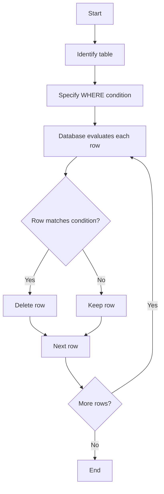

# SQL DELETE Statement

## Introduction

The SQL `DELETE` statement is a fundamental Data Manipulation Language (DML) command used to remove existing records from a database table. When working with databases, you'll often need to remove outdated, incorrect, or unnecessary data. The `DELETE` statement provides a powerful way to perform this operation with precision.

In this tutorial, you'll learn:
- The basic syntax of the `DELETE` statement
- How to delete specific rows using conditions
- How to delete all rows from a table
- Best practices and safety measures when deleting data
- Real-world examples of when and how to use `DELETE`

## Basic Syntax

The SQL `DELETE` statement follows this basic syntax:

```sql
DELETE FROM table_name
WHERE condition;
```

Let's break down the components:
- `DELETE FROM`: The command that tells SQL you want to remove data
- `table_name`: The name of the table containing the records you want to delete
- `WHERE`: An optional clause that specifies which records to delete
- `condition`: The criteria that determines which rows will be deleted

If you omit the `WHERE` clause, **all records** in the table will be deleted, so be careful!

## Deleting Specific Rows

The power of the `DELETE` statement comes from its ability to target specific rows using the `WHERE` clause. Let's look at some examples.

### Example 1: Delete a Single Row

Imagine we have a `customers` table and want to delete the customer with ID 101:

```sql
DELETE FROM customers
WHERE customer_id = 101;
```

**Result:** The customer with ID 101 is permanently removed from the table.

### Example 2: Delete Multiple Rows with a Condition

Let's say we want to delete all inactive customers (those who haven't logged in for over a year):

```sql
DELETE FROM customers
WHERE last_login_date < '2023-03-01';
```

**Result:** All customers who haven't logged in since March 1, 2023, are removed from the table.

### Example 3: Delete Rows Based on Multiple Conditions

We can use logical operators to create more complex conditions:

```sql
DELETE FROM products
WHERE (price < 10.00 AND stock_quantity = 0)
   OR expiration_date < CURRENT_DATE;
```

**Result:** This deletes all products that are both under $10 and out of stock, as well as any expired products.

## Deleting All Rows

If you want to remove all rows from a table, you can use the `DELETE` statement without a `WHERE` clause:

```sql
DELETE FROM temporary_logs;
```

**Warning:** This removes ALL records from the table but keeps the table structure intact. This operation cannot be undone unless you have a backup or transaction rollback capability.

## Using DELETE with JOIN (Advanced)

In some database systems like MySQL, you can use `DELETE` with a `JOIN` to delete rows based on data in another table.

### Example: Delete Orders from Inactive Customers

```sql
DELETE orders
FROM orders
JOIN customers ON orders.customer_id = customers.customer_id
WHERE customers.status = 'inactive';
```

**Result:** This deletes all orders associated with inactive customers.

## Safe Deletion Practices

Deleting data is a permanent operation (unless you're using transactions). Here are some best practices to follow:

1. **Always back up your data** before performing large delete operations
2. **Use transactions** for complex delete operations:
   ```sql
   BEGIN TRANSACTION;
   
   DELETE FROM orders
   WHERE order_date < '2020-01-01';
   
   -- Check if everything looks good
   -- If not, you can ROLLBACK
   
   COMMIT;
   ```

3. **Test your `WHERE` clause** with a `SELECT` statement first:
   ```sql
   -- First, check which rows will be affected
   SELECT * FROM customers
   WHERE last_login_date < '2023-03-01';
   
   -- If the results look correct, proceed with deletion
   DELETE FROM customers
   WHERE last_login_date < '2023-03-01';
   ```

4. **Use database constraints** like foreign keys with `ON DELETE` actions to maintain data integrity

## Real-World Applications

Let's look at some common scenarios where the `DELETE` statement is used:

### Data Cleanup

Regularly removing old, temporary data to keep databases efficient:

```sql
-- Delete logs older than 90 days
DELETE FROM system_logs
WHERE log_date < DATEADD(day, -90, GETDATE());
```

### User Account Management

When users request account deletion:

```sql
-- First, handle foreign key dependencies
DELETE FROM user_preferences
WHERE user_id = 5432;

DELETE FROM user_sessions
WHERE user_id = 5432;

-- Finally, delete the user
DELETE FROM users
WHERE user_id = 5432;
```

### Inventory Management

Removing discontinued products:

```sql
DELETE FROM products
WHERE status = 'discontinued'
AND last_ordered_date < DATEADD(month, -6, GETDATE());
```

## Common Errors and Troubleshooting

When working with the `DELETE` statement, you might encounter these common issues:

### Foreign Key Constraint Violations

If you try to delete a record that has related records in other tables, you'll get a foreign key constraint error:

```
Error: Cannot delete or update a parent row: a foreign key constraint fails
```

**Solution**: Either delete the related records first, use cascading deletes, or update the related records to reference a different parent.

### Syntax Errors

Make sure you're using the correct syntax for your specific database system, as there can be slight variations.

### Accidental Deletion of All Records

If you forget the `WHERE` clause, you'll delete all records in the table.

**Solution**: Always use transactions for significant delete operations, so you can roll back if needed.

## Visualizing the DELETE Process

Here's a simple diagram showing how the DELETE statement works with a WHERE condition:



## Summary

The SQL `DELETE` statement is a powerful tool for removing unwanted records from your database tables. Key points to remember:

- Use the `WHERE` clause to specify which records to delete
- Without a `WHERE` clause, all records in the table will be deleted
- Always test your conditions with `SELECT` before deleting
- Use transactions for safety when performing significant delete operations
- Consider the impact on related tables when deleting records

By mastering the `DELETE` statement, you'll be able to maintain clean, efficient databases and implement data lifecycle management in your applications.

## Exercises

Practice what you've learned with these exercises:

1. Create a table called `practice_customers` with columns for `id`, `name`, `email`, and `signup_date`.
2. Insert at least 10 sample records.
3. Write a `DELETE` statement to remove customers who signed up before 2022.
4. Write a `DELETE` statement that removes a specific customer by their email address.
5. Advanced: Create a related table `practice_orders` with a foreign key to `practice_customers` and practice deleting data while maintaining referential integrity.

## Additional Resources

- [SQL DELETE Statement - W3Schools](https://www.w3schools.com/sql/sql_delete.asp)
- [MySQL DELETE Statement Documentation](https://dev.mysql.com/doc/refman/8.0/en/delete.html)
- [PostgreSQL DELETE Documentation](https://www.postgresql.org/docs/current/sql-delete.html)