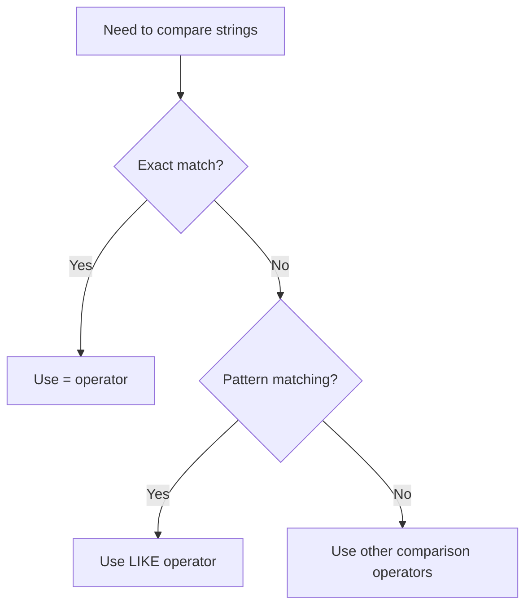

# SQL LIKE Operator

## Introduction

The SQL `LIKE` operator is a powerful tool for pattern matching in string comparisons. It allows you to search for specific patterns within text data rather than exact matches. This is particularly useful when you're working with text fields and need to find records that contain certain characters, start or end with specific patterns, or match more complex string patterns.

In this tutorial, you'll learn how to use the SQL `LIKE` operator to perform flexible string searches in your database queries. This is an essential skill for data filtering and manipulation tasks in SQL.

## Basic Syntax

The basic syntax for the `LIKE` operator in a SQL query is:

```sql
SELECT column1, column2, ...
FROM table_name
WHERE columnN LIKE pattern;
```

The `pattern` is a string that can include special wildcard characters:

- `%` (percent sign): Represents zero, one, or multiple characters
- `_` (underscore): Represents a single character

## Wildcard Characters Explained

### The Percent Sign (%)

The percent sign represents any sequence of zero or more characters. For example:

```sql
SELECT * FROM employees WHERE last_name LIKE 'S%';
```

This query will return all employees whose last name starts with 'S', followed by any number of characters.

### The Underscore (_)

The underscore represents exactly one character. For example:

```sql
SELECT * FROM products WHERE product_code LIKE 'ABC-1__';
```

This query will return all products with a product code that starts with 'ABC-1' followed by exactly two characters.

## Common LIKE Pattern Examples

Let's explore some common patterns using the `LIKE` operator:

### 1. Starting with a specific pattern

To find strings that start with a specific pattern:

```sql
SELECT * FROM customers WHERE city LIKE 'New%';
```

This will match cities like "New York", "New Orleans", "New Delhi", etc.

### 2. Ending with a specific pattern

To find strings that end with a specific pattern:

```sql
SELECT * FROM products WHERE product_name LIKE '%phone';
```

This will match product names like "iPhone", "Smartphone", "Headphone", etc.

### 3. Containing a specific pattern

To find strings that contain a specific pattern anywhere:

```sql
SELECT * FROM books WHERE title LIKE '%SQL%';
```

This will match book titles containing "SQL" anywhere in the title, such as "Learning SQL Basics", "SQL for Beginners", etc.

### 4. Matching a specific length

To find strings of a specific length:

```sql
SELECT * FROM products WHERE product_code LIKE '____';
```

This will match product codes that are exactly 4 characters long.

### 5. Starting and ending with specific patterns

To find strings that start and end with specific patterns:

```sql
SELECT * FROM employees WHERE email LIKE 'j%@company.com';
```

This will match emails that start with 'j' and end with '@company.com', such as "john@company.com", "jane@company.com", etc.

## Practical Examples

Let's look at some practical examples using a sample database.

### Example 1: Customer Database

Suppose we have a `customers` table with the following structure:

```sql
CREATE TABLE customers (
    customer_id INT PRIMARY KEY,
    first_name VARCHAR(50),
    last_name VARCHAR(50),
    email VARCHAR(100),
    phone VARCHAR(20),
    city VARCHAR(50)
);
```

With sample data:

```sql
INSERT INTO customers VALUES
(1, 'John', 'Smith', 'john.smith@example.com', '555-1234', 'New York'),
(2, 'Jane', 'Doe', 'jane.doe@example.com', '555-5678', 'Los Angeles'),
(3, 'Bob', 'Johnson', 'bob.j@example.com', '555-9012', 'Chicago'),
(4, 'Sarah', 'Williams', 'sarah.w@example.net', '555-3456', 'New Orleans'),
(5, 'Mike', 'Brown', 'mike.brown@example.com', '555-7890', 'Boston');
```

Now, let's find customers with specific patterns:

```sql
-- Find customers whose last name starts with 'S'
SELECT * FROM customers WHERE last_name LIKE 'S%';

-- Output:
-- 1, John, Smith, john.smith@example.com, 555-1234, New York
```

```sql
-- Find customers whose email is on the example.com domain
SELECT first_name, last_name, email FROM customers WHERE email LIKE '%@example.com';

-- Output:
-- John, Smith, john.smith@example.com
-- Jane, Doe, jane.doe@example.com
-- Mike, Brown, mike.brown@example.com
```

```sql
-- Find customers who live in cities starting with 'New'
SELECT first_name, last_name, city FROM customers WHERE city LIKE 'New%';

-- Output:
-- John, Smith, New York
-- Sarah, Williams, New Orleans
```

### Example 2: Product Inventory

Consider a `products` table with the following structure:

```sql
CREATE TABLE products (
    product_id INT PRIMARY KEY,
    product_name VARCHAR(100),
    product_code VARCHAR(20),
    category VARCHAR(50),
    price DECIMAL(10,2)
);
```

With sample data:

```sql
INSERT INTO products VALUES
(101, 'Laptop Pro', 'LP-2023', 'Electronics', 1299.99),
(102, 'Smartphone X', 'SPX-10', 'Electronics', 899.99),
(103, 'Bluetooth Headphones', 'BH-100', 'Audio', 149.99),
(104, 'Wireless Mouse', 'WM-50', 'Accessories', 29.99),
(105, 'USB-C Cable 1m', 'UC-001', 'Cables', 9.99),
(106, 'USB-C Cable 2m', 'UC-002', 'Cables', 14.99);
```

Let's find products with specific patterns:

```sql
-- Find all products in the 'Electronics' category
SELECT product_name, product_code, price FROM products WHERE category LIKE 'Electr%';

-- Output:
-- Laptop Pro, LP-2023, 1299.99
-- Smartphone X, SPX-10, 899.99
```

```sql
-- Find all USB-C cables
SELECT * FROM products WHERE product_name LIKE '%USB-C%';

-- Output:
-- 105, USB-C Cable 1m, UC-001, Cables, 9.99
-- 106, USB-C Cable 2m, UC-002, Cables, 14.99
```

```sql
-- Find all products with a 3-digit number in their product code
SELECT product_name, product_code FROM products WHERE product_code LIKE '%-%___%';

-- Output:
-- Bluetooth Headphones, BH-100
```

## Escaping Special Characters

If you need to search for patterns that include the wildcard characters themselves (`%` or `_`), you'll need to escape them using an escape character. The escape character is defined using the `ESCAPE` clause.

```sql
-- Searching for product codes containing underscore
SELECT * FROM products WHERE product_code LIKE '%\_%' ESCAPE '\';
```

The exact syntax for escaping special characters may vary slightly between database systems, so be sure to check your database documentation.

## Case Sensitivity

In most SQL databases, the `LIKE` operator is case-insensitive by default. However, this can vary between database systems:

- MySQL: Case-insensitive by default, but you can use `BINARY` for case-sensitive comparisons: `WHERE column LIKE BINARY 'pattern'`
- PostgreSQL: Case-sensitive by default, but you can use `ILIKE` for case-insensitive comparisons: `WHERE column ILIKE 'pattern'`
- SQL Server: Depends on the database collation settings
- Oracle: Depends on the database's National Language Support (NLS) settings

## Performance Considerations

The `LIKE` operator, especially with wildcards at the beginning of patterns (e.g., `'%text'`), can be slow on large tables because it prevents the efficient use of indexes. Consider these performance tips:

1. Use `LIKE 'text%'` (with wildcard at the end) when possible, as this can use indexes
2. Consider full-text search for complex text searching needs
3. Use appropriate indexes on columns frequently searched with `LIKE`
4. For complex pattern matching, consider regular expressions if your database supports them

## LIKE Operator vs. Comparison Operators

It's important to understand when to use the `LIKE` operator versus standard comparison operators:



## Summary

The SQL `LIKE` operator is an essential tool for pattern matching in databases. In this tutorial, you've learned:

- How to use the `LIKE` operator for flexible string comparisons
- The meaning and usage of the wildcard characters `%` and `_`
- Common pattern matching techniques for different scenarios
- Practical examples applying the `LIKE` operator to real-world data
- How to handle special cases such as escaping wildcards and case sensitivity
- Performance considerations when using the `LIKE` operator

With this knowledge, you can write more powerful SQL queries to search and filter text data based on patterns rather than just exact matches.

## Exercises

Test your understanding of the SQL `LIKE` operator with these exercises:

1. Write a query to find all customers whose first name contains the letter 'a'.
2. Write a query to find all products that have a product code ending with a number.
3. Find all customers with a 5-character first name.
4. Find all products in the database with names that have exactly 10 characters.
5. Write a query to find email addresses that have a dot (.) in the username part (before the @ symbol).

## Additional Resources

To deepen your understanding of SQL string operations, check out these related topics:

- SQL Regular Expressions
- Full-Text Search
- SQL String Functions (CONCAT, SUBSTRING, LENGTH, etc.)
- SQL Indexes and Optimization for Text Searching

Happy querying!