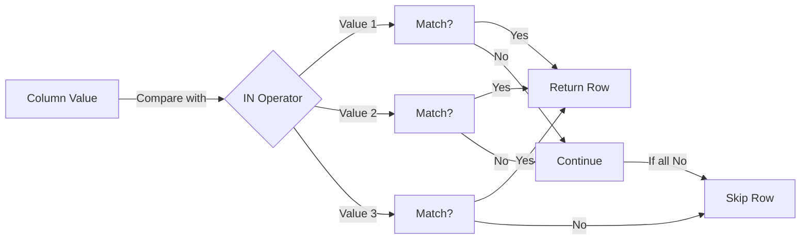

# SQL IN Operator

The IN operator is a powerful SQL feature that allows you to check if a value matches any value in a list of values. It's essentially a shorthand for multiple OR conditions and makes your queries cleaner and more readable.

## Introduction

When filtering data in SQL, you often need to check if a column value matches one of several possible values. For example, you might want to find products from specific categories or employees from particular departments.

Instead of writing multiple OR conditions like this:

```sql
SELECT * FROM products 
WHERE category = 'Electronics' OR category = 'Computers' OR category = 'Accessories';
```

You can use the IN operator to simplify your query:

```sql
SELECT * FROM products 
WHERE category IN ('Electronics', 'Computers', 'Accessories');
```

## Basic Syntax

The basic syntax of the IN operator is:

```sql
value IN (value1, value2, value3, ...)
```

or 

```sql
value IN (subquery)
```

Where:
- `value` is typically a column name or expression
- `value1, value2, ...` are the values to match against
- `subquery` is a SELECT statement that returns a single column of values

## Using the IN Operator with a List of Values

Let's look at a practical example using a sample `employees` table:

```sql
-- Sample employees table structure
CREATE TABLE employees (
    employee_id INT PRIMARY KEY,
    first_name VARCHAR(50),
    last_name VARCHAR(50),
    department VARCHAR(50),
    salary DECIMAL(10, 2)
);

-- Sample data
INSERT INTO employees VALUES 
(1, 'John', 'Smith', 'IT', 75000),
(2, 'Sarah', 'Johnson', 'Marketing', 65000),
(3, 'Michael', 'Brown', 'IT', 80000),
(4, 'Emily', 'Davis', 'HR', 60000),
(5, 'Robert', 'Wilson', 'Finance', 90000),
(6, 'Jennifer', 'Taylor', 'Marketing', 67000),
(7, 'David', 'Anderson', 'IT', 78000);
```

### Example 1: Finding employees in specific departments

To find all employees who work in either IT or Marketing:

```sql
SELECT employee_id, first_name, last_name, department
FROM employees
WHERE department IN ('IT', 'Marketing');
```

**Result:**

```
employee_id | first_name | last_name | department
------------|------------|-----------|------------
1           | John       | Smith     | IT
2           | Sarah      | Johnson   | Marketing
3           | Michael    | Brown     | IT
6           | Jennifer   | Taylor    | Marketing
7           | David      | Anderson  | IT
```

### Example 2: Using IN operator with numbers

Let's find employees with specific employee IDs:

```sql
SELECT employee_id, first_name, last_name, department
FROM employees
WHERE employee_id IN (1, 3, 5);
```

**Result:**

```
employee_id | first_name | last_name | department
------------|------------|-----------|------------
1           | John       | Smith     | IT
3           | Michael    | Brown     | IT
5           | Robert     | Wilson    | Finance
```

## Using the NOT IN Operator

You can combine the IN operator with NOT to find values that don't match any value in the list.

### Example 3: Finding employees NOT in specific departments

```sql
SELECT employee_id, first_name, last_name, department
FROM employees
WHERE department NOT IN ('IT', 'Marketing');
```

**Result:**

```
employee_id | first_name | last_name | department
------------|------------|-----------|------------
4           | Emily      | Davis     | HR
5           | Robert     | Wilson    | Finance
```

## Using the IN Operator with Subqueries

One of the most powerful ways to use the IN operator is with subqueries.

Let's add another table to our example:

```sql
-- Sample projects table
CREATE TABLE projects (
    project_id INT PRIMARY KEY,
    project_name VARCHAR(100),
    department VARCHAR(50)
);

-- Sample data
INSERT INTO projects VALUES
(101, 'Website Redesign', 'IT'),
(102, 'Summer Campaign', 'Marketing'),
(103, 'ERP Implementation', 'IT'),
(104, 'Budget Planning', 'Finance');
```

### Example 4: Finding employees in departments with active projects

```sql
SELECT employee_id, first_name, last_name, department
FROM employees
WHERE department IN (
    SELECT department
    FROM projects
);
```

**Result:**

```
employee_id | first_name | last_name | department
------------|------------|-----------|------------
1           | John       | Smith     | IT
2           | Sarah      | Johnson   | Marketing
3           | Michael    | Brown     | IT
5           | Robert     | Wilson    | Finance
6           | Jennifer   | Taylor    | Marketing
7           | David      | Anderson  | IT
```

This query finds all employees whose department has at least one active project.

## Performance Considerations

The IN operator is generally efficient, but here are some tips:

1. **Indexed columns**: The IN operator can utilize indexes on the column being checked.
2. **List size**: For very large lists, there might be a performance impact. Most databases have limits on the number of items in an IN list.
3. **Subqueries**: When using IN with a subquery, ensure the subquery is optimized.

## Real-World Applications

### Example 5: E-commerce product filtering

Imagine you have an e-commerce database and want to find all products in specific categories that are on sale:

```sql
SELECT product_id, product_name, price, discount_price
FROM products
WHERE category_id IN (1, 3, 7)  -- Electronics, Computers, Accessories
AND sale_status = 'ON_SALE';
```

### Example 6: Reporting on sales in specific regions

For a sales report on specific regions:

```sql
SELECT 
    order_id,
    customer_name,
    order_amount,
    region
FROM orders
WHERE YEAR(order_date) = 2023
AND region IN ('North', 'West', 'Central');
```

## Common Errors and Troubleshooting

### NULL Values

The IN operator doesn't match NULL values. If you need to check for NULL values, you'll need to use `IS NULL` in addition to your IN condition:

```sql
SELECT * FROM employees
WHERE department IN ('IT', 'Marketing') OR department IS NULL;
```

### Type Mismatches

Make sure the data types in your IN list match the column type:

```sql
-- This will cause an error if employee_id is a number
SELECT * FROM employees
WHERE employee_id IN ('1', '3', '5');  -- Strings instead of numbers
```

## Visualizing the IN Operator

Here's a simple visualization of how the IN operator works:



## Summary

The SQL IN operator is a powerful tool for filtering data based on multiple possible values. Key points to remember:

- It's equivalent to multiple OR conditions but more concise
- Can be used with both literal values and subqueries
- Works with numbers, strings, dates, and other data types
- Can be combined with NOT for exclusion logic
- Doesn't match NULL values (you need to handle those separately)

By mastering the IN operator, you'll write cleaner, more readable SQL queries and optimize your database operations.

## Practice Exercises

1. Write a query to find all employees with employee_id values of 2, 4, and 6.
2. Find all employees who are NOT in IT or Finance departments.
3. Find all projects in departments that have employees with salaries over $70,000.
4. Write a query using IN with a subquery to find all employees in departments that have at least 2 employees.

## Additional Resources

- [SQL WHERE Clause](https://www.w3schools.com/sql/sql_where.asp)
- [SQL Operators](https://www.w3schools.com/sql/sql_operators.asp)
- [SQL Subqueries](https://www.w3schools.com/sql/sql_subqueries.asp)