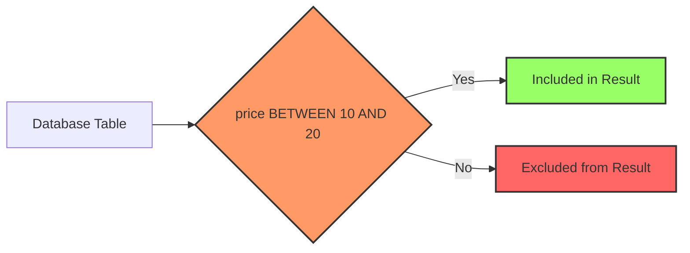

# SQL BETWEEN Operator

## Introduction

The BETWEEN operator is a useful SQL feature that allows you to select values within a specified range. It's a concise alternative to writing range conditions using comparison operators like `>=` and `<=`.

When working with databases, you'll often need to filter data based on ranges – such as dates, numbers, or even alphabetical ranges. The BETWEEN operator simplifies this task by providing a clean, readable syntax for specifying inclusive ranges in your queries.

## Syntax

The basic syntax for the BETWEEN operator is:

```sql
SELECT column_name(s)
FROM table_name
WHERE column_name BETWEEN value1 AND value2;
```

This statement will return all rows where `column_name` has values that fall between `value1` and `value2` (including both values).

## Key Features

- **Inclusive Range**: BETWEEN returns values that are greater than or equal to `value1` AND less than or equal to `value2`.
- **Works with Various Data Types**: You can use BETWEEN with numbers, dates, text, and more.
- **Simplifies Range Queries**: Makes your code more readable than using multiple comparison operators.

## Basic Examples

### Numeric Ranges

Let's say we have a `products` table with product information:

```sql
SELECT product_name, price
FROM products
WHERE price BETWEEN 10 AND 20;
```

**Output:**
```
| product_name  | price |
|---------------|-------|
| T-shirt       | 15.99 |
| Coffee Mug    | 12.50 |
| Notebook      | 10.25 |
| Water Bottle  | 19.99 |
```

This returns all products priced between $10 and $20 (inclusive).

### Date Ranges

The BETWEEN operator works well with dates:

```sql
SELECT order_id, customer_name, order_date
FROM orders
WHERE order_date BETWEEN '2023-01-01' AND '2023-01-31';
```

**Output:**
```
| order_id | customer_name | order_date  |
|----------|---------------|-------------|
| 1001     | John Smith    | 2023-01-05  |
| 1008     | Mary Johnson  | 2023-01-12  |
| 1015     | Robert Brown  | 2023-01-27  |
```

This returns all orders placed in January 2023.

### Text Ranges

BETWEEN can also be used with text values:

```sql
SELECT last_name, first_name
FROM employees
WHERE last_name BETWEEN 'A' AND 'D';
```

**Output:**
```
| last_name | first_name |
|-----------|------------|
| Adams     | Sarah      |
| Brown     | Michael    |
| Collins   | Patricia   |
| Davis     | Thomas     |
```

This returns employees whose last names start with A, B, C, or D.

## NOT BETWEEN Operator

You can also use `NOT BETWEEN` to find values outside a specified range:

```sql
SELECT product_name, price
FROM products
WHERE price NOT BETWEEN 10 AND 20;
```

**Output:**
```
| product_name  | price |
|---------------|-------|
| Headphones    | 59.99 |
| Pen Set       | 5.99  |
| Backpack      | 45.00 |
| Mouse Pad     | 8.50  |
```

This returns all products with prices less than $10 or more than $20.

## Combining with Other Conditions

You can combine BETWEEN with other conditions using AND and OR operators:

```sql
SELECT product_name, price, category
FROM products
WHERE price BETWEEN 10 AND 20
AND category = 'Office Supplies';
```

**Output:**
```
| product_name  | price | category        |
|---------------|-------|-----------------|
| Notebook      | 10.25 | Office Supplies |
| Stapler       | 15.75 | Office Supplies |
| Sticky Notes  | 12.99 | Office Supplies |
```

This returns office supplies products priced between $10 and $20.

## BETWEEN with NULL Values

It's important to note that NULL values will not be included when using BETWEEN. If a column contains NULL in your table, those rows won't be returned by a BETWEEN query for that column.

## Real-World Application: E-commerce Filtering

One of the most common real-world applications of the BETWEEN operator is in e-commerce websites where users can filter products by price range.

Let's imagine you're building a backend for an online store where customers want to see products within a specific price range:

```sql
-- Query to power the price range filter
SELECT 
    product_id,
    product_name,
    category,
    price,
    average_rating
FROM 
    products
WHERE 
    price BETWEEN 50 AND 100
    AND category = 'Electronics'
ORDER BY 
    average_rating DESC
LIMIT 10;
```

**Output:**
```
| product_id | product_name        | category    | price | average_rating |
|------------|---------------------|-------------|-------|----------------|
| 305        | Wireless Earbuds    | Electronics | 79.99 | 4.8            |
| 287        | Bluetooth Speaker   | Electronics | 89.99 | 4.7            |
| 412        | Power Bank          | Electronics | 59.99 | 4.6            |
| 156        | Smart Watch Band    | Electronics | 54.99 | 4.5            |
| 234        | Gaming Mouse        | Electronics | 65.99 | 4.4            |
```

## Real-World Application: Reporting System

Another common use case is in reporting systems, where you might need to analyze data for a specific period:

```sql
-- Monthly sales report query
SELECT 
    product_category,
    SUM(order_amount) AS total_sales,
    COUNT(order_id) AS number_of_orders
FROM 
    sales
WHERE 
    order_date BETWEEN '2023-06-01' AND '2023-06-30'
GROUP BY 
    product_category
ORDER BY 
    total_sales DESC;
```

**Output:**
```
| product_category | total_sales | number_of_orders |
|------------------|-------------|------------------|
| Electronics      | 45250.00    | 187              |
| Clothing         | 28750.50    | 324              |
| Home & Kitchen   | 18340.75    | 156              |
| Beauty           | 12480.25    | 143              |
```

## Understanding BETWEEN vs. Comparison Operators

The BETWEEN operator is equivalent to using greater than or equal to AND less than or equal to operators:

```sql
-- These two queries are equivalent
SELECT product_name, price
FROM products
WHERE price BETWEEN 10 AND 20;

SELECT product_name, price
FROM products
WHERE price >= 10 AND price <= 20;
```

Using BETWEEN makes your queries more concise and easier to read, especially when working with complex conditions.

## Visual Representation

Here's a simple diagram showing how the BETWEEN operator works:



## Common Mistakes and Troubleshooting

### String Comparison Confusion

When using BETWEEN with strings, be aware that it performs a lexicographical comparison:

```sql
-- This will return names from 'A' to 'C', but NOT names starting with 'D'
SELECT * FROM employees WHERE last_name BETWEEN 'A' AND 'C';
```

If you want to include names starting with 'D', use:

```sql
SELECT * FROM employees WHERE last_name BETWEEN 'A' AND 'D\uffff';
```

### Date Format Issues

Always ensure dates are in the correct format for your database:

```sql
-- This may cause errors or unexpected results if not in the correct format
SELECT * FROM orders WHERE order_date BETWEEN '01-01-2023' AND '31-01-2023';

-- Using ISO format is generally safer
SELECT * FROM orders WHERE order_date BETWEEN '2023-01-01' AND '2023-01-31';
```

## Performance Considerations

The BETWEEN operator can use indexes effectively, which is important for performance when working with large datasets. However, be aware that the execution plan may vary depending on your database system and the specific query.

## Summary

The SQL BETWEEN operator provides a clean, readable way to filter data within a specified range. Key points to remember:

- It's inclusive of both start and end values
- It works with various data types, including numbers, dates, and text
- It's equivalent to using `>=` and `<=` comparison operators together
- It's commonly used in filtering and reporting scenarios
- NULL values are not included in BETWEEN results

By mastering the BETWEEN operator, you'll be able to write more concise and readable SQL queries, especially when dealing with range-based data filtering.

## Exercises

1. Write a query to find all products with prices between $25 and $50 from a `products` table.
2. Create a query to find employees who were hired between January 1, 2020, and December 31, 2022.
3. Write a query to find customers whose last names are alphabetically between 'Johnson' and 'Smith'.
4. Create a query to find orders with quantities not between 5 and 20.
5. Write a query that combines the BETWEEN operator with GROUP BY to find the total sales for each product category for transactions that occurred between specific dates.

## Additional Resources

- [SQL WHERE Clause](https://www.w3schools.com/sql/sql_where.asp)
- [SQL Comparison Operators](https://www.w3schools.com/sql/sql_operators.asp)
- [SQL Date Functions](https://www.w3schools.com/sql/sql_dates.asp)