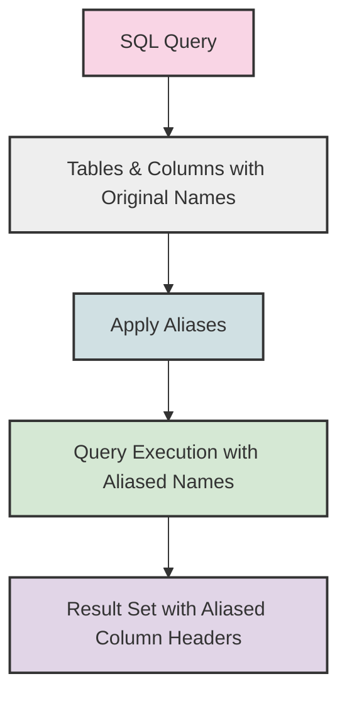

# SQL Aliases

## Introduction

When working with databases, you'll often find yourself dealing with long table names or column names that can make your SQL queries hard to read. SQL aliases come to the rescue by allowing you to assign temporary, alternative names to tables and columns during a query execution. Think of aliases as nicknames that make your SQL code more concise and readable.

In this tutorial, we'll explore two main types of SQL aliases:
- Column aliases
- Table aliases

## Column Aliases

### What Are Column Aliases?

Column aliases are temporary names assigned to columns in your query results. They're particularly useful when:
- Working with calculated fields
- Making column names more readable
- Avoiding ambiguity in column names

### Basic Syntax

```sql
SELECT column_name AS alias_name
FROM table_name;
```

The `AS` keyword is used to create the alias, though it's optional in most database systems.

### Column Alias Examples

#### Example 1: Simple Column Alias

```sql
-- Without alias
SELECT first_name FROM employees;

-- With alias
SELECT first_name AS name FROM employees;
```

**Output:**
```
name
------
John
Jane
Mark
Sarah
```

The result column is labeled as "name" instead of "first_name" in the output.

#### Example 2: Alias for Calculated Fields

```sql
-- Without alias
SELECT product_name, unit_price * units_in_stock FROM products;

-- With alias
SELECT product_name, unit_price * units_in_stock AS total_value 
FROM products;
```

**Output:**
```
product_name    total_value
-------------   -----------
Chai            432.00
Chang           475.00
Aniseed Syrup   100.00
```

The calculated field (multiplication result) is now labeled with the meaningful name "total_value".

#### Example 3: Aliases Without the AS Keyword

In most SQL databases, the `AS` keyword is optional:

```sql
SELECT first_name name, last_name surname
FROM employees;
```

**Output:**
```
name    surname
------  --------
John    Smith
Jane    Doe
Mark    Johnson
```

#### Example 4: Aliases with Spaces

If your alias contains spaces, enclose it in quotes:

```sql
SELECT employee_id AS "Employee ID", 
       first_name AS "First Name", 
       last_name AS "Last Name"
FROM employees;
```

**Output:**
```
Employee ID    First Name    Last Name
-----------    ----------    ---------
1              John          Smith
2              Jane          Doe
3              Mark          Johnson
```

## Table Aliases

### What Are Table Aliases?

Table aliases are temporary alternative names for tables in a query. They're especially valuable when:
- Working with multiple tables in joins
- Self-joining a table
- Making complex queries more readable

### Basic Syntax

```sql
SELECT column_name
FROM table_name AS alias_name;
```

As with column aliases, the `AS` keyword is optional.

### Table Alias Examples

#### Example 1: Simple Table Alias

```sql
-- Without alias
SELECT employees.first_name, employees.last_name
FROM employees;

-- With alias
SELECT e.first_name, e.last_name
FROM employees AS e;
```

Both queries produce the same result, but the second one is more concise.

**Output:**
```
first_name    last_name
----------    ---------
John          Smith
Jane          Doe
Mark          Johnson
```

#### Example 2: Aliases in Joins

```sql
SELECT o.order_id, c.customer_name
FROM orders AS o
JOIN customers AS c ON o.customer_id = c.customer_id;
```

**Output:**
```
order_id    customer_name
--------    -------------
1001        Acme Corp
1002        Widget Inc
1003        Acme Corp
```

Using aliases makes join statements much more readable.

#### Example 3: Self-Join with Aliases

When joining a table to itself, aliases are essential:

```sql
SELECT e1.first_name AS employee, e2.first_name AS manager
FROM employees e1
JOIN employees e2 ON e1.manager_id = e2.employee_id;
```

**Output:**
```
employee    manager
--------    -------
John        Sarah
Jane        Sarah
Mark        John
```

Here, we've used aliases to distinguish between the same table used in different roles.

## Practical Applications

### Scenario 1: Sales Analysis Dashboard

Imagine you're creating a sales dashboard and need to present data in a readable format:

```sql
SELECT 
    p.product_name,
    c.category_name AS category,
    SUM(od.quantity * od.unit_price) AS total_revenue,
    COUNT(o.order_id) AS order_count
FROM 
    orders o
JOIN 
    order_details od ON o.order_id = od.order_id
JOIN 
    products p ON od.product_id = p.product_id
JOIN 
    categories c ON p.category_id = c.category_id
WHERE 
    o.order_date BETWEEN '2023-01-01' AND '2023-12-31'
GROUP BY 
    p.product_name, c.category_name
ORDER BY 
    total_revenue DESC;
```

This query uses both table and column aliases to create a clear, organized view of sales data.

### Scenario 2: Employee Directory Report

Creating a report that combines data from multiple employee-related tables:

```sql
SELECT 
    e.employee_id AS "ID",
    e.first_name || ' ' || e.last_name AS "Full Name",
    d.department_name AS "Department",
    l.city || ', ' || l.country AS "Location",
    m.first_name || ' ' || m.last_name AS "Manager"
FROM 
    employees e
JOIN 
    departments d ON e.department_id = d.department_id
JOIN 
    locations l ON d.location_id = l.location_id
LEFT JOIN 
    employees m ON e.manager_id = m.employee_id;
```

This query demonstrates how aliases can help organize complex joins and create meaningful output column names.

## Best Practices for SQL Aliases

1. **Use Meaningful Names**: Choose aliases that make sense and indicate what the data represents.
   ```sql
   -- Good
   SELECT p.product_name FROM products p;
   
   -- Not so good
   SELECT x.product_name FROM products x;
   ```

2. **Be Consistent**: Adopt a naming convention for your aliases and stick with it.
   ```sql
   -- Consistent 
   SELECT c.customer_name, o.order_date
   FROM customers c
   JOIN orders o ON c.customer_id = o.customer_id;
   ```

3. **Keep It Short**: Aliases should make your code more readable, not longer.
   ```sql
   -- Too long
   SELECT product_inventory.quantity
   FROM product_inventory;
   
   -- Better
   SELECT pi.quantity
   FROM product_inventory pi;
   ```

4. **Use AS for Clarity**: While optional, including the `AS` keyword can make your code easier to read.
   ```sql
   -- With AS (more explicit)
   SELECT first_name AS name FROM employees;
   
   -- Without AS
   SELECT first_name name FROM employees;
   ```

## When to Use SQL Aliases

Use SQL aliases when:
1. You need to make your query results more readable
2. You're working with calculated fields that need descriptive names
3. You're joining multiple tables and want to avoid typing long table names
4. You're joining a table to itself (self-join)
5. Column names in different tables conflict with each other

## Visualizing SQL Aliases



## Summary

SQL aliases are a powerful feature that helps you:
- Create temporary, alternative names for tables and columns
- Make your queries more readable and maintainable
- Work more efficiently with complex queries and joins
- Present your query results with more meaningful column headers

By using column aliases, you can provide better labels for your result sets, especially when dealing with calculations or concatenations. Table aliases shine when you're working with multiple tables, making your code more concise and easier to write.

## Exercises

1. **Basic Column Alias**: Write a query that selects the `product_name` and `unit_price` columns from a `products` table, aliasing them as "Product" and "Price" respectively.

2. **Calculated Field Alias**: Create a query that calculates a 10% discount on the `unit_price` in a `products` table and displays it with the alias "Discounted Price".

3. **Table Alias Practice**: Write a query that joins the `employees` and `departments` tables, using appropriate aliases, to display each employee's name alongside their department name.

4. **Challenge**: Write a self-join query using the `employees` table that displays each employee's name alongside their manager's name, using clear aliases throughout.

## Additional Resources

- [W3Schools SQL Aliases Tutorial](https://www.w3schools.com/sql/sql_alias.asp)
- [MySQL Documentation on SELECT Statement](https://dev.mysql.com/doc/refman/8.0/en/select.html)
- [PostgreSQL Documentation on SELECT](https://www.postgresql.org/docs/current/sql-select.html)

Happy SQL coding!