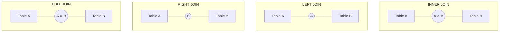

# SQL Joins Overview

## Introduction

SQL joins are powerful features that allow you to combine rows from two or more tables based on a related column between them. Joins are essential for working with relational databases, as they enable you to retrieve data from multiple tables in a single query, establishing relationships between different datasets.

In real-world applications, data is often distributed across multiple tables to maintain database normalization principles. For example, an e-commerce database might have separate tables for customers, orders, and products. Joins allow you to connect these tables to answer questions like "What products did customer X order?" or "Which customers purchased product Y?"

## Types of SQL Joins

There are four main types of SQL joins:

1. **INNER JOIN**: Returns records that have matching values in both tables
2. **LEFT JOIN** (or LEFT OUTER JOIN): Returns all records from the left table and matched records from the right table
3. **RIGHT JOIN** (or RIGHT OUTER JOIN): Returns all records from the right table and matched records from the left table
4. **FULL JOIN** (or FULL OUTER JOIN): Returns all records when there is a match in either the left or right table

Let's visualize these joins using Venn diagrams:



## Setting Up Example Tables

Before diving into the specifics of each join type, let's create two sample tables to work with throughout this tutorial.

```sql
-- Create Customers table
CREATE TABLE Customers (
    customer_id INT PRIMARY KEY,
    first_name VARCHAR(50),
    last_name VARCHAR(50),
    email VARCHAR(100)
);

-- Create Orders table
CREATE TABLE Orders (
    order_id INT PRIMARY KEY,
    customer_id INT,
    order_date DATE,
    total_amount DECIMAL(10, 2)
);

-- Insert sample data into Customers
INSERT INTO Customers VALUES
(1, 'John', 'Doe', 'john.doe@example.com'),
(2, 'Jane', 'Smith', 'jane.smith@example.com'),
(3, 'Robert', 'Johnson', 'robert.johnson@example.com'),
(4, 'Emily', 'Williams', 'emily.williams@example.com');

-- Insert sample data into Orders
INSERT INTO Orders VALUES
(101, 1, '2023-01-15', 150.75),
(102, 2, '2023-01-16', 89.99),
(103, 1, '2023-01-20', 45.50),
(104, 3, '2023-01-25', 210.25),
(105, NULL, '2023-01-28', 55.00);
```

Let's examine what our tables look like:

**Customers Table:**

| customer_id | first_name | last_name | email                      |
|-------------|------------|-----------|----------------------------|
| 1           | John       | Doe       | john.doe@example.com       |
| 2           | Jane       | Smith     | jane.smith@example.com     |
| 3           | Robert     | Johnson   | robert.johnson@example.com |
| 4           | Emily      | Williams  | emily.williams@example.com |

**Orders Table:**

| order_id | customer_id | order_date | total_amount |
|----------|-------------|------------|--------------|
| 101      | 1           | 2023-01-15 | 150.75       |
| 102      | 2           | 2023-01-16 | 89.99        |
| 103      | 1           | 2023-01-20 | 45.50        |
| 104      | 3           | 2023-01-25 | 210.25       |
| 105      | NULL        | 2023-01-28 | 55.00        |

Notice that:
- Customer with ID 4 (Emily) has no orders
- Order with ID 105 has no associated customer (NULL customer_id)

These scenarios will help demonstrate the differences between join types.

## INNER JOIN

An INNER JOIN returns only the rows where there is a match in both tables based on the specified condition. This is the most common type of join.

### Syntax

```sql
SELECT columns
FROM table1
INNER JOIN table2
ON table1.column = table2.column;
```

### Example

Let's retrieve a list of customers and their orders:

```sql
SELECT 
    c.customer_id,
    c.first_name,
    c.last_name,
    o.order_id,
    o.order_date,
    o.total_amount
FROM 
    Customers c
INNER JOIN 
    Orders o
ON 
    c.customer_id = o.customer_id;
```

### Result

| customer_id | first_name | last_name | order_id | order_date | total_amount |
|-------------|------------|-----------|----------|------------|--------------|
| 1           | John       | Doe       | 101      | 2023-01-15 | 150.75       |
| 1           | John       | Doe       | 103      | 2023-01-20 | 45.50        |
| 2           | Jane       | Smith     | 102      | 2023-01-16 | 89.99        |
| 3           | Robert     | Johnson   | 104      | 2023-01-25 | 210.25       |

### Explanation

Notice that:
- Only matching rows are returned
- Emily (customer_id = 4) doesn't appear because she has no orders
- Order 105 doesn't appear because it has no associated customer
- John Doe appears twice because he has two separate orders

## LEFT JOIN

A LEFT JOIN (or LEFT OUTER JOIN) returns all records from the left table and matching records from the right table. If there's no match in the right table, NULL values are returned for right table columns.

### Syntax

```sql
SELECT columns
FROM table1
LEFT JOIN table2
ON table1.column = table2.column;
```

### Example

Let's retrieve all customers and their orders (if any):

```sql
SELECT 
    c.customer_id,
    c.first_name,
    c.last_name,
    o.order_id,
    o.order_date,
    o.total_amount
FROM 
    Customers c
LEFT JOIN 
    Orders o
ON 
    c.customer_id = o.customer_id;
```

### Result

| customer_id | first_name | last_name | order_id | order_date | total_amount |
|-------------|------------|-----------|----------|------------|--------------|
| 1           | John       | Doe       | 101      | 2023-01-15 | 150.75       |
| 1           | John       | Doe       | 103      | 2023-01-20 | 45.50        |
| 2           | Jane       | Smith     | 102      | 2023-01-16 | 89.99        |
| 3           | Robert     | Johnson   | 104      | 2023-01-25 | 210.25       |
| 4           | Emily      | Williams  | NULL     | NULL       | NULL         |

### Explanation

Notice that:
- All customers are included in the result
- Emily appears with NULL values for order information since she has no orders
- The "left" table in this case is Customers

## RIGHT JOIN

A RIGHT JOIN (or RIGHT OUTER JOIN) returns all records from the right table and matching records from the left table. If there's no match in the left table, NULL values are returned for left table columns.

### Syntax

```sql
SELECT columns
FROM table1
RIGHT JOIN table2
ON table1.column = table2.column;
```

### Example

Let's retrieve all orders and their associated customers (if any):

```sql
SELECT 
    c.customer_id,
    c.first_name,
    c.last_name,
    o.order_id,
    o.order_date,
    o.total_amount
FROM 
    Customers c
RIGHT JOIN 
    Orders o
ON 
    c.customer_id = o.customer_id;
```

### Result

| customer_id | first_name | last_name | order_id | order_date | total_amount |
|-------------|------------|-----------|----------|------------|--------------|
| 1           | John       | Doe       | 101      | 2023-01-15 | 150.75       |
| 2           | Jane       | Smith     | 102      | 2023-01-16 | 89.99        |
| 1           | John       | Doe       | 103      | 2023-01-20 | 45.50        |
| 3           | Robert     | Johnson   | 104      | 2023-01-25 | 210.25       |
| NULL        | NULL       | NULL      | 105      | 2023-01-28 | 55.00        |

### Explanation

Notice that:
- All orders are included in the result
- Order 105 appears with NULL values for customer information since it has no associated customer
- The "right" table in this case is Orders

## FULL JOIN

A FULL JOIN (or FULL OUTER JOIN) returns all records when there is a match in either the left or right table. If there's no match, NULL values are returned for columns from the table without a match.

:::note
FULL JOIN is not supported in all database systems. For example, MySQL doesn't directly support FULL JOIN, but you can simulate it using a combination of LEFT JOIN, UNION, and RIGHT JOIN.
:::

### Syntax

```sql
SELECT columns
FROM table1
FULL JOIN table2
ON table1.column = table2.column;
```

### Example

Let's retrieve all customers and all orders, regardless of whether there's a match:

```sql
SELECT 
    c.customer_id,
    c.first_name,
    c.last_name,
    o.order_id,
    o.order_date,
    o.total_amount
FROM 
    Customers c
FULL JOIN 
    Orders o
ON 
    c.customer_id = o.customer_id;
```

### Result

| customer_id | first_name | last_name | order_id | order_date | total_amount |
|-------------|------------|-----------|----------|------------|--------------|
| 1           | John       | Doe       | 101      | 2023-01-15 | 150.75       |
| 1           | John       | Doe       | 103      | 2023-01-20 | 45.50        |
| 2           | Jane       | Smith     | 102      | 2023-01-16 | 89.99        |
| 3           | Robert     | Johnson   | 104      | 2023-01-25 | 210.25       |
| 4           | Emily      | Williams  | NULL     | NULL       | NULL         |
| NULL        | NULL       | NULL      | 105      | 2023-01-28 | 55.00        |

### Explanation

Notice that:
- All customers and all orders are included in the result
- Emily appears with NULL values for order information
- Order 105 appears with NULL values for customer information

## Practical Real-World Examples

Let's look at some practical examples of how joins are used in real-world scenarios.

### Example 1: Customer Order Summary

A common business requirement is to generate a summary of orders per customer:

```sql
SELECT 
    c.customer_id,
    c.first_name,
    c.last_name,
    COUNT(o.order_id) AS order_count,
    SUM(o.total_amount) AS total_spent
FROM 
    Customers c
LEFT JOIN 
    Orders o
ON 
    c.customer_id = o.customer_id
GROUP BY 
    c.customer_id, c.first_name, c.last_name;
```

Result:

| customer_id | first_name | last_name | order_count | total_spent |
|-------------|------------|-----------|-------------|-------------|
| 1           | John       | Doe       | 2           | 196.25      |
| 2           | Jane       | Smith     | 1           | 89.99       |
| 3           | Robert     | Johnson   | 1           | 210.25      |
| 4           | Emily      | Williams  | 0           | NULL        |

We use LEFT JOIN here to ensure all customers are included, even those without orders.

### Example 2: Finding Customers Who Haven't Placed Orders

This query identifies customers who haven't placed any orders:

```sql
SELECT 
    c.customer_id,
    c.first_name,
    c.last_name,
    c.email
FROM 
    Customers c
LEFT JOIN 
    Orders o
ON 
    c.customer_id = o.customer_id
WHERE 
    o.order_id IS NULL;
```

Result:

| customer_id | first_name | last_name | email                     |
|-------------|------------|-----------|---------------------------|
| 4           | Emily      | Williams  | emily.williams@example.com |

This information could be useful for marketing campaigns targeting inactive customers.

## Multiple Joins

In complex databases, you often need to join more than two tables. Let's add a Products table and an OrderItems table to demonstrate multiple joins:

```sql
-- Create Products table
CREATE TABLE Products (
    product_id INT PRIMARY KEY,
    product_name VARCHAR(100),
    price DECIMAL(10, 2)
);

-- Create OrderItems table
CREATE TABLE OrderItems (
    order_item_id INT PRIMARY KEY,
    order_id INT,
    product_id INT,
    quantity INT
);

-- Insert sample data
INSERT INTO Products VALUES
(1, 'Laptop', 1200.00),
(2, 'Smartphone', 800.00),
(3, 'Headphones', 100.00);

INSERT INTO OrderItems VALUES
(1, 101, 1, 1),
(2, 102, 2, 1),
(3, 103, 3, 2),
(4, 104, 1, 1),
(5, 104, 3, 1);
```

Now, let's find out which products each customer has ordered:

```sql
SELECT 
    c.first_name,
    c.last_name,
    o.order_id,
    p.product_name,
    oi.quantity,
    (p.price * oi.quantity) AS item_total
FROM 
    Customers c
INNER JOIN 
    Orders o ON c.customer_id = o.customer_id
INNER JOIN 
    OrderItems oi ON o.order_id = oi.order_id
INNER JOIN 
    Products p ON oi.product_id = p.product_id
ORDER BY 
    o.order_id;
```

Result:

| first_name | last_name | order_id | product_name | quantity | item_total |
|------------|-----------|----------|--------------|----------|------------|
| John       | Doe       | 101      | Laptop       | 1        | 1200.00    |
| Jane       | Smith     | 102      | Smartphone   | 1        | 800.00     |
| John       | Doe       | 103      | Headphones   | 2        | 200.00     |
| Robert     | Johnson   | 104      | Laptop       | 1        | 1200.00    |
| Robert     | Johnson   | 104      | Headphones   | 1        | 100.00     |

This query demonstrates how to join four tables to get a comprehensive view of customer orders.

## Advanced Join Techniques

### Self Joins

A self join is when you join a table to itself. This is useful when a table contains its own relationships, like an employee hierarchy:

```sql
-- Create Employees table
CREATE TABLE Employees (
    employee_id INT PRIMARY KEY,
    name VARCHAR(100),
    manager_id INT
);

-- Insert sample data
INSERT INTO Employees VALUES
(1, 'John Smith', NULL),  -- CEO, no manager
(2, 'Jane Doe', 1),       -- Reports to John
(3, 'Bob Johnson', 1),    -- Reports to John
(4, 'Emily Davis', 2),    -- Reports to Jane
(5, 'Mike Wilson', 2);    -- Reports to Jane

-- Self join to find employees and their managers
SELECT 
    e.name AS employee,
    m.name AS manager
FROM 
    Employees e
LEFT JOIN 
    Employees m ON e.manager_id = m.employee_id;
```

Result:

| employee    | manager     |
|-------------|-------------|
| John Smith  | NULL        |
| Jane Doe    | John Smith  |
| Bob Johnson | John Smith  |
| Emily Davis | Jane Doe    |
| Mike Wilson | Jane Doe    |

### Cross Joins

A CROSS JOIN returns the Cartesian product of two tables (every row from the first table combined with every row from the second table):

```sql
-- Simple example with small tables
CREATE TABLE Colors (color VARCHAR(20));
CREATE TABLE Sizes (size VARCHAR(20));

INSERT INTO Colors VALUES ('Red'), ('Blue'), ('Green');
INSERT INTO Sizes VALUES ('Small'), ('Medium'), ('Large');

-- Cross join to get all combinations
SELECT 
    c.color,
    s.size
FROM 
    Colors c
CROSS JOIN 
    Sizes s;
```

Result:

| color | size   |
|-------|--------|
| Red   | Small  |
| Red   | Medium |
| Red   | Large  |
| Blue  | Small  |
| Blue  | Medium |
| Blue  | Large  |
| Green | Small  |
| Green | Medium |
| Green | Large  |

This is useful for generating all possible combinations, like for product variations.

## Performance Considerations

When working with joins, especially in large databases, consider the following performance tips:

1. **Use indexes**: Ensure that columns used in join conditions are properly indexed.
2. **Limit joined data**: Only select the columns you need, especially from large tables.
3. **Filter early**: Apply WHERE clauses before joins when possible to reduce the number of rows being joined.
4. **Consider query execution plans**: Most database systems allow you to view execution plans to identify performance bottlenecks.

```sql
-- Example of efficient filtering before joining
SELECT 
    c.customer_id,
    c.first_name,
    o.order_id
FROM 
    Customers c
INNER JOIN 
    (SELECT * FROM Orders WHERE order_date > '2023-01-15') o
ON 
    c.customer_id = o.customer_id;
```

## Summary

SQL joins are powerful tools for combining data from multiple tables in relational databases. The key types of joins are:

- **INNER JOIN**: Returns only matching rows between tables
- **LEFT JOIN**: Returns all rows from the left table and matching rows from the right
- **RIGHT JOIN**: Returns all rows from the right table and matching rows from the left
- **FULL JOIN**: Returns all rows when there's a match in either table

Advanced join techniques like self joins and cross joins expand the possibilities for data analysis. When working with joins, it's important to consider performance implications, especially with large datasets.

Mastering SQL joins is essential for effective database querying and data analysis, enabling you to extract meaningful insights from relational data structures.

## Exercises

To reinforce your understanding, try these exercises:

1. Write a query to list all customers and their total spending, with customers ordered by highest total first.
2. Find all orders that don't have any associated order items.
3. Generate a report showing the number of orders for each product, including products with zero orders.
4. Create a query that shows a customer hierarchy: list each customer along with the number of other customers who made their first purchase after them.

## Additional Resources

- [SQL Joins Visualization](https://joins.spathon.com/) - Interactive visualization of different join types
- [W3Schools SQL Tutorial](https://www.w3schools.com/sql/) - Comprehensive SQL learning resources
- [Mode Analytics SQL Tutorial](https://mode.com/sql-tutorial/) - In-depth SQL tutorials with practical examples
- [PostgreSQL Documentation on Joins](https://www.postgresql.org/docs/current/tutorial-join.html) - Official documentation with detailed explanations

Happy querying!