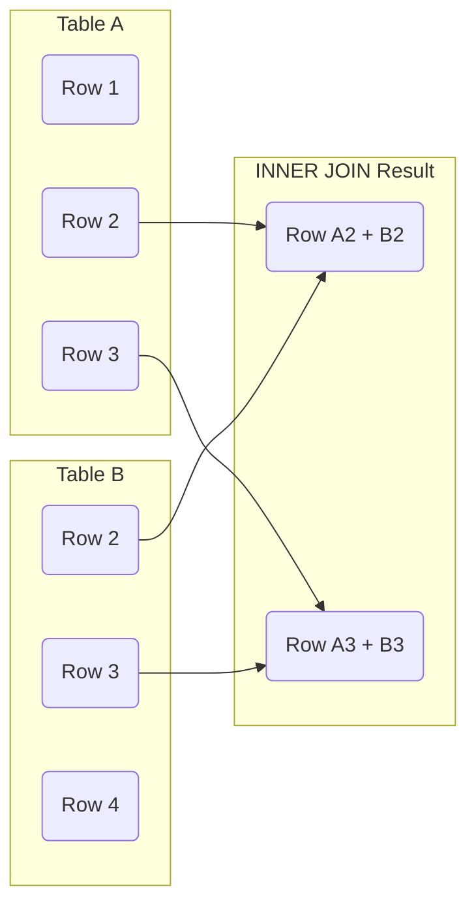

# SQL Inner Join

## Introduction

When working with relational databases, data is often distributed across multiple tables to minimize redundancy and improve data integrity. However, to retrieve meaningful information, we frequently need to combine data from these separate tables. This is where SQL JOINs come into play, and the INNER JOIN is the most commonly used type.

An **INNER JOIN** allows you to combine rows from two or more tables based on a related column between them. It returns only the rows where there is a match in both tables according to the specified join condition.

## Basic Syntax

The basic syntax of an INNER JOIN is:

```sql
SELECT columns
FROM table1
INNER JOIN table2
ON table1.column = table2.column;
```

- The `FROM` clause specifies the first table.
- The `INNER JOIN` clause specifies the second table to join with the first table.
- The `ON` clause specifies the condition for the join (how the tables are related).

## Visual Representation

Here's a visual representation of how INNER JOIN works:



Notice that only rows 2 and 3 appear in the result set because they exist in both Table A and Table B.

## Basic Example

Let's look at a simple example using two tables: `customers` and `orders`.

**customers table:**

```
| customer_id | name        | email                 |
|-------------|-------------|-----------------------|
| 1           | John Smith  | john.smith@email.com  |
| 2           | Jane Doe    | jane.doe@email.com    |
| 3           | Bob Johnson | bob.johnson@email.com |
```

**orders table:**

```
| order_id | customer_id | product      | amount |
|----------|-------------|--------------|--------|
| 101      | 1           | Laptop       | 1200   |
| 102      | 3           | Smartphone   | 800    |
| 103      | 1           | Headphones   | 100    |
| 104      | 4           | Tablet       | 300    |
```

To get a list of customers and their orders, we can use an INNER JOIN:

```sql
SELECT 
    customers.name, 
    orders.product, 
    orders.amount
FROM 
    customers
INNER JOIN 
    orders
ON 
    customers.customer_id = orders.customer_id;
```

**Result:**

```
| name        | product      | amount |
|-------------|--------------|--------|
| John Smith  | Laptop       | 1200   |
| John Smith  | Headphones   | 100    |
| Bob Johnson | Smartphone   | 800    |
```

Notice that:
- Only customers with matching orders are included (John and Bob).
- Jane Doe doesn't appear in the result because she doesn't have any orders.
- The order with customer_id 4 doesn't appear because there's no matching customer in the customers table.

## Using Table Aliases

For more complex queries, you can use table aliases to make the SQL more readable:

```sql
SELECT 
    c.name, 
    o.product, 
    o.amount
FROM 
    customers AS c
INNER JOIN 
    orders AS o
ON 
    c.customer_id = o.customer_id;
```

The result is the same as the previous query, but the SQL is more concise.

## Joining Multiple Tables

You can extend INNER JOINs to multiple tables. Let's add a `products` table:

**products table:**

```
| product_id | product_name | category    |
|------------|--------------|-------------|
| 1          | Laptop       | Electronics |
| 2          | Smartphone   | Electronics |
| 3          | Headphones   | Audio       |
| 4          | Tablet       | Electronics |
```

Now, let's modify our `orders` table to reference the products:

**orders table:**

```
| order_id | customer_id | product_id | amount |
|----------|-------------|------------|--------|
| 101      | 1           | 1          | 1200   |
| 102      | 3           | 2          | 800    |
| 103      | 1           | 3          | 100    |
| 104      | 4           | 4          | 300    |
```

To join all three tables:

```sql
SELECT 
    c.name, 
    p.product_name, 
    p.category,
    o.amount
FROM 
    customers AS c
INNER JOIN 
    orders AS o
ON 
    c.customer_id = o.customer_id
INNER JOIN 
    products AS p
ON 
    o.product_id = p.product_id;
```

**Result:**

```
| name        | product_name | category    | amount |
|-------------|--------------|-------------|--------|
| John Smith  | Laptop       | Electronics | 1200   |
| John Smith  | Headphones   | Audio       | 100    |
| Bob Johnson | Smartphone   | Electronics | 800    |
```

## Common Use Cases

### 1. Finding Related Records

INNER JOIN is perfect for finding records in one table that have corresponding records in another table.

```sql
-- Find all customers who have placed orders
SELECT DISTINCT c.customer_id, c.name
FROM customers c
INNER JOIN orders o ON c.customer_id = o.customer_id;
```

### 2. Aggregating Data Across Tables

You can use INNER JOIN with aggregate functions:

```sql
-- Calculate total spending per customer
SELECT 
    c.name,
    SUM(o.amount) AS total_spent
FROM 
    customers c
INNER JOIN 
    orders o ON c.customer_id = o.customer_id
GROUP BY 
    c.name;
```

**Result:**

```
| name        | total_spent |
|-------------|-------------|
| John Smith  | 1300        |
| Bob Johnson | 800         |
```

### 3. Filtering Joined Data

You can apply WHERE clauses to filter joined results:

```sql
-- Find customers who bought electronics
SELECT 
    c.name,
    p.product_name
FROM 
    customers c
INNER JOIN 
    orders o ON c.customer_id = o.customer_id
INNER JOIN 
    products p ON o.product_id = p.product_id
WHERE 
    p.category = 'Electronics';
```

**Result:**

```
| name        | product_name |
|-------------|--------------|
| John Smith  | Laptop       |
| Bob Johnson | Smartphone   |
```

## INNER JOIN vs. Other Joins

INNER JOIN returns only matching records. This differs from:

- **LEFT JOIN**: Returns all records from the left table and matching records from the right table.
- **RIGHT JOIN**: Returns all records from the right table and matching records from the left table.
- **FULL JOIN**: Returns all records when there is a match in either the left or right table.

## Common Pitfalls

### 1. Ambiguous Column Names

If both tables have columns with the same name, you must specify which table you're referring to:

```sql
-- This could cause an error if both tables have a 'name' column
SELECT name FROM table1 INNER JOIN table2 ON table1.id = table2.id;

-- Better approach
SELECT table1.name FROM table1 INNER JOIN table2 ON table1.id = table2.id;

-- Or with aliases
SELECT t1.name FROM table1 t1 INNER JOIN table2 t2 ON t1.id = t2.id;
```

### 2. Cartesian Product

If you omit the JOIN condition, you'll get a Cartesian product (every row in the first table joined with every row in the second table):

```sql
-- Don't do this! It creates a Cartesian product
SELECT * FROM customers, orders;
```

### 3. Performance Considerations

INNER JOINs can be resource-intensive for large tables. To optimize performance:

- Ensure columns used in the JOIN condition are indexed.
- Select only the columns you need rather than using SELECT *.
- Consider breaking complex queries with multiple joins into simpler queries.

## Summary

INNER JOIN is a fundamental SQL operation that combines rows from two or more tables based on a related column. It returns only the rows where there is a match in all joined tables.

Key points to remember:
- INNER JOIN returns only matching rows.
- The ON clause specifies the relationship between tables.
- You can join multiple tables in a single query.
- Table aliases make complex joins more readable.
- Always be mindful of performance when joining large tables.

## Exercises

1. Create two tables called `authors` and `books`. Then write an INNER JOIN query to find all books with their author information.

2. Modify the example with customers, orders, and products to find the customer who spent the most on a single order.

3. Write a query to find all products that have never been ordered using an INNER JOIN and a subquery.

## Additional Resources

- [SQL Joins Visualized](https://joins.spathon.com/) - An interactive visualization of different join types
- [W3Schools SQL Joins](https://www.w3schools.com/sql/sql_join.asp) - More examples of SQL joins
- [PostgreSQL Documentation on Joins](https://www.postgresql.org/docs/current/tutorial-join.html) - Advanced join techniques

For more advanced join techniques, check out the other articles in this SQL Joins series, including LEFT JOIN, RIGHT JOIN, and FULL JOIN.