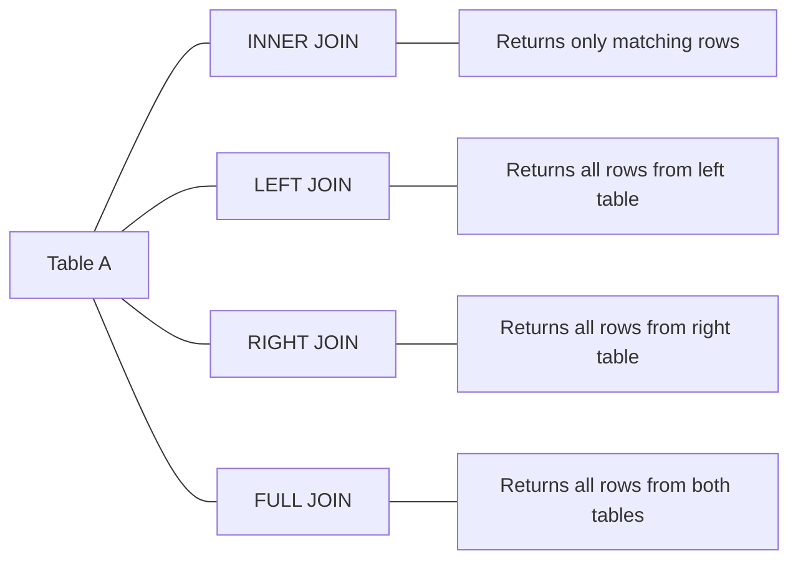

# SQL Join Conditions

## Introduction

When working with relational databases, data is often spread across multiple tables to minimize redundancy and improve data integrity. SQL joins allow you to combine data from these separate tables into meaningful result sets. However, simply joining tables isn't enough—you need to specify **join conditions** that determine how the rows from one table relate to rows in another table.

Join conditions are the crucial link that establishes relationships between tables, allowing you to pull together complete information from your database. Without proper join conditions, your queries might return incorrect results or perform poorly.

In this guide, we'll explore different types of join conditions, their syntax, and practical applications to help you write effective SQL queries.

## Basic Join Condition Syntax

The most common way to specify join conditions is using the `ON` clause. Here's the basic syntax:

```sql
SELECT columns
FROM table1
JOIN table2 ON table1.column_name = table2.column_name;
```

Let's break this down:

1. `SELECT columns`: Specifies which columns you want in your result set
2. `FROM table1`: Identifies the first table in the join
3. `JOIN table2`: Identifies the second table to join with
4. `ON table1.column_name = table2.column_name`: Specifies the join condition

The join condition determines which rows from each table should be combined based on matching values in the specified columns.

## Types of Join Conditions

### 1. Equality Join Conditions

The most common type of join condition uses the equality operator (`=`) to match rows where values in the specified columns are equal.

#### Example: 

Suppose we have two tables: `customers` and `orders`.

```sql
-- customers table
CREATE TABLE customers (
  customer_id INT PRIMARY KEY,
  name VARCHAR(100),
  email VARCHAR(100)
);

-- orders table
CREATE TABLE orders (
  order_id INT PRIMARY KEY,
  customer_id INT,
  order_date DATE,
  total_amount DECIMAL(10, 2)
);

-- Insert sample data
INSERT INTO customers VALUES 
(1, 'Alice Smith', 'alice@example.com'),
(2, 'Bob Johnson', 'bob@example.com'),
(3, 'Carol Williams', 'carol@example.com');

INSERT INTO orders VALUES 
(101, 1, '2023-01-15', 150.00),
(102, 2, '2023-01-16', 75.50),
(103, 1, '2023-01-20', 200.00),
(104, 3, '2023-01-25', 125.00);
```

To join these tables using an equality condition:

```sql
SELECT c.name, o.order_id, o.order_date, o.total_amount
FROM customers c
JOIN orders o ON c.customer_id = o.customer_id;
```

**Result:**

```
name           | order_id | order_date | total_amount
---------------|----------|------------|-------------
Alice Smith    | 101      | 2023-01-15 | 150.00
Alice Smith    | 103      | 2023-01-20 | 200.00
Bob Johnson    | 102      | 2023-01-16 | 75.50
Carol Williams | 104      | 2023-01-25 | 125.00
```

This query matches customers with their orders based on the `customer_id` column in both tables.

### 2. Non-Equality Join Conditions

While equality joins are most common, you can also use other comparison operators like `<`, `>`, `<=`, `>=`, or `<>` in join conditions.

#### Example:

Let's say we have a `products` table and a `price_ranges` table:

```sql
-- products table
CREATE TABLE products (
  product_id INT PRIMARY KEY,
  name VARCHAR(100),
  price DECIMAL(10, 2)
);

-- price_ranges table
CREATE TABLE price_ranges (
  range_id INT PRIMARY KEY,
  min_price DECIMAL(10, 2),
  max_price DECIMAL(10, 2),
  category VARCHAR(50)
);

-- Insert sample data
INSERT INTO products VALUES 
(1, 'Basic Widget', 25.00),
(2, 'Premium Widget', 75.00),
(3, 'Deluxe Widget', 125.00),
(4, 'Super Widget', 200.00);

INSERT INTO price_ranges VALUES 
(1, 0.00, 50.00, 'Budget'),
(2, 50.01, 100.00, 'Standard'),
(3, 100.01, 200.00, 'Premium');
```

To categorize products using non-equality join conditions:

```sql
SELECT p.name, p.price, pr.category
FROM products p
JOIN price_ranges pr ON p.price >= pr.min_price AND p.price <= pr.max_price;
```

**Result:**

```
name           | price  | category
---------------|--------|----------
Basic Widget   | 25.00  | Budget
Premium Widget | 75.00  | Standard
Deluxe Widget  | 125.00 | Premium
Super Widget   | 200.00 | Premium
```

This query matches products to price ranges by checking if the product's price falls within the range's minimum and maximum values.

### 3. Multiple Join Conditions

Often, you'll need multiple conditions to join tables correctly, especially when working with composite keys or when you need to apply additional filters.

#### Example:

Let's enhance our previous example with `customers`, `orders`, and a new `order_items` table:

```sql
-- order_items table
CREATE TABLE order_items (
  order_id INT,
  product_id INT,
  quantity INT,
  unit_price DECIMAL(10, 2),
  PRIMARY KEY (order_id, product_id)
);

-- Insert sample data
INSERT INTO order_items VALUES 
(101, 1, 2, 25.00),
(101, 2, 1, 75.00),
(102, 1, 3, 25.00),
(103, 3, 1, 125.00),
(104, 2, 1, 75.00),
(104, 4, 1, 200.00);
```

To get order details with multiple join conditions:

```sql
SELECT c.name, o.order_id, p.name AS product_name, 
       oi.quantity, oi.unit_price, (oi.quantity * oi.unit_price) AS item_total
FROM customers c
JOIN orders o ON c.customer_id = o.customer_id
JOIN order_items oi ON o.order_id = oi.order_id
JOIN products p ON oi.product_id = p.product_id
WHERE o.order_date >= '2023-01-15' AND oi.quantity > 1;
```

**Result:**

```
name        | order_id | product_name   | quantity | unit_price | item_total
------------|----------|----------------|----------|------------|------------
Alice Smith | 101      | Basic Widget   | 2        | 25.00      | 50.00
Bob Johnson | 102      | Basic Widget   | 3        | 25.00      | 75.00
```

This query:
1. Joins `customers` and `orders` on `customer_id`
2. Joins `orders` and `order_items` on `order_id`
3. Joins `order_items` and `products` on `product_id`
4. Adds filtering conditions for the order date and quantity

### 4. Using NULL-Safe Join Conditions

When your data might contain NULL values, standard equality conditions can be problematic because `NULL = NULL` evaluates to UNKNOWN in SQL (not TRUE). To handle NULL values in join conditions, you can use the NULL-safe equality operator `<=>` in MySQL or `IS NOT DISTINCT FROM` in PostgreSQL and some other databases.

#### Example (MySQL):

```sql
SELECT c.name, o.order_id
FROM customers c
LEFT JOIN orders o ON c.customer_id <=> o.customer_id;
```

#### Example (PostgreSQL):

```sql
SELECT c.name, o.order_id
FROM customers c
LEFT JOIN orders o ON c.customer_id IS NOT DISTINCT FROM o.customer_id;
```

These operators treat NULL values as equal to each other, which can be useful when joining on columns that might contain NULLs.

## Join Conditions vs. WHERE Clauses

A common confusion for beginners is the difference between join conditions (in the `ON` clause) and filtering conditions (in the `WHERE` clause).

### Key Differences:

1. **Join conditions** determine which rows from each table are combined.
2. **WHERE clause conditions** filter the joined result set.

The difference becomes most apparent when using outer joins:

```sql
-- Using ON clause for join condition
SELECT c.name, o.order_id
FROM customers c
LEFT JOIN orders o ON c.customer_id = o.customer_id AND o.total_amount > 100;

-- Using WHERE clause for filtering
SELECT c.name, o.order_id
FROM customers c
LEFT JOIN orders o ON c.customer_id = o.customer_id
WHERE o.total_amount > 100 OR o.total_amount IS NULL;
```

In the first query, customers without orders or with orders less than $100 will still appear in the result (with NULL values for order details).

In the second query, the WHERE clause filters out customers who have orders with total_amount `<=` $100, but keeps those without any orders.

## Using JOIN Conditions with Different Join Types

Join conditions work differently depending on the type of join:



### 1. INNER JOIN

```sql
SELECT c.name, o.order_id
FROM customers c
INNER JOIN orders o ON c.customer_id = o.customer_id;
```

Returns only customers who have orders.

### 2. LEFT JOIN

```sql
SELECT c.name, o.order_id
FROM customers c
LEFT JOIN orders o ON c.customer_id = o.customer_id;
```

Returns all customers, even those without orders.

### 3. RIGHT JOIN

```sql
SELECT c.name, o.order_id
FROM customers c
RIGHT JOIN orders o ON c.customer_id = o.customer_id;
```

Returns all orders, even those without matching customers.

### 4. FULL OUTER JOIN

```sql
SELECT c.name, o.order_id
FROM customers c
FULL OUTER JOIN orders o ON c.customer_id = o.customer_id;
```

Returns all customers and all orders, with NULL values where there's no match.

## Best Practices for Join Conditions

1. **Use meaningful column names**: Make your joins easier to understand by using descriptive column names.

2. **Include table aliases**: Use short, descriptive aliases for tables to make your queries more readable.

3. **Join on indexed columns**: For optimal performance, join tables on indexed columns—ideally primary or foreign keys.

4. **Be explicit about join types**: Always specify the type of join (INNER, LEFT, etc.) rather than relying on implicit joins.

5. **Use appropriate join conditions**: Choose the right comparison operators for your data relationships.

6. **Limit the number of joined tables**: Each additional join adds complexity and potential performance issues.

7. **Test with representative data**: Verify that your join conditions produce the expected results with various data scenarios.

## Practical Real-World Examples

### Example 1: Sales Analysis

Let's create a query to analyze sales by customer and product category:

```sql
-- Additional tables
CREATE TABLE product_categories (
  category_id INT PRIMARY KEY,
  category_name VARCHAR(50)
);

ALTER TABLE products ADD COLUMN category_id INT;

-- Insert sample data
INSERT INTO product_categories VALUES 
(1, 'Widgets'),
(2, 'Gadgets'),
(3, 'Accessories');

UPDATE products SET category_id = 1 WHERE product_id IN (1, 2, 3, 4);
INSERT INTO products VALUES (5, 'Basic Gadget', 30.00, 2), (6, 'Premium Accessory', 45.00, 3);

INSERT INTO order_items VALUES 
(101, 5, 1, 30.00),
(102, 6, 2, 45.00);
```

Now, let's create a comprehensive sales report:

```sql
SELECT 
    c.name AS customer_name,
    pc.category_name,
    SUM(oi.quantity) AS total_items,
    SUM(oi.quantity * oi.unit_price) AS total_amount
FROM 
    customers c
JOIN 
    orders o ON c.customer_id = o.customer_id
JOIN 
    order_items oi ON o.order_id = oi.order_id
JOIN 
    products p ON oi.product_id = p.product_id
JOIN 
    product_categories pc ON p.category_id = pc.category_id
GROUP BY 
    c.name, pc.category_name
ORDER BY 
    c.name, total_amount DESC;
```

This query:
1. Joins five tables with appropriate join conditions
2. Groups the results by customer and product category
3. Calculates summary statistics

### Example 2: Employee Hierarchy

For a more complex example, let's consider an employee hierarchy:

```sql
CREATE TABLE employees (
  employee_id INT PRIMARY KEY,
  name VARCHAR(100),
  manager_id INT,
  department_id INT,
  hire_date DATE,
  salary DECIMAL(10, 2)
);

CREATE TABLE departments (
  department_id INT PRIMARY KEY,
  department_name VARCHAR(50),
  location VARCHAR(50)
);

-- Insert sample data
INSERT INTO departments VALUES 
(1, 'Engineering', 'Building A'),
(2, 'Sales', 'Building B'),
(3, 'Marketing', 'Building B');

INSERT INTO employees VALUES 
(1, 'John Smith', NULL, 1, '2020-01-10', 85000.00),
(2, 'Mary Johnson', 1, 1, '2020-02-15', 75000.00),
(3, 'James Brown', 1, 1, '2020-03-20', 75000.00),
(4, 'Patricia Davis', 2, 1, '2020-04-05', 65000.00),
(5, 'Robert Wilson', NULL, 2, '2020-01-15', 80000.00),
(6, 'Linda Martinez', 5, 2, '2020-02-20', 70000.00),
(7, 'Michael Anderson', NULL, 3, '2020-01-20', 82000.00);
```

To display employees with their managers and departments:

```sql
SELECT 
    e.name AS employee_name,
    d.department_name,
    m.name AS manager_name,
    DATEDIFF(CURRENT_DATE, e.hire_date) / 365.0 AS years_employed,
    e.salary
FROM 
    employees e
JOIN 
    departments d ON e.department_id = d.department_id
LEFT JOIN 
    employees m ON e.manager_id = m.employee_id
ORDER BY 
    d.department_name, e.salary DESC;
```

This query:
1. Uses a self-join on the employees table (as e and m) to match employees with their managers
2. Joins the departments table to get department information
3. Uses a LEFT JOIN for the manager relationship because some employees (like department heads) don't have managers

## Common Join Condition Mistakes and How to Avoid Them

### 1. Missing Join Conditions

```sql
-- Incorrect (Cartesian product)
SELECT c.name, o.order_id
FROM customers c
JOIN orders o;

-- Correct
SELECT c.name, o.order_id
FROM customers c
JOIN orders o ON c.customer_id = o.customer_id;
```

Without a join condition, you'll get a Cartesian product—every row in the first table combined with every row in the second table.

### 2. Using the Wrong Join Type

```sql
-- Might be incorrect if you want to see all customers
SELECT c.name, o.order_id
FROM customers c
INNER JOIN orders o ON c.customer_id = o.customer_id;

-- Better if you want to see all customers
SELECT c.name, o.order_id
FROM customers c
LEFT JOIN orders o ON c.customer_id = o.customer_id;
```

Make sure you're using the join type that matches your data requirements.

### 3. Confusing Join Conditions with Filtering Conditions

```sql
-- Might not give expected results with LEFT JOIN
SELECT c.name, o.order_id
FROM customers c
LEFT JOIN orders o ON c.customer_id = o.customer_id
WHERE o.order_date > '2023-01-15';

-- Better approach if you want to keep all customers
SELECT c.name, o.order_id
FROM customers c
LEFT JOIN orders o ON c.customer_id = o.customer_id AND o.order_date > '2023-01-15';
```

Be mindful of whether conditions should be part of the join criteria or filter criteria.

### 4. Not Handling NULL Values Properly

```sql
-- Might not handle NULLs correctly
SELECT c.name, o.order_id
FROM customers c
LEFT JOIN orders o ON c.customer_id = o.customer_id
WHERE o.total_amount > 100;

-- Better if you want to keep customers with no orders
SELECT c.name, o.order_id
FROM customers c
LEFT JOIN orders o ON c.customer_id = o.customer_id
WHERE o.total_amount > 100 OR o.order_id IS NULL;
```

Remember to account for NULL values when filtering outer joined data.

## Summary

SQL join conditions are essential for combining data from multiple tables in a meaningful way. Key points to remember:

1. Join conditions specify how rows from different tables should be matched using the `ON` clause
2. You can use various comparison operators in join conditions, not just equality
3. Multiple join conditions can be combined with `AND` and `OR`
4. Join conditions work differently with different join types (INNER, LEFT, RIGHT, FULL)
5. Be careful about the distinction between join conditions (in `ON`) and filtering conditions (in `WHERE`)

Mastering join conditions is crucial for writing efficient and accurate SQL queries, especially when working with complex data models.

## Exercises

To practice your understanding of join conditions, try these exercises:

1. Write a query to find all customers who have placed orders worth more than $100 in total.
2. Create a query to list products that have never been ordered.
3. Develop a report showing the total orders by department location.
4. Write a query to find employees who earn more than their managers.
5. Create a query to show customers alongside their most expensive order.

## Additional Resources

- [SQL Joins Visualizer](https://joins.spathon.com/) - An interactive tool to visualize different join types
- [W3Schools SQL JOIN Tutorial](https://www.w3schools.com/sql/sql_join.asp) - Basic explanations and examples
- [PostgreSQL Documentation on Joins](https://www.postgresql.org/docs/current/queries-table-expressions.html) - In-depth technical explanation
- [MySQL JOIN Syntax](https://dev.mysql.com/doc/refman/8.0/en/join.html) - MySQL-specific join documentation