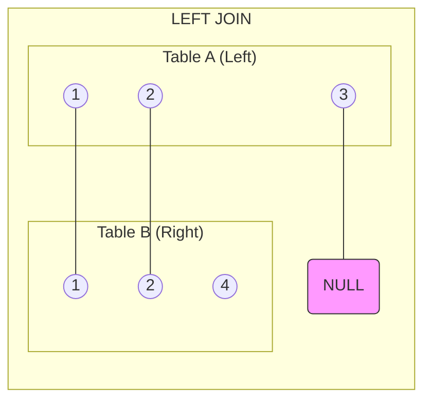
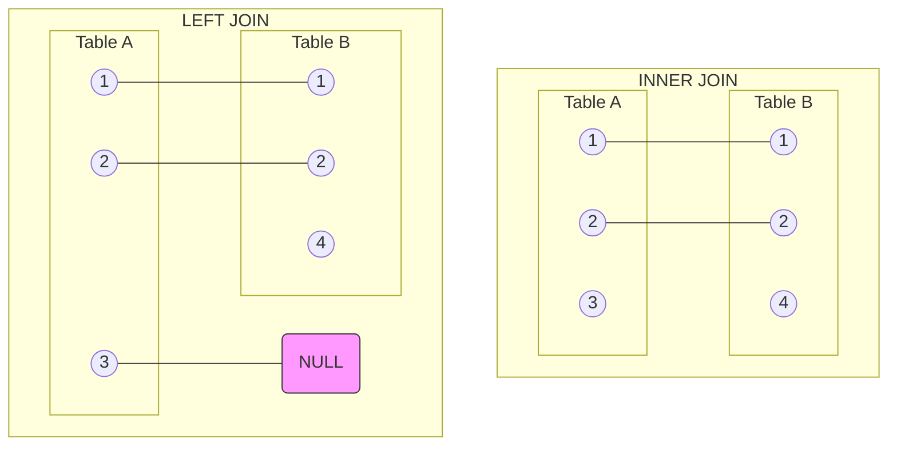

# SQL LEFT JOIN

## Introduction

When working with relational databases, data is often spread across multiple tables to maintain organization and reduce redundancy. However, you frequently need to combine data from different tables to answer specific questions or generate reports. This is where SQL JOINs come in, and the LEFT JOIN is one of the most commonly used join types.

A LEFT JOIN (or LEFT OUTER JOIN) returns **all records from the left table** and the matching records from the right table. If there's no match in the right table, the result will contain NULL values for the right table's columns.

## LEFT JOIN Syntax

The basic syntax for a LEFT JOIN is:

```sql
SELECT columns
FROM table1
LEFT JOIN table2
ON table1.column = table2.column;
```

Where:
- `table1` is the left table
- `table2` is the right table
- The `ON` clause specifies the condition for matching records

## Visual Representation

Let's visualize how LEFT JOIN works:



In the diagram above:
- Records 1 and 2 exist in both tables and are matched
- Record 3 exists only in Table A, so it's included with NULL values for Table B's columns
- Record 4 exists only in Table B, so it's excluded from the results entirely

## Basic LEFT JOIN Example

Let's create two simple tables to demonstrate LEFT JOIN:

```sql
-- Create a table for employees
CREATE TABLE employees (
    employee_id INT PRIMARY KEY,
    first_name VARCHAR(50),
    last_name VARCHAR(50),
    department_id INT
);

-- Create a table for departments
CREATE TABLE departments (
    department_id INT PRIMARY KEY,
    department_name VARCHAR(50)
);

-- Insert sample data
INSERT INTO employees VALUES
(1, 'John', 'Doe', 1),
(2, 'Jane', 'Smith', 2),
(3, 'Michael', 'Johnson', 1),
(4, 'Emily', 'Williams', NULL),
(5, 'David', 'Brown', 3);

INSERT INTO departments VALUES
(1, 'HR'),
(2, 'IT'),
(4, 'Finance');
```

Now, let's use LEFT JOIN to get all employees with their department names (if available):

```sql
SELECT 
    e.employee_id,
    e.first_name,
    e.last_name,
    d.department_name
FROM 
    employees e
LEFT JOIN 
    departments d ON e.department_id = d.department_id;
```

### Result:

| employee_id | first_name | last_name | department_name |
|-------------|------------|-----------|-----------------|
| 1           | John       | Doe       | HR              |
| 2           | Jane       | Smith     | IT              |
| 3           | Michael    | Johnson   | HR              |
| 4           | Emily      | Williams  | NULL            |
| 5           | David      | Brown     | NULL            |

Notice:
- All employees are included in the result
- Emily has a NULL department_id, so no department name is matched
- David has department_id 3, but there's no matching department, so department_name is NULL

## When to Use LEFT JOIN

LEFT JOIN is particularly useful when you want to:

1. Include all records from the first table regardless of whether there's a match in the second table
2. Find records in the first table that don't have matches in the second table
3. Generate reports that need to show all entries from a primary table with optional related data

## Finding Records with No Match

One common use case for LEFT JOIN is to find records in the left table that have no corresponding match in the right table:

```sql
SELECT 
    e.employee_id,
    e.first_name,
    e.last_name
FROM 
    employees e
LEFT JOIN 
    departments d ON e.department_id = d.department_id
WHERE 
    d.department_id IS NULL;
```

### Result:

| employee_id | first_name | last_name |
|-------------|------------|-----------|
| 4           | Emily      | Williams  |
| 5           | David      | Brown     |

This query returns employees who don't have a matching department.

## Real-world Application: Customer Orders

Let's look at a practical example using customer and order data:

```sql
-- Create tables
CREATE TABLE customers (
    customer_id INT PRIMARY KEY,
    customer_name VARCHAR(100),
    email VARCHAR(100),
    join_date DATE
);

CREATE TABLE orders (
    order_id INT PRIMARY KEY,
    customer_id INT,
    order_date DATE,
    total_amount DECIMAL(10, 2)
);

-- Insert sample data
INSERT INTO customers VALUES
(101, 'Alice Johnson', 'alice@example.com', '2023-01-15'),
(102, 'Bob Smith', 'bob@example.com', '2023-02-20'),
(103, 'Carol Williams', 'carol@example.com', '2023-03-10'),
(104, 'David Brown', 'david@example.com', '2023-04-05');

INSERT INTO orders VALUES
(1001, 101, '2023-05-10', 150.50),
(1002, 102, '2023-05-15', 89.99),
(1003, 101, '2023-06-01', 45.75),
(1004, 103, '2023-06-10', 199.99);
```

Now, let's find all customers and their orders (if any):

```sql
SELECT 
    c.customer_id,
    c.customer_name,
    c.email,
    o.order_id,
    o.order_date,
    o.total_amount
FROM 
    customers c
LEFT JOIN 
    orders o ON c.customer_id = o.customer_id
ORDER BY 
    c.customer_id, o.order_date;
```

### Result:

| customer_id | customer_name  | email             | order_id | order_date | total_amount |
|-------------|----------------|-------------------|----------|------------|--------------|
| 101         | Alice Johnson  | alice@example.com | 1001     | 2023-05-10 | 150.50       |
| 101         | Alice Johnson  | alice@example.com | 1003     | 2023-06-01 | 45.75        |
| 102         | Bob Smith      | bob@example.com   | 1002     | 2023-05-15 | 89.99        |
| 103         | Carol Williams | carol@example.com | 1004     | 2023-06-10 | 199.99       |
| 104         | David Brown    | david@example.com | NULL     | NULL       | NULL         |

Notice that:
- Alice has two orders, so she appears twice in the results
- David doesn't have any orders, but he's still included with NULL values for order details

## Identifying Customers with No Orders

To find customers who haven't placed any orders:

```sql
SELECT 
    c.customer_id,
    c.customer_name,
    c.email,
    c.join_date
FROM 
    customers c
LEFT JOIN 
    orders o ON c.customer_id = o.customer_id
WHERE 
    o.order_id IS NULL;
```

### Result:

| customer_id | customer_name | email             | join_date  |
|-------------|---------------|-------------------|------------|
| 104         | David Brown   | david@example.com | 2023-04-05 |

## Multiple LEFT JOINs

You can chain multiple LEFT JOINs to combine data from several tables:

```sql
-- Creating a shipping table
CREATE TABLE shipments (
    shipment_id INT PRIMARY KEY,
    order_id INT,
    ship_date DATE,
    carrier VARCHAR(50)
);

INSERT INTO shipments VALUES
(5001, 1001, '2023-05-12', 'FedEx'),
(5002, 1002, '2023-05-17', 'UPS'),
(5003, 1004, '2023-06-12', 'USPS');

-- Query with multiple LEFT JOINs
SELECT 
    c.customer_name,
    o.order_id,
    o.order_date,
    s.shipment_id,
    s.ship_date,
    s.carrier
FROM 
    customers c
LEFT JOIN 
    orders o ON c.customer_id = o.customer_id
LEFT JOIN 
    shipments s ON o.order_id = s.order_id
ORDER BY 
    c.customer_name;
```

### Result:

| customer_name  | order_id | order_date | shipment_id | ship_date  | carrier |
|----------------|----------|------------|-------------|------------|---------|
| Alice Johnson  | 1001     | 2023-05-10 | 5001        | 2023-05-12 | FedEx   |
| Alice Johnson  | 1003     | 2023-06-01 | NULL        | NULL       | NULL    |
| Bob Smith      | 1002     | 2023-05-15 | 5002        | 2023-05-17 | UPS     |
| Carol Williams | 1004     | 2023-06-10 | 5003        | 2023-06-12 | USPS    |
| David Brown    | NULL     | NULL       | NULL        | NULL       | NULL    |

## LEFT JOIN vs INNER JOIN

It's important to understand the difference between LEFT JOIN and INNER JOIN:



- **INNER JOIN** returns only the matching records from both tables
- **LEFT JOIN** returns all records from the left table and matching records from the right table

To see the difference, let's compare the results:

```sql
-- INNER JOIN example
SELECT 
    e.employee_id,
    e.first_name,
    d.department_name
FROM 
    employees e
INNER JOIN 
    departments d ON e.department_id = d.department_id;

-- LEFT JOIN example
SELECT 
    e.employee_id,
    e.first_name,
    d.department_name
FROM 
    employees e
LEFT JOIN 
    departments d ON e.department_id = d.department_id;
```

### INNER JOIN Result:

| employee_id | first_name | department_name |
|-------------|------------|-----------------|
| 1           | John       | HR              |
| 2           | Jane       | IT              |
| 3           | Michael    | HR              |

### LEFT JOIN Result:

| employee_id | first_name | department_name |
|-------------|------------|-----------------|
| 1           | John       | HR              |
| 2           | Jane       | IT              |
| 3           | Michael    | HR              |
| 4           | Emily      | NULL            |
| 5           | David      | NULL            |

The INNER JOIN excludes employees with no department match, while the LEFT JOIN includes all employees.

## Common Mistakes with LEFT JOIN

### 1. Filtering in WHERE Instead of ON

A common mistake is placing join conditions in the WHERE clause:

```sql
-- Incorrect: This converts the LEFT JOIN to an INNER JOIN
SELECT e.employee_id, e.first_name, d.department_name
FROM employees e
LEFT JOIN departments d ON e.department_id = d.department_id
WHERE d.department_id = 1;

-- Correct: Filter the left table before joining
SELECT e.employee_id, e.first_name, d.department_name
FROM employees e
LEFT JOIN departments d ON e.department_id = d.department_id AND d.department_id = 1;
```

### 2. Forgetting Table Aliases in Complex Queries

Always use table aliases when working with multiple tables to avoid ambiguity:

```sql
-- Without aliases (harder to read)
SELECT employee_id, first_name, department_name
FROM employees
LEFT JOIN departments ON employees.department_id = departments.department_id;

-- With aliases (clearer and less prone to errors)
SELECT e.employee_id, e.first_name, d.department_name
FROM employees e
LEFT JOIN departments d ON e.department_id = d.department_id;
```

## Summary

The LEFT JOIN is a powerful SQL operation that allows you to:

1. Retrieve all records from the left table and matching records from the right table
2. Include NULL values for right-table columns when no match exists
3. Find records in the left table that have no corresponding match in the right table
4. Generate comprehensive reports that need to show all primary records regardless of relationships

LEFT JOIN is particularly useful in reporting scenarios, data analysis, and when you need to ensure all records from a primary table are included in your results.

## Practice Exercises

To reinforce your understanding of LEFT JOIN, try these exercises:

1. Create tables for students and courses, then write a query to find all students and the courses they're enrolled in (if any).
2. Modify the query to find students who aren't enrolled in any courses.
3. Create a three-table join between customers, orders, and products to list all customers and what products they've purchased.
4. Write a query to find products that haven't been ordered by any customer.

## Additional Resources

- [SQL JOINS Explained](https://www.w3schools.com/sql/sql_join.asp) - An overview of all join types
- [PostgreSQL Documentation on Joins](https://www.postgresql.org/docs/current/tutorial-join.html)
- [SQL JOIN Visualization Tool](https://sql-joins.leopard.in.ua/) - Interactive visualization of different join types
- [Practice SQL with SQLFiddle](http://sqlfiddle.com/) - Test your LEFT JOIN queries online