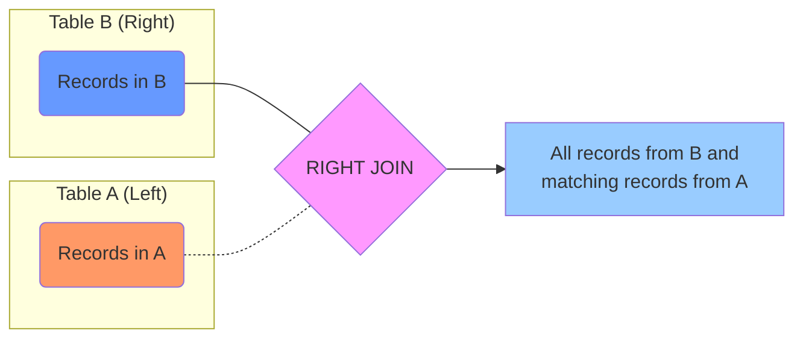

# SQL RIGHT JOIN

## Introduction

When working with relational databases, data is often spread across multiple tables to maintain organization and avoid redundancy. SQL provides various JOIN operations to help you combine data from these tables when needed. One of these operations is the **RIGHT JOIN** (also called RIGHT OUTER JOIN).

A RIGHT JOIN returns all records from the right table (the second table mentioned in the query), and the matching records from the left table (the first table). If there's no match in the left table, the result will contain NULL values for the left table's columns.

This tutorial will explain how RIGHT JOIN works, when to use it, and provide practical examples to help you understand its application in real-world scenarios.

## Understanding RIGHT JOIN

### Visual Representation

The following diagram shows what a RIGHT JOIN looks like conceptually:



In this visualization:
- The blue circle represents all records in the right table (Table B)
- The orange circle represents records in the left table (Table A)
- The purple intersection represents the matching records
- The RIGHT JOIN result includes all blue records and any matching orange records

### Syntax

The basic syntax for a RIGHT JOIN in SQL is:

```sql
SELECT columns
FROM table1
RIGHT JOIN table2
ON table1.column = table2.column;
```

You can also use the more explicit form:

```sql
SELECT columns
FROM table1
RIGHT OUTER JOIN table2
ON table1.column = table2.column;
```

Both syntaxes produce the same result.

## Basic RIGHT JOIN Example

Let's start with a simple example using two tables: `employees` and `departments`.

### Sample Tables

**employees**
```
+----+----------+------------+-------------+
| id | name     | salary     | department_id |
+----+----------+------------+-------------+
| 1  | Alice    | 75000      | 1           |
| 2  | Bob      | 65000      | 2           |
| 3  | Charlie  | 80000      | 1           |
| 4  | David    | 72000      | 3           |
| 5  | Eva      | 90000      | NULL        |
+----+----------+------------+-------------+
```

**departments**
```
+----+------------------+------------+
| id | name             | location   |
+----+------------------+------------+
| 1  | Engineering      | Building A |
| 2  | Marketing        | Building B |
| 3  | Human Resources  | Building A |
| 4  | Research         | Building C |
+----+------------------+------------+
```

### RIGHT JOIN Query

Now, let's write a RIGHT JOIN query to get all departments and their employees:

```sql
SELECT e.name AS employee_name, 
       d.name AS department_name, 
       d.location
FROM employees e
RIGHT JOIN departments d
ON e.department_id = d.id;
```

### Result

```
+---------------+------------------+------------+
| employee_name | department_name  | location   |
+---------------+------------------+------------+
| Alice         | Engineering      | Building A |
| Charlie       | Engineering      | Building A |
| Bob           | Marketing        | Building B |
| David         | Human Resources  | Building A |
| NULL          | Research         | Building C |
+---------------+------------------+------------+
```

### Explanation

In this result:
- Departments "Engineering", "Marketing", and "Human Resources" have matching employees, so those employees' information is included
- The "Research" department doesn't have any matching employees, so NULL appears in the employee_name column
- Note that Eva doesn't appear in this result because she isn't assigned to any department (her department_id is NULL)

## RIGHT JOIN vs LEFT JOIN

Understanding the difference between RIGHT JOIN and LEFT JOIN is crucial. A RIGHT JOIN is essentially the mirror image of a LEFT JOIN with the tables swapped.

The following two queries produce the same result:

```sql
-- Using RIGHT JOIN
SELECT e.name, d.name
FROM employees e
RIGHT JOIN departments d
ON e.department_id = d.id;

-- Equivalent query using LEFT JOIN
SELECT e.name, d.name
FROM departments d
LEFT JOIN employees e
ON e.department_id = d.id;
```

Many SQL developers prefer to use LEFT JOIN consistently rather than switching between LEFT and RIGHT JOIN. However, understanding RIGHT JOIN is still important, especially when working with existing code or when RIGHT JOIN provides a more intuitive way to express the query.

## Practical Applications

### Finding Missing Relationships

One common use of RIGHT JOIN is to identify records in the right table that don't have corresponding matches in the left table. We can find departments with no employees like this:

```sql
SELECT d.id, d.name AS department_name
FROM employees e
RIGHT JOIN departments d
ON e.department_id = d.id
WHERE e.id IS NULL;
```

This would return:

```
+----+------------------+
| id | department_name  |
+----+------------------+
| 4  | Research         |
+----+------------------+
```

### Combining Data from Multiple Tables

RIGHT JOIN is useful when you need to ensure all records from the right table are included, regardless of whether they have matching records in the left table.

For example, to generate a report of all departments and their total employee salary:

```sql
SELECT d.name AS department_name, 
       COALESCE(SUM(e.salary), 0) AS total_salary,
       COUNT(e.id) AS employee_count
FROM employees e
RIGHT JOIN departments d
ON e.department_id = d.id
GROUP BY d.name;
```

Result:

```
+------------------+--------------+----------------+
| department_name  | total_salary | employee_count |
+------------------+--------------+----------------+
| Engineering      | 155000       | 2              |
| Marketing        | 65000        | 1              |
| Human Resources  | 72000        | 1              |
| Research         | 0            | 0              |
+------------------+--------------+----------------+
```

## RIGHT JOIN with Multiple Tables

You can extend RIGHT JOIN to work with more than two tables. Here's an example with a third table `projects`:

**projects**
```
+----+------------------+-------------+
| id | name             | department_id |
+----+------------------+-------------+
| 1  | Website Redesign | 2           |
| 2  | Database Upgrade | 1           |
| 3  | Mobile App       | 1           |
| 4  | Annual Review    | 3           |
| 5  | New Product      | 4           |
+----+------------------+-------------+
```

Query to get departments, their employees, and projects:

```sql
SELECT d.name AS department_name, 
       e.name AS employee_name,
       p.name AS project_name
FROM employees e
RIGHT JOIN departments d ON e.department_id = d.id
LEFT JOIN projects p ON p.department_id = d.id
ORDER BY d.name, e.name;
```

This might return:

```
+------------------+---------------+------------------+
| department_name  | employee_name | project_name     |
+------------------+---------------+------------------+
| Engineering      | Alice         | Database Upgrade |
| Engineering      | Alice         | Mobile App       |
| Engineering      | Charlie       | Database Upgrade |
| Engineering      | Charlie       | Mobile App       |
| Human Resources  | David         | Annual Review    |
| Marketing        | Bob           | Website Redesign |
| Research         | NULL          | New Product      |
+------------------+---------------+------------------+
```

## When to Use RIGHT JOIN

RIGHT JOIN is particularly useful in the following scenarios:

1. When you want to ensure all records from the second table are included in the result
2. When you need to find records in the second table that don't have corresponding entries in the first table
3. When the natural reading of your query flows better with a RIGHT JOIN
4. When working with existing code that already uses RIGHT JOIN

## Potential Pitfalls

### NULL Values

Be careful with NULL values when using RIGHT JOIN:

1. Records with NULL values in the JOIN columns won't match
2. You need to handle NULL values in the result set appropriately (using functions like COALESCE or IFNULL)

### Multiple Matches

If there are multiple matches between tables, the result set will include all combinations. For example, if a department has three employees, each department record will appear three times in the result.

## Summary

RIGHT JOIN is a powerful SQL operation that returns all records from the right table along with matching records from the left table. It's particularly useful when you need to ensure all records from the second table appear in your results, regardless of whether they have corresponding matches.

While some developers prefer to use LEFT JOIN consistently (by reversing the table order), understanding RIGHT JOIN gives you flexibility in expressing queries and helps when working with existing code.

The key points to remember about RIGHT JOIN are:
- It keeps all records from the right (second) table
- It includes matching records from the left (first) table
- Non-matching left table columns contain NULL values
- The syntax uses the keywords RIGHT JOIN or RIGHT OUTER JOIN

## Exercises

Try these exercises to practice your understanding of RIGHT JOIN:

1. Write a query using RIGHT JOIN to find all departments and count how many employees are in each
2. Modify the earlier query to show only departments that have no employees
3. Write a query to find the total salary budget for each department, showing 0 for departments with no employees
4. Write a query using RIGHT JOIN that shows all projects and the employees working in those departments

## Additional Resources

- [Official SQL Documentation](https://www.w3schools.com/sql/sql_join_right.asp)
- [Interactive SQL JOIN Visualizer](https://joins.spathon.com/)
- [SQL JOIN Types Explained](https://www.geeksforgeeks.org/sql-join-set-1-inner-left-right-and-full-joins/)

For more practice, try implementing these concepts using a database management system like MySQL, PostgreSQL, or SQLite.