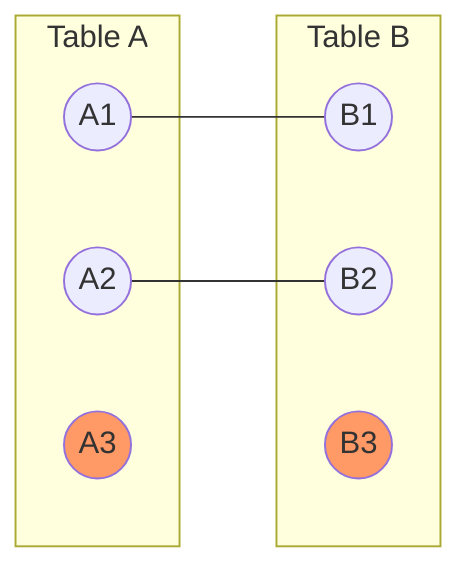

# SQL FULL JOIN

## Introduction

A **FULL JOIN** (sometimes called a **FULL OUTER JOIN**) is a type of SQL join that returns all rows from both tables being joined, regardless of whether there's a match between them. When rows in either table have no match in the other table, the result will contain NULL values for columns from the table without a match.

FULL JOIN is particularly useful when you want to see all possible combinations between two tables, including records that exist in only one table but not the other. It essentially combines the results of both a LEFT JOIN and a RIGHT JOIN.

## Syntax

The basic syntax for a FULL JOIN is:

```sql
SELECT columns
FROM table1
FULL [OUTER] JOIN table2
ON table1.column = table2.column;
```

The word `OUTER` is optional in most database systems.

## Visual Representation

Here's a visual representation of FULL JOIN:



The diagram shows:
- Matching records (A1-B1, A2-B2) are included
- Records only in Table A (A3) are included with NULL values for Table B columns
- Records only in Table B (B3) are included with NULL values for Table A columns

## Basic Example

Let's look at a basic example using two tables: `students` and `courses`.

**Table: students**
```
| student_id | student_name |
|------------|--------------|
| 1          | Alice        |
| 2          | Bob          |
| 3          | Charlie      |
| 4          | Diana        |
```

**Table: enrollments**
```
| enrollment_id | student_id | course_name     |
|---------------|------------|-----------------|
| 101           | 1          | Mathematics     |
| 102           | 2          | Physics         |
| 103           | 5          | Computer Science|
| 104           | 6          | Chemistry       |
```

Notice that students with IDs 3 and 4 don't have any enrollments, and there are enrollments for student IDs 5 and 6 who don't exist in the students table.

Using a FULL JOIN:

```sql
SELECT s.student_id, s.student_name, e.course_name
FROM students s
FULL JOIN enrollments e ON s.student_id = e.student_id;
```

**Result:**
```
| student_id | student_name | course_name     |
|------------|--------------|-----------------|
| 1          | Alice        | Mathematics     |
| 2          | Bob          | Physics         |
| 3          | Charlie      | NULL            |
| 4          | Diana        | NULL            |
| NULL       | NULL         | Computer Science|
| NULL       | NULL         | Chemistry       |
```

In this result:
1. Alice and Bob have matching records in both tables
2. Charlie and Diana exist only in the students table, so course_name is NULL
3. The enrollments for student IDs 5 and 6 (Computer Science and Chemistry) exist only in the enrollments table, so student_name is NULL

## Real-World Applications

### 1. Data Validation and Integrity Checking

FULL JOIN is excellent for identifying records that exist in one table but not the other, which is useful for data validation:

```sql
SELECT 
    e.employee_id, 
    e.employee_name, 
    p.payroll_id
FROM 
    employees e
FULL JOIN 
    payroll p ON e.employee_id = p.employee_id
WHERE 
    e.employee_id IS NULL OR p.payroll_id IS NULL;
```

This query helps identify:
- Employees without payroll records (potential payroll errors)
- Payroll records without matching employees (potential data integrity issues)

### 2. Reporting and Analytics

When generating comprehensive reports, you might need all data from multiple tables:

```sql
SELECT 
    p.product_id,
    p.product_name,
    s.sale_date,
    s.quantity_sold
FROM 
    products p
FULL JOIN 
    sales s ON p.product_id = s.product_id
ORDER BY 
    p.product_id, s.sale_date;
```

This shows all products (even those without sales) and all sales records (even if the product was deleted from the products table).

### 3. Combining Data from Different Departments

When combining data from different departments that might not have complete information:

```sql
SELECT 
    hr.employee_id,
    hr.employee_name,
    it.email,
    finance.salary
FROM 
    hr_data hr
FULL JOIN 
    it_data it ON hr.employee_id = it.employee_id
FULL JOIN 
    finance_data finance ON hr.employee_id = finance.employee_id;
```

This ensures no employee data is missed, regardless of which department has their information.

## Database Support Considerations

Not all database systems support FULL JOIN. Here's what to know:

- **Full support**: PostgreSQL, Oracle, SQL Server
- **No direct support**: MySQL, SQLite

For databases without direct FULL JOIN support, you can simulate it using UNION:

```sql
-- Simulating FULL JOIN in MySQL
SELECT s.student_id, s.student_name, e.course_name
FROM students s
LEFT JOIN enrollments e ON s.student_id = e.student_id

UNION

SELECT s.student_id, s.student_name, e.course_name
FROM students s
RIGHT JOIN enrollments e ON s.student_id = e.student_id
WHERE s.student_id IS NULL;
```

## FULL JOIN with Multiple Conditions

You can join tables based on multiple conditions:

```sql
SELECT 
    c.customer_name,
    o.order_date,
    o.order_amount
FROM 
    customers c
FULL JOIN 
    orders o ON c.customer_id = o.customer_id AND c.region = o.region;
```

## Filtering FULL JOIN Results

When applying WHERE clauses to FULL JOIN results, be cautious about filtering out NULL values:

```sql
-- This shows all records from both tables
SELECT * FROM table1 FULL JOIN table2 ON table1.id = table2.id;

-- This shows only records that exist in table1 but not in table2
SELECT * FROM table1 FULL JOIN table2 ON table1.id = table2.id
WHERE table2.id IS NULL;

-- This shows only records that exist in table2 but not in table1
SELECT * FROM table1 FULL JOIN table2 ON table1.id = table2.id
WHERE table1.id IS NULL;
```

## Step-by-Step Example: Customer Orders Analysis

Let's walk through a more comprehensive example step by step:

**Table: customers**
```
| customer_id | customer_name | city      |
|-------------|---------------|-----------|
| 1           | John Smith    | New York  |
| 2           | Jane Doe      | Boston    |
| 3           | Mike Johnson  | Chicago   |
| 4           | Lisa Brown    | New York  |
```

**Table: orders**
```
| order_id | customer_id | product     | amount |
|----------|-------------|------------|--------|
| 1001     | 1           | Laptop     | 1200   |
| 1002     | 2           | Phone      | 800    |
| 1003     | 5           | Tablet     | 500    |
| 1004     | 6           | Headphones | 100    |
```

### Step 1: Write the FULL JOIN query

```sql
SELECT 
    c.customer_id,
    c.customer_name,
    c.city,
    o.order_id,
    o.product,
    o.amount
FROM 
    customers c
FULL JOIN 
    orders o ON c.customer_id = o.customer_id;
```

### Step 2: Execute and analyze the result

**Result:**
```
| customer_id | customer_name | city     | order_id | product     | amount |
|-------------|---------------|----------|----------|------------|--------|
| 1           | John Smith    | New York | 1001     | Laptop     | 1200   |
| 2           | Jane Doe      | Boston   | 1002     | Phone      | 800    |
| 3           | Mike Johnson  | Chicago  | NULL     | NULL       | NULL   |
| 4           | Lisa Brown    | New York | NULL     | NULL       | NULL   |
| NULL        | NULL          | NULL     | 1003     | Tablet     | 500    |
| NULL        | NULL          | NULL     | 1004     | Headphones | 100    |
```

### Step 3: Identify the different types of records

1. **Matching records** (rows 1-2): Customers who have placed orders
2. **Left-only records** (rows 3-4): Customers without orders
3. **Right-only records** (rows 5-6): Orders from customers not in our customer table

### Step 4: Find customers without orders

```sql
SELECT 
    c.customer_id,
    c.customer_name,
    c.city
FROM 
    customers c
FULL JOIN 
    orders o ON c.customer_id = o.customer_id
WHERE 
    o.order_id IS NULL;
```

### Step 5: Find orders without matching customers

```sql
SELECT 
    o.order_id,
    o.customer_id,
    o.product,
    o.amount
FROM 
    customers c
FULL JOIN 
    orders o ON c.customer_id = o.customer_id
WHERE 
    c.customer_id IS NULL;
```

## Common Mistakes to Avoid

1. **Forgetting that columns from unmatched rows will be NULL**
   - Always check for NULL values when working with columns from the other table

2. **Using FULL JOIN when INNER JOIN or LEFT/RIGHT JOIN would be more appropriate**
   - FULL JOIN returns all rows from both tables, which might be more data than needed

3. **Not accounting for database compatibility**
   - Remember that MySQL and SQLite don't directly support FULL JOIN

4. **Incorrect filtering with WHERE clauses**
   - Using `WHERE table1.column = 'value'` can eliminate NULL rows from table2

## Summary

FULL JOIN is a powerful SQL operation that allows you to:

- Combine all rows from two tables whether they have matching values or not
- Return NULL values for columns from the table without a match
- Identify data inconsistencies between related tables
- Generate comprehensive reports including all possible data

When working with FULL JOIN, remember to:
- Consider whether you really need all rows from both tables
- Check your database system's support for FULL JOIN
- Be careful with WHERE clauses to avoid unintentionally filtering out results
- Use IS NULL conditions to find records that exist in only one table

## Exercises

1. Create two tables of your choice with some overlapping and some non-overlapping data
2. Write a FULL JOIN query to combine all records from both tables
3. Write queries to find records that exist only in the first table
4. Write queries to find records that exist only in the second table
5. For MySQL users, write a query that simulates FULL JOIN using UNION

## Additional Resources

- [PostgreSQL Documentation on FULL JOIN](https://www.postgresql.org/docs/current/queries-table-expressions.html)
- [SQL Server Documentation on FULL JOIN](https://docs.microsoft.com/en-us/sql/t-sql/queries/from-transact-sql)
- [W3Schools SQL JOIN Tutorial](https://www.w3schools.com/sql/sql_join.asp)
- [Mode Analytics SQL Tutorial](https://mode.com/sql-tutorial/sql-outer-joins/)