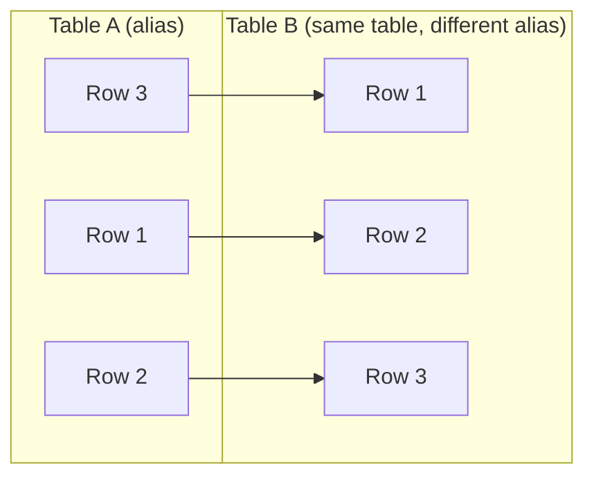

# SQL Self Join

## Introduction

A **self join** is a special type of SQL join where a table is joined with itself. This might sound unusual at first, but it's a powerful technique used when you need to compare rows within the same table or when your data has hierarchical relationships.

Self joins are used when a table has a foreign key that references its own primary key, or when you need to compare different rows from the same table. For example, finding employees and their managers from an employee table, or finding all pairs of products that have the same price.

## Understanding Self Joins

Unlike other join types that combine rows from different tables, a self join combines rows from the same table. Since we can't reference the same table twice in a query without creating confusion, we use table aliases to distinguish between the two instances of the same table.

### Basic Syntax

```sql
SELECT a.column_name, b.column_name
FROM table_name AS a
JOIN table_name AS b
ON a.common_column = b.common_column;
```

The key elements are:
- Table aliases (`a` and `b`) to differentiate between the two instances of the same table
- A join condition that establishes how the rows should be related

## Visualizing a Self Join

Here's a diagram showing how a self join works:



## Common Use Cases for Self Joins

### 1. Hierarchical Data

One of the most common applications of self joins is working with hierarchical data, like organizational structures:

#### Example: Employee-Manager Relationship

Consider an `employees` table with the following structure:

| employee_id | employee_name | manager_id |
|-------------|---------------|------------|
| 1           | John Smith     | NULL       |
| 2           | Jane Doe      | 1          |
| 3           | Bob Johnson   | 1          |
| 4           | Alice Williams| 2          |
| 5           | Charlie Brown | 2          |

To find each employee along with their manager's name:

```sql
SELECT 
    e.employee_id,
    e.employee_name AS employee,
    m.employee_name AS manager
FROM 
    employees e
LEFT JOIN 
    employees m ON e.manager_id = m.employee_id;
```

**Result:**

| employee_id | employee        | manager        |
|-------------|-----------------|----------------|
| 1           | John Smith      | NULL           |
| 2           | Jane Doe        | John Smith     |
| 3           | Bob Johnson     | John Smith     |
| 4           | Alice Williams  | Jane Doe       |
| 5           | Charlie Brown   | Jane Doe       |

In this example:
- `e` represents the employees table with employee information
- `m` represents the same table but is used to look up manager information
- The join condition `e.manager_id = m.employee_id` connects employees to their managers

### 2. Finding Pairs or Relationships

Self joins are useful for finding pairs of rows that share certain characteristics.

#### Example: Finding Products with the Same Price

Consider a `products` table:

| product_id | product_name | price  | category    |
|------------|--------------|--------|-------------|
| 1          | Laptop       | 999.99 | Electronics |
| 2          | Smartphone   | 699.99 | Electronics |
| 3          | Headphones   | 99.99  | Audio       |
| 4          | Mouse        | 29.99  | Computer    |
| 5          | Keyboard     | 29.99  | Computer    |

To find all pairs of different products that have the same price:

```sql
SELECT 
    a.product_id AS product1_id,
    a.product_name AS product1_name,
    b.product_id AS product2_id,
    b.product_name AS product2_name,
    a.price
FROM 
    products a
JOIN 
    products b ON a.price = b.price AND a.product_id < b.product_id;
```

**Result:**

| product1_id | product1_name | product2_id | product2_name | price |
|-------------|---------------|-------------|---------------|-------|
| 4           | Mouse         | 5           | Keyboard      | 29.99 |

Notes on this query:
- We use `a.product_id < b.product_id` to avoid duplicate pairs (e.g., if we had Mouse-Keyboard, we don't want Keyboard-Mouse as well)
- The join condition matches products with the same price

## Implementing Different Types of Self Joins

Just like regular joins, self joins can be implemented as INNER, LEFT, RIGHT, or FULL OUTER joins.

### Inner Self Join

Returns only the rows that have matches in both instances of the table.

```sql
SELECT a.column, b.column
FROM table a
INNER JOIN table b ON a.common_field = b.common_field;
```

### Left Self Join

Returns all rows from the first instance of the table and matching rows from the second instance.

```sql
SELECT a.column, b.column
FROM table a
LEFT JOIN table b ON a.common_field = b.common_field;
```

## Practical Example: Finding Routes between Cities

Let's look at a real-world example of using self joins to find direct flight routes between cities.

Consider a `flights` table:

| flight_id | departure_city | arrival_city | duration | price |
|-----------|----------------|--------------|----------|-------|
| 1         | New York       | Chicago      | 2.5      | 199   |
| 2         | Chicago        | Denver       | 2.0      | 150   |
| 3         | New York       | Denver       | 4.0      | 250   |
| 4         | Chicago        | New York     | 2.5      | 210   |
| 5         | Denver         | Chicago      | 2.0      | 145   |

### Finding All Connecting Flights (One-Stop Routes)

This query finds all possible one-stop routes between cities:

```sql
SELECT 
    f1.departure_city AS start_city,
    f1.arrival_city AS connecting_city,
    f2.arrival_city AS destination_city,
    f1.duration + f2.duration AS total_duration,
    f1.price + f2.price AS total_price
FROM 
    flights f1
JOIN 
    flights f2 ON f1.arrival_city = f2.departure_city
WHERE 
    f1.departure_city != f2.arrival_city; -- Exclude routes that return to the starting city
```

**Result:**

| start_city | connecting_city | destination_city | total_duration | total_price |
|------------|-----------------|------------------|----------------|-------------|
| New York   | Chicago         | Denver           | 4.5            | 349         |
| Chicago    | Denver          | Chicago          | 4.0            | 295         |
| Chicago    | New York        | Chicago          | 5.0            | 409         |
| Denver     | Chicago         | New York         | 5.0            | 355         |
| Denver     | Chicago         | Denver           | 4.0            | 295         |
| New York   | Chicago         | New York         | 5.0            | 409         |

This example:
- Joins the flights table with itself where the arrival city of the first flight (f1) matches the departure city of the second flight (f2)
- Calculates the total duration and price for the connecting flights
- Excludes routes that start and end in the same city

## Common Pitfalls and Tips

1. **Beware of Cartesian Products**: Without proper join conditions, self joins can create massive result sets. Always include appropriate join conditions.

2. **Use Clear Aliases**: Choose meaningful aliases like `employees` and `managers` instead of `e` and `m` to make your queries more readable.

3. **Watch for Performance**: Self joins on large tables can be resource-intensive. Consider adding appropriate indexes on join columns.

4. **Avoid Infinite Recursion**: When dealing with hierarchical data, be careful with recursive relationships that might cause infinite loops.

## Summary

SQL self joins are a powerful technique for:
- Working with hierarchical data
- Finding relationships between rows in the same table
- Comparing different records within a single table

By creating aliases and defining proper join conditions, you can effectively query and analyze data within a single table, revealing insights that would be difficult to obtain using other SQL operations.

## Exercises

1. Create a table called `employees` with columns for employee_id, employee_name, and manager_id. Write a self join query to display each employee along with their manager's name.

2. Given a table called `friends` with columns person_id, person_name, and friend_id, write a query to find all mutual friendships (where person A is friends with person B, and person B is friends with person A).

3. Create a `products` table with product_id, product_name, and category. Write a self join query to find all pairs of products that belong to the same category.

## Additional Resources

- [W3Schools SQL Self Join Tutorial](https://www.w3schools.com/sql/sql_join_self.asp)
- [PostgreSQL Documentation on Joins](https://www.postgresql.org/docs/current/queries-table-expressions.html)
- [SQL Self Joins for Hierarchical Data](https://www.sqlshack.com/sql-self-join-and-hierarchical-query-examples/)