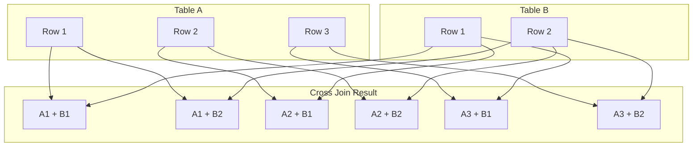

# SQL Cross Join

## Introduction

A **Cross Join** (also known as a **Cartesian Join**) is one of the fundamental join types in SQL. Unlike other joins that match rows based on related columns, a Cross Join returns the Cartesian product of two tables—meaning it combines each row from the first table with every row from the second table.

The result is a new table containing all possible combinations of rows from both source tables. If table A has N rows and table B has M rows, the cross join will produce N × M rows.

## Basic Syntax

The SQL syntax for a Cross Join is quite straightforward:

```sql
SELECT *
FROM table1
CROSS JOIN table2;
```

Or using an older, alternative syntax:

```sql
SELECT *
FROM table1, table2;
```

## Understanding Cross Joins

Let's visualize how a Cross Join works with a simple diagram:



As you can see, each row from Table A is paired with every row in Table B, resulting in a total of 6 rows (3 × 2) in the result set.

## A Simple Example

Let's look at a basic example using two small tables:

### Example Tables

Table: `colors`
```
id | color
---+------
1  | Red
2  | Blue
3  | Green
```

Table: `sizes`
```
id | size
---+------
1  | Small
2  | Medium
3  | Large
```

### Cross Join Query

```sql
SELECT colors.color, sizes.size
FROM colors
CROSS JOIN sizes;
```

### Result

```
color | size
------+------
Red   | Small
Red   | Medium
Red   | Large
Blue  | Small
Blue  | Medium
Blue  | Large
Green | Small
Green | Medium
Green | Large
```

In this example, our cross join produces 9 rows (3 colors × 3 sizes), representing all possible color-size combinations.

## When to Use Cross Joins

Cross joins might seem strange at first because they don't filter the combinations based on any relationship between the tables. However, they have several practical uses:

1. **Generating combinations**: When you need all possible combinations of items from two sets
2. **Creating test data**: Quickly generating large datasets for testing
3. **Reference table population**: Creating lookup tables with all possible combinations of values
4. **Calculating values across multiple dimensions**: Such as in financial modeling or scientific calculations

## Practical Real-World Example

Let's look at a more practical example of using a Cross Join to generate a date-time grid for a scheduling application.

### Example: Creating a Time Slot Grid

Imagine we're building a scheduling system and need to generate all possible 30-minute time slots for each day of the week.

```sql
-- Table with days of the week
CREATE TABLE days (
    day_name VARCHAR(10)
);

INSERT INTO days VALUES 
    ('Monday'), ('Tuesday'), ('Wednesday'), 
    ('Thursday'), ('Friday'), ('Saturday'), ('Sunday');

-- Table with half-hour time slots
CREATE TABLE time_slots (
    slot_time TIME
);

-- Inserting time slots from 9:00 AM to 5:00 PM in 30-minute increments
INSERT INTO time_slots VALUES 
    ('09:00'), ('09:30'), ('10:00'), ('10:30'), ('11:00'), ('11:30'),
    ('12:00'), ('12:30'), ('13:00'), ('13:30'), ('14:00'), ('14:30'),
    ('15:00'), ('15:30'), ('16:00'), ('16:30'), ('17:00');

-- Cross join to generate all possible day-time combinations
SELECT 
    days.day_name, 
    time_slots.slot_time,
    CONCAT(days.day_name, ' ', time_slots.slot_time) AS appointment_slot
FROM 
    days
CROSS JOIN 
    time_slots
ORDER BY 
    CASE
        WHEN day_name = 'Monday' THEN 1
        WHEN day_name = 'Tuesday' THEN 2
        WHEN day_name = 'Wednesday' THEN 3
        WHEN day_name = 'Thursday' THEN 4
        WHEN day_name = 'Friday' THEN 5
        WHEN day_name = 'Saturday' THEN 6
        WHEN day_name = 'Sunday' THEN 7
    END,
    slot_time;
```

### Partial Result

```
day_name  | slot_time | appointment_slot
----------+-----------+------------------
Monday    | 09:00:00  | Monday 09:00:00
Monday    | 09:30:00  | Monday 09:30:00
Monday    | 10:00:00  | Monday 10:00:00
...
Tuesday   | 09:00:00  | Tuesday 09:00:00
...
```

This query generates 119 rows (7 days × 17 time slots), creating a complete schedule grid that could be used as the foundation for an appointment booking system.

## Another Practical Example: Product Variations

Suppose you're building an e-commerce website and need to generate all possible product variations. For example, if you sell t-shirts in different colors and sizes, you could use a Cross Join to generate all available combinations.

```sql
-- Table with t-shirt colors
CREATE TABLE shirt_colors (
    color_id INT PRIMARY KEY,
    color_name VARCHAR(20)
);

INSERT INTO shirt_colors VALUES 
    (1, 'Black'), (2, 'White'), (3, 'Red'), 
    (4, 'Blue'), (5, 'Green');

-- Table with t-shirt sizes
CREATE TABLE shirt_sizes (
    size_id INT PRIMARY KEY,
    size_code VARCHAR(5)
);

INSERT INTO shirt_sizes VALUES 
    (1, 'XS'), (2, 'S'), (3, 'M'), 
    (4, 'L'), (5, 'XL'), (6, 'XXL');

-- Cross join to generate all product variations
SELECT 
    shirt_colors.color_id,
    shirt_colors.color_name,
    shirt_sizes.size_id,
    shirt_sizes.size_code,
    CONCAT('T-Shirt-', color_name, '-', size_code) AS product_sku
FROM 
    shirt_colors
CROSS JOIN 
    shirt_sizes
ORDER BY 
    color_name, 
    CASE
        WHEN size_code = 'XS' THEN 1
        WHEN size_code = 'S' THEN 2
        WHEN size_code = 'M' THEN 3
        WHEN size_code = 'L' THEN 4
        WHEN size_code = 'XL' THEN 5
        WHEN size_code = 'XXL' THEN 6
    END;
```

### Partial Result

```
color_id | color_name | size_id | size_code | product_sku
---------+------------+---------+-----------+------------------
1        | Black      | 1       | XS        | T-Shirt-Black-XS
1        | Black      | 2       | S         | T-Shirt-Black-S
1        | Black      | 3       | M         | T-Shirt-Black-M
...
2        | White      | 1       | XS        | T-Shirt-White-XS
...
```

This query generates 30 rows (5 colors × 6 sizes), creating all possible product variations for your inventory system.

## Performance Considerations

While Cross Joins are useful, they can produce very large result sets, which can lead to performance issues. Here are some guidelines to follow:

1. **Avoid unintentional Cross Joins**: Missing join conditions in queries with multiple tables can result in accidental Cross Joins
2. **Be careful with table sizes**: Cross Joins between large tables can produce enormous result sets
3. **Use WHERE clauses**: You can filter the results of a Cross Join with a WHERE clause
4. **Consider LIMIT**: If you only need a portion of the combinations, use LIMIT to restrict the output

## Comparing Cross Join with Other Join Types

Here's how Cross Join differs from other common join types:

| Join Type | Description | Use Case |
|-----------|-------------|----------|
| Cross Join | Combines each row from first table with every row from second table | Generating combinations |
| Inner Join | Returns matching rows from both tables based on join condition | Finding related records |
| Left Join | Returns all rows from left table and matching rows from right table | Preserving left table data |
| Right Join | Returns all rows from right table and matching rows from left table | Preserving right table data |
| Full Join | Returns all rows when there's a match in either table | Preserving data from both tables |

## Summary

A SQL Cross Join creates a Cartesian product between two tables, combining each row from the first table with every row from the second table. While this can quickly generate large result sets, Cross Joins have valuable applications in:

- Generating combinations or permutations
- Creating test data
- Building reference tables
- Calculating multidimensional values

Remember to use Cross Joins intentionally and be mindful of performance when working with larger tables, as the result set size is the product of the row counts of the tables being joined.

## Exercises

To practice your understanding of Cross Joins, try these exercises:

1. Create two tables: `fruits` (apple, banana, orange) and `vegetables` (carrot, spinach, potato). Write a Cross Join query to combine them.

2. Using the `colors` and `sizes` tables from the examples, write a query that generates all combinations but excludes any combination where the color is 'Red' and the size is 'Small'.

3. Create tables for months and years (2020-2025), then write a Cross Join query to generate a grid of all months for the next 5 years.

## Additional Resources

- [SQL JOIN Types Explained](https://www.link-to-your-join-types-article.com)
- [Optimizing SQL Queries](https://www.link-to-your-optimization-article.com)
- [Database Normalization Basics](https://www.link-to-your-normalization-article.com)