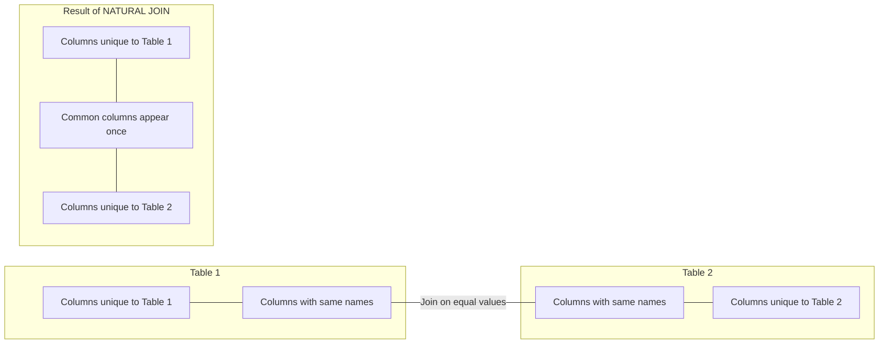

# SQL Natural Join

## Introduction

A Natural Join is a type of join operation in SQL that automatically joins tables based on columns with matching names and compatible data types. Unlike other join types where you explicitly specify the joining columns, a Natural Join identifies the common columns across tables and performs the join without requiring you to specify the join condition.

Natural Joins are part of the SQL standard and provide a convenient shorthand for joining tables, especially when your database follows consistent naming conventions. While powerful, they should be used with careful consideration of your table structure.

## How Natural Join Works

The NATURAL JOIN clause operates by:

1. Identifying all columns that have the same name in both tables
2. Using these matching columns as the join condition
3. Returning only one instance of each common column in the result set

The syntax for a Natural Join is straightforward:

```sql
SELECT columns
FROM table1
NATURAL JOIN table2;
```

This simple syntax is what makes Natural Joins attractive, but it also requires that your database design follows consistent naming conventions.

## Natural Join vs INNER JOIN with USING

A Natural Join is equivalent to an INNER JOIN with a USING clause that lists all common columns. For example:

```sql
-- Natural Join
SELECT * FROM employees NATURAL JOIN departments;

-- Equivalent INNER JOIN with USING
SELECT * FROM employees 
INNER JOIN departments USING (department_id);
```

The key difference is that with NATURAL JOIN, you don't explicitly list the join columns - the database system identifies them automatically.

## Example 1: Basic Natural Join

Let's look at a basic example using two tables: `employees` and `departments`.

**Table: employees**
```
employee_id | first_name | last_name | department_id
-----------+------------+-----------+---------------
1          | John       | Doe       | 1
2          | Jane       | Smith     | 1
3          | Bob        | Johnson   | 2
4          | Alice      | Williams  | 3
5          | Charlie    | Brown     | 2
```

**Table: departments**
```
department_id | department_name | location_id
--------------+----------------+------------
1             | HR             | 100
2             | IT             | 200
3             | Finance        | 300
4             | Marketing      | 400
```

**Query:**
```sql
SELECT employee_id, first_name, last_name, department_name
FROM employees
NATURAL JOIN departments;
```

**Result:**
```
employee_id | first_name | last_name | department_name
-----------+------------+-----------+----------------
1          | John       | Doe       | HR
2          | Jane       | Smith     | HR
3          | Bob        | Johnson   | IT
4          | Alice      | Williams  | Finance
5          | Charlie    | Brown     | IT
```

In this example, the Natural Join automatically used `department_id` (the only column with the same name in both tables) as the join condition.

## Example 2: Natural Join with Multiple Common Columns

Let's see a more complex example where tables have multiple columns in common.

**Table: products**
```
product_id | product_name | category_id | supplier_id
-----------+-------------+-------------+------------
1          | Laptop       | 1           | 101
2          | Smartphone   | 1           | 102
3          | Headphones   | 2           | 101
4          | Monitor      | 3           | 103
```

**Table: inventory**
```
inventory_id | product_id | category_id | quantity | location
-------------+------------+-------------+----------+----------
1            | 1          | 1           | 25       | Warehouse A
2            | 2          | 1           | 40       | Warehouse B
3            | 3          | 2           | 100      | Warehouse A
4            | 4          | 3           | 15       | Warehouse C
```

**Query:**
```sql
SELECT product_name, quantity, location
FROM products
NATURAL JOIN inventory;
```

**Result:**
```
product_name | quantity | location
-------------+----------+----------
Laptop       | 25       | Warehouse A
Smartphone   | 40       | Warehouse B
Headphones   | 100      | Warehouse A
Monitor      | 15       | Warehouse C
```

In this example, the Natural Join used both `product_id` AND `category_id` as join conditions since both column names exist in both tables.

## Visualizing Natural Join Operation

Here's a diagram showing how a Natural Join works:



## Real-World Application: E-commerce Database

Let's look at a real-world application in an e-commerce database where Natural Joins can be useful.

**Table: orders**
```
order_id | customer_id | order_date | status
---------+-------------+------------+-------
1001     | 5001        | 2023-01-15 | Delivered
1002     | 5002        | 2023-01-16 | Processing
1003     | 5001        | 2023-01-20 | Shipped
1004     | 5003        | 2023-01-25 | Processing
```

**Table: customers**
```
customer_id | customer_name | email                | address
------------+--------------+----------------------+-------------------
5001        | John Smith    | john@example.com    | 123 Main St
5002        | Jane Doe      | jane@example.com    | 456 Oak Ave
5003        | Bob Johnson   | bob@example.com     | 789 Pine Rd
```

**Query to get order information with customer details:**
```sql
SELECT order_id, order_date, status, customer_name, email
FROM orders
NATURAL JOIN customers;
```

**Result:**
```
order_id | order_date | status     | customer_name | email
---------+------------+------------+--------------+------------------
1001     | 2023-01-15 | Delivered  | John Smith    | john@example.com
1002     | 2023-01-16 | Processing | Jane Doe      | jane@example.com
1003     | 2023-01-20 | Shipped    | John Smith    | john@example.com
1004     | 2023-01-25 | Processing | Bob Johnson   | bob@example.com
```

This query links order information with the corresponding customer details using the `customer_id` column without having to explicitly specify it in the join condition.

## Advantages of Natural Join

1. **Simplicity**: The syntax is concise and easy to read
2. **Maintainability**: When table structure follows consistent naming conventions, Natural Joins can make queries more maintainable
3. **Less Error Prone**: Eliminates the possibility of forgetting to include join columns when tables have multiple common columns

## Potential Pitfalls

1. **Implicit Behavior**: Natural Joins use all columns with matching names, which might lead to unexpected results if tables share column names that shouldn't be part of the join condition
2. **Schema Changes**: If the schema changes and new common columns are added, the join behavior will change without any modification to the query
3. **Readability for Others**: While the syntax is simple, it might not be immediately clear to others what columns are being joined

## When to Use (and When Not to Use) Natural Joins

### Good Use Cases:
- When working with well-designed databases with consistent naming conventions
- For quick queries where tables have clearly defined relationships
- When the tables have only one column in common with the same name

### When to Avoid:
- In production code where maintainability and explicitness are priorities
- When tables have multiple columns with the same name but different meanings
- When working with complex schemas or unfamiliar databases

## Summary

SQL Natural Join provides a convenient way to join tables based on columns with matching names. It simplifies query syntax by automatically detecting common columns and using them as join conditions. While powerful and concise, Natural Joins should be used with caution, especially in production environments where explicit join conditions might be preferred for clarity and maintainability.

Remember these key points:
- Natural Joins use ALL columns with matching names
- The result set contains only one instance of each common column
- They're equivalent to INNER JOINs with USING clauses
- They can be convenient but potentially unpredictable if schema changes

## Exercises

1. Given two tables `students` (student_id, name, class_id) and `classes` (class_id, class_name, teacher_id), write a query using NATURAL JOIN to list all students with their respective class names.

2. Create two tables `products` and `categories` with a common column `category_id`. Insert sample data and practice writing Natural Join queries.

3. Compare the results of a NATURAL JOIN with an INNER JOIN using an explicit ON clause. Are the results the same? If not, why?

4. Write a query that joins three tables using Natural Joins (`employees`, `departments`, and `locations`). What challenges did you encounter?

## Additional Resources

- [SQL Standard Documentation](https://www.iso.org/standard/63555.html)
- [PostgreSQL Documentation on Joins](https://www.postgresql.org/docs/current/tutorial-join.html)
- [MySQL Documentation on Joins](https://dev.mysql.com/doc/refman/8.0/en/join.html)
- Book: "SQL Cookbook" by Anthony Molinaro
- Book: "SQL Performance Explained" by Markus Winand