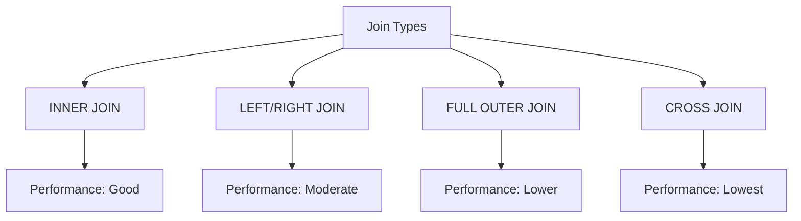
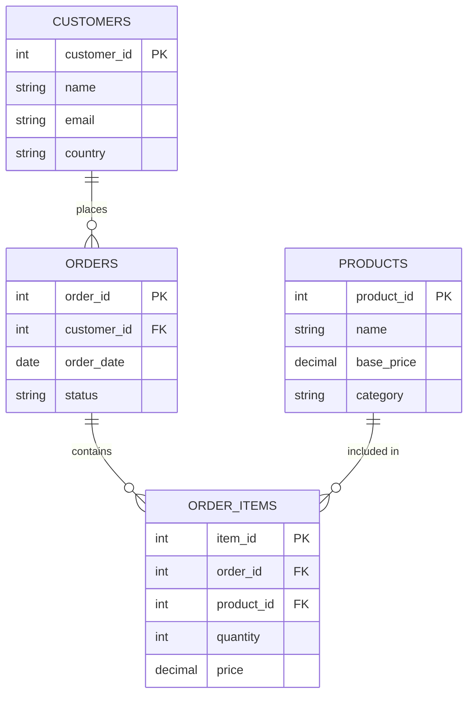

# SQL Join Optimization

Joins are essential operations in SQL that allow you to combine data from multiple tables. However, poorly optimized joins can significantly impact your database performance, especially when working with large datasets. This guide will teach you practical techniques to optimize your SQL joins for better efficiency and speed.

## Introduction

When you're working with relational databases, joins are unavoidable. They're powerful but can become performance bottlenecks if not implemented correctly. Join optimization is the process of structuring your joins and queries to minimize execution time and resource usage.

Think of joins like connecting puzzle pieces—there are efficient and inefficient ways to solve the puzzle. This guide will show you how to find the most efficient path.

## Why Join Optimization Matters

Consider these two scenarios:

**Scenario 1**: A query that takes 0.5 seconds to execute
**Scenario 2**: The same query, optimized, taking 0.05 seconds to execute

This 10x performance improvement might seem small for a single query, but when your application runs thousands of queries per minute, the difference becomes dramatic:

- **Unoptimized**: 500ms × 1,000 = 500,000ms (8.3 minutes)
- **Optimized**: 50ms × 1,000 = 50,000ms (50 seconds)

Let's dive into how you can achieve these kinds of optimizations.

## Understanding Join Types and Their Performance

Before optimizing joins, it's important to understand how different types of joins perform:



### Performance Ranking (Best to Worst)

1. **INNER JOIN**: Usually the most efficient as it only returns matched records
2. **LEFT/RIGHT JOIN**: Moderately efficient but requires scanning the entire "preserved" table
3. **FULL OUTER JOIN**: Less efficient as it requires processing all records from both tables
4. **CROSS JOIN**: Least efficient as it produces a Cartesian product of both tables

## Essential Join Optimization Techniques

### 1. Use Proper Indexes

Indexes are perhaps the most powerful optimization technique for joins.

```sql
-- Without index (slow)
SELECT customers.name, orders.order_date
FROM customers
JOIN orders ON customers.customer_id = orders.customer_id
WHERE orders.amount > 1000;

-- First create an index
CREATE INDEX idx_customer_id ON orders(customer_id);
CREATE INDEX idx_amount ON orders(amount);

-- Same query (now much faster)
```

**Before indexing**: The database might need to scan all records in both tables.
**After indexing**: The database can use the index to quickly find matching records.

Remember: Always index the join columns on both tables!

### 2. Join Order Matters

The order in which you join tables can significantly impact performance. As a general rule:

1. Start with the table that will return the fewest rows after filtering
2. Join from smaller to larger tables when possible

```sql
-- Less efficient: Starts with a large table
SELECT c.name, o.order_date
FROM orders o
JOIN customers c ON c.customer_id = o.customer_id
WHERE o.amount > 5000;

-- More efficient: Starts with a smaller result set
SELECT c.name, o.order_date
FROM (SELECT * FROM orders WHERE amount > 5000) o
JOIN customers c ON c.customer_id = o.customer_id;
```

### 3. Filter Early

Apply WHERE clauses before joins to reduce the number of rows being joined.

```sql
-- Less efficient: Filtering after join
SELECT c.name, o.order_date
FROM customers c
JOIN orders o ON c.customer_id = o.customer_id
WHERE o.amount > 1000 AND c.country = 'USA';

-- More efficient: Filtering before join
SELECT c.name, o.order_date
FROM (SELECT * FROM customers WHERE country = 'USA') c
JOIN (SELECT * FROM orders WHERE amount > 1000) o 
ON c.customer_id = o.customer_id;
```

### 4. Avoid SELECT *

Only select the columns you actually need, especially in joins.

```sql
-- Inefficient: Selects all columns
SELECT * 
FROM customers c
JOIN orders o ON c.customer_id = o.customer_id;

-- Efficient: Selects only needed columns
SELECT c.name, c.email, o.order_date, o.amount
FROM customers c
JOIN orders o ON c.customer_id = o.customer_id;
```

### 5. Use JOIN Instead of Subqueries When Possible

Joins are often more efficient than correlated subqueries.

```sql
-- Less efficient: Using subquery
SELECT c.name,
       (SELECT MAX(order_date) 
        FROM orders 
        WHERE customer_id = c.customer_id) as last_order
FROM customers c;

-- More efficient: Using JOIN
SELECT c.name, MAX(o.order_date) as last_order
FROM customers c
LEFT JOIN orders o ON c.customer_id = o.customer_id
GROUP BY c.name;
```

## Real-World Example: E-commerce Order Analysis

Let's optimize a real-world query that analyzes customer orders in an e-commerce database.

### Database Schema



### Unoptimized Query

Here's a query to find the total spending by US customers on electronics products:

```sql
SELECT c.name, c.email, SUM(oi.price * oi.quantity) as total_spent
FROM customers c
JOIN orders o ON c.customer_id = o.customer_id
JOIN order_items oi ON o.order_id = oi.order_id
JOIN products p ON oi.product_id = p.product_id
WHERE c.country = 'USA' AND p.category = 'Electronics'
GROUP BY c.name, c.email;
```

### Optimized Query

```sql
-- First, ensure proper indexes exist
CREATE INDEX idx_customer_country ON customers(country);
CREATE INDEX idx_product_category ON products(category);
CREATE INDEX idx_order_customer ON orders(customer_id);
CREATE INDEX idx_orderitems_order ON order_items(order_id);
CREATE INDEX idx_orderitems_product ON order_items(product_id);

-- Optimized query
SELECT c.name, c.email, SUM(oi.price * oi.quantity) as total_spent
FROM customers c
JOIN (
    -- Filter orders early
    SELECT o.order_id, o.customer_id
    FROM orders o
) o ON c.customer_id = o.customer_id
JOIN order_items oi ON o.order_id = oi.order_id
-- Filter products early
JOIN (
    SELECT product_id
    FROM products 
    WHERE category = 'Electronics'
) p ON oi.product_id = p.product_id
WHERE c.country = 'USA'
GROUP BY c.name, c.email;
```

The optimized query:
1. Uses appropriate indexes
2. Filters data early before joining
3. Only selects necessary columns
4. Joins the tables in an efficient order

## Using Query Execution Plans

Most database systems provide tools to analyze query execution plans, which show how your query will be processed.

For MySQL, use `EXPLAIN`:

```sql
EXPLAIN SELECT c.name, o.order_date
FROM customers c
JOIN orders o ON c.customer_id = o.customer_id
WHERE c.country = 'USA';
```

Example output:
```
+----+-------------+-------+------------+------+---------------+------+---------+------+------+----------+-------------+
| id | select_type | table | partitions | type | possible_keys | key  | key_len | ref  | rows | filtered | Extra       |
+----+-------------+-------+------------+------+---------------+------+---------+------+------+----------+-------------+
|  1 | SIMPLE      | c     | NULL       | ALL  | NULL          | NULL | NULL    | NULL | 1000 |    10.00 | Using where |
|  1 | SIMPLE      | o     | NULL       | ALL  | NULL          | NULL | NULL    | NULL | 5000 |    10.00 | Using join  |
+----+-------------+-------+------------+------+---------------+------+---------+------+------+----------+-------------+
```

This shows a table scan (`type: ALL`) which is inefficient. After adding indexes:

```
+----+-------------+-------+------------+------+---------------+----------------+---------+-------------------+------+----------+-------------+
| id | select_type | table | partitions | type | possible_keys | key            | key_len | ref               | rows | filtered | Extra       |
+----+-------------+-------+------------+------+---------------+----------------+---------+-------------------+------+----------+-------------+
|  1 | SIMPLE      | c     | NULL       | ref  | idx_country   | idx_country    | 3       | const             |  100 |   100.00 | Using where |
|  1 | SIMPLE      | o     | NULL       | ref  | idx_customer  | idx_customer   | 4       | db.c.customer_id  |    5 |   100.00 | Using join  |
+----+-------------+-------+------------+------+---------------+----------------+---------+-------------------+------+----------+-------------+
```

Now it uses indexes (`type: ref`) and processes fewer rows!

## Common Join Optimization Mistakes

1. **Missing indexes on join columns**
   - This is the #1 reason for slow joins
   
2. **Joining too many tables at once**
   - Try to limit joins to 5 or fewer tables when possible
   
3. **Using incorrect join types**
   - Using LEFT JOIN when INNER JOIN would suffice
   
4. **Not filtering data before joins**
   - Always apply filters to reduce the dataset size before joining

5. **Joining on non-indexed columns**
   - Always index both sides of the join condition

## Summary

Optimizing SQL joins is a crucial skill for building efficient database applications. We've covered:

- The importance of proper indexing for join columns
- How join order affects performance
- Filtering data early to reduce join size
- Selecting only necessary columns
- Using query execution plans to identify bottlenecks

By applying these techniques, you can significantly improve your database performance and create more responsive applications.

## Exercises

1. Given the schema from our e-commerce example, write an optimized query to find the top 5 products purchased by customers from Canada.

2. Analyze and optimize this query:
   ```sql
   SELECT * 
   FROM employees e
   LEFT JOIN departments d ON e.dept_id = d.dept_id
   LEFT JOIN locations l ON d.location_id = l.location_id
   LEFT JOIN countries c ON l.country_id = c.country_id
   WHERE e.hire_date > '2020-01-01';
   ```

3. Create appropriate indexes for this query:
   ```sql
   SELECT o.order_id, c.name, p.name
   FROM orders o
   JOIN customers c ON o.customer_id = c.customer_id
   JOIN order_items oi ON o.order_id = oi.order_id
   JOIN products p ON oi.product_id = p.product_id
   WHERE o.order_date BETWEEN '2023-01-01' AND '2023-12-31'
   AND p.category = 'Electronics';
   ```

## Additional Resources

- [SQL Performance Explained](https://use-the-index-luke.com/) - A comprehensive resource on SQL indexing and performance
- [MySQL Explain Documentation](https://dev.mysql.com/doc/refman/8.0/en/explain.html)
- [PostgreSQL EXPLAIN Documentation](https://www.postgresql.org/docs/current/using-explain.html)
- [SQLite Query Planning](https://www.sqlite.org/queryplanner.html)

Happy optimizing!