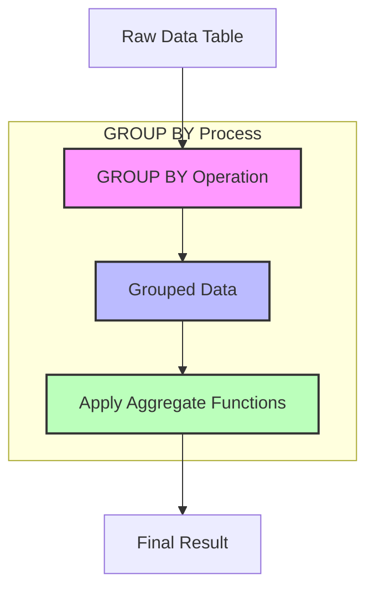

# SQL GROUP BY

## Introduction

The `GROUP BY` clause is one of the most powerful features in SQL, allowing you to organize your data into groups and perform calculations on each group separately. When you need to analyze data at a summarized level rather than individual rows, `GROUP BY` is your go-to tool.

In this tutorial, you'll learn:
- What the `GROUP BY` clause does and why it's useful
- How to use `GROUP BY` with aggregate functions
- Common use cases and examples
- Best practices and common pitfalls

## Understanding GROUP BY

### Basic Concept

The `GROUP BY` clause divides the rows in a result set into groups based on the values in one or more columns. It's typically used with aggregate functions like `COUNT()`, `SUM()`, `AVG()`, `MIN()`, and `MAX()` to perform calculations on each group.

Think of `GROUP BY` as a way to organize your data into buckets, where each bucket contains rows that share the same value in the specified column(s).

### Syntax

```sql
SELECT column1, column2, ... , aggregate_function(column)
FROM table_name
GROUP BY column1, column2, ...;
```

Where:
- `column1, column2, ...` are the columns you want to group by
- `aggregate_function(column)` is an optional aggregate function applied to each group

## GROUP BY with Aggregate Functions

Let's look at a simple example using a `sales` table:

```sql
CREATE TABLE sales (
  id INT PRIMARY KEY,
  product_name VARCHAR(50),
  category VARCHAR(50),
  price DECIMAL(10, 2),
  quantity INT,
  sale_date DATE
);

INSERT INTO sales VALUES
(1, 'Laptop', 'Electronics', 999.99, 1, '2023-01-15'),
(2, 'Mouse', 'Electronics', 24.99, 3, '2023-01-15'),
(3, 'Keyboard', 'Electronics', 59.99, 2, '2023-01-16'),
(4, 'Coffee Mug', 'Kitchen', 12.99, 4, '2023-01-17'),
(5, 'Blender', 'Kitchen', 79.99, 1, '2023-01-18'),
(6, 'Headphones', 'Electronics', 149.99, 2, '2023-01-19'),
(7, 'Plate Set', 'Kitchen', 39.99, 1, '2023-01-20'),
(8, 'Mouse', 'Electronics', 24.99, 5, '2023-01-21');
```

### Counting Items in Each Category

To count how many different products we have in each category:

```sql
SELECT category, COUNT(*) AS product_count
FROM sales
GROUP BY category;
```

**Output:**
```
|  category   | product_count |
|-------------|---------------|
| Electronics |       4       |
| Kitchen     |       3       |
```

The `GROUP BY` clause grouped all rows with the same `category` value, and the `COUNT(*)` function counted the number of rows in each group.

### Calculating Totals by Category

Let's calculate the total revenue (price × quantity) for each category:

```sql
SELECT 
    category, 
    SUM(price * quantity) AS total_revenue
FROM sales
GROUP BY category;
```

**Output:**
```
|  category   | total_revenue |
|-------------|---------------|
| Electronics |    1485.90    |
| Kitchen     |     172.95    |
```

### Multiple Aggregations

You can use multiple aggregate functions in the same query:

```sql
SELECT 
    category,
    COUNT(*) AS transaction_count,
    SUM(quantity) AS total_items_sold,
    AVG(price) AS average_price,
    MIN(price) AS lowest_price,
    MAX(price) AS highest_price
FROM sales
GROUP BY category;
```

**Output:**
```
|  category   | transaction_count | total_items_sold | average_price | lowest_price | highest_price |
|-------------|-------------------|------------------|---------------|--------------|---------------|
| Electronics |         4         |        11        |    307.49     |    24.99     |    999.99     |
| Kitchen     |         3         |         6        |     44.32     |    12.99     |     79.99     |
```

## Grouping by Multiple Columns

You can group by multiple columns to create more specific groups:

```sql
SELECT 
    category,
    product_name,
    SUM(quantity) AS total_quantity
FROM sales
GROUP BY category, product_name;
```

**Output:**
```
|  category   | product_name | total_quantity |
|-------------|--------------|----------------|
| Electronics | Headphones   |        2       |
| Electronics | Keyboard     |        2       |
| Electronics | Laptop       |        1       |
| Electronics | Mouse        |        8       |
| Kitchen     | Blender      |        1       |
| Kitchen     | Coffee Mug   |        4       |
| Kitchen     | Plate Set    |        1       |
```

This groups the data first by `category`, and then by `product_name` within each category.

## GROUP BY with HAVING

The `HAVING` clause allows you to filter groups based on aggregate results. It works like the `WHERE` clause but operates on grouped data:

```sql
SELECT 
    category, 
    SUM(quantity) AS total_quantity
FROM sales
GROUP BY category
HAVING SUM(quantity) > 5;
```

**Output:**
```
|  category   | total_quantity |
|-------------|----------------|
| Electronics |       11       |
| Kitchen     |        6       |
```

## GROUP BY with ORDER BY

You can use `ORDER BY` to sort your grouped results:

```sql
SELECT 
    category, 
    SUM(price * quantity) AS total_revenue
FROM sales
GROUP BY category
ORDER BY total_revenue DESC;
```

**Output:**
```
|  category   | total_revenue |
|-------------|---------------|
| Electronics |    1485.90    |
| Kitchen     |     172.95    |
```

## Real-World Applications

### Sales Analysis by Date

Let's say you want to analyze sales trends by date:

```sql
SELECT 
    sale_date,
    COUNT(*) AS transactions,
    SUM(price * quantity) AS daily_revenue
FROM sales
GROUP BY sale_date
ORDER BY sale_date;
```

**Output:**
```
| sale_date  | transactions | daily_revenue |
|------------|--------------|---------------|
| 2023-01-15 |      2       |    1074.96    |
| 2023-01-16 |      1       |     119.98    |
| 2023-01-17 |      1       |      51.96    |
| 2023-01-18 |      1       |      79.99    |
| 2023-01-19 |      1       |     299.98    |
| 2023-01-20 |      1       |      39.99    |
| 2023-01-21 |      1       |     124.95    |
```

### Calculating Product Popularity

```sql
SELECT 
    product_name,
    SUM(quantity) AS units_sold,
    COUNT(*) AS transaction_count
FROM sales
GROUP BY product_name
ORDER BY units_sold DESC;
```

**Output:**
```
| product_name | units_sold | transaction_count |
|--------------|------------|-------------------|
| Mouse        |     8      |         2         |
| Coffee Mug   |     4      |         1         |
| Headphones   |     2      |         1         |
| Keyboard     |     2      |         1         |
| Blender      |     1      |         1         |
| Laptop       |     1      |         1         |
| Plate Set    |     1      |         1         |
```

### Group by Year and Month

Let's extract the year and month from the sale date and group by them:

```sql
SELECT 
    EXTRACT(YEAR FROM sale_date) AS year,
    EXTRACT(MONTH FROM sale_date) AS month,
    SUM(price * quantity) AS monthly_revenue
FROM sales
GROUP BY 
    EXTRACT(YEAR FROM sale_date),
    EXTRACT(MONTH FROM sale_date)
ORDER BY year, month;
```

**Output:**
```
| year | month | monthly_revenue |
|------|-------|-----------------|
| 2023 |   1   |     1791.81     |
```

In this example, all sales were in January 2023, but in a real-world scenario, this query would show revenue trends over time.

## Common Pitfalls and Best Practices

### The SELECT Clause Rule

In a `GROUP BY` query, every column in the `SELECT` clause must either:
1. Be included in the `GROUP BY` clause, or
2. Be used within an aggregate function

This incorrect query will generate an error:

```sql
-- Incorrect: product_name is not in GROUP BY
SELECT category, product_name, COUNT(*)
FROM sales
GROUP BY category;
```

The correct version:

```sql
SELECT category, product_name, COUNT(*)
FROM sales
GROUP BY category, product_name;
```

### Order of Operations

The SQL execution order for a query with `GROUP BY` is:

1. `FROM` clause
2. `WHERE` clause
3. `GROUP BY` clause
4. `HAVING` clause
5. `SELECT` clause
6. `ORDER BY` clause

Understanding this order is important. For example, you can't use an alias created in the `SELECT` clause within the `GROUP BY` or `HAVING` clause.

### GROUP BY vs. DISTINCT

While both `GROUP BY` and `DISTINCT` can remove duplicates, they serve different purposes:

- `DISTINCT` simply removes duplicate rows
- `GROUP BY` organizes data into groups for aggregate calculations

```sql
-- Using DISTINCT
SELECT DISTINCT category FROM sales;

-- Using GROUP BY
SELECT category FROM sales GROUP BY category;
```

Both queries return the same result in this case, but `GROUP BY` allows you to perform calculations on each group.

## Visual Representation

Here's a diagram showing how `GROUP BY` works:



## Summary

The `GROUP BY` clause is an essential SQL feature for data analysis and reporting. Here's what we've covered:

- `GROUP BY` organizes rows into groups based on column values
- It's typically used with aggregate functions like `COUNT()`, `SUM()`, `AVG()`, `MIN()`, and `MAX()`
- You can group by multiple columns for more specific grouping
- The `HAVING` clause filters groups based on aggregate results
- Every column in the `SELECT` list must either be in the `GROUP BY` clause or used within an aggregate function

By mastering `GROUP BY`, you'll be able to transform raw data into meaningful insights and summaries that help you understand your data better.

## Exercises

1. Write a query to find the total quantity sold for each product in the sales table.
2. Write a query to find the average price of products in each category.
3. Find the date with the highest total sales revenue.
4. Count how many sales transactions occurred on each day of the week.
5. Find categories where the average price is greater than $50.
