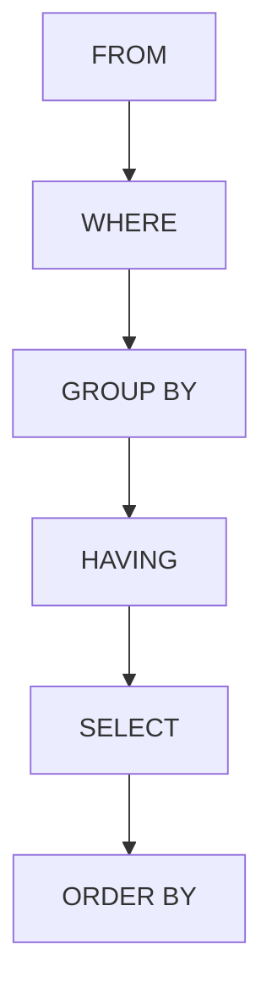

# SQL HAVING Clause

## Introduction

When analyzing data in SQL, you often need to filter results after grouping them. While the `WHERE` clause filters rows before grouping, the `HAVING` clause allows you to filter **after** grouping has occurred. This distinction is crucial when working with aggregate functions like `COUNT()`, `SUM()`, `AVG()`, `MIN()`, and `MAX()`.

In this tutorial, you'll learn:
- What the `HAVING` clause is and why it's needed
- The difference between `WHERE` and `HAVING`
- How to use `HAVING` with various aggregate functions
- Real-world applications of the `HAVING` clause

## Basic Syntax

Here's the basic syntax of the `HAVING` clause:

```sql
SELECT column_name(s), aggregate_function(column_name)
FROM table_name
GROUP BY column_name(s)
HAVING condition;
```

The `HAVING` clause always appears after the `GROUP BY` clause and before any `ORDER BY` clause.

## WHERE vs. HAVING

Let's understand the key differences between `WHERE` and `HAVING`:

| `WHERE` Clause | `HAVING` Clause |
|----------------|-----------------|
| Filters rows before grouping | Filters groups after grouping |
| Cannot contain aggregate functions | Can contain aggregate functions |
| Applied to individual rows | Applied to groups of rows |
| Executed before `GROUP BY` | Executed after `GROUP BY` |

This sequence diagram illustrates the order of operations in a SQL query:



## Basic Examples

### Example 1: Filter by Count

Let's say we have a `sales` table with customer purchases:

```sql
CREATE TABLE sales (
    customer_id INT,
    product_id INT,
    purchase_date DATE,
    amount DECIMAL(10, 2)
);

INSERT INTO sales VALUES
(1, 101, '2023-01-15', 150.00),
(1, 102, '2023-01-20', 75.50),
(2, 101, '2023-01-16', 150.00),
(3, 103, '2023-01-18', 200.00),
(3, 104, '2023-01-19', 85.75),
(3, 105, '2023-01-22', 125.50),
(4, 102, '2023-01-21', 75.50),
(5, 101, '2023-01-17', 150.00);
```

To find customers who have made more than 2 purchases:

```sql
SELECT customer_id, COUNT(*) AS purchase_count
FROM sales
GROUP BY customer_id
HAVING COUNT(*) > 2;
```

Result:

```
customer_id | purchase_count
------------+---------------
3           | 3
```

Only customer_id 3 has made more than 2 purchases.

### Example 2: Filter by Sum

Find product categories with total sales over $300:

```sql
SELECT product_id, SUM(amount) AS total_sales
FROM sales
GROUP BY product_id
HAVING SUM(amount) > 300;
```

Result:

```
product_id | total_sales
-----------+------------
101        | 450.00
```

Only product_id 101 has total sales exceeding $300.

## Using HAVING with Other Clauses

The `HAVING` clause can be combined with other clauses for more complex queries.

### Example 3: WHERE, GROUP BY, and HAVING Together

Find customers who made purchases in January 2023 with an average purchase amount over $100:

```sql
SELECT customer_id, AVG(amount) AS avg_purchase
FROM sales
WHERE purchase_date BETWEEN '2023-01-01' AND '2023-01-31'
GROUP BY customer_id
HAVING AVG(amount) > 100
ORDER BY avg_purchase DESC;
```

Result:

```
customer_id | avg_purchase
------------+-------------
3           | 137.08
1           | 112.75
5           | 150.00
2           | 150.00
```

Notice the order of clauses:
1. `WHERE` filters rows (before grouping)
2. `GROUP BY` groups the filtered rows
3. `HAVING` filters the groups
4. `ORDER BY` sorts the results

## Multiple Conditions in HAVING

Like the `WHERE` clause, `HAVING` can use multiple conditions with logical operators.

### Example 4: Multiple Conditions

Find customers who made more than 1 purchase with a total spending over $200:

```sql
SELECT customer_id, COUNT(*) AS purchase_count, SUM(amount) AS total_spent
FROM sales
GROUP BY customer_id
HAVING COUNT(*) > 1 AND SUM(amount) > 200;
```

Result:

```
customer_id | purchase_count | total_spent
------------+----------------+------------
1           | 2              | 225.50
3           | 3              | 411.25
```

## HAVING with JOINS

The `HAVING` clause works well with joined tables too.

### Example 5: HAVING with JOIN

Let's add a `customers` table with more information:

```sql
CREATE TABLE customers (
    customer_id INT,
    customer_name VARCHAR(100),
    city VARCHAR(100)
);

INSERT INTO customers VALUES
(1, 'Alice Smith', 'New York'),
(2, 'Bob Johnson', 'Chicago'),
(3, 'Carol Williams', 'New York'),
(4, 'Dave Brown', 'Los Angeles'),
(5, 'Eve Davis', 'Chicago');
```

Now, find cities where customers have spent more than $300 in total:

```sql
SELECT c.city, SUM(s.amount) AS total_sales
FROM sales s
JOIN customers c ON s.customer_id = c.customer_id
GROUP BY c.city
HAVING SUM(s.amount) > 300;
```

Result:

```
city      | total_sales
----------+------------
New York  | 636.75
```

## Real-World Applications

### Example 6: Business Analysis

A company might use the `HAVING` clause to identify high-value product categories:

```sql
SELECT 
    category,
    COUNT(DISTINCT product_id) AS product_count,
    SUM(sales_amount) AS total_revenue,
    AVG(sales_amount) AS avg_sale
FROM 
    product_sales
GROUP BY 
    category
HAVING 
    SUM(sales_amount) > 10000 AND COUNT(DISTINCT product_id) >= 3;
```

This query finds product categories that:
- Generated more than $10,000 in revenue
- Have at least 3 different products sold

### Example 7: Customer Segmentation

Identify customer segments for a targeted marketing campaign:

```sql
SELECT 
    customer_segment,
    COUNT(*) AS customer_count,
    AVG(annual_spending) AS avg_spending
FROM 
    customer_data
GROUP BY 
    customer_segment
HAVING 
    COUNT(*) > 100 AND AVG(annual_spending) > 500;
```

This targets large customer segments (>100 customers) with high average spending (>$500).

## Common Mistakes

### Mistake 1: Using WHERE Instead of HAVING

This query will fail:

```sql
-- This will cause an error
SELECT department, AVG(salary)
FROM employees
WHERE AVG(salary) > 50000
GROUP BY department;
```

The correct version uses `HAVING`:

```sql
-- Correct version
SELECT department, AVG(salary) AS avg_salary
FROM employees
GROUP BY department
HAVING AVG(salary) > 50000;
```

### Mistake 2: Referencing Column Aliases

In some database systems, you cannot reference column aliases in the `HAVING` clause:

```sql
-- This may fail in some databases
SELECT department, AVG(salary) AS avg_salary
FROM employees
GROUP BY department
HAVING avg_salary > 50000;
```

The safer approach is to repeat the aggregate function:

```sql
-- This works in all databases
SELECT department, AVG(salary) AS avg_salary
FROM employees
GROUP BY department
HAVING AVG(salary) > 50000;
```

## Summary

The `HAVING` clause is a powerful SQL feature that allows you to filter grouped data based on aggregate function results. Key points to remember:

- Use `WHERE` to filter individual rows before grouping
- Use `HAVING` to filter groups after the `GROUP BY` clause
- `HAVING` can work with aggregate functions like `COUNT()`, `SUM()`, `AVG()`, `MIN()`, and `MAX()`
- The `HAVING` clause can be combined with `JOIN`, `WHERE`, and `ORDER BY` for complex queries
- Always place `HAVING` after `GROUP BY` and before `ORDER BY`

By mastering the `HAVING` clause, you can write more efficient and expressive SQL queries that extract valuable insights from grouped data.

## Exercises

1. Write a query to find departments with more than 10 employees and an average salary above $60,000.
2. Create a query to identify products that have been ordered more than 5 times with a total order value exceeding $1,000.
3. Write a query to find customer segments where the average customer age is over 30 and the total spending is above $10,000.

## Additional Resources

- [MySQL Documentation: GROUP BY Clause](https://dev.mysql.com/doc/refman/8.0/en/group-by-modifiers.html)
- [PostgreSQL Documentation: GROUP BY Clause](https://www.postgresql.org/docs/current/queries-table-expressions.html#QUERIES-GROUP)
- [SQL Aggregate Functions](https://www.w3schools.com/sql/sql_count_avg_sum.asp)
- [Advanced SQL Grouping Operations](https://mode.com/sql-tutorial/sql-group-by/)