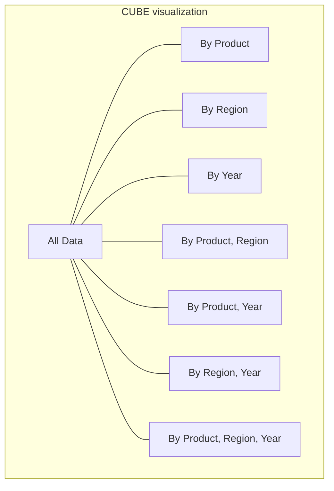

# SQL CUBE

## Introduction

When analyzing data, you often need to examine it from multiple dimensions and levels of granularity simultaneously. The SQL `CUBE` operator extends the functionality of `GROUP BY` to generate all possible combinations of grouping columns, providing a powerful tool for multi-dimensional data analysis.

Introduced as part of the SQL standard's OLAP (Online Analytical Processing) features, `CUBE` allows you to perform comprehensive aggregations without writing multiple queries - saving time and making your analytics more efficient.

## What is CUBE?

The `CUBE` operator is an extension to the `GROUP BY` clause that generates all possible grouping sets for the specified columns. A grouping set is a set of columns by which you group your data.

For example, if you `GROUP BY CUBE (A, B)`, SQL will generate results grouped by:
- `(A, B)` - Data grouped by both A and B
- `(A)` - Data grouped by only A
- `(B)` - Data grouped by only B
- `()` - Data not grouped by any column (grand total)

This is equivalent to combining the results of multiple `GROUP BY` clauses with `UNION ALL`, but much more concise and efficient.

## Syntax

The basic syntax for using `CUBE` is:

```sql
SELECT column1, column2, ..., aggregate_function(column)
FROM table
GROUP BY CUBE (column1, column2, ...);
```

In some database systems, the syntax might vary slightly:

```sql
-- Alternative syntax in some systems
SELECT column1, column2, ..., aggregate_function(column)
FROM table
GROUP BY column1, column2, ... WITH CUBE;
```

## Simple CUBE Example

Let's start with a basic example. Imagine we have a `sales` table with the following data:

| product  | region | year | amount |
|----------|--------|------|--------|
| Widget   | North  | 2022 | 1000   |
| Widget   | South  | 2022 | 1500   |
| Gadget   | North  | 2022 | 2000   |
| Gadget   | South  | 2022 | 2500   |
| Widget   | North  | 2023 | 1200   |
| Widget   | South  | 2023 | 1700   |
| Gadget   | North  | 2023 | 2200   |
| Gadget   | South  | 2023 | 2700   |

Now, let's apply the `CUBE` operator to see sales aggregated by product and region:

```sql
SELECT 
    product,
    region,
    SUM(amount) as total_sales
FROM 
    sales
GROUP BY 
    CUBE (product, region);
```

This query will produce the following result:

| product  | region | total_sales |
|----------|--------|-------------|
| Widget   | North  | 2200        |
| Widget   | South  | 3200        |
| Gadget   | North  | 4200        |
| Gadget   | South  | 5200        |
| Widget   | NULL   | 5400        | -- Total for Widget across all regions
| Gadget   | NULL   | 9400        | -- Total for Gadget across all regions
| NULL     | North  | 6400        | -- Total for North region across all products
| NULL     | South  | 8400        | -- Total for South region across all products
| NULL     | NULL   | 14800       | -- Grand total

The `NULL` values in the result indicate the rows that represent aggregated data for that dimension. For example, when `product` is "Widget" and `region` is `NULL`, the row shows the total sales for all Widgets regardless of region.

## Understanding NULL in CUBE Results

When using `CUBE`, `NULL` values in the result set represent aggregated values. However, this can cause confusion if your data already contains legitimate `NULL` values.

To distinguish between these two types of `NULL`s, many databases provide the `GROUPING()` function, which returns:
- `1` when the column value is `NULL` because it's summarized (aggregated)
- `0` when the column value is an actual `NULL` in the data

Here's how you can use it:

```sql
SELECT 
    CASE WHEN GROUPING(product) = 1 THEN 'All Products' ELSE COALESCE(product, 'Unknown') END AS product,
    CASE WHEN GROUPING(region) = 1 THEN 'All Regions' ELSE COALESCE(region, 'Unknown') END AS region,
    SUM(amount) as total_sales
FROM 
    sales
GROUP BY 
    CUBE (product, region);
```

This query produces more readable output:

| product      | region      | total_sales |
|--------------|-------------|-------------|
| Widget       | North       | 2200        |
| Widget       | South       | 3200        |
| Gadget       | North       | 4200        |
| Gadget       | South       | 5200        |
| Widget       | All Regions | 5400        |
| Gadget       | All Regions | 9400        |
| All Products | North       | 6400        |
| All Products | South       | 8400        |
| All Products | All Regions | 14800       |

## Real-World Applications of CUBE

### Sales Analysis Dashboard

One common use case for `CUBE` is in building sales dashboards that need to show data at multiple levels of aggregation:

```sql
SELECT 
    COALESCE(category, 'All Categories') AS category,
    COALESCE(region, 'All Regions') AS region,
    COALESCE(TO_CHAR(sale_date, 'YYYY'), 'All Years') AS year,
    SUM(amount) AS total_sales,
    COUNT(*) AS num_transactions,
    AVG(amount) AS avg_sale
FROM 
    sales
GROUP BY 
    CUBE(category, region, TO_CHAR(sale_date, 'YYYY'));
```

This query generates data that can power an interactive dashboard allowing users to drill down into specific categories, regions, or years, or view combinations of these dimensions.

### Inventory Analysis

Another practical application is analyzing inventory levels across multiple dimensions:

```sql
SELECT
    COALESCE(warehouse, 'All Warehouses') AS warehouse,
    COALESCE(product_type, 'All Products') AS product_type,
    COALESCE(TO_CHAR(stock_date, 'MM-YYYY'), 'All Periods') AS period,
    SUM(quantity) AS total_stock,
    AVG(quantity) AS avg_stock,
    MAX(quantity) AS max_stock,
    MIN(quantity) AS min_stock
FROM
    inventory
GROUP BY
    CUBE(warehouse, product_type, TO_CHAR(stock_date, 'MM-YYYY'));
```

This allows inventory managers to see stock levels at various levels of detail in a single query.

## CUBE vs. ROLLUP and GROUPING SETS

SQL provides several extensions to `GROUP BY` for multi-dimensional analysis:

1. `CUBE`: Generates all possible combinations of grouping columns (2ⁿ combinations for n columns)
2. `ROLLUP`: Creates a hierarchical set of groupings, good for hierarchical dimensions like time (year, quarter, month)
3. `GROUPING SETS`: Allows you to specify exactly which grouping combinations you want

Here's a comparison using our sales data:

```sql
-- CUBE: All possible combinations
SELECT product, region, year, SUM(amount)
FROM sales
GROUP BY CUBE(product, region, year);
-- Generates 2³ = 8 grouping combinations

-- ROLLUP: Hierarchical grouping
SELECT product, region, year, SUM(amount)
FROM sales
GROUP BY ROLLUP(product, region, year);
-- Generates 4 grouping combinations: (product,region,year), (product,region), (product), ()

-- GROUPING SETS: Custom selection of groupings
SELECT product, region, year, SUM(amount)
FROM sales
GROUP BY GROUPING SETS(
    (product, region, year),
    (product, region),
    (region, year),
    ()
);
-- Generates exactly the 4 specified grouping combinations
```

Choose the right operator based on your analytical needs:
- Use `CUBE` when you need all possible aggregation combinations
- Use `ROLLUP` for hierarchical rollups (e.g., time dimensions)
- Use `GROUPING SETS` for specific combinations you're interested in

## Performance Considerations

The `CUBE` operator can generate a large number of rows, especially with many dimensions. For n columns, it creates 2ⁿ grouping combinations. This means:
- 2 columns = 4 combinations
- 3 columns = 8 combinations
- 4 columns = 16 combinations
- 5 columns = 32 combinations

For performance reasons:
1. Only include necessary dimensions in your `CUBE`
2. Consider using `ROLLUP` or `GROUPING SETS` if you don't need all combinations
3. Ensure proper indexing on grouping columns
4. For very large datasets, consider pre-aggregating data in materialized views

## Database Support

Support for `CUBE` varies across database systems:

- **Full support**: SQL Server, PostgreSQL, Oracle, DB2
- **Partial support**: MySQL 8.0+ (via `WITH ROLLUP` and multiple queries)
- **No direct support**: SQLite (requires workarounds)

Always check your specific database's documentation for syntax details and limitations.

## Visual Representation

The `CUBE` operation can be visualized as a multi-dimensional cube, where each dimension corresponds to a grouping column:



## Summary

The SQL `CUBE` operator is a powerful tool for multi-dimensional data analysis that:

- Creates all possible grouping combinations in a single query
- Provides comprehensive aggregations at different levels of detail
- Simplifies the creation of analytical dashboards and reports
- Reduces the need for multiple separate queries

Key points to remember:
1. Use `CUBE` when you need to analyze data across multiple dimensions simultaneously
2. The `GROUPING()` function helps distinguish between aggregation `NULL`s and data `NULL`s
3. For large datasets with many dimensions, consider performance implications
4. Choose between `CUBE`, `ROLLUP`, and `GROUPING SETS` based on your specific needs

## Exercises

1. Write a query using `CUBE` to analyze a table of student exam scores by subject, grade level, and exam period.

2. Modify a `CUBE` query to replace `NULL` values with meaningful labels using the `GROUPING()` function.

3. Compare the number of rows generated by `CUBE`, `ROLLUP`, and a specific `GROUPING SETS` query on the same dataset.

4. Create a query that combines `CUBE` results with a `HAVING` clause to filter for only significant aggregations (e.g., totals above a certain threshold).

## Additional Resources

- [SQL Standard Documentation](https://www.iso.org/standard/63555.html)
- [PostgreSQL Documentation on CUBE](https://www.postgresql.org/docs/current/queries-table-expressions.html#QUERIES-GROUPING-SETS)
- [SQL Server Documentation on CUBE](https://docs.microsoft.com/en-us/sql/t-sql/queries/select-group-by-transact-sql)
- [Advanced SQL for Data Analysis](https://www.amazon.com/Advanced-SQL-Data-Analysis-Engineers/dp/1484265114) (book)
- [Practical SQL: A Beginner's Guide to Storytelling with Data](https://www.amazon.com/Practical-SQL-Beginners-Guide-Storytelling/dp/1593278276) (book)