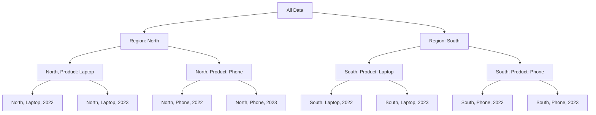

# SQL ROLLUP

## Introduction

When analyzing data, you often need to view information at different levels of detail - from individual records to various summary levels. The SQL `ROLLUP` operator is a powerful extension to the `GROUP BY` clause that allows you to create hierarchical summary reports with subtotals and grand totals automatically.

`ROLLUP` generates multiple grouping sets based on the columns you specify, creating a hierarchy of aggregations from the most detailed level to the most general. This makes it perfect for generating reports that require subtotals and grand totals, such as sales summaries by region, product, and time periods.

In this tutorial, you'll learn:
- What `ROLLUP` is and how it works
- The syntax for using `ROLLUP`
- How to interpret `ROLLUP` results
- Practical examples with real-world applications
- Best practices and common pitfalls

## Understanding ROLLUP

The `ROLLUP` operator creates a hierarchy of groupings based on the columns you specify. It automatically generates grouping sets that include all combinations of columns from right to left, plus a grand total.

For example, if you use `ROLLUP(A, B, C)`, it generates these grouping sets:
- `(A, B, C)` - The most detailed level
- `(A, B)` - Subtotals for A and B
- `(A)` - Subtotals for A
- `()` - Grand total (all columns are NULL)

This creates a hierarchical report with different levels of summary data.

## Basic Syntax

The basic syntax for `ROLLUP` is:

```sql
SELECT column1, column2, ..., aggregate_function(column)
FROM table
GROUP BY ROLLUP(column1, column2, ...);
```

The order of columns in the `ROLLUP` clause matters! It determines the hierarchy of the generated grouping sets.

## Simple ROLLUP Example

Let's look at a basic example using a sales database:

```sql
-- Create a sample sales table
CREATE TABLE sales (
    region VARCHAR(50),
    product VARCHAR(50),
    year INT,
    amount DECIMAL(10,2)
);

-- Insert sample data
INSERT INTO sales VALUES
('North', 'Laptop', 2022, 10000),
('North', 'Laptop', 2023, 12000),
('North', 'Phone', 2022, 8000),
('North', 'Phone', 2023, 9500),
('South', 'Laptop', 2022, 9000),
('South', 'Laptop', 2023, 11000),
('South', 'Phone', 2022, 7500),
('South', 'Phone', 2023, 8500);

-- Basic ROLLUP query
SELECT region, product, SUM(amount) as total_sales
FROM sales
GROUP BY ROLLUP(region, product);
```

The result would look something like:

| region | product | total_sales |
|--------|---------|-------------|
| North  | Laptop  | 22000.00    |
| North  | Phone   | 17500.00    |
| North  | NULL    | 39500.00    |
| South  | Laptop  | 20000.00    |
| South  | Phone   | 16000.00    |
| South  | NULL    | 36000.00    |
| NULL   | NULL    | 75500.00    |

In this result:
- Rows with both region and product show sales for each region/product combination
- Rows with region but NULL product show subtotals for each region
- The row with NULL region and NULL product shows the grand total

## Understanding NULL Values in ROLLUP Results

The `NULL` values in `ROLLUP` results indicate summary rows. However, this can be confusing because:
1. These rows might be mixed with actual NULL values in your data
2. NULLs don't clearly indicate which level of summary they represent

To make your reports more readable, you can use the `COALESCE` function to replace NULLs with descriptive labels:

```sql
SELECT 
    COALESCE(region, 'Grand Total') as region,
    COALESCE(product, 'Region Total') as product,
    SUM(amount) as total_sales
FROM sales
GROUP BY ROLLUP(region, product);
```

Result:

| region       | product       | total_sales |
|--------------|---------------|-------------|
| North        | Laptop        | 22000.00    |
| North        | Phone         | 17500.00    |
| North        | Region Total  | 39500.00    |
| South        | Laptop        | 20000.00    |
| South        | Phone         | 16000.00    |
| South        | Region Total  | 36000.00    |
| Grand Total  | Region Total  | 75500.00    |

## Multi-level Hierarchies with ROLLUP

`ROLLUP` becomes even more powerful with more grouping columns. Let's expand our example to include the year:

```sql
SELECT 
    COALESCE(region, 'Grand Total') as region,
    COALESCE(product, 'Region Total') as product,
    COALESCE(CAST(year AS VARCHAR), 'Product Total') as year,
    SUM(amount) as total_sales
FROM sales
GROUP BY ROLLUP(region, product, year);
```

This produces a report with multiple levels of subtotals:

| region       | product       | year          | total_sales |
|--------------|---------------|---------------|-------------|
| North        | Laptop        | 2022          | 10000.00    |
| North        | Laptop        | 2023          | 12000.00    |
| North        | Laptop        | Product Total | 22000.00    |
| North        | Phone         | 2022          | 8000.00     |
| North        | Phone         | 2023          | 9500.00     |
| North        | Phone         | Product Total | 17500.00    |
| North        | Region Total  | Product Total | 39500.00    |
| South        | Laptop        | 2022          | 9000.00     |
| South        | Laptop        | 2023          | 11000.00    |
| South        | Laptop        | Product Total | 20000.00    |
| South        | Phone         | 2022          | 7500.00     |
| South        | Phone         | 2023          | 8500.00     |
| South        | Phone         | Product Total | 16000.00    |
| South        | Region Total  | Product Total | 36000.00    |
| Grand Total  | Region Total  | Product Total | 75500.00    |

The query generates:
- Individual sales for each region, product, and year
- Subtotals for each region and product (across all years)
- Subtotals for each region (across all products and years)
- Grand total (across all regions, products, and years)

## Visualizing the ROLLUP Hierarchy

To better understand how `ROLLUP` generates grouping sets, here's a diagram:



This hierarchy shows how `ROLLUP` aggregates data at different levels, from the most detailed (year, product, region) to the most general (grand total).

## Practical Applications

### Sales Reporting

Sales reporting is one of the most common applications for `ROLLUP`. It allows you to see sales figures at different levels of granularity in a single query:

```sql
SELECT
    COALESCE(region, 'All Regions') as region,
    COALESCE(product, 'All Products') as product,
    COALESCE(CAST(year AS VARCHAR), 'All Years') as year,
    SUM(amount) as total_sales,
    COUNT(*) as transaction_count,
    AVG(amount) as average_sale
FROM sales
GROUP BY ROLLUP(region, product, year);
```

### Financial Reporting

Financial statements often require subtotals and grand totals for different categories:

```sql
-- Assuming an expenses table
SELECT
    COALESCE(department, 'Company Total') as department,
    COALESCE(category, 'Department Total') as expense_category,
    SUM(amount) as total_expense
FROM expenses
GROUP BY ROLLUP(department, category);
```

### Performance Metrics

You can use `ROLLUP` to analyze performance metrics at different levels:

```sql
-- Assuming a web traffic table
SELECT
    COALESCE(traffic_source, 'All Sources') as source,
    COALESCE(device_type, 'All Devices') as device,
    SUM(visits) as total_visits,
    SUM(conversions) as total_conversions,
    CASE 
        WHEN SUM(visits) > 0 THEN 
            ROUND((SUM(conversions) * 100.0) / SUM(visits), 2)
        ELSE 0
    END as conversion_rate
FROM website_traffic
GROUP BY ROLLUP(traffic_source, device_type);
```

## ROLLUP vs. CUBE

While `ROLLUP` creates a hierarchical set of groupings, the similar `CUBE` operator generates all possible combinations of grouping columns. To understand the difference:

- `ROLLUP(A, B, C)` generates: `(A,B,C)`, `(A,B)`, `(A)`, and `()`
- `CUBE(A, B, C)` generates: `(A,B,C)`, `(A,B)`, `(A,C)`, `(B,C)`, `(A)`, `(B)`, `(C)`, and `()`

`ROLLUP` is best for hierarchical data where there's a clear parent-child relationship between columns. `CUBE` is better when you want to analyze all possible combinations.

## Database Compatibility

The `ROLLUP` operator is supported in many popular database systems, but the syntax may vary slightly:

- **Standard SQL, PostgreSQL, Oracle, SQL Server**:
  ```sql
  GROUP BY ROLLUP(column1, column2, ...)
  ```

- **MySQL (older versions)**:
  ```sql
  GROUP BY column1, column2 WITH ROLLUP
  ```
  Note: Newer versions of MySQL also support the standard syntax.

## Best Practices and Tips

1. **Column Order Matters**: The order of columns in the `ROLLUP` clause determines the hierarchy of subtotals. Put the highest level of your hierarchy first.

2. **Use COALESCE for Readable Reports**: Replace NULL values with descriptive labels to make reports more readable.

3. **Consider Performance**: `ROLLUP` can generate a large number of grouping sets, which may impact performance on very large datasets.

4. **Partial ROLLUP**: You can do a partial rollup by combining regular grouped columns with `ROLLUP`:
   ```sql
   GROUP BY column1, ROLLUP(column2, column3)
   ```
   This generates subtotals for column2 and column3, but not for column1.

5. **Combine with HAVING**: You can use `HAVING` to filter the results after aggregation:
   ```sql
   SELECT region, product, SUM(amount) as total_sales
   FROM sales
   GROUP BY ROLLUP(region, product)
   HAVING SUM(amount) > 10000;
   ```

## Summary

The SQL `ROLLUP` operator is a powerful extension to `GROUP BY` that allows you to generate hierarchical summary reports with multiple levels of subtotals and grand totals automatically. Key points to remember:

- `ROLLUP` creates a hierarchy of groupings based on the columns you specify
- The order of columns determines the hierarchy of subtotals
- NULL values in the result indicate summary rows
- Use `COALESCE` to replace NULLs with descriptive labels
- `ROLLUP` is perfect for reports that require different levels of aggregation, like sales summaries

By mastering `ROLLUP`, you'll be able to create sophisticated summary reports with a single query instead of combining multiple queries with `UNION ALL`.

## Exercises

To reinforce your understanding of `ROLLUP`, try these exercises:

1. Create a sales report that shows total sales by country, state, and city using `ROLLUP`.
2. Modify the query to replace NULL values with descriptive labels.
3. Create a query that combines regular grouped columns with `ROLLUP`.
4. Compare the results of `ROLLUP(A, B, C)` with `CUBE(A, B, C)` on the same dataset.
5. Create a financial report that shows expenses by department, category, and subcategory with appropriate subtotals.
